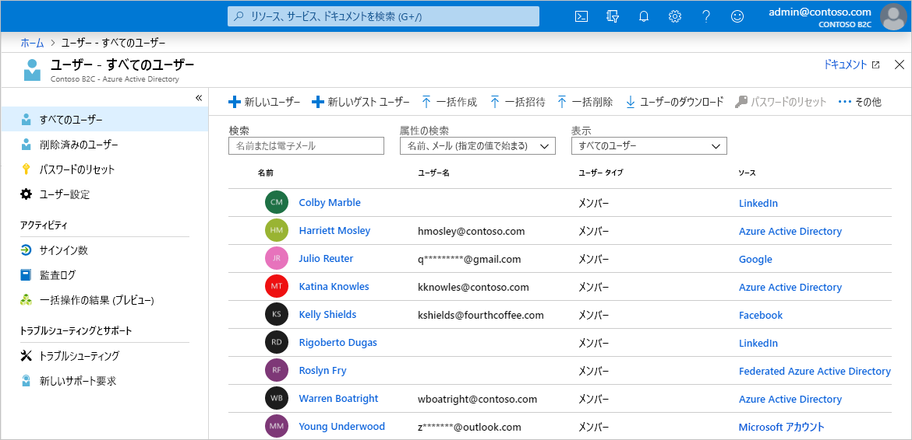
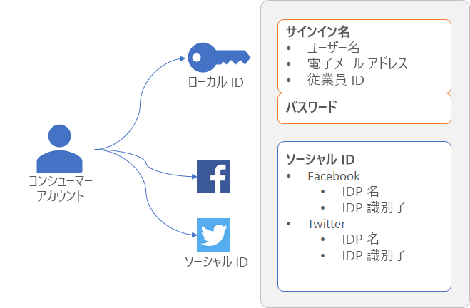
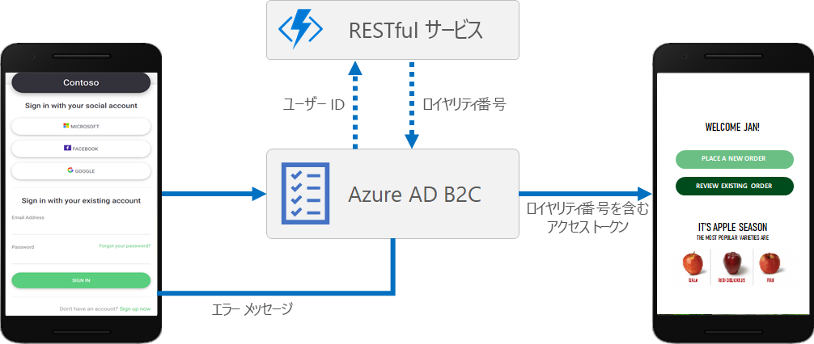
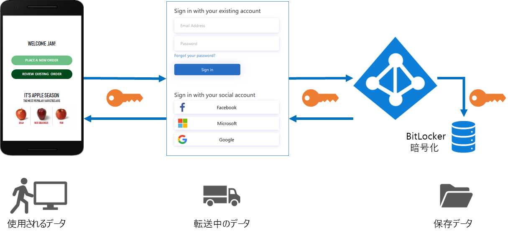
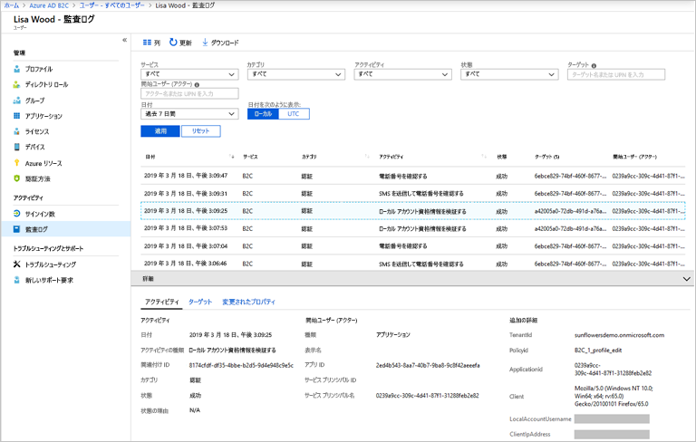

# Azure Active Directory B2C の技術と機能の概要

[Azure Active Directory B2C の概要](overview.md)に関する記事と併せて、この記事ではサービスについてさらに詳しく説明します。 ここでは、サービスで使用する主要なリソース、サービスの機能、およびアプリケーションの顧客に完全なカスタム ID エクスペリエンスを提供する方法について説明します。

## Azure AD B2C テナント

Azure Active Directory B2C (Azure AD B2C) では、"*テナント*" は組織を表しており、ユーザーのディレクトリです。 各 Azure AD B2C テナントは、他の Azure AD B2C テナントと区別され分離されています。 Azure AD B2C テナントは、既にお持ちかもしれない Azure Active Directory テナントとは別のものです。

Azure AD B2C テナントで使用する主なリソースは次のとおりです。

* **ディレクトリ** - "*ディレクトリ*" は、Azure AD B2C によってユーザーの資格情報とプロファイル データ、およびアプリケーションの登録が格納される場所です。
* **アプリケーションの登録** - ID を管理できるようにするには、Azure AD B2C に Web アプリケーション、モバイル アプリケーション、およびネイティブ アプリケーションを登録します。 また、Azure AD B2C で保護する API も登録します。
* **ユーザー フロー**と**カスタム ポリシー** - アプリケーションに対する組み込み (ユーザー フロー) と完全にカスタマイズ可能 (カスタム ポリシー) な ID エクスペリエンスです。
  * サインアップ、サインイン、プロファイル編集などの一般的な ID タスクを簡単に構成して有効にするには、"*ユーザー フロー*" を使用します。
  * 一般的な ID タスクだけでなく、組織、顧客、従業員、パートナー、市民に固有の複雑な ID ワークフローのサポートの作成にもユーザー エクスペリエンスを有効にするには、"*カスタム ポリシー*" を使用します。
* **ID プロバイダー** - 以下に対するフェデレーション設定:
  * アプリケーションでサポートする Facebook、LinkedIn、Twitter などの "*ソーシャル*" ID プロバイダー。
  * OAuth 2.0、OpenID Connect などの標準的な ID プロトコルをサポートする "*外部*" ID プロバイダー。
  * ユーザーがユーザー名 (またはメール アドレスや他の ID) とパスワードを使用してサインアップおよびサインインできるようにする "*ローカル*" アカウント。
* **キー** - クライアント シークレット、証明書、パスワード、トークンの署名と検証のための暗号化キーを追加および管理します。

Azure AD B2C テナントは、Azure AD B2C の使用を始めるために最初に作成する必要があるリソースです。 「[チュートリアル: Azure Active Directory B2C テナントを作成する](tutorial-create-tenant.md)」の手順に従って作成できます。

## Azure AD B2C のアカウント

Azure AD B2C では、複数の種類のユーザー アカウントが定義されています。 Azure Active Directory、Azure Active Directory B2B、Azure Active Directory B2C で、これらのアカウントの種類が共有されます。

* **職場アカウント** - 職場アカウントを持つユーザーは、テナントのリソースを管理でき、管理者ロールを使用してテナントも管理できます。 職場アカウントを持つユーザーは、新しいコンシューマー アカウントの作成、パスワードのリセット、アカウントのブロック/ブロック解除、アクセス許可の設定、セキュリティ グループへのアカウントの割り当てを行うことができます。
* **ゲスト アカウント** - ゲストとしてテナントに招待する外部ユーザーです。 ゲスト ユーザーを Azure AD B2C テナントに招待する一般的なシナリオは、管理責任を共有することです。
* **コンシューマー アカウント** - コンシューマー アカウントは、テナントに登録されているアプリケーションでユーザーがサインアップ ユーザー体験を完了すると、Azure AD B2C ディレクトリに作成されるアカウントです。

 *図:Azure portal での Azure AD B2C テナント内のユーザー ディレクトリ*

### コンシューマー アカウント

"*コンシューマー*" アカウントを使用すると、ユーザーは Azure AD B2C でセキュリティ保護されているアプリケーションにサインインできます。 ただし、コンシューマー アカウントを持つユーザーは、Azure portal などの Azure リソースにアクセスすることはできません。

コンシューマー アカウントは、次の種類の ID に関連付けることができます。

* **ローカル** ID。ユーザー名とパスワードは、Azure AD B2C ディレクトリにローカルに格納されます。 これらの ID は、"ローカル アカウント" とよく呼ばれます。
* **ソーシャル** ID または **エンタープライズ** ID。ユーザーの ID は、Facebook、Microsoft、ADFS、Salesforce などのフェデレーション ID プロバイダーによって管理されます。

コンシューマー アカウントを持つユーザーは、複数の ID (ユーザー名、メール アドレス、従業員 ID、政府 ID など) を使用してサインインできます。 1 つのアカウントで、ローカルとソーシャル両方の ID を持つことができます。

 *図:Azure AD B2C に複数の ID を持つ単一のコンシューマー アカウント*

Azure AD B2C を使用すると、表示名、姓、特定の名前、都市など、コンシューマー アカウント プロファイルの一般的な属性を管理できます。 また、ユーザーに関する追加情報を格納するように、Azure AD スキーマを拡張することもできます。 たとえば、国/地域や居住地、優先する言語、ニュースレターを購読するか、多要素認証を有効にするか、といった設定などです。

Azure AD B2C でのユーザー アカウントの種類について詳しくは、「[Azure Active Directory B2C のユーザー アカウントの概要](user-overview.md)」をご覧ください。

## 外部 ID プロバイダー

ユーザーが外部のソーシャル ID プロバイダー (IDP) またはエンタープライズ ID プロバイダーの資格情報を使用してアプリケーションにサインインできるように、Azure AD B2C を構成できます。 Azure AD B2C では、Facebook、Microsoft アカウント、Google、Twitter などの外部 ID プロバイダー、および OAuth 1.0、OAuth 2.0、OpenID Connect、SAML の各プロトコルに対応するすべての ID プロバイダーがサポートされています。

外部 ID プロバイダーのフェデレーションを使用すると、アプリケーション用だけに新しいアカウントを作成する必要なしに、既存のソーシャルまたはエンタープライズ アカウントを使用してサインインする機能を、コンシューマーに提供できます。

サインアップまたはサインイン ページには、Azure AD B2C によって、ユーザーがサインインのために選択できる外部 ID プロバイダーの一覧が表示されます。 外部 ID プロバイダーの 1 つを選択すると、選択したプロバイダーの Web サイトに誘導 (リダイレクト) されるので、そこでサインイン プロセスを完了します。 正常にサインインしたユーザーは、アプリケーションでのアカウントの認証のために Azure AD B2C に戻されます。

Azure AD B2C で ID プロバイダーを追加する方法については、「[チュートリアル: Azure Active Directory B2C でアプリケーションに ID プロバイダーを追加する](tutorial-add-identity-providers.md)」をご覧ください。

## ID エクスペリエンス: ユーザー フローまたはカスタム ポリシー

Azure AD B2C の中核となる強みは、その拡張可能なポリシー フレームワークです。 ポリシーでは、サインアップ、サインイン、プロファイル編集など、ユーザーの ID エクスペリエンスが記述されています。

Azure AD B2C には、これらの ID エクスペリエンスを提供するために使用できる主要なパスとして、ユーザー フローとカスタム ポリシーの 2 つがあります。

* **ユーザー フロー** は、事前に定義された組み込みの構成可能なポリシーであり、サインアップ、サインイン、ポリシー編集のエクスペリエンスを数分で作成できるように用意されています。

* **カスタム ポリシー** を使用すると、複雑な ID エクスペリエンス シナリオ用に独自のユーザー体験を作成できます。

ユーザー フローとカスタム ポリシーのどちらも、Azure AD B2C のポリシー オーケストレーション エンジンである *Identity Experience Framework* を利用しています。

### ユーザー フロー

最も一般的な ID タスクをすばやく設定できるように、Azure portal には、"*ユーザー フロー*" と呼ばれる事前定義済みで構成可能な複数のポリシーが用意されています。

アプリケーションでの ID エクスペリエンスの動作を制御するため、次のようなユーザー フロー設定を構成できます。

* サインインに使用するアカウントの種類 (Facebook などのソーシャル アカウント、またはメール アドレスとパスワードをサインインに使用するローカル アカウント)
* コンシューマーから収集される属性 (名、郵便番号、居住地の国/地域など)
* Azure Multi-Factor Authentication (MFA)
* ユーザー インターフェイスのカスタマイズ
* ユーザーがユーザー フローを完了した後でアプリケーションが受け取るトークン内の要求のセット
* セッションの管理
* その他

ほとんどのモバイル アプリケーション、Web アプリケーション、シングルページ アプリケーションに対する最も一般的な ID シナリオを、ユーザー フローで効果的に定義および実装できます。 カスタム ポリシーの完全な柔軟性を必要とする複雑なユーザー体験シナリオがある場合を除き、組み込みのユーザー フローを使用することをお勧めします。

ユーザー フローについて詳しくは、「[Azure Active Directory B2C のユーザー フロー](user-flow-overview.md)」をご覧ください。

### カスタム ポリシー

カスタム ポリシーでは、Identity Experience Framework (IEF) オーケストレーション エンジンを最大限に活用できます。 カスタム ポリシーでは、IEF を利用して、認証、ユーザー登録、プロファイル編集の想像できるほぼすべてのエクスペリエンスを構築できます。

Identity Experience Framework を使用すると、手順を自由に組み合わせてユーザー体験を構築できます。 次に例を示します。

* 他の ID プロバイダーとのフェデレーション
* ファーストパーティとサードパーティの多要素認証 (MFA) の課題
* ユーザー入力の収集
* REST API 通信を使用した外部システムとの統合

このようなユーザー体験はポリシーによって定義されており、組織に最適なユーザー エクスペリエンスを実現するために必要な数のポリシーを、いくら多くても、またはいくら少なくても作成できます。

カスタム ポリシーは、階層型チェーンで互いを参照する複数の XML ファイルによって定義されます。 XML 要素では、要求スキーマ、要求変換、コンテンツ定義、クレーム プロバイダー、技術プロファイル、ユーザー体験のオーケストレーション手順、ID エクスペリエンスの他の側面を定義します。

カスタム ポリシーの強力な柔軟性は、複雑な ID シナリオを構築する必要がある場合に最適です。 カスタム ポリシーを構成する開発者は、信頼できる関係の詳細をメタデータ エンドポイント、正確な要求交換定義を含むように慎重に定義し、各 ID プロバイダーの必要に応じてシークレット、キー、および証明書を構成する必要があります。

カスタム ポリシーについて詳しくは、「[Azure Active Directory B2C のカスタム ポリシー](custom-policy-overview.md)」をご覧ください。

## プロトコルとトークン

- アプリケーションのユーザー体験に関して、Azure AD B2C では、[OAuth 2.0](protocols-overview.md)、[OpenID Connect](openid-connect.md)、[SAML プロトコル](connect-with-saml-service-providers.md)がサポートされています。 アプリケーションは Azure AD B2C に認証要求を発行することで、このユーザー体験を開始します。 Azure AD B2C に対する要求の結果として、[ID トークンやアクセス トークン](tokens-overview.md)、SAML トークンなどのセキュリティ トークンが作成されます。 このセキュリティ トークンでは、アプリケーションにおけるユーザーの ID が定義されています。

- 外部 ID の場合、Azure AD B2C では、OAuth 1.0、OAuth 2.0、OpenID Connect、SAML ID プロバイダーとのフェデレーションがサポートされています。

次の図では、Azure AD B2C が同じ認証フローでさまざまなプロトコルを使用して通信する方法が示されています。

1. 証明書利用者アプリケーションでは、OpenID Connect を使用して Azure AD B2C への認可要求が開始されます。
1. アプリケーションのユーザーが、SAML プロトコルを使用する外部 ID プロバイダーでのサインインを選択すると、Azure AD B2C によって、その ID プロバイダーと通信するために SAML プロトコルが呼び出されます。
1. ユーザーが外部 ID プロバイダーとのサインイン操作を完了すると、Azure AD B2C では、OpenID Connect を使用して証明書利用者アプリケーションにトークンが返されます。

## アプリケーションの統合

ユーザーがアプリケーションにサインインしようとすると、それが Web アプリケーション、モバイル アプリケーション、デスクトップ アプリケーション、シングルページ アプリケーション (SPA) のいずれであっても、アプリケーションによって、ユーザー フローまたはカスタム ポリシーで提供されるエンドポイントへの認可要求が開始されます。 ユーザー フローまたはカスタム ポリシーによって、ユーザーのエクスペリエンスが定義および制御されます。 ユーザー フロー (たとえば、"*サインアップまたはサインイン*" のフロー)が完了すると、Azure AD B2C によってトークンが生成され、ユーザーはアプリケーションにリダイレクトされます。

複数のアプリケーションで、同じユーザー フローまたはカスタム ポリシーを使用できます。 1 つのアプリケーションで、複数のユーザー フローまたはカスタム ポリシーを使用できます。

たとえば、アプリケーションへのサインインの場合は、アプリケーションでは "*サインアップまたはサインイン*" のユーザー フローが使用されます。 ユーザーは、サインインした後で、自分のプロファイルを編集したい場合があります。そのため、アプリケーションでは、今度は "*プロファイル編集*" のユーザー フローを使用して、別の認可要求が開始されます。

## シームレスなユーザー エクスペリエンス

Azure AD B2C では、ユーザーに表示されるページがブランドのルック アンド フィールとシームレスに統合されるように、ユーザーの ID エクスペリエンスを作成できます。 アプリケーションの ID 体験の過程でユーザーに表示される HTML および CSS コンテンツを、ほぼ完全に制御できます。 この柔軟性により、アプリケーションと Azure AD B2C との間で、ブランドと視覚的な一貫性を維持することができます。

UI のカスタマイズについては、「[Azure Active Directory B2C でのユーザー インターフェイスのカスタマイズについて](customize-ui-overview.md)」をご覧ください。

## ローカリゼーション

Azure AD B2C の言語のカスタマイズを使用すると、顧客のニーズに応じて、さまざまな言語に対応することができます。 Microsoft では 36 の言語の翻訳が提供されていますが、どの言語についてもユーザーが自分で翻訳を提供できます。 1 つの言語でのみページが提供されている場合でも、ページ上の任意のテキストをカスタマイズできます。

ローカライズのしくみについては、「[Azure Active Directory B2C での言語のカスタマイズ](user-flow-language-customization.md)」をご覧ください。

## 独自のビジネス ロジックの追加

カスタム ポリシーの使用を選択した場合は、ユーザー体験で RESTful API と統合して、独自のビジネス ロジックを体験に追加することができます。 たとえば、Azure AD B2C では、RESTful サービスとデータを交換して次のことができます。

* わかりやすいカスタム エラー メッセージを表示する。
* ユーザー入力を検証して、不正なデータがユーザー ディレクトリに存在しないようにする。 たとえば、ユーザーが入力したデータを修正できます (すべて小文字で入力された場合に、姓を大文字にするなど)。
* 企業の基幹業務アプリケーションとさらに緊密に統合することでユーザー データを拡充する。
* RESTful の呼び出しを使用して、プッシュ通知の送信、企業データベースの更新、ユーザーの移行プロセスの実行、アクセス許可の管理、データベースの監査などを行う。

REST API 呼び出しに対する Azure AD B2C のサポートによって有効になるもう 1 つのシナリオは、ロイヤルティ プログラムです。 たとえば、RESTful サービスでは、ユーザーのメール アドレスを受け取り、顧客のデータベースを照会し、ユーザーのロイヤルティ番号を Azure AD B2C に返すことができます。 返されたデータを Azure AD B2C のユーザーのディレクトリ アカウントに格納した後、ポリシーの後続の手順でさらに評価したり、アクセス トークンに含めたりすることができます。

カスタム ポリシーによって定義されているユーザー体験の任意のステップで、REST API 呼び出しを追加できます。 たとえば、次のタイミングで REST API を呼び出すことができます。

* サインイン時の、Azure AD B2C によって資格情報が検証される直前
* サインインの直後
* Azure AD B2C によってディレクトリに新しいアカウントが作成される前
* Azure AD B2C によってディレクトリに新しいアカウントが作成された後
* Azure AD B2C によってアクセス トークンが発行される前

Azure AD B2C で RESTful API 統合に対してカスタム ポリシーを使用する方法については、「[REST API 要求交換を Azure AD B2C カスタム ポリシーに統合する](custom-policy-rest-api-intro.md)」を参照してください。

## 顧客の ID を保護する

Azure AD B2C は、[Microsoft Azure セキュリティ センター](https://www.microsoft.com/trustcenter/cloudservices/azure)で説明されているセキュリティ、プライバシー、その他のコミットメントに準拠しています。

セッションは暗号化されたデータとしてモデル化され、解読キーは Azure AD B2C のセキュリティ トークン サービスのみが認識しています。 強力な暗号化アルゴリズムである AES-192 が使用されます。 すべての通信パスは、機密性と整合性のために TLS で保護されます。 セキュリティ トークン サービスでは、TLS に拡張検証 (EV) 証明書が使用されます。 一般に、セキュリティ トークン サービスにより、信頼されていない入力を提供しないことでクロスサイト スクリプティング (XSS) 攻撃が軽減されます。

### ユーザー データにアクセスする

Azure AD B2C テナントでは、従業員やパートナーに使用されるエンタープライズ Azure Active Directory テナントと多くの特性が共有されます。 共有される部分としては、管理者ロールの表示、ロールの割り当て、監査アクティビティなどがあります。

ロールを割り当てることにより、次のような Azure AD B2C での特定の管理操作を実行できるユーザーを制御できます。

* ユーザー フローのすべての側面の作成と管理
* すべてのユーザー フローに使用可能な属性スキーマの作成と管理
* 直接フェデレーションで使用するための ID プロバイダーの構成
* Identity Experience Framework での信頼フレームワーク ポリシーの作成と管理 (カスタム ポリシー)
* Identity Experience Framework でのフェデレーションのシークレットと暗号化の管理 (カスタム ポリシー)

Azure AD B2C 管理ロールのサポートなど、Azure AD のロールについて詳しくは、「[Azure Active Directory での管理者ロールのアクセス許可](../active-directory/users-groups-roles/directory-assign-admin-roles.md)」をご覧ください。

### Multi-Factor Authentication (MFA)

Azure AD B2C の多要素認証 (MFA) を利用すれば、データやアプリケーションへのアクセスを保護し、ユーザーには簡単なサインイン プロセスを提供できます。 第 2 の認証方式を要求することでセキュリティが追加され、簡単に使用できるさまざまな認証方法を提供することによって強力な認証が実現されます。 ユーザーは、管理者が行う構成上の決定に基づいて、MFA で認証が行われる場合と行われない場合があります。

ユーザー フローで MFA を有効にする方法については、「[Azure Active Directory B2C の多要素認証 | Microsoft Docs](custom-policy-multi-factor-authentication.md)」をご覧ください。

### スマート アカウント ロックアウト

ブルートフォース パスワード推測の試行を防ぐため、Azure AD B2C では、高度な戦略を使用して、要求の IP、入力されたパスワード、その他のいくつかの要因に基づいてアカウントがロックされます。 ロックアウトの期間は、リスクと試行回数に基づいて自動的に延長されます。

パスワード保護の設定の管理について詳しくは、「[Azure Active Directory B2C でリソースやデータに対する脅威を管理する](threat-management.md)」をご覧ください。

### パスワードの複雑さ

サインアップ時またはパスワードのリセット時に、ユーザーは、複雑さのルールを満たすパスワードを指定する必要があります。 既定では、Azure AD B2C によって強力なパスワード ポリシーが適用されます。 また、Azure AD B2C では、顧客が使用するパスワードの複雑さの要件を指定するための構成オプションも提供されます。

パスワードの複雑さの要件は、[ユーザー フロー](user-flow-password-complexity.md)と[カスタム ポリシー](custom-policy-password-complexity.md)の両方で構成できます。

## 監査とログ

Azure AD B2C では、そのリソース、発行されたトークン、および管理者のアクセスに関するアクティビティ情報が含まれる監査ログが出力されます。 これらの監査ログを使用して、プラットフォームの利用状況を把握し、問題を診断することができます。 監査ログのエントリは、イベントを生成したアクティビティが発生した直後に使用できます。

Azure AD B2C テナントまたは特定のユーザーに対して使用できる監査ログでは、次のような情報を見つけることができます。

* B2C リソースにアクセスするユーザー (例: B2C ポリシーの一覧にアクセスする管理者) の承認に関するアクティビティ
* 管理者が Azure portal を使用してサインインするときに取得されるディレクトリ属性に関連するアクティビティ
* B2C アプリケーションでの作成、読み取り、更新、削除 (CRUD) 操作
* B2C キー コンテナーに格納されたキーに対する CRUD 操作
* B2C リソース (例: ポリシーや ID プロバイダー) に対する CRUD 操作
* ユーザー資格情報とトークン発行の検証

監査ログについて詳しくは、「[Azure AD B2C 監査ログへのアクセス](view-audit-logs.md)」をご覧ください。

### 使用状況の分析情報

Azure AD B2C では、ユーザーが Web アプリにいつサインアップまたはサインインしたか、ユーザーがどこにいるか、どのようなブラウザーやオペレーティング システムが使われているかを確認できます。 カスタムポリシーを使用して Azure Application Insights を Azure AD B2C に統合することにより、ユーザーによるサインアップ、サインイン、パスワードのリセット、プロファイルの編集の状況に関する分析情報を取得できます。 この知識により、将来の開発サイクルに関してデータ駆動型の意思決定を行うことができます。

使用状況の分析について詳しくは、「[Application Insights を使用した Azure Active Directory B2C でのユーザー動作の追跡](analytics-with-application-insights.md)」をご覧ください。

## 次のステップ

Azure Active Directory B2C の機能と技術的な側面について詳しく見てきたので、B2C テナントを作成してサービスを開始してください。

> [!div class="nextstepaction"]
> [チュートリアル:Azure Active Directory B2C テナントを作成する >](tutorial-create-tenant.md)
