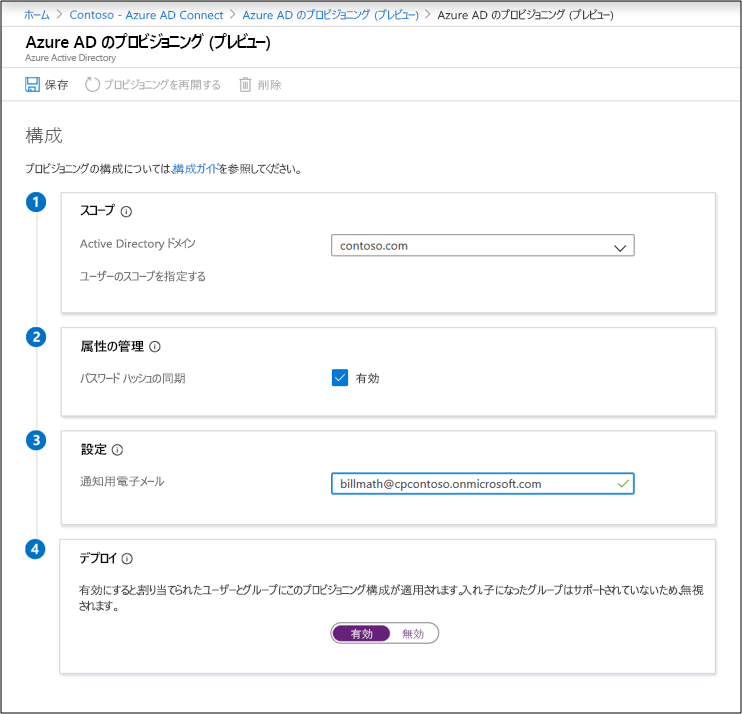

# Azure AD Connect クラウドベース プロビジョニングの新しい構成を作成する

エージェントをインストールしたら、Azure portal にサインインして Azure Active Directory (Azure AD) Connect クラウド プロビジョニングを構成する必要があります。 エージェントを有効にするには、次の手順に従います。

## プロビジョニングの構成
プロビジョニングを構成するのには、次の手順に従います。

1.  Azure Portal で、 **[Azure Active Directory]** を選びます。
1.  **[Azure AD Connect]** を選びます。
1.  **[プロビジョニングの管理 (プレビュー)]** を選択します。

    

1.  **[新しい構成]** を選択します。
1.  構成画面では、オンプレミス ドメインが事前に設定されています。
1.  **[通知用メール]** に入力します。 このメールは、プロビジョニングが正常でない場合に通知されます。
1.  セレクターを **[有効]** に移動し、 **[保存]** を選択します。

    

## 特定のユーザーとグループに対するプロビジョニングのスコープ設定
オンプレミスの Active Directory グループまたは組織単位を使用して、特定のユーザーとグループを同期するようにエージェントをスコープ設定できます。 1 つの構成内でグループと組織単位を構成することはできません。 

1.  Azure Portal で、 **[Azure Active Directory]** を選びます。
1.  **[Azure AD Connect]** を選びます。
1.  **[プロビジョニングの管理 (プレビュー)]** を選択します。
1.  **[構成]** の下で、自分の構成を選択します。

    

1.  **[構成]** で **[すべてのユーザー]** を選択して、構成規則のスコープを変更します。

    ![[すべてのユーザー] オプション](media/how-to-configure/scope2.png)

1. 右側で、セキュリティ グループのみを含めるようにスコープを変更できます。 グループの識別名を入力し、 **[追加]** を選択します。

    ![[選択したセキュリティ グループ] オプション](media/how-to-configure/scope3.png)

1.  または、特定の組織単位のみを含めるようにスコープを変更することもできます。 **[完了]** 、 **[保存]** の順に選択します。  
2.  スコープを変更したら、 [プロビジョニングを再開](#restart-provisioning)して、変更の即時同期を開始する必要があります。

    ![[選択した組織単位] オプション](media/how-to-configure/scope4.png)

## プロビジョニングを再開する 
スケジュールされた次回の実行を待ちたくない場合は、 **[プロビジョニングを再開する]** ボタンを使用してプロビジョニングの実行をトリガーします。 
1.  Azure Portal で、 **[Azure Active Directory]** を選びます。
1.  **[Azure AD Connect]** を選びます。
1.  **[プロビジョニングの管理 (プレビュー)]** を選択します。
1.  **[構成]** の下で、自分の構成を選択します。

    

1.  上部にある **[プロビジョニングを再開する]** を選択します。

## 構成の削除
構成を削除するには、次の手順に従います。

1.  Azure Portal で、 **[Azure Active Directory]** を選びます。
1.  **[Azure AD Connect]** を選びます。
1.  **[プロビジョニングの管理 (プレビュー)]** を選択します。
1.  **[構成]** の下で、自分の構成を選択します。

    

1.  構成画面の上部にある **[削除]** を選択します。

    ![[削除] ボタン](media/how-to-configure/remove1.png)

>[!IMPORTANT]
>構成を削除する前に確認は行われません。 **[削除]** を選択する前に、これが実行するアクションであることを確認してください。

## 次のステップ 

- [プロビジョニングとは](what-is-provisioning.md)
- [Azure AD Connect クラウド プロビジョニングとは](what-is-cloud-provisioning.md)
