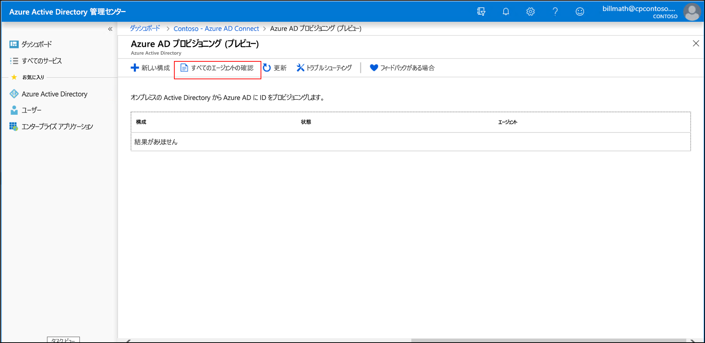
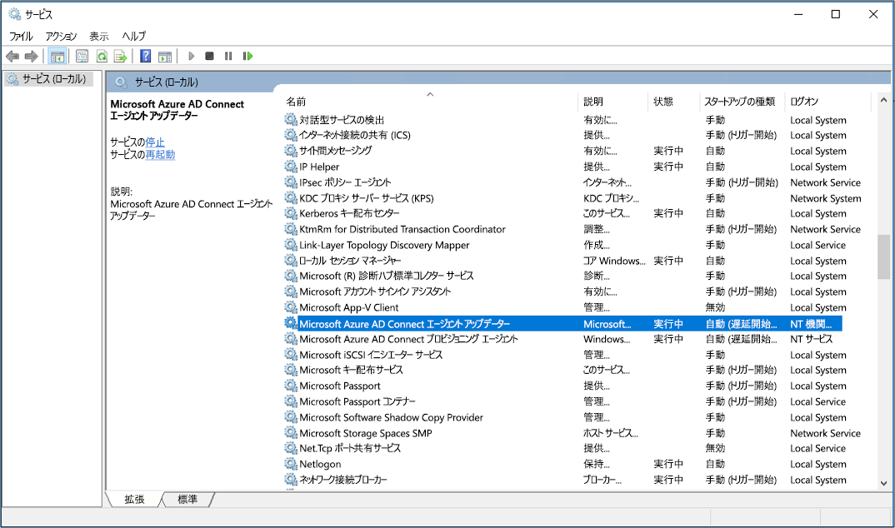

# <a name="cloud-provisioning-troubleshooting"></a>クラウド プロビジョニングのトラブルシューティング

クラウド プロビジョニングは、さまざまな項目に影響を及ぼし、さまざまな依存関係を持ちます。  当然、これによって各種の問題が生じると考えられます。  このドキュメントは、これらの問題のトラブルシューティングを開始できるようにすることを目的としています。  このドキュメントでは、焦点を当てる必要がある一般的な分野、追加情報の収集方法、問題の追跡に使用できる各種の手法について紹介します。  


## <a name="common-troubleshooting-areas"></a>一般的なトラブルシューティング分野

|名前|説明|
|-----|-----|
|[エージェントに関する問題](#agent-issues)|エージェントが正しくインストールされ、Azure AD と通信していることを確認します。|
|[オブジェクトの同期に関する問題](#object-synchronization-issues)|プロビジョニング ログを使用してオブジェクトの同期に関する問題をトラブルシューティングします。|
|[プロビジョニングの検疫に関する問題](#provisioning-quarantined-issues)|プロビジョニングの検疫に関する問題とその解決方法について説明します。|


## <a name="agent-issues"></a>エージェントに関する問題
エージェントに関して検証する最初の項目は、次のとおりです。


-  インストール済みであるか。
-  エージェントはローカルで実行されているか。
-  エージェントはポータル内にあるか。
-  エージェントは正常とマークされているか。  

これらの項目は、Azure portal のほか、エージェントが実行されているローカル サーバーで検証できます。

### <a name="azure-portal-agent-verification"></a>Azure portal でのエージェントの検証

エージェントが Azure によって認識されていて、正常であることを確認するには、次の手順を実行します。

1. Azure ポータルにサインインします。
2. 左側の **[Azure Active Directory]** を選択して **[Azure AD Connect]** をクリックし、中央の **[プロビジョニングの管理 (プレビュー)]** を選択します。
3.  **[Azure AD のプロビジョニング (プレビュー)]** 画面で **[すべてのエージェントの確認]** をクリックします。
 </br>
 
4. **[On-premises provisioning agents]\(オンプレミス プロビジョニング エージェント\)** 画面に、インストールしたエージェントが表示されます。  該当するエージェントが存在すること、また **[正常]** としてマークされていることを確認します。
 </br>

### <a name="verify-the-port"></a>ポートの確認

Azure がポート 443 でリッスンしていて、エージェントがそれと通信できることを確認する場合、次のツールを使用できます。

https://aadap-portcheck.connectorporttest.msappproxy.net/ 

このテストでは、エージェントがポート 443 を介して Azure と通信できることを確認します。  ブラウザーを開き、エージェントがインストールされているサーバーから上記の URL に移動します。
 

### <a name="on-the-local-server"></a>ローカル サーバー上

エージェントが実行されていることを確認するには、次の手順に従います。

1.  エージェントがインストールされているサーバーで **[サービス]** を開きます。これには、そこに直接移動するか、スタート ボタンをクリックし、[ファイル名を指定して実行] で「Services.msc」と入力しします。
2.  **[サービス]** に **[Microsoft Azure AD Connect Agent Updater]** と **[Microsoft Azure AD Connect Provisioning Agent]** が存在し、その状態が **[実行中]** になっていることを確認します。
 

### <a name="common-agent-installation-issues"></a>エージェントのインストールに関する一般的な問題

エージェントのインストールに関する一般的な問題と、標準的な解決策を次に示します。

#### <a name="agent-failed-to-start"></a>エージェントが起動しない

次の内容のエラー メッセージが表示された場合:

**Service 'Microsoft Azure AD Connect Provisioning Agent' (AADConnectProvisioningAgent) failed to start.Verify that you have sufficient privileges to start the system. (サービス 'Microsoft Azure AD Connect Provisioning Agent' (AADConnectProvisioningAgent) を開始できませんでした。システムを起動するために十分な特権を持っていることを確認してください。)** 

これは、通常、インストーラーによって作成されたローカル NT サービスの "ログオン アカウント" (NT SERVICE\AADConnectProvisioningAgent) にアクセス許可が適用されないようにするグループ ポリシーが原因で発生します。これらのアクセス許可は、サービスを開始するために必要です。

これを解決するには、次の手順を実行します。

1.  管理者アカウントでサーバーにログオンします。
2.  **[サービス]** を開きます。これには、そこに直接移動するか、スタート ボタンをクリックし、[ファイル名を指定して実行] で「Services.msc」と入力します。
3.  **[サービス]** で **[Microsoft Azure AD Connect Provisioning Agent]** をダブルクリックします。
4. そのタブで、"ログオン アカウント" をドメイン管理者に変更し、サービスを再起動します。 

 

#### <a name="agent-times-out-or-certificate-is-invalid"></a>エージェントがタイムアウトになるか証明書が無効である

エージェントを登録しようとすると、次のエラーが表示されることがあります。

 

これは通常、エージェントがハイブリッド ID サービスに接続できないことが原因で発生し、HTTP プロキシを構成する必要があります。  これを解決するには、送信プロキシを構成します。 

プロビジョニング エージェントは送信プロキシの使用をサポートしています。 構成するには、エージェントの構成ファイル **C:\Program Files\Microsoft Azure AD Connect Provisioning Agent\AADConnectProvisioningAgent.exe.config** を編集します。ファイルの末尾近くにある `</configuration>` の終了タグの直前に次の行を追加します。
変数 [proxy-server] と [proxy-port] をお客様のプロキシ サーバー名とポート値に置き換えてください。

```xml
    <system.net>
        <defaultProxy enabled="true" useDefaultCredentials="true">
            <proxy
                usesystemdefault="true"
                proxyaddress="http://[proxy-server]:[proxy-port]"
                bypassonlocal="true"
            />
        </defaultProxy>
    </system.net>
```

#### <a name="agent-registration-fails-with-security-error"></a>セキュリティ エラーが発生してエージェントの登録が失敗する

クラウド プロビジョニング エージェントをインストールするときに、次のエラーが表示される場合があります。

これは通常、ローカルの PowerShell 実行ポリシーが原因で、エージェントで PowerShell 登録スクリプトを実行できないことが原因で発生します。

これを解決するには、サーバー上の PowerShell の実行ポリシーを変更します。 マシンとユーザーのポリシーを "Undefined" または "RemoteSigned" に設定する必要があります。 "Unrestricted" になっていると、このエラーが表示されます。  詳細については、「[PowerShell の実行ポリシー](https://docs.microsoft.com/powershell/module/microsoft.powershell.core/about/about_execution_policies?view=powershell-6)」を参照してください。 

### <a name="log-files"></a>ログ ファイル

既定では、エージェントによって最小限のエラー メッセージとスタック トレース情報が発行されます。 これらのトレース ログはフォルダ **C:\ProgramData\Microsoft\Azure AD Connect Provisioning Agent\Trace** にあります。

エージェント関連の問題のトラブルシューティングに関する追加の詳細情報を収集するには、次の手順を実行します。

1. サービス **Microsoft Azure AD Connect Provisioning Agent** を停止します。
2. 元の構成ファイル **C:\Program Files\Microsoft Azure AD Connect Provisioning Agent\AADConnectProvisioningAgent.exe.config** のコピーを作成します。
3. 既存の <system.diagnostics> セクションを以下に置き換えます。これにより、すべてのトレース メッセージはファイル **ProvAgentTrace.log** に送られます。

      ```xml
        <system.diagnostics>
            <sources>
            <source name="AAD Connect Provisioning Agent">
                <listeners>
                <add name="console"/>
                <add name="etw"/>
                <add name="textWriterListener"/>
                </listeners>
            </source>
            </sources>
            <sharedListeners>
            <add name="console" type="System.Diagnostics.ConsoleTraceListener" initializeData="false"/>
            <add name="etw" type="System.Diagnostics.EventLogTraceListener" initializeData="Azure AD Connect Provisioning Agent">
                <filter type="System.Diagnostics.EventTypeFilter" initializeData="All"/>
            </add>
            <add name="textWriterListener" type="System.Diagnostics.TextWriterTraceListener" initializeData="C:/ProgramData/Microsoft/Azure AD Connect Provisioning Agent/Trace/ProvAgentTrace.log"/>
            </sharedListeners>
        </system.diagnostics>

      ```
4. サービス **Microsoft Azure AD Connect Provisioning Agent** を開始します。
5. 次のコマンドを使用すると、ファイルを追跡し、問題をデバッグできます。 
    ```
    Get-Content “C:/ProgramData/Microsoft/Azure AD Connect Provisioning Agent/Trace/ProvAgentTrace.log” -Wait
    ```
## <a name="object-synchronization-issues"></a>オブジェクトの同期に関する問題

次のセクションでは、オブジェクトの同期に関するトラブルシューティングについて説明します。

### <a name="provisioning-logs"></a>プロビジョニング ログ

Azure portal では、プロビジョニング ログを使用して、オブジェクトの同期に関する問題の追跡とトラブルシューティングを行うことができます。  ログを表示するには、 **[ログ]** を選択します。
 

プロビジョニング ログは、オンプレミスの AD 環境と Azure の間で同期されているオブジェクトの状態に関するさまざまな情報を提供します。

 

ページ上部にあるドロップダウンを使用してビューをフィルター処理し、特定の問題や日付などに絞り込むことができます。個々のイベントをダブルクリックすると、追加の詳細情報が表示されます。

 

この情報は、詳しい手順と、同期の問題が発生している場所を示します。  これにより、問題を絞り込み、問題の正確な場所を特定できます。


## <a name="provisioning-quarantined-issues"></a>プロビジョニングの検疫に関する問題

クラウド プロビジョニングでは、構成の正常性が監視され、正常でないオブジェクトは "検疫" 状態に置かれます。 ターゲット システムに対する呼び出しのほとんどまたはすべてが、管理者の資格情報が無効であるなどの理由で常にエラーで失敗する場合、プロビジョニング ジョブは検疫状態になります。

 

状態をクリックすると、検疫に関する追加情報を表示できます。  エラー コードとメッセージも取得できます。

 

### <a name="resolving-a-quarantine"></a>検疫の解決

- Azure portal を使用して、プロビジョニング ジョブを再起動します。 エージェントの構成ページで **[プロビジョニングを再開する]** を選択します。

  

- Microsoft Graph を使用して、[プロビジョニング ジョブを再起動します](https://docs.microsoft.com/graph/api/synchronization-synchronizationjob-restart?view=graph-rest-beta&tabs=http)。 再起動する対象は完全に制御できます。 エスクローをクリアするか (検疫状態と判定されるためのエスクロー カウンターを再起動するため)、検疫をオフにするか (検疫からアプリケーションを削除するため)、または透かしをクリアするかを選択できます。 次の要求を使用します。
 
  `POST /servicePrincipals/{id}/synchronization/jobs/{jobId}/restart`

## <a name="next-steps"></a>次の手順 

- [プロビジョニングとは](what-is-provisioning.md)
- [Azure AD Connect クラウド プロビジョニングとは](what-is-cloud-provisioning.md)


