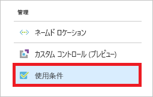
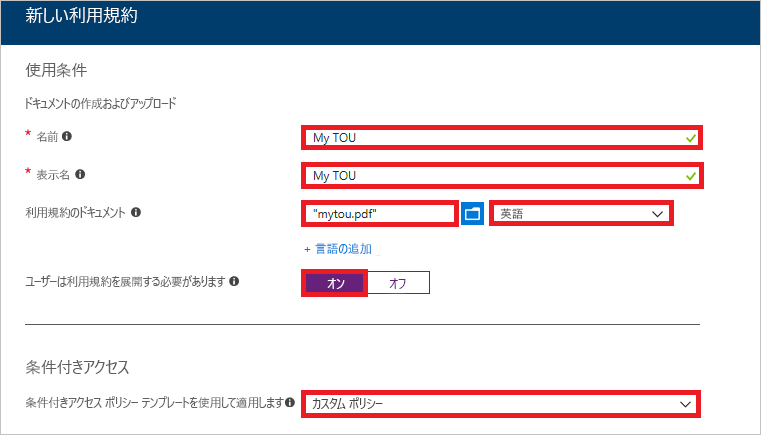

# クイック スタート: クラウド アプリにアクセスする前に使用条件への同意を要求する

環境内の特定のクラウド アプリにアクセスする前に、使用条件 (ToU) を受け入れる形式でユーザーからの同意を得る場合があります。 Azure Active Directory (Azure AD) の条件付きアクセスでは、次のものが提供されます。

- ToU を構成する簡単な方法
- 条件付きアクセス ポリシーを介して使用条件に同意を要求するオプション  

このクイック スタートでは、環境内で選択したクラウド アプリに対して ToU への同意を必要とする [Azure AD の条件付きアクセス ポリシー](../active-directory-conditional-access-azure-portal.md)を構成する方法について説明します。

Azure サブスクリプションをお持ちでない場合は、開始する前に [無料アカウント](https://azure.microsoft.com/free/?WT.mc_id=A261C142F) を作成してください。

## 前提条件

このクイック スタートのシナリオを完了するための要件を次に示します。

- **Azure AD Premium エディションへのアクセス** - Azure AD の条件付きアクセスは Azure AD Premium の機能です。
- **Isabella Simonsen というテスト アカウント** - テスト アカウントの作成方法がわからない場合は、「[クラウド ベースのユーザーを追加する](../fundamentals/add-users-azure-active-directory.md#add-a-new-user)」を参照してください。

## サインインをテストする

この手順の目的は、条件付きアクセス ポリシーがないサインイン エクスペリエンスの印象を確認することです。

**サインインをテストするには:**

1. Isabella Simonsen として [Azure portal](https://portal.azure.com/) にサインインします。
1. サインアウトします。

## 使用条件を作成する

このセクションでは、サンプル ToU を作成する手順について説明します。 ToU を作成するときに、 **[条件付きアクセス ポリシー テンプレートを使用して適用します]** の値を選択します。 **[カスタム ポリシー]** を選択すると、ToU が作成されるとすぐに、新しい条件付きアクセス ポリシーを作成するためのダイアログが開かれます。

**使用条件を作成するには:**

1. Microsoft Word で、新しいドキュメントを作成します。
1. 「**My terms of use**」と入力し、ドキュメントをコンピューターに **mytou.pdf** として保存します。
1. [Azure portal](https://portal.azure.com) に全体管理者、セキュリティ管理者、または条件付きアクセス管理者としてサインインします。
1. Azure Portal の左側のナビゲーション バーで、 **[Azure Active Directory]** をクリックします。

   

1. **[Azure Active Directory]** ページの **[セキュリティ]** セクションで、 **[条件付きアクセス]** をクリックします。

   

1. **[管理]** セクションで、 **[使用条件]** をクリックします。

   

1. 上部のメニューで **[新しい条件]** をクリックします。

   

1. **[新しい利用規約]** ページで、次の操作を行います。

   

   1. **[名前]** ボックスに「**My TOU**」と入力します。
   1. **[表示名]** ボックスに、「**My TOU**」と入力します。
   1. 使用条件 PDF ファイルをアップロードします。
   1. **[言語]** で **[英語]** を選択します。
   1. **[ユーザーは使用条件を展開する必要があります]** で、 **[オン]** を選択します。
   1. **[条件付きアクセス ポリシー テンプレートを使用して適用します]** で **[カスタム ポリシー]** を選択します。
   1. **Create** をクリックしてください。

## 条件付きアクセス ポリシーを作成する

このセクションでは、必要な条件付きアクセス ポリシーを作成する方法について説明します。 このクイック スタートのシナリオでは、以下を使用します。

- ToU の同意を必要とするクラウド アプリのプレースホルダーとしての Azure portal。 
- 条件付きアクセス ポリシーをテストするサンプル ユーザー。  

ポリシーに以下の内容を設定します。

| 設定 | 値 |
| --- | --- |
| ユーザーとグループ | Isabella Simonsen |
| クラウド アプリ | Microsoft Azure の管理 |
| アクセス権の付与 | My TOU |

**条件付きアクセス ポリシーを構成するには:**

1. **[新規]** ページの **[名前]** ボックスに、「**Require TOU for Isabella**」と入力します。

   

1. **[割り当て]** セクションで **[ユーザーとグループ]** をクリックします。

   

1. **[ユーザーとグループ]** ページで、次の手順に従います。

   

   1. **[ユーザーとグループの選択]** をクリックし、 **[ユーザーとグループ]** を選択します。
   1. **[選択]** をクリックします。
   1. **[選択]** ページで **[Isabella Simonsen]** を選択し、 **[選択]** をクリックします。
   1. **[ユーザーとグループ]** ページで、 **[完了]** をクリックします。
1. **[クラウド アプリ]** をクリックします。

   

1. **[クラウド アプリ]** ページで、次の手順に従います。

   

   1. **[アプリを選択]** をクリックします。
   1. **[選択]** をクリックします。
   1. **[選択]** ページで **[Microsoft Azure の管理]** を選択し、 **[選択]** をクリックします。
   1. **[クラウド アプリ]** ページで、 **[完了]** をクリックします。
1. **[アクセス制御]** セクションで、 **[許可]** をクリックします。

   

1. **[許可]** ページで、次の手順に従います。

   

   1. **[アクセス権の付与]** を選択します。
   1. **[My TOU]** を選択します。
   1. **[選択]** をクリックします。
1. **[ポリシーを有効にする]** セクションで **[オン]** をクリックします。

   

1. **Create** をクリックしてください。

## シミュレートされたサインインを評価する

条件付きアクセス ポリシーを構成したら、期待どおりに動作しているかどうかを確認してみましょう。 最初の手順として、条件付きアクセスの What If ポリシー ツールを使用して、テスト ユーザーのサインインをシミュレートします。 シミュレーションでは、サインインがポリシーに与える影響を推定し、シミュレーション レポートが生成されます。  

**What If** ポリシー評価ツールを初期化するには、次のように設定します。

- ユーザーに「**Isabella Simonsen**」
- クラウド アプリに「**Microsoft Azure の管理**」

**[What If]** をクリックすると、シミュレート レポートが作成され、次のように表示されます。

- **[適用するポリシー]** の下に "**Require TOU for Isabella**"
- **[制御の許可]** として "**My TOU**"

**条件付きアクセス ポリシーを評価するには:**

1. [[条件付きアクセス - ポリシー]](https://portal.azure.com/#blade/Microsoft_AAD_IAM/ConditionalAccessBlade/Policies) ページで、上部のメニューの **[What If]** をクリックします。  

   

1. **[ユーザー]** をクリックし、 **[Isabella Simonsen]** を選択し、 **[選択]** をクリックします。

   

1. クラウド アプリを選択するには:

   

   1. **[クラウド アプリ]** をクリックします。
   1. **[クラウド アプリ]** ページで、 **[アプリの選択]** をクリックします。
   1. **[選択]** をクリックします。
   1. **[選択]** ページで **[Microsoft Azure の管理]** を選択し、 **[選択]** をクリックします。
   1. [クラウド アプリ] ページで、 **[完了]** をクリックします。
1. **[What If]** をクリックします。

## 条件付きアクセス ポリシーをテストする

前のセクションでは、シミュレートされたサインインを評価する方法を学びました。 期待どおりに動作することを確認するには、シミュレーションに加え、条件付きアクセス ポリシーもテストすることをお勧めします。

ポリシーをテストするには、[Isabella Simonsen](https://portal.azure.com) テスト アカウントを使用して **Azure Portal** にサインインしてみます。 使用条件への同意を求めるダイアログが表示されるはずです。

## リソースをクリーンアップする

不要になったら、テスト ユーザーと条件付きアクセス ポリシーを削除します。

- Azure AD ユーザーの削除方法がわからない場合は、「[Azure AD からユーザーを削除する](../fundamentals/add-users-azure-active-directory.md#delete-a-user)」を参照してください。
- ポリシーを削除するには、ポリシーを選択し、クイック アクセス ツール バーの **[削除]** をクリックします。

    

- 使用条件を削除するには、使用条件を選択し、上部のツール バーの **[条件の削除]** をクリックします。

    

## 次のステップ

> [!div class="nextstepaction"]
> [特定のアプリに対して MFA を必要にする](app-based-mfa.md)
> [セッションのリスクが検出されたときにアクセスをブロックする](app-sign-in-risk.md)
