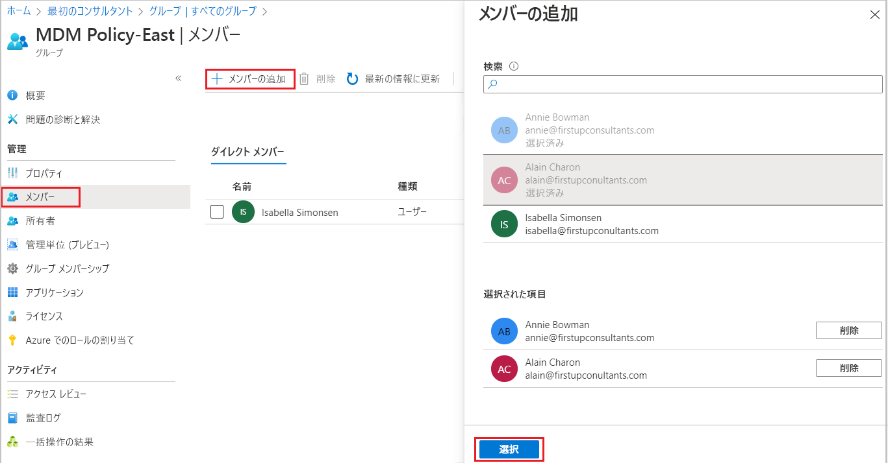

# Azure Active Directory を使用して基本グループを作成してメンバーを追加する
Azure Active Directory (Azure AD) ポータルを使用して、基本グループを作成できます。 この記事の目的に合わせて、基本グループは、リソース所有者 (管理者) によって単一リソースに追加され、そのリソースにアクセスする必要がある特定のメンバー (従業員) を含みます。 動的なメンバーシップやルールの作成など、より複雑なシナリオについては、「[Azure Active Directory のユーザー管理のドキュメント](../users-groups-roles/index.yml)」を参照してください。

## 基本グループを作成してメンバーを追加する
基本グループを作成し、それと同時にメンバーを追加できます。

### 基本グループを作成してメンバーを追加するには、次の手順を実行します。
1. ディレクトリのグローバル管理者アカウントを使用して [Azure portal](https://portal.azure.com) にサインインします。

1. **Azure Active Directory** を検索して選択します。

    ![[グループ] が表示された Azure AD ページ](media/active-directory-groups-create-azure-portal/search-active-directory.png)

1. **[Active Directory]** ページで、 **[グループ]** 、 **[新しいグループ]** の順に選択します。

    ![[グループ] が表示された Azure AD ページ](media/active-directory-groups-create-azure-portal/group-full-screen.png)

1. **[新しいグループ]** ページで、必要な情報を入力します。

    

   - **[グループの種類]\(必須)。** 事前に定義されたグループの種類を選択します。 これには次のものが含まれます。- **セキュリティ**。 メンバーを管理し、グループ ユーザーの共有リソースへのコンピューター アクセスを管理するために、使用されます。 たとえば、特定のセキュリティ ポリシーのセキュリティ グループを作成できます。 この方法で作成すると、すべてのメンバーに一連のアクセス許可を一度に付与でき、各メンバーにアクセス許可を個別に追加する必要はありません。 リソースへのアクセス管理の詳細については、[Azure Active Directory グループによるリソースへのアクセス管理](active-directory-manage-groups.md)に関するページを参照してください。
               - **Office 365**。 共有メールボックス、カレンダー、ファイル、SharePoint サイトなどへのアクセスをメンバーに付与することで、共同作業の機会を提供します。 また、このオプションでは、組織外のユーザーにグループへのアクセス権を付与することもできます。 Office 365 グループの詳細については、「[Office 365 グループの概要](https://support.office.com/article/learn-about-office-365-groups-b565caa1-5c40-40ef-9915-60fdb2d97fa2)」を参照してください。

   - **[グループ名]\(必須)。** グループの名前を追加します。覚えやすい、意味のある名前にします。 名前が別のグループに既に使用されているかどうかを判断するチェックが実行されます。 名前が既に使用されている場合は、重複した名前付けを避けるために、グループの名前を変更するように求められます。

   - **グループのメール アドレス (必須)。** グループのメール アドレスを追加するか、自動的に入力されたメール アドレスをそのまま使用します。

   - **[グループの説明]。** 任意で、グループに説明を追加します。

   - **[メンバーシップの種類]\(必須)。** 事前に定義されたメンバーシップの種類を選択します。 これには次のものが含まれます。- **割り当て済み。** このグループのメンバーとなり、一意のアクセス許可を保持するように、特定のメンバーを追加できます。 この記事の目的に合わせて、このオプションを使用しています。
          - **動的ユーザー。** 動的メンバーシップ ルールを使用して、メンバーを自動的に追加および削除できます。 メンバーの属性が変更されると、システムは、ディレクトリの動的なグループ ルールを確認して、そのメンバーがルール要件を満たしているか (追加される)、またはルール要件を満たさなくなったか (削除される) を判定します。
          - **動的デバイス。** 動的なグループ ルールを使用して、自動的にデバイスを追加および削除できます。 デバイスの属性が変更されると、システムは、ディレクトリの動的なグループ ルールを確認して、そのデバイスがルール要件を満たしているか (追加される)、またはルール要件を満たさなくなったか (削除される) を判定します。

        >[!Important]
        >デバイスまたはユーザーのどちらかに対して動的グループを作成することは可能ですが、両方に対して作成することはできません。 また、デバイス所有者の属性に基づいてデバイス グループを作成することはできません。 デバイス メンバーシップ ルールで参照できるのは、デバイスの属性のみです。 ユーザーとデバイスの動的グループの作成に関する詳細については、「[動的グループの作成と状態チェックを行う](../users-groups-roles/groups-create-rule.md)」を参照してください。

1. **作成** を選択します。

    グループが作成され、メンバーを追加する準備ができました。

1. **[グループ]** ページから **[メンバー]** 領域を選択して、 **[メンバーの選択]** ページからグループに追加するメンバーの検索を開始します。

    

1. メンバーの追加が完了したら、 **[選択]** をクリックします。

    **[グループの概要]** ページが更新され、グループに追加されたメンバー数が表示されるようになりました。

    ![[グループの概要] ページで、メンバー数が強調されている](media/active-directory-groups-create-azure-portal/group-overview-blade-number-highlight.png)

## ウェルカム メールをオンまたはオフにする

メンバーシップが動的であるか静的であるかを問わず、新しい Office 365 グループが作成されると、そのグループに追加されたすべてのユーザーにウェルカム通知が送信されます。 ユーザーまたはデバイスのいずれかの属性が変更されると、組織内のすべての動的グループ ルールが、潜在的なメンバーシップの変更のために処理されます。 追加されたユーザーは、ウェルカム通知も受け取ります。 この動作は、[Exchange PowerShell](https://docs.microsoft.com/powershell/module/exchange/users-and-groups/Set-UnifiedGroup?view=exchange-ps) を使用して無効にすることができます。 

## 次の手順
グループと、少なくとも 1 人のユーザーを追加したので、次の作業が可能になりました。

- [グループとメンバーを表示する](active-directory-groups-view-azure-portal.md)

- [グループ メンバーシップを管理する](active-directory-groups-membership-azure-portal.md)

- [グループ内のユーザーの動的ルールの管理](../users-groups-roles/groups-create-rule.md)

- [グループの設定を編集する](active-directory-groups-settings-azure-portal.md)

- [グループを使用してリソースへのアクセスを管理する](active-directory-manage-groups.md)

- [グループを使用して SaaS アプリへのアクセスを管理する](../users-groups-roles/groups-saasapps.md)

- [PowerShell コマンドを使用してグループを管理する](../users-groups-roles/groups-settings-v2-cmdlets.md)

- [Azure サブスクリプションを Azure Active Directory に関連付けまたは追加する](active-directory-how-subscriptions-associated-directory.md)
