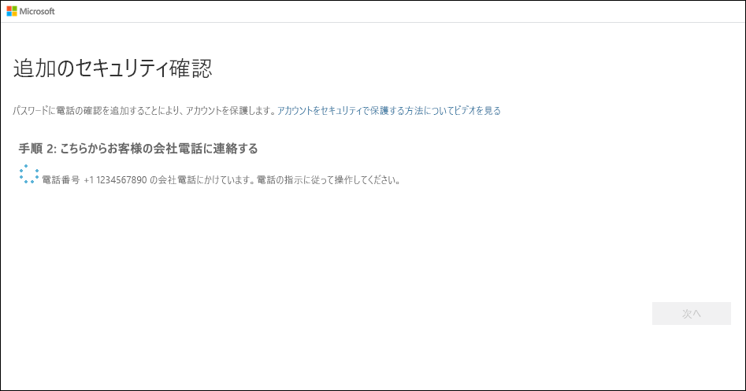

# 会社電話を 2 要素認証方法として設定する

会社電話を 2 要素認証方法として動作するように設定できます。

>[!Note]
> 会社電話オプションが灰色表示される場合、検証に会社電話の番号を使用することを組織が許可していない可能性があります。 この場合、別の方法を選択するか、管理者に支援を要請する必要があります。

## 会社電話の番号を確認方法として設定する

1. **[追加のセキュリティ確認]** ページの **[手順 1: ご希望のご連絡方法をお知らせください]** 領域で **[会社電話]** を選択し、ドロップダウン リストからお住まいの国または地域を選択して、会社の電話番号、内線番号 (ある場合) の順に入力してください。

    ![[認証用電話] を選択し、[電話で確認コードを受け取る] をオンにした [追加のセキュリティ確認] ページ](media/multi-factor-authentication-verification-methods/multi-factor-authentication-office-phone.png)

2. Microsoft から電話がかかってきて、ID を確認するために会社電話でポンド (#) 記号を押すように求められます。

    

3. **[手順 3: 既存のアプリケーションを使用し続ける]** 領域から、指定されたアプリ パスワードをコピーし、それを安全な場所に貼り付けます。

    ![[追加のセキュリティ確認] ページの [アプリ パスワード] 領域](media/multi-factor-authentication-verification-methods/multi-factor-authentication-app-passwords.png)

    >[!Note]
    >古いアプリでアプリ パスワードを使用する方法の詳細については、「[アプリ パスワードの管理](multi-factor-authentication-end-user-app-passwords.md)」を参照してください。 2 要素認証をサポートしていない古いアプリを引き続き使用する場合のみ、アプリ パスワードを使用する必要があります。

4. **[Done]** を選択します。

## 次のステップ

2 要素認証方法を設定した後、方法の追加、設定とアプリ パスワードの管理、サインインを行うことができます。また、2 要素認証に関連する一般的な問題についてサポートを受けることもできます。

- [2 要素認証方法の設定を管理する](multi-factor-authentication-end-user-manage-settings.md)

- [アプリ パスワードの管理](multi-factor-authentication-end-user-app-passwords.md)

- [2 要素認証を使用してサインインする](multi-factor-authentication-end-user-signin.md)

- [2 要素認証のサポートを受ける](multi-factor-authentication-end-user-troubleshoot.md)
