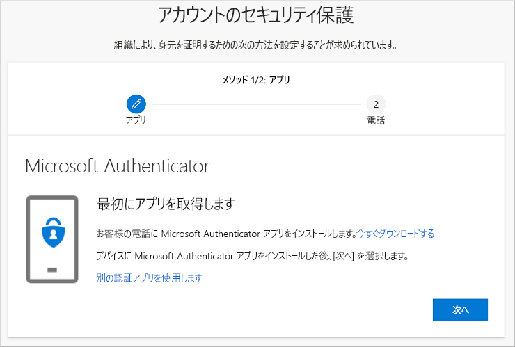
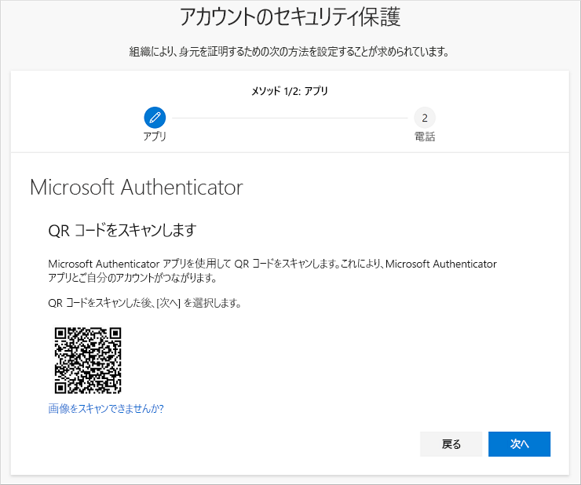
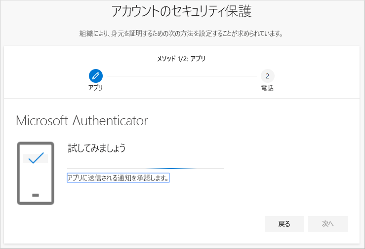
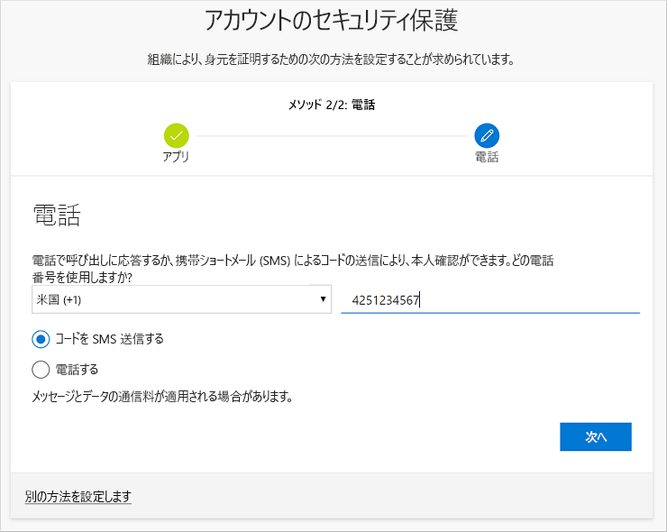
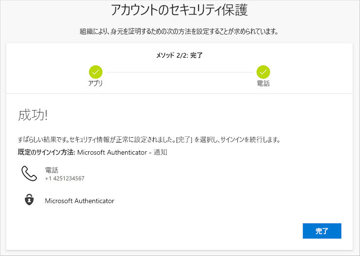
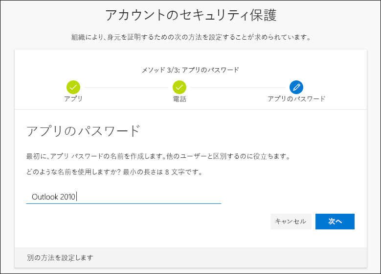
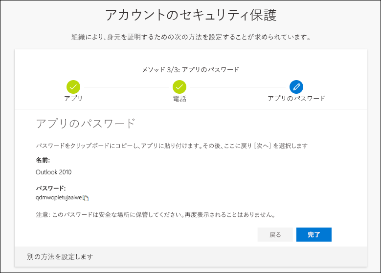
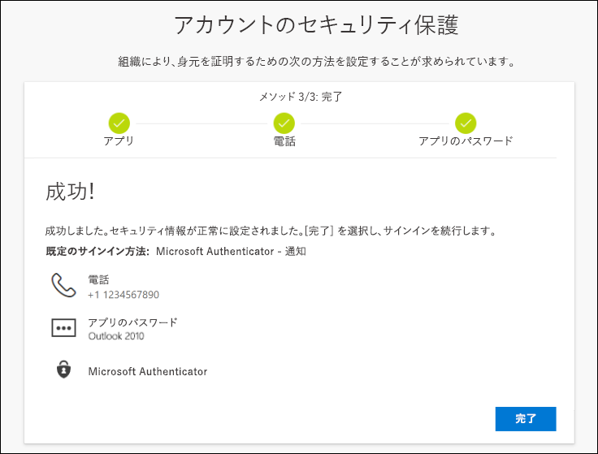

# サインイン プロンプトから自分のセキュリティ情報を設定する

職場または学校アカウントにサインインした直後にセキュリティ情報の設定を求められた場合は、次の手順のようにして設定できます。

このプロンプトは、組織で要求されているセキュリティ情報を設定していない場合にのみ表示されます。 以前にセキュリティ情報を設定してあり、それを変更したい場合は、さまざまなメソッドに基づく方法に関する記事の手順を利用できます。 詳しくは、[セキュリティ情報の追加または更新の概要](security-info-add-update-methods-overview.md)に関する記事をご覧ください。

[!INCLUDE [preview-notice](../../../includes/active-directory-end-user-preview-notice-security-info.md)]

## セキュリティ認証とパスワードのリセット認証

セキュリティ情報の方法は、2 要素セキュリティ認証とパスワードのリセットの両方に使用されます。 ただし、すべてのメソッドを両方に使用できるわけではありません。

| Method | 使用目的 |
| ------ | -------- |
| Authenticator アプリ | 2 要素認証とパスワードのリセット認証。 |
| テキスト メッセージ | 2 要素認証とパスワードのリセット認証。 |
| 電話 | 2 要素認証とパスワードのリセット認証。 |
| セキュリティ キー | 2 要素認証とパスワードのリセット認証。 |
| 電子メール アカウント | パスワードのリセット認証のみ。 2 要素認証には別のメソッドを選択する必要があります。 |
| セキュリティの質問 | パスワードのリセット認証のみ。 2 要素認証には別のメソッドを選択する必要があります。 |

## 職場または学校アカウントにサインインする

職場または学校アカウントにサインインした後、アカウントにアクセスできるようになる前に、詳細情報の提供を求めるプロンプトが表示されます。

## ウィザードを使用してセキュリティ情報を設定する

次の手順のようにして、プロンプトから職場または学校アカウントのセキュリティ情報を設定します。

>[!Important]
>これは、あくまでもプロセスの例です。 組織の要件によっては、このプロセスの間に設定する必要がある他の確認メソッドが管理者によって設定されている可能性があります。 この例では、Microsoft Authenticator アプリと、確認の呼び出しまたはテキスト メッセージのための携帯電話番号の、2 つのメソッドを要求しています。

1. プロンプトで **[次へ]** を選択した後、**アカウントのセキュリティ保護ウィザード**が表示されて、管理者と組織が設定するよう要求している最初のメソッドが示されます。 この例では、Microsoft Authenticator アプリです。

   > [!Note]
   > Microsoft Authenticator アプリ以外の認証アプリを使用する場合は、 **[別の認証アプリを使用します]** リンクを選択します。
   >
   > 組織で、認証アプリのほかに別の方法を選択できる場合は、 **[別の方法を設定します]** リンクを選択できます。

    

2. **[今すぐダウンロード]** を選択し、Microsoft Authenticator アプリをダウンロードしてモバイル デバイスにインストールし、 **[次へ]** を選択します。 アプリをダウンロードして、インストールする方法の詳細については、「[Microsoft Authenticator アプリのダウンロードとインストール](user-help-auth-app-download-install.md)」を参照してください。

    ![Authenticator の [アカウントのセットアップ] ページが示されているアカウントのセキュリティ保護ウィザード](media/security-info/securityinfo-prompt-auth-app-setup-acct.png)

3. モバイル デバイスで Microsoft Authenticator アプリを設定している間は、 **[アカウントのセットアップ]** ページに留まります。

4. Microsoft Authenticator アプリを開き、通知を許可するように選択し (メッセージが表示された場合)、右上の **[Customize and control]\(カスタマイズと制御\)** アイコンから **[アカウントの追加]** を選択して、 **[職場または学校アカウント]** を選択します。

    >[!Note]
    >初めて Microsoft Authenticator アプリを設定する場合は、アプリによるカメラへのアクセスを許可するか (iOS)、またはアプリによる画像の撮影とビデオの録画を許可するか (Android) を確認するメッセージが表示されることがあります。 認証アプリがカメラにアクセスして、次の手順で QR コードを撮影できるようにするには、 **[許可]** を選択する必要があります。 カメラを許可しない場合でも、認証アプリを設定できますが、手動でコード情報を追加する必要があります。 コードを手動で追加する方法の詳細については、「[アプリにアカウントを手動で追加する](user-help-auth-app-add-account-manual.md)」を参照してください。

5. コンピューターで **[アカウントのセットアップ]** ページに戻り、 **[次へ]** を選択します。

    **[QR コードをスキャンします]** ページが表示されます。

    

6. 手順 5 で職場または学校アカウントを作成した後に、モバイル デバイスに表示されたコードを、Microsoft Authenticator アプリの QR コード リーダーでスキャンします。

    認証アプリによって、ユーザーからの追加情報を必要とせずに、職場または学校アカウントが正常に追加されるはずです。 ただし、QR コード リーダーで、コードを読み取れない場合は、 **[Can't scan the QR image]\(QR イメージをスキャンできませんか?\)** を選択し、コードと URL を Microsoft Authenticator アプリに手動で入力します。 コードを手動で追加する方法の詳細については、「[アプリにアカウントを手動で追加する](user-help-auth-app-add-account-manual.md)」を参照してください。

7. コンピューターの **[QR コードをスキャンします]** ページで、 **[次へ]** を選択します。

    モバイル デバイスの Microsoft Authenticator アプリに、アカウントをテストするための通知が送信されます。

    

8. Microsoft Authenticator アプリで通知を承認し、 **[次へ]** を選択します。

    

    2 段階認証またはパスワードのリセットを使用するときに、既定で Microsoft Authenticator アプリを使用して本人確認をするようにセキュリティ情報が更新されます。

9. **[電話番号]** 設定ページで、テキスト メッセージまたは電話呼び出しのどちらを受け取るかを選択した後、 **[次へ]** を選択します。 この例ではテキスト メッセージを使用しているので、テキスト メッセージを受け取ることができるデバイスの電話番号を使用する必要があります。

    

    指定した電話番号にテキスト メッセージが送信されます。 電話呼び出しを希望する場合も、プロセスは同じです。 ただし、テキスト メッセージではなく、手順についての電話呼び出しを受け取ります。

10. モバイル デバイスに送信されたテキスト メッセージで提供されたコードを入力し、 **[次へ]** を選択します。

    

11. 成功通知を確認し、 **[完了]** を選択します。

    

    2 段階認証またはパスワードのリセットを使用するときに、ID を確認するためのバックアップ メソッドとしてテキスト メッセージを使用するように、セキュリティ情報が更新されます。

12. **[成功]** ページで、セキュリティ情報に Microsoft Authenticator アプリと電話番号 (テキスト メッセージまたは電話呼び出し) の両方のメソッドが正しく設定されたことを確認した後、 **[完了]** を選択します。

    

    >[!Note]
    >組織でアプリ パスワードを使用するように要求されている場合は、このウィザードに追加のセクションが表示され、そこで設定することができます。 **アプリ パスワード**と呼ばれる 3 番目のセクションが表示された場合は、ウィザードを完了する前に、これを入力する必要があります。 アプリ パスワードを追加する手順については、この記事の「[アプリ パスワードを管理する](#manage-your-app-passwords)」セクションを参照してください。

### アプリ パスワードを管理する

Outlook 2010 などの特定のアプリでは、2 段階認証はサポートされていません。 このサポートの欠如は、組織で 2 段階認証を使用している場合、アプリが動作しないことを意味します。 この問題を回避するために、通常のパスワードとは別に、各非ブラウザー アプリで使用する自動生成パスワードを作成できます。

>[!Note]
>ウィザードにこのオプションが表示されない場合は、管理者が設定していないことを意味します。 これが設定されていないが、アプリ パスワードを使用する必要があることがわかっている場合は、[セキュリティ情報ページからアプリ パスワードを設定する](security-info-app-passwords.md)方法に関するページの手順に従ってください。

アプリ パスワードを使用する場合は、次の点に注意してください。

- アプリ パスワードは自動生成され、アプリごとに 1 回しか入力されない。

- ユーザー 1 人あたりのパスワード数の上限は 40 個である。 この上限を超えて作成を試行すると、新しいパスワードの作成が許可されるように、事前に既存のパスワードを削除するよう求められます。

- アプリ パスワードは、アプリごとではなく、デバイスごとに 1 つ使用します。 たとえば、ラップトップ上のすべてのアプリに対して単一のパスワードを作成してから、デスクトップ上のすべてのアプリに対してもう 1 つの別のパスワードを作成します。

#### サインイン ウィザードでアプリ パスワードを追加するには

1. ウィザードの前のセクションを完了したら、 **[次へ]** を選択し、 **[アプリ パスワード]** セクションを完了します。

2. パスワードを必要とするアプリの名前 (例: `Outlook 2010`) を入力し、 **[次へ]** を選択します。

    

3. **[アプリ パスワード]** 画面からパスワード コードをコピーし、アプリの **[パスワード]** 領域 (この例では Outlook 2010) に貼り付けます。

    

4. パスワードをコピーしてアプリに貼り付けたら、このウィザードに戻り、すべてのサインイン方法の情報が正確であることを確認してから、 **[完了]** を選択します。

    

## 次のステップ

- 既定のセキュリティ情報メソッドの変更、削除、または更新については、以下をご覧ください。

    - [認証アプリ用にセキュリティ情報を設定する](security-info-setup-auth-app.md)。

    - [テキスト メッセージ用にセキュリティ情報を設定する](security-info-setup-text-msg.md)。

    - [電話を使用するようにセキュリティ情報を設定する](security-info-setup-phone-number.md)。

    - [メールを使用するようにセキュリティ情報を設定する](security-info-setup-email.md)。

    - [あらかじめ定義されたセキュリティの質問を使用するようにセキュリティ情報を設定する](security-info-setup-questions.md)。

- 指定したメソッドを使用してサインインする方法については、「[サインイン方法](user-help-sign-in.md)」をご覧ください。

- [パスワード リセット ポータル](https://passwordreset.microsoftonline.com/)を使用するか、「[職場または学校のパスワードをリセットする](active-directory-passwords-update-your-own-password.md)」の手順に従って、パスワードをリセットする (パスワードをなくしたか忘れた場合)。

- 「[Microsoft アカウントにサインインできない場合](https://support.microsoft.com/help/12429/microsoft-account-sign-in-cant)」の記事でサインインの問題に関するトラブルシューティングのヒントやヘルプを入手する。
