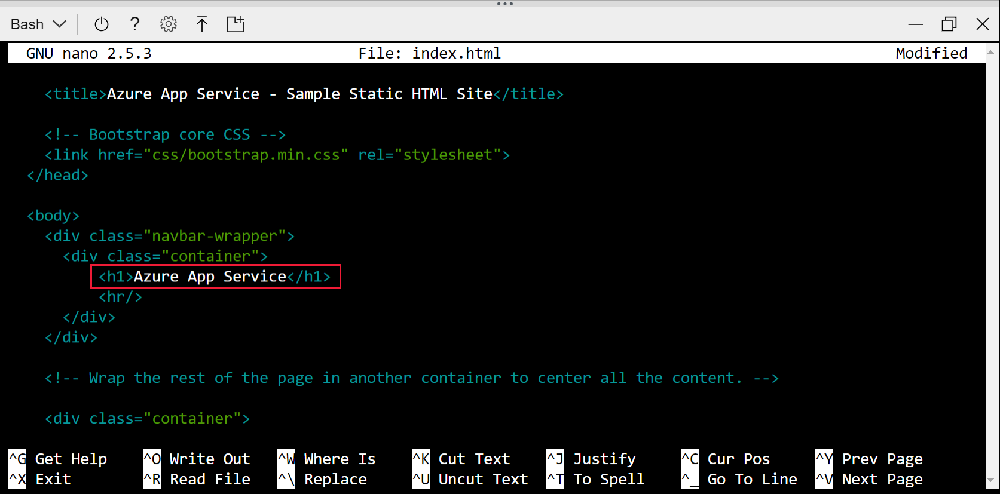
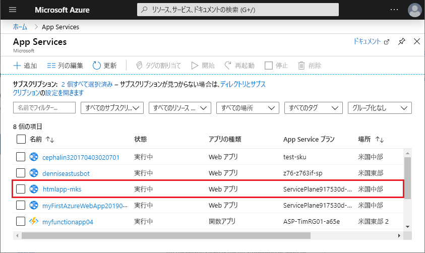
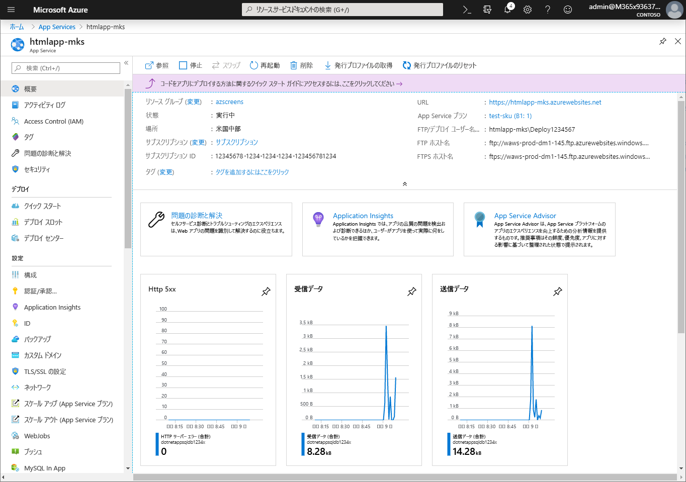

# <a name="create-a-static-html-web-app-in-azure"></a>Azure で静的 HTML Web アプリを作成する

[Azure App Service](overview.md) は、非常にスケーラブルな、自己適用型の Web ホスティング サービスを提供します。 このクイック スタートでは、基本的な HTML+CSS サイトを Azure App Service にデプロイする方法を示します。 このクイック スタートは [Cloud Shell](https://docs.microsoft.com/azure/cloud-shell/overview) で行いますが、これらのコマンドは [Azure CLI](/cli/azure/install-azure-cli) を使用してローカルで実行することもできます。


[!INCLUDE [quickstarts-free-trial-note](../../includes/quickstarts-free-trial-note.md)]

[!INCLUDE [cloud-shell-try-it.md](../../includes/cloud-shell-try-it.md)]

## <a name="download-the-sample"></a>サンプルのダウンロード

Cloud Shell で、クイックスタートのディレクトリを作成し、それに変更します。

```bash
mkdir quickstart

cd $HOME/quickstart
```

次に、以下のコマンドを実行して、サンプル アプリのリポジトリをクイックスタートのディレクトリに複製します。

```bash
git clone https://github.com/Azure-Samples/html-docs-hello-world.git
```

## <a name="create-a-web-app"></a>Web アプリを作成する

サンプル コードが含まれているディレクトリに移動し、`az webapp up` コマンドを実行します。

次の例で、<app_name> を一意のアプリ名に置き換えます。

```bash
cd html-docs-hello-world
```

```azurecli
az webapp up --location westeurope --name <app_name> 
```

`az webapp up` コマンドは、次の処理を実行します。

- 既定のリソース グループを作成する。

- 既定の App Service プランを作成する。

- 指定された名前でアプリを作成する。

- 現在の作業ディレクトリから Web アプリにファイルを [zip してデプロイ](https://docs.microsoft.com/azure/app-service/deploy-zip)する。

このコマンドの実行には、数分かかる場合があります。 実行中、次の例のような情報が表示されます。

```json
{
  "app_url": "https://<app_name>.azurewebsites.net",
  "location": "westeurope",
  "name": "<app_name>",
  "os": "Windows",
  "resourcegroup": "appsvc_rg_Windows_westeurope",
  "serverfarm": "appsvc_asp_Windows_westeurope",
  "sku": "FREE",
  "src_path": "/home/<username>/quickstart/html-docs-hello-world ",
  < JSON data removed for brevity. >
}
```

`resourceGroup` の値を書き留めておきます。 これは、「[リソースのクリーンアップ](#clean-up-resources)」セクションで必要になります。

## <a name="browse-to-the-app"></a>アプリの参照

ブラウザーで、アプリの URL (`http://<app_name>.azurewebsites.net`) に移動します。

ページは、Azure App Service Web アプリとして実行されています。


**お疲れさまでした。** App Service に初めての HTML アプリをデプロイしました。

## <a name="update-and-redeploy-the-app"></a>アプリを更新して再デプロイする

Cloud Shell で、「`nano index.html`」と入力して nano テキスト エディターを開きます。 次に示すように、`<h1>` 見出しタグで "Azure App Service - Sample Static HTML Site" から "Azure App Service" に変更します。



変更内容を保存し、nano を終了します。 コマンド `^O` を使用して保存し、`^X` を使用して終了します。

同じ `az webapp up` コマンドを使用して、アプリを再デプロイします。

```azurecli
az webapp up --location westeurope --name <app_name> --html
```

デプロイが完了したら、「**アプリの参照**」の手順で開いたブラウザー ウィンドウに戻り、ページを更新します。


## <a name="manage-your-new-azure-app"></a>新しい Azure アプリの管理

作成した Web アプリを管理するには、[Azure portal](https://portal.azure.com) で **[App Services]** を検索して選択します。 

![Azure portal で [App Services] を選択する](./media/app-service-web-get-started-html/portal0.png)

**[App Services]** ページで、Azure アプリの名前を選択します。



Web アプリの [概要] ページを確認します。 ここでは、参照、停止、開始、再開、削除のような基本的な管理タスクを行うことができます。



左側のメニューは、アプリを構成するためのさまざまなページを示しています。

## <a name="clean-up-resources"></a>リソースをクリーンアップする

前の手順では、リソース グループ内に Azure リソースを作成しました。 これらのリソースが将来必要になると想定していない場合、Cloud Shell で次のコマンドを実行して、リソース グループを削除します。 「[Web アプリを作成する](#create-a-web-app)」の手順で、リソース グループ名が自動的に生成されたことを思い出してください。

```azurecli
az group delete --name appsvc_rg_Windows_westeurope
```

このコマンドの実行には、少し時間がかかる場合があります。

## <a name="next-steps"></a>次のステップ

> [!div class="nextstepaction"]
> [カスタム ドメインをマップする](app-service-web-tutorial-custom-domain.md)
