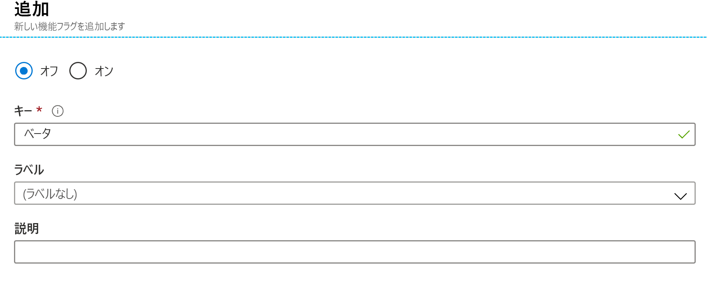
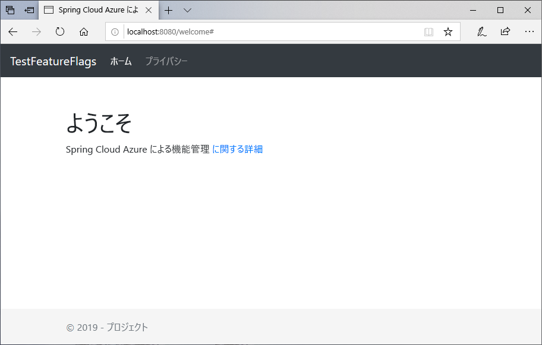

# <a name="quickstart-add-feature-flags-to-a-spring-boot-app"></a>クイック スタート:Spring Boot アプリに機能フラグを追加する

このクイックスタートでは、Azure App Configuration を Spring Boot Web アプリに組み込み、機能管理のエンドツーエンド実装を作成します。 App Configuration サービスを使用し、すべての機能フラグを一箇所に格納し、その状態を制御できます。

Spring Boot 機能管理ライブラリは、包括的な機能フラグのサポートにより、フレームワークを拡張します。 これらのライブラリは、Azure のライブラリには一切依存**しません**。 また、Spring Boot 構成プロバイダーを介して、App Configuration とシームレスに統合されます。

## <a name="prerequisites"></a>前提条件

* Azure サブスクリプション - [無料アカウントを作成する](https://azure.microsoft.com/free/)
* バージョン 8 を含む、サポートされている [Java Development Kit SDK](https://docs.microsoft.com/java/azure/jdk)。
* [Apache Maven](https://maven.apache.org/download.cgi) バージョン 3.0 以降。

## <a name="create-an-app-configuration-instance"></a>App Configuration インスタンスを作成する

[!INCLUDE [azure-app-configuration-create](../../includes/azure-app-configuration-create.md)]

6. **[機能マネージャー]**  >  **[+追加]** を選択して、`Beta` という機能フラグを追加します。

    > [!div class="mx-imgBorder"]
    > 

    現時点では `label` を空欄にしておいてください。

## <a name="create-a-spring-boot-app"></a>Spring Boot アプリを作成する

[Spring Initializr](https://start.spring.io/) を使用して、新しい Spring Boot プロジェクトを作成します。

1. <https://start.spring.io/> を参照します。

1. 次のオプションを指定します。

   * **Java** で **Maven** プロジェクトを生成します。
   * **Spring Boot** のバージョンとして、2.0 以降を指定します。
   * アプリケーションの**グループ (Group)** と**成果物 (Artifact)** の名前を指定します。  この記事では、`com.example` と `demo` を使用します。
   * **Spring Web** の依存関係を追加します。

1. 前の各オプションを指定してから、 **[プロジェクトの生成]** を選択します。 メッセージが表示されたら、ローカル コンピューターにプロジェクトをダウンロードします。

## <a name="add-feature-management"></a>機能管理を追加する

1. ファイルをローカル システム上に展開したら、Spring Boot アプリケーションの編集を開始できます。 アプリのルート ディレクトリで *pom.xml* を探します。

1. テキスト エディターで *pom.xml* ファイルを開き、`<dependencies>` の一覧に以下を追加します。

    **Spring Cloud 1.1.x**

    ```xml
    <dependency>
        <groupId>com.microsoft.azure</groupId>
        <artifactId>spring-cloud-azure-appconfiguration-config</artifactId>
        <version>1.1.2</version>
    </dependency>
    <dependency>
        <groupId>com.microsoft.azure</groupId>
        <artifactId>spring-cloud-azure-feature-management-web</artifactId>
        <version>1.1.2</version>
    </dependency>
    <dependency>
        <groupId>org.springframework.boot</groupId>
        <artifactId>spring-boot-starter-thymeleaf</artifactId>
    </dependency>
    ```

    **Spring Cloud 1.2.x**

    ```xml
    <dependency>
        <groupId>com.microsoft.azure</groupId>
        <artifactId>spring-cloud-azure-appconfiguration-config</artifactId>
        <version>1.2.2</version>
    </dependency>
    <dependency>
        <groupId>com.microsoft.azure</groupId>
        <artifactId>spring-cloud-azure-feature-management-web</artifactId>
        <version>1.2.2</version>
    </dependency>
    <dependency>
        <groupId>org.springframework.boot</groupId>
        <artifactId>spring-boot-starter-thymeleaf</artifactId>
    </dependency>
    ```

> [!Note]
> Spring Web に依存しない非 Web 機能管理ライブラリが存在します。 相違点については、GitHub の[ドキュメント](https://github.com/microsoft/spring-cloud-azure/tree/master/spring-cloud-azure-feature-management)を参照してください。

## <a name="connect-to-an-app-configuration-store"></a>App Configuration ストアに接続する

1. アプリの `resources` ディレクトリに移動し、`bootstrap.properties` を開きます。  ファイルが存在しない場合は、作成してください。 次の行をファイルに追加します。

    ```properties
    spring.cloud.azure.appconfiguration.stores[0].connection-string= ${APP_CONFIGURATION_CONNECTION_STRING}
    ```

1. 構成ストアの App Configuration ポータルで、サイドバーから `Access keys` を選択します。 [読み取り専用キー] タブを選択します。プライマリ接続文字列の値をコピーします。

1. 変数名 `APP_CONFIGURATION_CONNECTION_STRING` を使用して、環境変数としてプライマリ接続文字列を追加します。

1. メイン アプリケーションの Java ファイルを開き、`@EnableConfigurationProperties` を追加してこの機能を有効にします。

    ```java
    package com.example.demo;

    import org.springframework.boot.SpringApplication;
    import org.springframework.boot.context.properties.ConfigurationProperties;
    import org.springframework.boot.context.properties.EnableConfigurationProperties;
    import org.springframework.boot.autoconfigure.SpringBootApplication;

    @SpringBootApplication
    @EnableConfigurationProperties(MessageProperties.class)
    public class DemoApplication {

        public static void main(String[] args) {
            SpringApplication.run(DemoApplication.class, args);
        }
    }
    ```

1. アプリのパッケージ ディレクトリに、*MessageProperties.java* という名前の新しい Java ファイルを作成します。

    ```java
    package com.example.demo;

    import org.springframework.boot.context.properties.ConfigurationProperties;
    import org.springframework.context.annotation.Configuration;

    @Configuration
    @ConfigurationProperties(prefix = "config")
    public class MessageProperties {
        private String message;

        public String getMessage() {
            return message;
        }

        public void setMessage(String message) {
            this.message = message;
        }
    }
    ```

1. アプリのパッケージ ディレクトリに、*HelloController.java* という名前の新しい Java ファイルを作成します。

    ```java
    package com.example.demo;

    import org.springframework.boot.context.properties.ConfigurationProperties;
    import org.springframework.stereotype.Controller;
    import org.springframework.ui.Model;

    import com.microsoft.azure.spring.cloud.feature.manager.FeatureManager;
    import org.springframework.web.bind.annotation.GetMapping;


    @Controller
    @ConfigurationProperties("controller")
    public class HelloController {

        private FeatureManager featureManager;

        public HelloController(FeatureManager featureManager) {
            this.featureManager = featureManager;
        }

        @GetMapping("/welcome")
        public String mainWithParam(Model model) {
            model.addAttribute("Beta", featureManager.isEnabledAsync("Beta").block());
            return "welcome";
        }
    }
    ```

1. アプリの templates ディレクトリに、*welcome.html* という名前の新しい HTML ファイルを作成します。

    ```html
    <!DOCTYPE html>
    <html lang="en" xmlns:th="http://www.thymeleaf.org">
    <head>
        <meta charset="utf-8">
        <meta name="viewport" content="width=device-width, initial-scale=1, shrink-to-fit=no">
        <title>Feature Management with Spring Cloud Azure</title>

        <link rel="stylesheet" href="/css/main.css">
        <link rel="stylesheet" href="https://stackpath.bootstrapcdn.com/bootstrap/4.3.1/css/bootstrap.min.css" integrity="sha384-ggOyR0iXCbMQv3Xipma34MD+dH/1fQ784/j6cY/iJTQUOhcWr7x9JvoRxT2MZw1T" crossorigin="anonymous">

        <script src="https://code.jquery.com/jquery-3.3.1.slim.min.js" integrity="sha384-q8i/X+965DzO0rT7abK41JStQIAqVgRVzpbzo5smXKp4YfRvH+8abtTE1Pi6jizo" crossorigin="anonymous"></script>
        <script src="https://cdnjs.cloudflare.com/ajax/libs/popper.js/1.14.7/umd/popper.min.js" integrity="sha384-UO2eT0CpHqdSJQ6hJty5KVphtPhzWj9WO1clHTMGa3JDZwrnQq4sF86dIHNDz0W1" crossorigin="anonymous"></script>
        <script src="https://stackpath.bootstrapcdn.com/bootstrap/4.3.1/js/bootstrap.min.js" integrity="sha384-JjSmVgyd0p3pXB1rRibZUAYoIIy6OrQ6VrjIEaFf/nJGzIxFDsf4x0xIM+B07jRM" crossorigin="anonymous"></script>

    </head>
    <body>
        <header>
        <!-- Fixed navbar -->
        <nav class="navbar navbar-expand-md navbar-dark fixed-top bg-dark">
            <a class="navbar-brand" href="#">TestFeatureFlags</a>
            <button class="navbar-toggler" aria-expanded="false" aria-controls="navbarCollapse" aria-label="Toggle navigation" type="button" data-target="#navbarCollapse" data-toggle="collapse">
            <span class="navbar-toggler-icon"></span>
            </button>
            <div class="collapse navbar-collapse" id="navbarCollapse">
            <ul class="navbar-nav mr-auto">
                <li class="nav-item active">
                <a class="nav-link" href="#">Home <span class="sr-only">(current)</span></a>
                </li>
                <li class="nav-item" th:if="${Beta}">
                <a class="nav-link" href="#">Beta</a>
                </li>
                <li class="nav-item">
                <a class="nav-link" href="#">Privacy</a>
                </li>
            </ul>
            </div>
        </nav>
        </header>
        <div class="container body-content">
            <h1 class="mt-5">Welcome</h1>
            <p>Learn more about <a href="https://github.com/microsoft/spring-cloud-azure/blob/master/spring-cloud-azure-feature-management/README.md">Feature Management with Spring Cloud Azure</a></p>

        </div>
        <footer class="footer">
            <div class="container">
            <span class="text-muted">&copy; 2019 - Projects</span>
        </div>

        </footer>
    </body>
    </html>

    ```

1. CSS という名前の新しいフォルダーを `static` の下に作成し、その中に *main.css* という名前の新しい CSS ファイルを作成します。

    ```css
    html {
     position: relative;
     min-height: 100%;
    }
    body {
     margin-bottom: 60px;
    }
    .footer {
     position: absolute;
     bottom: 0;
     width: 100%;
     height: 60px;
     line-height: 60px;
     background-color: #f5f5f5;
    }

    body > .container {
     padding: 60px 15px 0;
    }

    .footer > .container {
     padding-right: 15px;
     padding-left: 15px;
    }

    code {
     font-size: 80%;
    }
    ```

## <a name="build-and-run-the-app-locally"></a>アプリをビルドしてローカルで実行する

1. 自分の Spring Boot アプリケーションを Maven でビルドし、実行します。

    ```shell
    mvn clean package
    mvn spring-boot:run
    ```

1. ブラウザー ウィンドウを開き、`http://localhost:8080/welcome` に移動します。

    

1. App Configuration ポータルで **[Feature Manager]\(機能マネージャー\)** を選択し、 **[Beta]\(ベータ\)** キーの状態を **[On]\(オン\)** に変更します。

    | Key | State |
    |---|---|
    | ベータ | On |

1. ブラウザー ページを最新の情報に更新して新しい構成設定を確認します。

    

## <a name="clean-up-resources"></a>リソースをクリーンアップする

[!INCLUDE [azure-app-configuration-cleanup](../../includes/azure-app-configuration-cleanup.md)]

## <a name="next-steps"></a>次のステップ

このクイックスタートでは、新しい App Configuration ストアを作成し、この構成ストアを使用して、[機能管理ライブラリ](https://go.microsoft.com/fwlink/?linkid=2074664)を介して Spring Boot Web アプリの機能を管理しました。

* [機能管理](./concept-feature-management.md)の詳細を確認します。
* [機能フラグを管理](./manage-feature-flags.md)します。
* [Spring Boot Core アプリ内で機能フラグを使用](./use-feature-flags-spring-boot.md)します。
