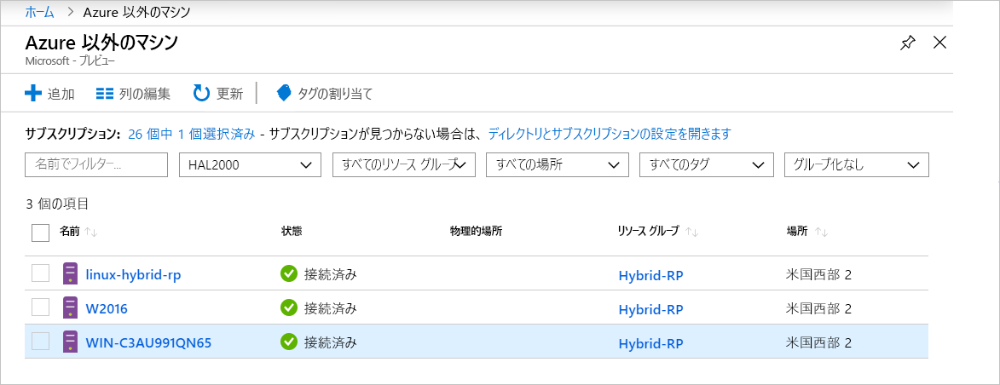

# <a name="what-is-azure-arc-for-servers"></a>サーバー向け Azure Arc とは

サーバー向け Azure Arc を使用すると、Azure の外部にあるマシンを管理できます。
Azure 以外のマシンが Azure に接続されると、**接続済みマシン**になり、Azure 内でリソースとして扱われます。 各**接続済みマシン**にはリソース ID があり、サブスクリプション内のリソース グループの一部として管理されます。また、Azure Policy やタグ付けなどの標準的な Azure のコンストラクトの利点も活用できます。

Azure に接続するには、エージェント パッケージを各マシンにインストールする必要があります。 このドキュメントの残りの部分では、そのプロセスについて詳しく説明します。

マシンの状態は、エージェントがどのくらい最近チェックインされたかに基づいて、**接続**または**切断**のいずれかになります。 各チェックインはハートビートと呼ばれます。 過去 5 分以内にマシンがチェックインされていない場合は、接続が復元されるまでオフラインとして表示されます。  <!-- For more information on troubleshooting agent connectivity, see [Troubleshooting Azure Arc for servers](troubleshoot/arc-for-servers.md). -->



## <a name="clients"></a>クライアント

### <a name="supported-operating-systems"></a>サポートされているオペレーティング システム

パブリック プレビューでは、次がサポートされます。

- Windows Server 2012 R2 以降
- Ubuntu 16.04 および 18.04

パブリック プレビュー リリースは、評価目的で設計されているため、重要な運用リソースの管理には使用しないでください。

## <a name="azure-subscription-and-service-limits"></a>Azure サブスクリプションとサービスの制限

Azure Resource Manager の制限事項を読み、[サブスクリプション](../../azure-subscription-service-limits.md#subscription-limits---azure-resource-manager)と[リソース グループ](../../azure-subscription-service-limits.md#resource-group-limits)について記載されているガイドラインに従って、接続するマシンの数を計画してください。 具体的には、リソース グループあたりのサーバー数は既定で 800 に制限されています。

## <a name="networking-configuration"></a>ネットワーク構成

エージェントをインストールしたり実行したりするためには、**Azure Arc サービスのエンドポイント**への接続が必要となります。 ファイアウォールにより送信接続がブロックされている場合は、次の URL が既定でブロックされないことを確認します。 すべての接続はエージェントから Azure に送信され、**SSL** によってセキュリティで保護されます。 すべてのトラフィックは、**HTTPS** プロキシ経由でルーティングできます。 サーバーに接続を許可する IP の範囲やドメイン名を許可する場合は、次のサービス タグや DNS 名にポート 443 へのアクセスを許可する必要があります。

サービス タグ:

* AzureActiveDirectory
* AzureTrafficManager

各サービス タグ/リージョンの IP アドレスの一覧については、「[Azure IP 範囲とサービス タグ – パブリック クラウド](https://www.microsoft.com/download/details.aspx?id=56519)」という JSON ファイルを参照してください。 Microsoft では、各 Azure サービスとそれが使用する IP 範囲を含む更新プログラムを毎週発行しています。 詳細については、「[サービス タグ](https://docs.microsoft.com/azure/virtual-network/security-overview#service-tags)」を参照してください。

これらの DNS 名は、サービス タグの IP 範囲情報に加えて提供されます。ほとんどのサービスには現在サービス タグの登録がなく、そのため IP は変更される可能性があるためです。 ファイアウォール構成に IP 範囲が必要な場合は、**AzureCloud** サービス タグを使用して、すべての Azure サービスへのアクセスを許可してください。 これらの URL のセキュリティ監視または検査を無効にしてはなりませんが、他のインターネット トラフィックと同様に許可します。

| ドメイン環境 | 必要な Azure サービス エンドポイント |
|---------|---------|
|management.azure.com|Azure Resource Manager|
|login.windows.net|Azure Active Directory|
|dc.services.visualstudio.com|Application Insights|
|agentserviceapi.azure-automation.net|ゲスト構成|
|*-agentservice-prod-1.azure-automation.net|ゲスト構成|
|*.his.hybridcompute.azure-automation.net|ハイブリッド ID サービス|

### <a name="installation-network-requirements"></a>インストールのネットワーク要件

[Azure Connected Machine Agent パッケージ](https://aka.ms/AzureConnectedMachineAgent)を公式のディストリビューション サーバーからダウンロードします。以下のサイトには、お使いの環境からアクセスできる必要があります。 パッケージをファイル共有にダウンロードして、そこからエージェントをインストールすることもできます。 この場合、Azure portal から生成されたオンボード スクリプトを変更する必要があることがあります。

Windows:

* `aka.ms`
* `download.microsoft.com`

Linux:

* `aka.ms`
* `packages.microsoft.com`

指定のプロキシを使用するようにエージェントを構成する方法については、「[プロキシ サーバーの構成](quickstart-onboard-powershell.md#proxy-server-configuration)」セクションを参照してください。

## <a name="register-the-required-resource-providers"></a>必要なリソース プロバイダーを登録する

サーバー向け Azure Arc を使用するためには、必要なリソースプロバイダーを登録する必要があります。

* **Microsoft.HybridCompute**
* **Microsoft.GuestConfiguration**

リソース プロバイダーは、次のコマンドを使用して登録できます。

Azure PowerShell:

```azurepowershell-interactive
Login-AzAccount
Set-AzContext -SubscriptionId [subscription you want to onboard]
Register-AzResourceProvider -ProviderNamespace Microsoft.HybridCompute
Register-AzResourceProvider -ProviderNamespace Microsoft.GuestConfiguration
```

Azure CLI:

```azurecli-interactive
az account set --subscription "{Your Subscription Name}"
az provider register --namespace 'Microsoft.HybridCompute'
az provider register --namespace 'Microsoft.GuestConfiguration'
```

ポータルを使用してリソース プロバイダーを登録するには、[Azure portal](../../azure-resource-manager/resource-manager-supported-services.md#azure-portal) の手順に従ってください。

## <a name="supported-scenarios"></a>サポートされるシナリオ

ノードを登録した後は、他の Azure サービスを使用してノードの管理を開始できます。

パブリック プレビューでは、**接続済みマシン**で次のシナリオがサポートされています。

## <a name="guest-configuration"></a>ゲスト構成

マシンを Azure に接続した後、Azure の仮想マシンへのポリシー割り当てと同じエクスペリエンスを使用して、**接続済みマシン**に Azure ポリシーを割り当てることができます。

詳細については、「[Azure Policy のゲストの構成の理解](../../governance/policy/concepts/guest-configuration.md)」を参照してください。

**接続済みマシン**のゲスト構成エージェントのログは、次の場所にあります。

* Windows - `%ProgramFiles%\AzureConnectedMachineAgent\logs\dsc.log`
* Linux: - `/opt/logs/dsc.log`

## <a name="log-analytics"></a>Log Analytics

[Microsoft Monitoring Agent (MMA)](https://docs.microsoft.com/azure/azure-monitor/log-query/log-query-overview) によって収集され、Log Analytics のワークスペースに格納されているログ データに、マシンに固有のプロパティ (リソース中心のログ アクセスに使用できる **ResourceId** など) が含まれるようになりました。

- MMA エージェントが既にインストールされているマシンでは、更新された管理パックによって **Azure Arc** の機能が有効になります。
- サーバー向け Azure Arc の統合には、[MMA エージェント バージョン 10.20.18011 以上](https://docs.microsoft.com/azure/virtual-machines/extensions/oms-windows#agent-and-vm-extension-version)が必要です。
- [Azure Monitor](https://docs.microsoft.com/azure/azure-monitor/log-query/log-query-overview)でログデータを照会するときに返されるデータ スキーマには、ハイブリッド **ResourceId** が `/subscriptions/<SubscriptionId/resourceGroups/<ResourceGroup>/providers/Microsoft.HybridCompute/machines/<MachineName>` の形式で格納されます。

詳細については、「[Azure Monitor で Log Analytics の使用を開始する](https://docs.microsoft.com/azure/azure-monitor/log-query/get-started-portal)」を参照してください。

<!-- MMA agent version 10.20.18011 and later -->

## <a name="next-steps"></a>次の手順

サーバー向け Azure Arc を使用してマシンを接続する方法は 2 つあります

* **対話形式で** - [ポータルのクイック スタート](quickstart-onboard-portal.md)に従ってポータルからスクリプトを生成し、マシンで実行する。 これは、一度に 1 台のマシンを接続する場合に最適なオプションです。
* **大規模に** - [PowerShell のクイック スタート](quickstart-onboard-powershell.md)に従い、マシンを非対話的に接続するためのサービス プリンシパルを作成します。
