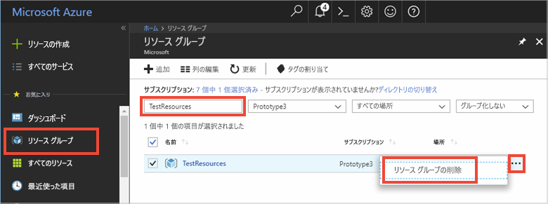

# <a name="quickstart-use-azure-cache-for-redis-with-java"></a>クイック スタート:Java で Azure Cache for Redis を使用する

このクイック スタートでは、Azure 内の任意のアプリケーションからアクセスできるセキュリティで保護された専用キャッシュにアクセスするために、Azure Cache for Redis を [Jedis](https://github.com/xetorthio/jedis) Redis クライアントを使用する Java アプリに組み込みます。

## <a name="prerequisites"></a>前提条件

- Azure サブスクリプション - [無料アカウントを作成する](https://azure.microsoft.com/free/)
- [Apache Maven](https://maven.apache.org/download.cgi)

## <a name="create-an-azure-cache-for-redis"></a>Azure Cache for Redis を作成する

[!INCLUDE [redis-cache-create](../../includes/redis-cache-create.md)]

[!INCLUDE [redis-cache-access-keys](../../includes/redis-cache-access-keys.md)]

**[ホスト名]** と **[プライマリ]** アクセス キーの環境変数を追加します。 コードに機密情報を直接含める代わりに、これらの変数をコードから使用します。

```CMD 
set REDISCACHEHOSTNAME=contosoCache.redis.cache.windows.net
set REDISCACHEKEY=XXXXXXXXXXXXXXXXXXXXXXXXXXXXXXXXXXXXXXXXXXXX
```

## <a name="create-a-new-java-app"></a>新しい Java アプリを作成する

Maven を使用して、新しいクイック スタート アプリを生成します。

```CMD
mvn archetype:generate -DarchetypeGroupId=org.apache.maven.archetypes -DarchetypeArtifactId=maven-archetype-quickstart -DarchetypeVersion=1.3 -DgroupId=example.demo -DartifactId=redistest -Dversion=1.0
```

新しい *redistest* プロジェクト ディレクトリに移動します。

*pom.xml* ファイルを開き、[Jedis](https://github.com/xetorthio/jedis) の依存関係を追加します。

```xml
    <dependency>
        <groupId>redis.clients</groupId>
        <artifactId>jedis</artifactId>
        <version>3.2.0</version>
        <type>jar</type>
        <scope>compile</scope>
    </dependency>
```

*pom.xml* ファイルを保存します。

*App.java* を開き、コードを次のコードに置き換えます。

```java
package example.demo;

import redis.clients.jedis.Jedis;
import redis.clients.jedis.JedisShardInfo;

/**
 * Redis test
 *
 */
public class App 
{
    public static void main( String[] args )
    {

        boolean useSsl = true;
        String cacheHostname = System.getenv("REDISCACHEHOSTNAME");
        String cachekey = System.getenv("REDISCACHEKEY");

        // Connect to the Azure Cache for Redis over the TLS/SSL port using the key.
        JedisShardInfo shardInfo = new JedisShardInfo(cacheHostname, 6380, useSsl);
        shardInfo.setPassword(cachekey); /* Use your access key. */
        Jedis jedis = new Jedis(shardInfo);      

        // Perform cache operations using the cache connection object...

        // Simple PING command        
        System.out.println( "\nCache Command  : Ping" );
        System.out.println( "Cache Response : " + jedis.ping());

        // Simple get and put of integral data types into the cache
        System.out.println( "\nCache Command  : GET Message" );
        System.out.println( "Cache Response : " + jedis.get("Message"));

        System.out.println( "\nCache Command  : SET Message" );
        System.out.println( "Cache Response : " + jedis.set("Message", "Hello! The cache is working from Java!"));

        // Demonstrate "SET Message" executed as expected...
        System.out.println( "\nCache Command  : GET Message" );
        System.out.println( "Cache Response : " + jedis.get("Message"));

        // Get the client list, useful to see if connection list is growing...
        System.out.println( "\nCache Command  : CLIENT LIST" );
        System.out.println( "Cache Response : " + jedis.clientList());

        jedis.close();
    }
}
```

このコードでは、キャッシュ ホスト名とキー環境変数を使用して Azure Cache for Redis のインスタンスに接続する方法を示しています。 コードでは、キャッシュ内の文字列値の格納および取得も行います。 `PING` および `CLIENT LIST` コマンドも実行されます。 

*App.java* を保存します。

## <a name="build-and-run-the-app"></a>アプリのビルドと実行

次の Maven コマンドを実行して、アプリをビルドおよび実行します。

```CMD
mvn compile
mvn exec:java -D exec.mainClass=example.demo.App
```

次の例では、`Message` キーは、前に Azure portal の Redis コンソールを使って設定されたキャッシュ値を持っていたことがわかります。 アプリは、そのキャッシュ値を更新しました。 また、アプリは `PING` および `CLIENT LIST` コマンドも実行しました。


## <a name="clean-up-resources"></a>リソースをクリーンアップする

次のチュートリアルに進む場合は、このクイック スタートで作成したリソースを維持して、再利用することができます。

クイック スタートのサンプル アプリケーションの使用を終える場合は、課金を避けるために、このクイック スタートで作成した Azure リソースを削除することができます。 

> [!IMPORTANT]
> いったん削除したリソース グループを元に戻すことはできません。リソース グループとそこに存在するすべてのリソースは完全に削除されます。 間違ったリソース グループやリソースをうっかり削除しないようにしてください。 このサンプルのホストとなるリソースを、保持するリソースが含まれている既存のリソース グループ内に作成した場合は、リソース グループを削除するのではなく、個々のブレードから各リソースを個別に削除することができます。
>

1. [Azure portal](https://portal.azure.com) にサインインし、 **[リソース グループ]** を選択します。

1. **[名前でフィルター]** ボックスにリソース グループの名前を入力します。 この記事の手順では、*TestResources* という名前のリソース グループを使用しました。 結果一覧でリソース グループの **[...]** を選択し、 **[リソース グループの削除]** を選択します。

   

1. リソース グループの削除の確認を求めるメッセージが表示されます。 確認のためにリソース グループの名前を入力し、 **[削除]** を選択します。

しばらくすると、リソース グループとそこに含まれているすべてのリソースが削除されます。

## <a name="next-steps"></a>次のステップ

このクイック スタートでは、Java アプリケーションから Azure Cache for Redis を使用する方法を説明しました。 ASP.NET Web アプリと Azure Cache for Redis を使用するには、次のクイック スタートに進みます。

> [!div class="nextstepaction"]
> [Azure Cache for Redis を使用する ASP.NET Web アプリを作成する](./cache-web-app-howto.md)
