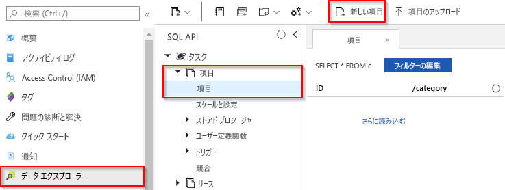

# Azure Cosmos DB によってトリガーされる関数を作成する

Azure Cosmos DB にデータが追加される、または変更されるときにトリガーされる関数の作成方法を説明します。 Azure Cosmos DB の詳細については、「[Azure Cosmos DB: Azure Functions を使用したサーバーなしのデータベースのコンピューティング](../cosmos-db/serverless-computing-database.md)」をご覧ください。

## 前提条件

このチュートリアルを完了するには、以下が必要です。

+ Azure サブスクリプションをお持ちでない場合は、開始する前に [無料アカウント](https://azure.microsoft.com/free/?WT.mc_id=A261C142F) を作成してください。

> [!NOTE]
> [!INCLUDE [SQL API support only](../../includes/functions-cosmosdb-sqlapi-note.md)]

## Azure Cosmos DB アカウントを作成する

トリガーを作成する前に、SQL API を使用する Azure Cosmos DB アカウントが必要です。

[!INCLUDE [cosmos-db-create-dbaccount](../../includes/cosmos-db-create-dbaccount.md)]

## Azure Function App の作成

[!INCLUDE [Create function app Azure portal](../../includes/functions-create-function-app-portal.md)]

次に、新しい Function App で関数を作成します。

## Azure Cosmos DB のトリガーの作成

1. Function App を展開し、 **[関数]+ の横にある** [ **]** ボタンをクリックします。 これが関数アプリの初めての関数の場合は、 **[ポータル内]** 、 **[続行]** の順に選択します。 それ以外の場合は、手順 3 に進みます。

   

1. **[その他のテンプレート]** 、 **[Finish and view templates]\(終了してテンプレートを表示\)** の順に選択します。

    ![Functions のクイック スタート: [その他のテンプレート] を選択する](./media/functions-create-cosmos-db-triggered-function/add-first-function.png)

1. 検索フィールドに「`cosmos`」と入力し、**Azure Cosmos DB トリガー** テンプレートを選択します。

1. プロンプトが表示されたら、 **[インストール]** を選択して Azure Cosmos DB 拡張機能を関数アプリにインストールします。 インストールが正常に完了したら、 **[続行]** を選択します。

    

1. 新しいトリガーは、次の画像の下の表に示したように設定します。

    

    | 設定      | 推奨値  | 説明                                |
    | ------------ | ---------------- | ------------------------------------------ |
    | **名前** | Default | テンプレートに示されている既定の関数名を使用します。|
    | **Azure Cosmos DB アカウント接続** | 新しい設定 | **[新規]** を選択し、使用する**サブスクリプション**、前の手順で作成した**データベース アカウント**、 **[選択]** の順に選択します。 これにより、アカウント接続のアプリケーション設定が作成されます。 この設定は、データベースへの接続へのバインディングによって使用されます。 |
    | **コンテナー名** | アイテム | 監視するコンテナーの名前。 |
    | **Create lease container if it doesn't exist (リース コンテナーが存在しない場合は作成する)** | オン | コンテナーはまだ存在していないため、作成します。 |
    | **データベース名** | 処理手順 | 監視するコンテナーのデータベース名。 |

1. **[作成]** をクリックして、Azure Cosmos DB でトリガーされる関数を作成します。 関数が作成されると、テンプレート ベースの関数コードが表示されます。  

    

    この関数テンプレートは、ドキュメント数と最初のドキュメント ID をログに書き込みます。

次に、Azure Cosmos DB アカウントに接続し、`Items` データベースに `Tasks` コンテナーを作成します。

## Items コンテナーの作成

1. ブラウザーの新しいタブで、[Azure Portal](https://portal.azure.com) の 2 つ目のインスタンスを開きます。

1. ポータルの左側のアイコン バーを展開し、検索フィールドに「`cosmos`」と入力して、 **[Azure Cosmos DB]** を選択します。

    

1. Azure Cosmos DB アカウントを選択してから、 **[データ エクスプローラー]** を選択します。 

1. **[SQL API]** で **Tasks** データベースを選択し、 **[新しいコンテナー]** を選択します。

    

1. **[コンテナーの追加]** で、次の画像の下の表に示したように設定します。 

    

    | 設定|推奨値|説明 |
    | ---|---|--- |
    | **[データベース ID]** | 処理手順 |新しいデータベースの名前。 これは、関数バインドで定義された名前と一致する必要があります。 |
    | **コンテナー ID** | アイテム | 新しいコンテナーの名前。 これは、関数バインドで定義された名前と一致する必要があります。  |
    | **[[パーティション キー]](../cosmos-db/partition-data.md)** | /category|各パーティションに均等にデータを分散するパーティション キー。 効率の良いコンテナーを作成するためには、正しいパーティション キーを選択することが大切です。 | 
    | **スループット** |400 RU| 既定値を使用します。 待ち時間を短縮する場合、後でスループットをスケールアップできます。 |    

1. **[OK]** をクリックして、Items コンテナーを作成します。 コンテナーが作成されるまで多少時間がかかる場合があります。

関数バインドで指定されたコンテナーが作成されたら、この新しいコンテナーに項目を追加することで関数をテストできます。

## 関数をテストする

1. データ エクスプローラーで新しい **Items** コンテナーを展開し、 **[Items]\(項目\)** を選択して、 **[New Item]\(新しい項目\)** を選択します。

    

1. 新しい項目の内容を次の内容に置き換えて、 **[保存]** を選択します。

        {
            "id": "task1",
            "category": "general",
            "description": "some task"
        }

1. ポータルでご利用の関数が表示されている、ブラウザーの 1 つ目のタブに切り替えます。 関数ログを展開し、新しいドキュメントがその関数をトリガーしたことを確認します。 `task1` のドキュメント ID の値がログに書き込まれていることを確認してください。 

    

1. (省略可能) ドキュメントに戻り、変更を加え、 **[更新]** をクリックします。 次に、関数ログに戻り、この更新によっても関数がトリガーされたことを確認します。

## リソースをクリーンアップする

[!INCLUDE [Next steps note](../../includes/functions-quickstart-cleanup.md)]

## 次のステップ

Azure Cosmos DB でドキュメントが追加または変更されたときに実行される関数を作成しました。 Azure Cosmos DBのトリガーの詳細については、「[Azure Functions の Azure Cosmos DB バインド](functions-bindings-cosmosdb.md)」をご覧ください。

[!INCLUDE [Next steps note](../../includes/functions-quickstart-next-steps.md)]
