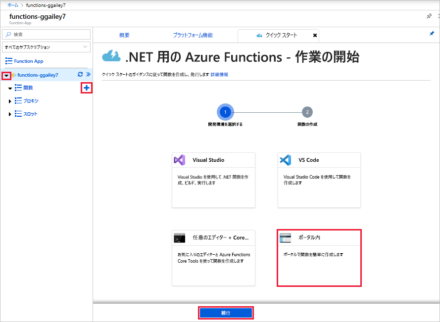
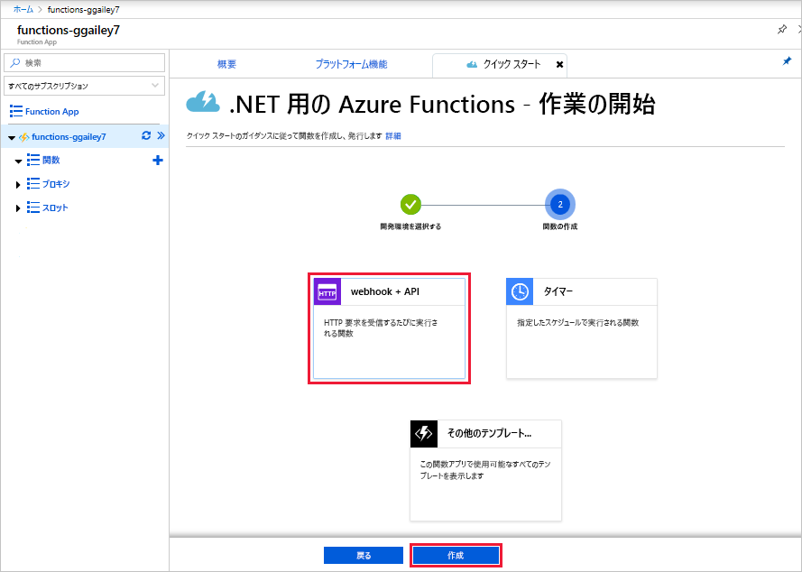
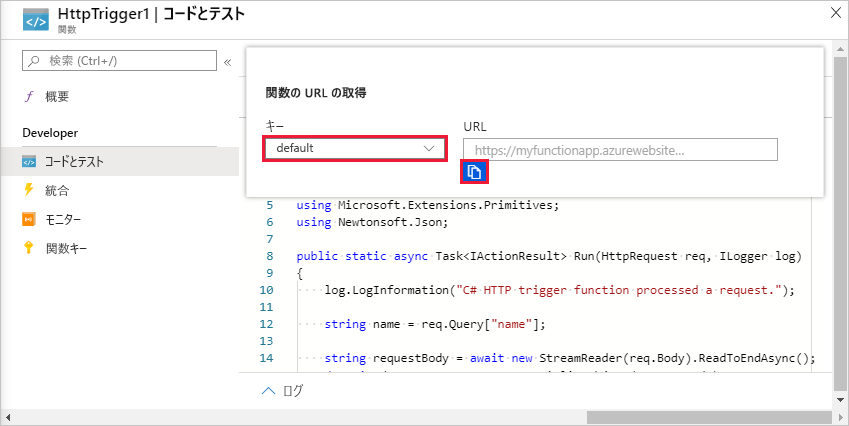

# Azure Portal で初めての関数を作成する

Azure Functions を使用すると、最初に仮想マシン (VM) を作成したり、Web アプリケーションを発行したりしなくても、サーバーレス環境でコードを実行できます。 この記事では、Azure Functions を使用して Azure portal で "hello world" の HTTP によってトリガーされる関数を作成する方法について学習します。

[!INCLUDE [quickstarts-free-trial-note](../../includes/quickstarts-free-trial-note.md)]

C# の開発者は、ポータルではなく、[Visual Studio 2019 で最初の関数を作成する](functions-create-your-first-function-visual-studio.md)ことを検討してください。 

## Azure へのサインイン

Azure アカウントで [Azure Portal](https://portal.azure.com) にサインインします。

## Function App を作成する

関数の実行をホストするための Function App が存在する必要があります。 関数アプリを使用すると、リソースの管理、デプロイ、スケーリング、および共有を容易にするための論理ユニットとして関数をグループ化できます。

[!INCLUDE [Create function app Azure portal](../../includes/functions-create-function-app-portal.md)]

次に、新しい関数アプリで関数を作成します。

## HTTP によってトリガーされる関数の作成

1. 新しい関数アプリを展開し、 **[関数]** の横にある **[+]** ボタン、 **[ポータル内]** 、 **[続行]** の順に選択します。

    

1. **[webhook + API]** を選択し、 **[作成]** を選択します。

    

   HTTP によってトリガーされる関数の言語固有のテンプレートを使用して、関数が作成されます。

ここで、HTTP 要求を送信することで、新しい関数を実行できます。

## 関数をテストする

1. 新しい関数で、右上にある **[</> 関数の URL の取得]** を選択します。 

1. **[関数の URL の取得]** ダイアログ ボックスで、ドロップダウン リストから **[default (Function key)]\(既定 (関数キー)\)** を選択し、 **[コピー]** を選択します。 

    

1. 関数 URL をブラウザーのアドレス バーに貼り付けます。 この URL の末尾にクエリ文字列の値 `&name=<your_name>` を追加し、Enter キーを押して要求を実行します。 

    次の例は、ブラウザーでの応答を示しています。

    

    要求 URL には、既定では HTTP 経由で関数にアクセスするために必要なキーが含まれています。

1. 関数が実行されると、ログにトレース情報が書き込まれます。 前の実行からのトレース出力を表示するには、ポータルで関数に戻り、画面の下部にある矢印を選択して **[ログ]** を展開します。

   

## リソースをクリーンアップする

[!INCLUDE [Clean-up resources](../../includes/functions-quickstart-cleanup.md)]

## 次のステップ

[!INCLUDE [Next steps note](../../includes/functions-quickstart-next-steps.md)]

