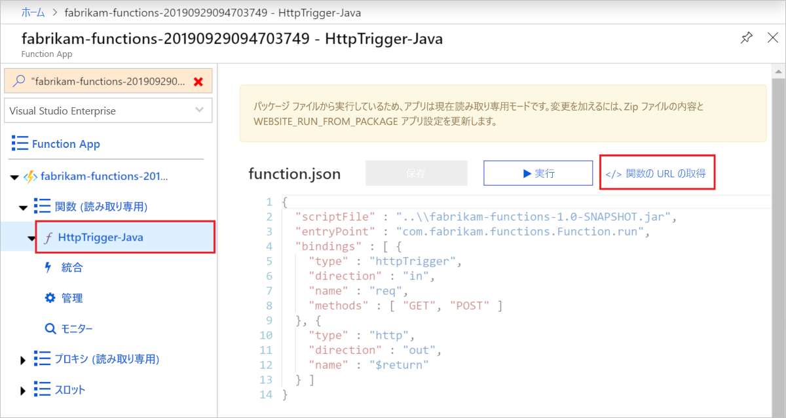

# <a name="quickstart-use-java-and-mavengradle-to-create-and-publish-a-function-to-azure"></a>クイック スタート:Java と Maven または Gradle を使用して関数を作成し、Azure に発行する

この記事では、Maven または Gradle コマンドライン ツールを使用して Java 関数を作成し、Azure Functions に発行する方法を示します。 完了すると、関数コードは Azure の[サーバーレス ホスティング プラン](functions-scale.md#consumption-plan)で実行され、HTTP 要求によってトリガーされます。

<!--
> [!NOTE] 
> You can also create a Kotlin-based Azure Functions project by using the azure-functions-kotlin-archetype instead. Visit the [GitHub repository](https://github.com/microsoft/azure-maven-archetypes/tree/develop/azure-functions-kotlin-archetype) for more information.
-->

## <a name="prerequisites"></a>前提条件

Java を使用して関数を開発するには、以下のものがインストールされている必要があります。

- [Java Developer Kit](https://aka.ms/azure-jdks)、バージョン 8
- [Azure CLI]
- [Azure Functions Core Tools](./functions-run-local.md#v2) バージョン 2.6.666 以降
::: zone pivot="java-build-tools-maven" 
- [Apache Maven](https://maven.apache.org)、バージョン 3.0 以降
::: zone-end

::: zone pivot="java-build-tools-gradle"  
- [Gradle](https://gradle.org/) バージョン 4.10 以降
::: zone-end 

アクティブな Azure サブスクリプションも必要です。 [!INCLUDE [quickstarts-free-trial-note](../../includes/quickstarts-free-trial-note.md)]


> [!IMPORTANT]
> このクイックスタートを行うには、JAVA_HOME 環境変数を JDK のインストール場所に設定する必要があります。

## <a name="prepare-a-functions-project"></a>Functions プロジェクトを準備する

::: zone pivot="java-build-tools-maven" 
空のフォルダーで次のコマンドを実行して、[Maven アーキタイプ](https://maven.apache.org/guides/introduction/introduction-to-archetypes.html)から Functions プロジェクトを生成します。

```bash
mvn archetype:generate -DarchetypeGroupId=com.microsoft.azure -DarchetypeArtifactId=azure-functions-archetype 
```

> [!NOTE]
> PowerShell を使用している場合は、パラメーターの前後に "" を追加してください。

> [!NOTE]
> コマンドの実行で問題が発生した場合は、使用されている `maven-archetype-plugin` のバージョンを確認します。 `.pom` ファイルがない空のディレクトリでコマンドを実行しているため、Maven を古いバージョンからアップグレードした場合は、`~/.m2/repository/org/apache/maven/plugins/maven-archetype-plugin` から古いバージョンのプラグインを使用しようとしている可能性があります。 その場合は、`maven-archetype-plugin` ディレクトリを削除した後、コマンドを再実行します。

Maven により、デプロイ時にプロジェクトの生成を終了するための値の入力が求められます。 入力を求められたら、次の値を入力します。

| Value | 説明 |
| ----- | ----------- |
| **groupId** | Java の[パッケージ命名規則](https://docs.oracle.com/javase/specs/jls/se6/html/packages.html#7.7)に従って、すべてのプロジェクトにわたって対象のプロジェクトを一意に識別する値。 このクイックスタートの例では、`com.fabrikam.functions` を使用します。 |
| **artifactId** | バージョン番号のない、jar の名前である値。 このクイックスタートの例では、`fabrikam-functions` を使用します。 |
| **version** | 既定値 `1.0-SNAPSHOT` を選択します。 |
| **package** | 生成された関数コードの Java パッケージである値。 既定値を使用します。 このクイックスタートの例では、`com.fabrikam.functions` を使用します。 |
| **appName** | Azure の新しい関数アプリを識別するグローバルに一意の名前。 既定値の、ランダムな番号が付加された _artifactId_ を使用します。 この値は後で必要になるのでメモしておきます。 |
| **appRegion** | ユーザーに近い[リージョン](https://azure.microsoft.com/regions/)、または関数がアクセスする他のサービスの近くのリージョンを選択します。 既定では、 `westus`です。 次の [Azure CLI] コマンドを実行して、すべてのリージョンの一覧を取得します:<br/>`az account list-locations --query '[].{Name:name}' -o tsv` |
| **resourceGroup** | その中に関数アプリを作成する新しい[リソース グループ](../azure-resource-manager/management/overview.md)の名前。 このクイックスタートの例で使用されている `myResourceGroup` を使用します。 リソース グループは、対象の Azure サブスクリプションに一意である必要があります。|

「`Y`」と入力するか、Enter キーを押して確認します。

Maven により、_artifactId_ という名前の新しいフォルダーにプロジェクト ファイルが作成されます (この例では `fabrikam-functions`)。 次のコマンドを実行して、作成したプロジェクト フォルダーにディレクトリを変更します。
```bash
cd fabrikam-function
```

::: zone-end 
::: zone pivot="java-build-tools-gradle"
次のコマンドを使用して、サンプル プロジェクトを複製します。

```bash
git clone https://github.com/Azure-Samples/azure-functions-samples-java.git
cd azure-functions-samples-java/
```

`build.gradle` を開き、次のセクションの `appName` を一意の名前に変更して、Azure にデプロイするときにドメイン名が競合しないようにします。 

```gradle
azurefunctions {
    resourceGroup = 'java-functions-group'
    appName = 'azure-functions-sample-demo'
    pricingTier = 'Consumption'
    region = 'westus'
    runtime {
      os = 'windows'
    }
    localDebug = "transport=dt_socket,server=y,suspend=n,address=5005"
}
```
::: zone-end

テキスト エディターで *src/main/java* パスの新しい Function.java ファイルを開き、生成されたコードを確認します。 このコードは、要求の本文をエコーする、[HTTP によってトリガーされる](functions-bindings-http-webhook.md)関数です。 

> [!div class="nextstepaction"]
> [問題が発生しました](https://www.research.net/r/javae2e?tutorial=functions-maven-quickstart&step=generate-project)

## <a name="run-the-function-locally"></a>関数をローカルで実行する

次のコマンドを実行して、関数プロジェクトをビルドして実行します。

::: zone pivot="java-build-tools-maven" 
```bash
mvn clean package 
mvn azure-functions:run
```
::: zone-end 

::: zone pivot="java-build-tools-gradle"  
```bash
gradle jar --info
gradle azureFunctionsRun
```
::: zone-end 

プロジェクトをローカルで実行すると、次のような Azure Functions Core Tools からの出力が表示されます。

```output
...

Now listening on: http://0.0.0.0:7071
Application started. Press Ctrl+C to shut down.

Http Functions:

    HttpExample: [GET,POST] http://localhost:7071/api/HttpExample
...
```

新しいターミナル ウィンドウで cURL を使用して、コマンド ラインから関数をトリガーします。

```bash
curl -w "\n" http://localhost:7071/api/HttpExample --data AzureFunctions
```

```output
Hello AzureFunctions!
```
ローカルで実行する場合、[関数キー](functions-bindings-http-webhook-trigger.md#authorization-keys)は必要ありません。 関数のコードを停止するには、ターミナルで `Ctrl+C` を使います。

> [!div class="nextstepaction"]
> [問題が発生しました](https://www.research.net/r/javae2e?tutorial=functions-maven-quickstart&step=local-run)

## <a name="deploy-the-function-to-azure"></a>関数を Azure にデプロイする

最初に関数アプリをデプロイすると、関数アプリと関連リソースが Azure に作成されます。 デプロイする前に、[az login](/cli/azure/authenticate-azure-cli) Azure CLI コマンドを使用して、対象の Azure サブスクリプションにサインインします。 

```azurecli
az login
```

> [!TIP]
> 対象のアカウントで複数のサブスクリプションにアクセスできる場合は、[az account set](/cli/azure/account#az-account-set) を使用して、このセッションの既定のサブスクリプションを設定します。 

次のコマンドを使用して、対象のプロジェクトを新しい関数アプリにデプロイします。 


::: zone pivot="java-build-tools-maven" 
```bash
mvn azure-functions:deploy
```
::: zone-end 

::: zone pivot="java-build-tools-gradle"  
```bash
gradle azureFunctionsDeploy
```
::: zone-end

これにより、Azure に次のリソースが作成されます。

+ リソース グループ。 指定した _resourceGroup_ の名前が付けられます。
+ ストレージ アカウント。 Functions に必要です。 名前は、ストレージ アカウント名の要件に基づいてランダムに生成されます。
+ App Service プラン。 指定した _appRegion_ での関数アプリのサーバーレス ホスティング。 名前はランダムに生成されます。
+ 関数アプリ。 関数アプリは、関数のデプロイと実行の単位です。 名前は _appName_ で、ランダムに生成された番号が付加されます。 

また、デプロイにより、プロジェクト ファイルがパッケージ化され、[zip デプロイ](functions-deployment-technologies.md#zip-deploy)を使用して Run-From-Package モードが有効な状態で新しい関数アプリにデプロイされます。

デプロイが完了すると、関数アプリのエンドポイントへのアクセスに使うことができる URL が表示されます。 公開した HTTP トリガーは `authLevel = AuthorizationLevel.FUNCTION` を使用するため、HTTP 経由で関数エンドポイントを呼び出すために関数キーを取得する必要があります。 関数キーを取得する最も簡単な方法は、[Azure portal] を利用することです。

> [!div class="nextstepaction"]
> [問題が発生しました](https://www.research.net/r/javae2e?tutorial=functions-maven-quickstart&step=deploy)

## <a name="get-the-http-trigger-url"></a>HTTP トリガー URL を取得する

<!--- We can updates this to remove portal dependency after the Maven archetype returns the full URLs with keys on publish (https://github.com/microsoft/azure-maven-plugins/issues/571). -->

関数をトリガーするために必要な URL は、関数キーと共に Azure portal から取得できます。 

1. [Azure portal] を参照してサインインし、対象の関数アプリの _appName_ をページ上部の **[検索]** に入力して、Enter キーを押します。
 
1. 対象の関数アプリで、 **[関数 (読み取り専用)]** を展開し、対象の関数を選択します。次に、右上にある **[</> 関数の URL の取得]** を選択します。 

    

1. **[default (Function key)]\(既定 (関数キー)\)** を選択し、 **[コピー]** を選択します。 

これで、コピーした URL を使用して関数にアクセスできます。

## <a name="verify-the-function-in-azure"></a>Azure で関数を検証する

`cURL` を使用して Azure で実行されている関数アプリを検証するには、次のサンプルの URL を、ポータルからコピーした URL に置き換えます。

```console
curl -w "\n" https://fabrikam-functions-20190929094703749.azurewebsites.net/api/HttpExample?code=zYRohsTwBlZ68YF.... --data AzureFunctions
```

これにより、要求の本文に `AzureFunctions` が含まれる POST 要求が関数エンドポイントに送信されます。 次の応答が表示されます。

```output
Hello AzureFunctions!
```

> [!div class="nextstepaction"]
> [問題が発生しました](https://www.research.net/r/javae2e?tutorial=functions-maven-quickstart&step=verify-deployment)

## <a name="next-steps"></a>次のステップ

HTTP でトリガーされる関数を含む Java 関数プロジェクトを作成し、ローカル コンピューターでそれを実行し、Azure にデプロイしました。 次は以下の方法で関数を拡張します。

> [!div class="nextstepaction"]
> [Azure Storage キュー出力バインドを追加する](functions-add-output-binding-storage-queue-java.md)


[Azure CLI]: /cli/azure
[Azure Portal]: https://portal.azure.com
