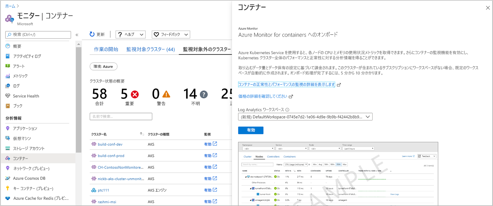

# <a name="configure-azure-red-hat-openshift-clusters-with-azure-monitor-for-containers"></a>Azure Red Hat OpenShift クラスターに Azure Monitor for containers を構成する

Azure Monitor for containers は、Azure Kubernetes Service (AKS) と AKS エンジン クラスター用の監視エクスペリエンスを提供するものです。 この記事では、[Azure Red Hat OpenShift](../../openshift/intro-openshift.md) でホストしている Kubernetes クラスターの監視を有効にし、Azure と同等の監視エクスペリエンスを実現する方法について説明します。

>[!NOTE]
>現時点では、Red Hat OpenShift のサポートはパブリック プレビューの機能です。
>

次のサポートされている方法を使用して、新規または 1 つ以上の既存の Azure Red Hat OpenShift のデプロイに対して Azure Monitor for containers を有効にできます。

- Azure portal または Azure Resource Manager テンプレートを使用した既存のクラスター向け
- Azure Resource Manager テンプレートを使用している新しいクラスター向け 

## <a name="supported-and-unsupported-features"></a>サポートされている機能とサポートされていない機能

Azure Monitor for containers では、次の機能を除き、[概要](container-insights-overview.md)記事で説明されている通り Azure Red Hat OpenShift の監視をサポートしています。

- ライブ データ
- Prometheus メトリックのスクレ―ピング
- クラスターノードとポッドから[メトリックを収集](container-insights-update-metrics.md)し、Azure Monitor メトリック データベースに格納する
- 正常性機能

## <a name="prerequisites"></a>前提条件

- Azure Monitor for containers の機能を有効にしてアクセスするには、少なくとも、Azure サブスクリプションの Azure *共同作成者* ロールのメンバー、および Azure Monitor for containers で構成されている Log Analytics ワークスペースの [*Log Analytics 共同作成者*](../platform/manage-access.md#manage-access-using-azure-permissions)のメンバーである必要があります。

- 監視データを表示するには、Azure Monitor for containers で構成されている Log Analytics ワークスペースの [*Log Analytics 閲覧者*](../platform/manage-access.md#manage-access-using-azure-permissions) ロールのアクセス権限を持つメンバーであることを確認します。

## <a name="enable-for-a-new-cluster-using-an-azure-resource-manager-template"></a>Azure Resource Manager テンプレートを使用している新しいクラスターで有効にする

監視が有効になっている Azure Red Hat OpenShift クラスターをデプロイするには、次の手順を実行します。 先に進む前に、チュートリアル「[Azure Red Hat OpenShift クラスターを作成する](../../openshift/tutorial-create-cluster.md#prerequisites)」を参照して、環境が正しく設定されるよう、構成する必要がある依存関係を理解してください。

この方法には、2 つの JSON テンプレートが含まれます。 1 つのテンプレートでは監視が有効になっているクラスターをデプロイする構成が指定され、もう 1 つのテンプレートには、次を指定するために構成するパラメーター値が含まれています。

- Azure Red Hat OpenShift クラスター リソース ID 

- クラスターが展開されているリソース グループ

- 作成手順を実行した後にメモされた、または既存の [Azure Active Directory テナント ID](../../openshift/howto-create-tenant.md#create-a-new-azure-ad-tenant)。

- 作成手順を実行した後にメモされた、または既存の [Azure Active Directory クライアント アプリケーション ID](../../openshift/howto-aad-app-configuration.md#create-an-azure-ad-app-registration)。

- 作成手順を実行した後にメモされた、または既存の [Azure Active Directory クライアント シークレット](../../openshift/howto-aad-app-configuration.md#create-a-client-secret)。

- 作成手順を実行した後にメモされた、または既存の [Azure AD セキュリティ グループ](../../openshift/howto-aad-app-configuration.md#create-an-azure-ad-security-group)。

- 既存の Log Analytics ワークスペースのリソース ID。

- クラスターで作成するマスター ノードの数。

- エージェント プール プロファイル内の計算ノードの数。

- エージェント プール プロファイル内のインフラストラクチャ ノードの数。 

テンプレートを使用するリソースのデプロイの概念について馴染みがない場合は、以下を参照してください。

- [Resource Manager テンプレートと Azure PowerShell を使用したリソースのデプロイ](../../azure-resource-manager/resource-group-template-deploy.md)

- [Resource Manager テンプレートと Azure CLI を使用したリソースのデプロイ](../../azure-resource-manager/resource-group-template-deploy-cli.md)

Azure CLI を使用する場合は、まず、ローカルに CLI をインストールして使用する必要があります。 Azure CLI バージョン 2.0.65 以降を実行している必要があります。 ご利用のバージョンを識別するには、`az --version` を実行します。 Azure CLI をインストールまたはアップグレードする必要がある場合は、[Azure CLI のインストール](https://docs.microsoft.com/cli/azure/install-azure-cli)に関するページを参照してください。 

Azure PowerShell または CLI を使用して監視を有効にするには、その前に Log Analytics ワークスペースが作成されている必要があります。 ワークスペースを作成するには、[Azure Resource Manager](../../azure-monitor/platform/template-workspace-configuration.md)、[PowerShell](../scripts/powershell-sample-create-workspace.md?toc=%2fpowershell%2fmodule%2ftoc.json)、[Azure portal](../../azure-monitor/learn/quick-create-workspace.md) のいずれかを使用して設定できます。

1. 次のコマンドを使用して、監視アドオンが追加されたクラスターを作成するには、Azure Resource Manager テンプレートおよびパラメーター ファイルをダウンロードしてローカル フォルダーに保存します。

    `curl -LO https://raw.githubusercontent.com/microsoft/OMS-docker/ci_feature/docs/aro/enable_monitoring_to_new_cluster/newClusterWithMonitoring.json`

    `curl -LO https://raw.githubusercontent.com/microsoft/OMS-docker/ci_feature/docs/aro/enable_monitoring_to_new_cluster/newClusterWithMonitoringParam.json` 

2. Azure へのサインイン 

    ```azurecli
    az login    
    ```
    
    複数のサブスクリプションへのアクセス権がある場合は、`az account set -s {subscription ID}` を実行して、`{subscription ID}` を、使用するサブスクリプションに置き換えます。
 
3. クラスターのリソース グループをまだ作成していない場合は、作成します。 Azure 上の OpenShift がサポートされる Azure リージョンの一覧については、[サポートされるリージョン](../../openshift/supported-resources.md#azure-regions)に関する記事を参照してください。 

    ```azurecli
    az group create -g <clusterResourceGroup> -l <location> 
    ```

4. JSON パラメーター ファイル **newClusterWithMonitoringParam.json** を編集し、次の値を更新します。

    - *location*
    - *clusterName*
    - *aadTenantId*
    - *aadClientId*
    - *aadClientSecret* 
    - *aadCustomerAdminGroupId* 
    - *workspaceResourceId*
    - *masterNodeCount*
    - *computeNodeCount*
    - *infraNodeCount*

5. 次の手順では、Azure CLI を使用して、監視が有効になっているクラスターをデプロイします。 

    ```azurecli
    az group deployment create --resource-group <ClusterResourceGroupName> --template-file ./newClusterWithMonitoring.json --parameters @./newClusterWithMonitoringParam.json 
    ```
 
    出力結果は、以下のようになります。

    ```azurecli
    provisioningState       : Succeeded
    ```

## <a name="enable-for-an-existing-cluster"></a>既存のクラスターでの有効化

Azure にデプロイされた Azure Red Hat OpenShift クラスターの監視を有効にするには、次の手順を実行します。 これは、Azure portal から、または提供されているテンプレートを使用して行うことができます。

### <a name="from-the-azure-portal"></a>Azure portal から
 
1. [Azure Portal](https://portal.azure.com) にサインインします。

2. Azure portal メニュー上または **[ホーム]** ページから、[Azure Monitor] を選択します。 **[分析情報]** セクションで **[コンテナー]** を選択します。 

3. **[モニター - コンテナー]** ページで、 **[Non-monitored clusters] (監視対象外のクラスター)** を選択します。

4. 監視対象外のクラスターの一覧でクラスターを検索し、 **[有効にする]** をクリックします。 一覧の結果を確認するには、 **[クラスターの種類]** 列から **ARO** を探します。

5. **[コンテナーの Azure Monitor へのオンボード]** ページにクラスターと同じサブスクリプションの既存の Log Analytics ワークスペースが存在する場合は、ドロップダウン リストから選択します。  
    このリストでは、サブスクリプションでクラスターがデプロイされている既定のワークスペースと場所が事前に選択されています。 

    

    >[!NOTE]
    >クラスターからの監視データを格納するための新しい Log Analytics ワークスペースを作成する場合は、「[Log Analytics ワークスペースの作成](../../azure-monitor/learn/quick-create-workspace.md)」の手順に従います。 必ず、RedHat OpenShift クラスターがデプロイされるのと同じサブスクリプションでワークスペースを作成してください。 
 
監視を有効にした後、クラスターの正常性メトリックが表示されるまで、約 15 分かかる場合があります。 

### <a name="enable-using-an-azure-resource-manager-template"></a>Azure Resource Manager テンプレートを使用して有効にする

この方法には、2 つの JSON テンプレートが含まれます。 1 つのテンプレートでは監視を有効にする構成が指定され、もう 1 つのテンプレートには、次を指定するために構成するパラメーター値が含まれています。

- Azure Red Hat OpenShift クラスター リソース ID。 

- クラスターが展開されているリソース グループ。

- Log Analytics ワークスペース。

テンプレートを使用するリソースのデプロイの概念について馴染みがない場合は、以下を参照してください。

- [Resource Manager テンプレートと Azure PowerShell を使用したリソースのデプロイ](../../azure-resource-manager/resource-group-template-deploy.md)

- [Resource Manager テンプレートと Azure CLI を使用したリソースのデプロイ](../../azure-resource-manager/resource-group-template-deploy-cli.md)

Azure CLI を使用する場合は、まず、ローカルに CLI をインストールして使用する必要があります。 Azure CLI バージョン 2.0.65 以降を実行している必要があります。 ご利用のバージョンを識別するには、`az --version` を実行します。 Azure CLI をインストールまたはアップグレードする必要がある場合は、[Azure CLI のインストール](https://docs.microsoft.com/cli/azure/install-azure-cli)に関するページを参照してください。 

Azure PowerShell または CLI を使用して監視を有効にするには、その前に Log Analytics ワークスペースが作成されている必要があります。 ワークスペースを作成するには、[Azure Resource Manager](../../azure-monitor/platform/template-workspace-configuration.md)、[PowerShell](../scripts/powershell-sample-create-workspace.md?toc=%2fpowershell%2fmodule%2ftoc.json)、[Azure portal](../../azure-monitor/learn/quick-create-workspace.md) のいずれかを使用して設定できます。

1. 次のコマンドを使用して、監視アドオンでクラスターを更新するためのテンプレートとパラメーター ファイルをダウンロードします。

    `curl -LO https://raw.githubusercontent.com/microsoft/OMS-docker/ci_feature/docs/aro/enable_monitoring_to_existing_cluster/existingClusterOnboarding.json`

    `curl -LO https://raw.githubusercontent.com/microsoft/OMS-docker/ci_feature/docs/aro/enable_monitoring_to_existing_cluster/existingClusterParam.json` 

2. Azure へのサインイン 

    ```azurecli
    az login    
    ```

    複数のサブスクリプションへのアクセス権がある場合は、`az account set -s {subscription ID}` を実行して、`{subscription ID}` を、使用するサブスクリプションに置き換えます。

3. Azure RedHat OpenShift クラスターのサブスクリプションを指定します。

    ```azurecli
    az account set --subscription "Subscription Name"  
    ```

4. 次のコマンドを実行して、クラスターの場所とリソース ID を指定します。

    ```azurecli
    az openshift show -g <clusterResourceGroup> -n <clusterName> 
    ```

5. JSON パラメーターファイル **existingClusterParam.json** を編集し、*araResourceId* および *araResoruceLocation*の値を更新します。 **workspaceResourceId** の値は、ワークスペース名を含む Log Analytics ワークスペースの完全なリソース ID です。 

6. Azure CLI を使用してデプロイするには、次のコマンドを実行します。 

    ```azurecli
    az group deployment create --resource-group <ClusterResourceGroupName> --template-file ./ExistingClusterOnboarding.json --parameters @./existingClusterParam.json 
    ```

    出力結果は、以下のようになります。

    ```azurecli
    provisioningState       : Succeeded
    ```

## <a name="next-steps"></a>次の手順

- RedHat OpenShift クラスターと実行中のワークロードの正常性とリソース使用率を収集するための監視を有効にしたうえで、Azure Monitor for containers を[使用する方法](container-insights-analyze.md)について学習します。

- Azure Monitor for containers でクラスターの監視を停止する方法については、「[お使いの Azure Red Hat OpenShift クラスターの監視を停止する方法](container-insights-optout-openshift.md)」を参照してください。