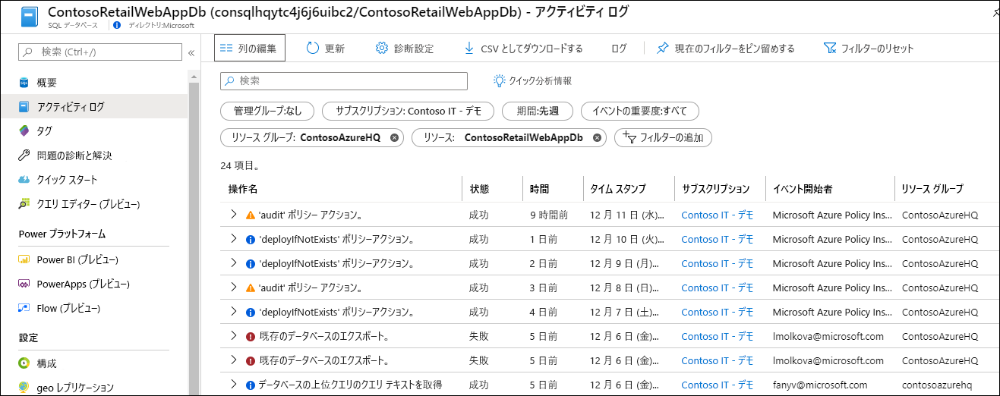
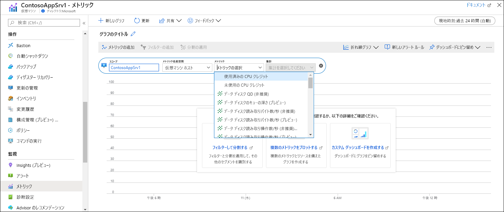
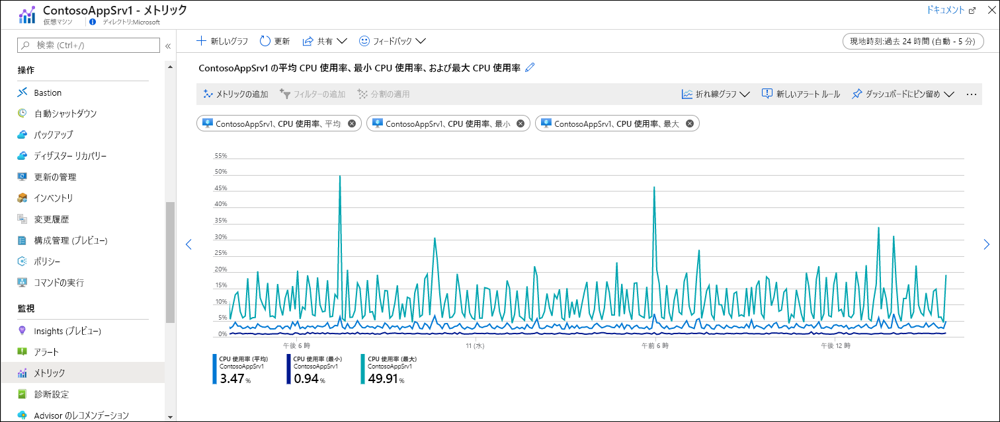

# クイック スタート:Azure Monitor を使用して Azure リソースを監視する
[Azure Monitor](../overview.md) は、作成された時点から Azure リソースからのデータ収集を開始します。 このクイックスタートでは、リソースについて自動的に収集されるデータを簡単に説明し、特定のリソースの Azure portal でそのデータを表示する方法について説明します。 後で、追加のデータを収集するための構成を追加して Azure Monitor メニューに移動すると、同じツールを使用して、ご利用のサブスクリプション内のすべてのリソースについて収集されたデータにアクセスできます。

Azure リソースから収集される監視データの詳細な説明については、「[Azure Monitor を使用した Azure リソースの監視](../insights/monitor-azure-resource.md)」を参照してください。

## Azure Portal にサインインする

Azure Portal ([https://portal.azure.com](https://portal.azure.com)) にサインインします。 

## [概要] ページ
多くのサービスでは、その操作をひとめで確認できるように、 **[概要]** ページに監視データが含まれています。 通常、これは Azure Monitor メトリックに格納されているプラットフォーム メトリックのサブセットに基づいています。

1. ご利用のサブスクリプションで Azure リソースを見つけます。
2. **[概要]** ページに移動し、パフォーマンス データが表示されているかどうかを確認します。 このデータは Azure Monitor によって提供されます。 以下の例は、Azure Storage アカウントの **[概要]** ページです。複数のメトリックが表示されていることがわかります。

    ![[概要] ページ](media/quick-monitor-azure-resource/overview.png)

3. グラフのいずれかをクリックすると、以下に説明するメトリックス エクスプローラーでデータを開くことができます。

## アクティビティ ログを表示する
アクティビティ ログは、サブスクリプション内の各 Azure リソースの操作に関する分析情報を提供します。 これには、リソースが作成または変更された日時、ジョブが開始された日時、特定の操作が発生した日時などの情報が含まれます。

1. ご利用のリソースのメニューの上部にある **[アクティビティ ログ]** を選択します。
2. 現在のフィルターは、ご利用のリソースに関連するイベントに設定されています。 イベントが表示されない場合は、**期間**を変更して時間範囲を長くしてみてください。

    

4. ご利用のサブスクリプション内の他のリソースのイベントを表示する場合は、フィルターの条件を変更するか、フィルターのプロパティを削除します。

    

## メトリックを表示する
メトリックは、ご利用のリソースの特定の時点におけるなんらかの側面を表す数値です。 Azure Monitor は、すべての Azure リソースから 1 分間隔でプラットフォーム メトリックを自動的に収集します。 これらのメトリックは、メトリックス エクスプローラーを使用して表示できます。

1. ご利用のリソースのメニューの **[監視]** セクションで、 **[メトリックス]** を選択します。 これにより、スコープがご利用のリソースに設定されたメトリックス エクスプローラーが開きます。
2. **[メトリックの追加]** をクリックして、グラフにメトリックを追加します。
   
   
   
4. ドロップダウン リストから**メトリック**を選択し、次に**集計方法**を選択します。 これにより、収集された値を各時間間隔でどのようにサンプリングするかを定義します。

    

5. **[メトリックの追加]** をクリックして、メトリックと集計の組み合わせをグラフに追加します。

    

## 次のステップ
このクイックスタートでは、Azure Monitor によって自動的に収集される Azure リソースのアクティビティ ログとメトリックを表示しました。 リソース ログは、リソースの詳細な操作に関する分析情報を提供しますが、収集するために構成する必要があります。 リソース ログを Log Analytics ワークスペースに収集し、ログ クエリを使用して分析できるようにするためのチュートリアルに進みます。

> [!div class="nextstepaction"]
> [Azure Monitor を使用してリソース ログを収集して分析する](tutorial-resource-logs.md)
