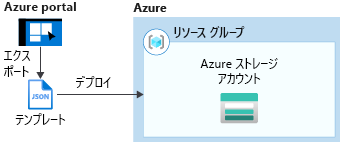
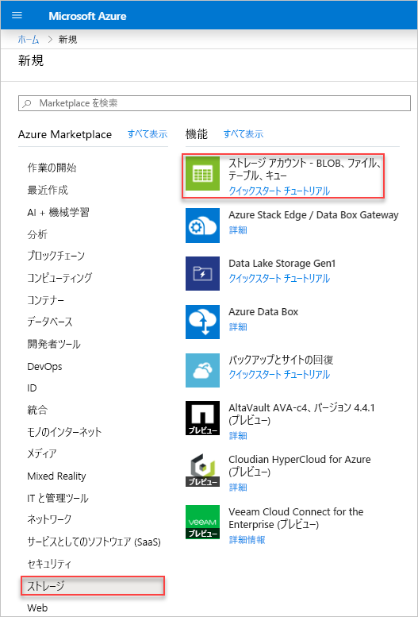
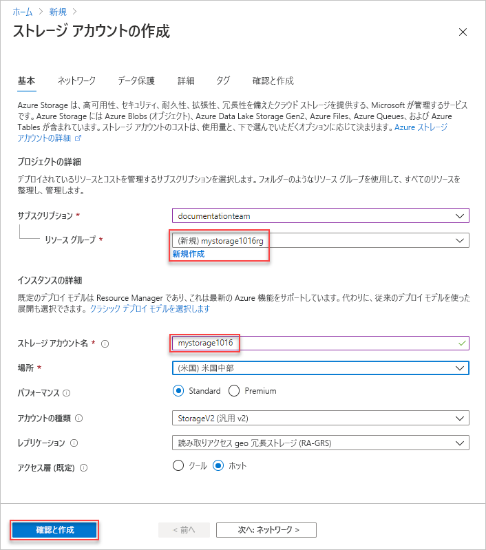
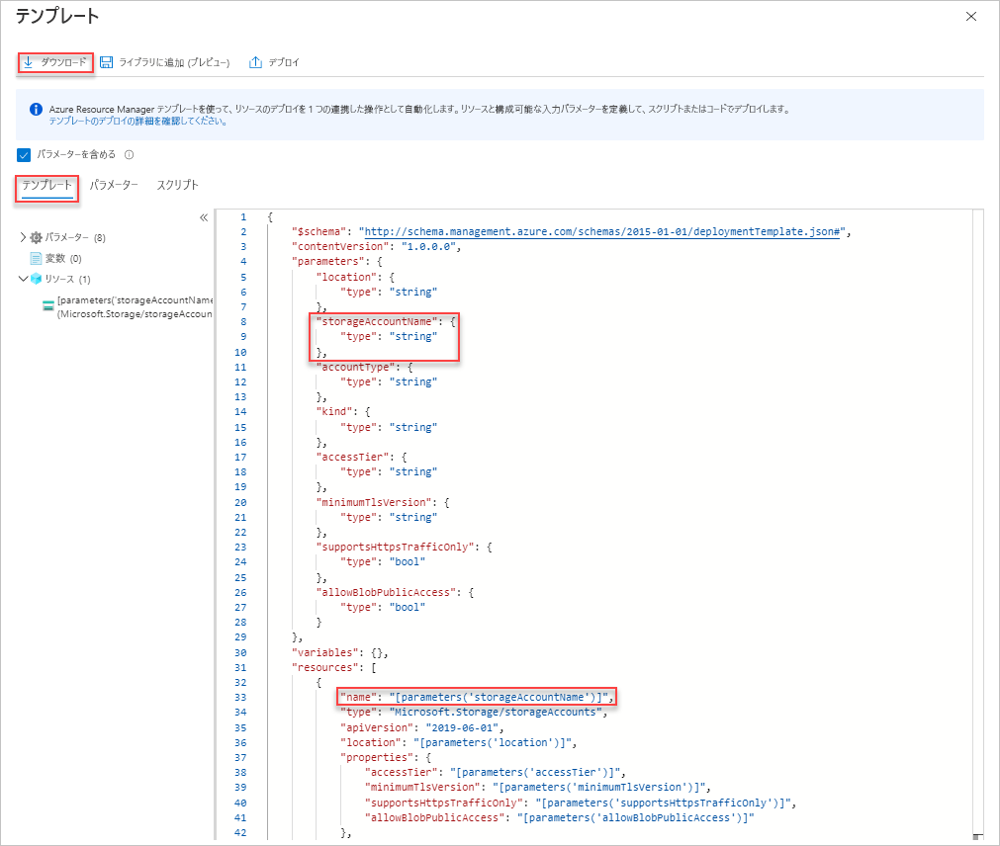
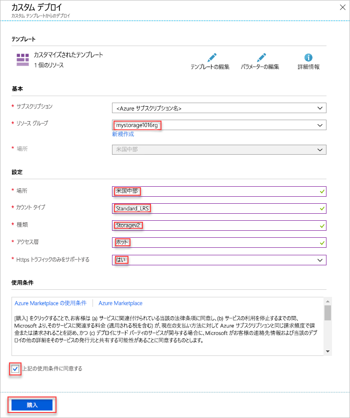
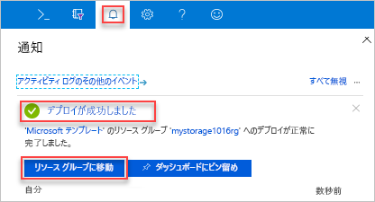

# <a name="quickstart-create-and-deploy-azure-resource-manager-templates-by-using-the-azure-portal"></a>クイック スタート:Azure portal を使用した Azure Resource Manager テンプレートの作成とデプロイ

Azure portal を使用して Resource Manager テンプレートを生成する方法と、ポータルでテンプレートを編集およびデプロイするプロセスについて学習します。 Resource Manager テンプレートとは、ソリューションに対してデプロイが必要なリソースを定義した JSON ファイルのことをいいます。 Azure ソリューションのデプロイと管理に関する概念について理解を深めるには、[テンプレートのデプロイの概要](overview.md)に関するページを参照してください。



チュートリアルを完了した後、Azure Storage アカウントをデプロイします。 同じプロセスを使用して他の Azure リソースをデプロイすることができます。

Azure サブスクリプションをお持ちでない場合は、開始する前に[無料アカウントを作成](https://azure.microsoft.com/free/)してください。

## <a name="generate-a-template-using-the-portal"></a>ポータルを使用したテンプレートの生成

最初から Resource Manager テンプレートを作成するのは簡単な作業ではありません。Azure のデプロイと JSON 形式に慣れていない場合は特にそうです。 Azure portal を使用すると、Azure Storage アカウントなどのリソースを構成できます。 リソースをデプロイする前に、構成を Resource Manager テンプレートにエクスポートできます。 テンプレートを保存し、今後再利用できます。

経験豊富なテンプレート開発者の多くは、慣れていない Azure リソースをデプロイするときにこの方法を使用してテンプレートを生成しています。 ポータルを使用したテンプレートのエクスポートの詳細については、[テンプレートへのリソース グループのエクスポート](../management/manage-resource-groups-portal.md#export-resource-groups-to-templates)に関する記事を参照してください。 作業用のテンプレートを検索する他の方法は、[Azure クイック スタート テンプレート](https://azure.microsoft.com/resources/templates/)からです。

1. Web ブラウザーで、[Azure portal](https://portal.azure.com) に移動してサインインします。
1. Azure portal メニューから **[リソースの作成]** を選択します。

    ![Azure portal メニューから [リソースの作成] を選択する](./media/quickstart-create-templates-use-the-portal/azure-resource-manager-template-tutorial-create-a-resource.png)

1. **[ストレージ]**  >  **[ストレージ アカウント]** を選択します。

    
1. 次の情報を入力します。

    |Name|値|
    |----|----|
    |**リソース グループ**|**[新規作成]** を選択し、任意のリソース グループ名を指定します。 スクリーンショットでは、リソース グループ名は *mystorage1016rg* です。 リソース グループとは、Azure リソース用のコンテナーです。 リソース グループを使用すると、Azure リソースをより簡単に管理できます。 |
    |**Name**|ストレージ アカウントに一意の名前を付けます。 ストレージ アカウントの名前は、Azure に存在するいずれの名前とも重複しないこと、また小文字と数字だけで構成されている必要があります。 名前は 3 文字から 24 文字の長さで指定する必要があります。 "ストレージ カウント名 'mystorage1016' は既に使用されています" というエラー メッセージが表示された場合は、 **&lt;自分の名前>storage&lt;MMDD形式の今日の日付>** (例: **johndolestorage1016**) の使用を試してください。 詳細については、「[名前付け規則と制約事項](/azure/architecture/best-practices/resource-naming)」を参照してください。|

    残りのプロパティは既定値のままでかまいません。

    

    > [!NOTE]
    > エクスポートされたテンプレートの中には、デプロイする前に編集を必要とするものがあります。

1. 画面下部の **[確認および作成]** を選択します。 次の手順で **[作成]** を選択しないでください。
1. 画面下部の **[Automation のテンプレートをダウンロードする]** を選択します。 ポータルに、生成されたテンプレートが次のように表示されます。

    

    メイン ウィンドウにテンプレートが表示されます。 これは、6 つの最上位要素 (`schema`、`contentVersion`、`parameters`、`variables`、`resources`、および `output`) が含まれた JSON ファイルです。 詳細については、「[Azure Resource Manager テンプレートの構造と構文の詳細](./template-syntax.md)」をご覧ください。

    6 個のパラメーターが定義されています。 そのうちの 1 つは、**storageAccountName** という名前です。 前のスクリーンショットの 2 番目の強調表示された部分は、テンプレートでこのパラメーターを参照する方法を示しています。 次のセクションでは、生成された名前をストレージ アカウントに使用するようにテンプレートを編集します。

    テンプレートには、1 つの Azure リソースが定義されています。 種類は `Microsoft.Storage/storageAccounts` です。 リソースがどのように定義されているかと、定義の構造を確認します。
1. 画面上部の **[ダウンロード]** を選択します。
1. ダウンロードした zip ファイルを開き、**template.json** をお使いのコンピューターに保存します。 次のセクションでは、テンプレート デプロイ ツールを使用してテンプレートを編集します。
1. **[パラメーター]** タブを選択して、パラメーターに指定した値を確認します。 これらの値を書き留めておきます。次のセクションでテンプレートをデプロイするときに必要になります。

    

    テンプレート ファイルとパラメーター ファイルの両方を使用して、リソース (このチュートリアルでは Azure Storage アカウント) を作成できます。

## <a name="edit-and-deploy-the-template"></a>テンプレートの編集とデプロイ

Azure portal では、いくつかの基本的なテンプレート編集を行うことができます。 このクイック スタートでは、"*Template Deployment*" と呼ばれるポータル ツールを使用します。 このチュートリアルでは *Template Deployment* を使用しているため、1 つのインターフェイス (Azure portal) を使用してチュートリアル全体を完了できます。 より複雑なテンプレートを編集する場合は、豊富な編集機能を備えた [Visual Studio Code](quickstart-create-templates-use-visual-studio-code.md) を使用することを検討してください。

> [!IMPORTANT]
> Template deployment は、シンプルなテンプレートをテストするためのインターフェイスを提供します。 運用環境でこの機能を使用することはお勧めしません。 代わりに、自分のテンプレートを Azure Storage アカウント、または GitHub のようなソース コード リポジトリに保存します。

Azure では、各 Azure サービスで一意の名前が使用される必要があります。 既に存在するストレージ アカウント名を入力すると、デプロイが失敗する可能性があります。 この問題を回避するために、テンプレート関数呼び出し `uniquestring()` を使用して一意のストレージ アカウント名を生成するようにテンプレートを変更します。

1. Azure portal メニューまたは **[ホーム]** ページで、 **[リソースの作成]** を選択します。
1. **[Marketplace を検索]** で「**template deployment**」と入力し、**Enter** キーを押します。
1. **[テンプレートのデプロイ]** を選択します。

    
1. **作成** を選択します。
1. **[Build your own template in the editor] \(エディターで独自のテンプレートをビルド\)** を選択します。
1. **[ファイルの読み込み]** を選択し、手順に従って、前のセクションでダウンロードした template.json を読み込みます。
1. テンプレートに次の 3 つの変更を加えます。

    

   - 前のスクリーンショットに示されているように、**storageAccountName** パラメーターを削除します。
   - 前のスクリーン ショットに示されているように、**storageAccountName** という 1 つの変数を追加します。

       ```json
       "storageAccountName": "[concat(uniqueString(subscription().subscriptionId), 'storage')]"
       ```

       ここでは、`concat()` と `uniqueString()` という 2 つのテンプレート関数が使用されています。
   - このパラメーターの代わりに、新しく定義した変数を使用するように、**Microsoft.Storage/storageAccounts** リソースの name 要素を更新します。

       ```json
       "name": "[variables('storageAccountName')]",
       ```

     最終的なテンプレートは次のようになります。

     ```json
     {
       "$schema": "https://schema.management.azure.com/schemas/2015-01-01/deploymentTemplate.json#",
       "contentVersion": "1.0.0.0",
       "parameters": {
           "location": {
               "type": "string"
           },
           "accountType": {
               "type": "string"
           },
           "kind": {
               "type": "string"
           },
           "accessTier": {
               "type": "string"
           },
           "supportsHttpsTrafficOnly": {
               "type": "bool"
           }
       },
       "variables": {
           "storageAccountName": "[concat(uniqueString(subscription().subscriptionId), 'storage')]"
       },
       "resources": [
           {
               "name": "[variables('storageAccountName')]",
               "type": "Microsoft.Storage/storageAccounts",
               "apiVersion": "2018-07-01",
               "location": "[parameters('location')]",
               "properties": {
                   "accessTier": "[parameters('accessTier')]",
                   "supportsHttpsTrafficOnly": "[parameters('supportsHttpsTrafficOnly')]"
               },
               "dependsOn": [],
               "sku": {
                   "name": "[parameters('accountType')]"
               },
               "kind": "[parameters('kind')]"
           }
       ],
       "outputs": {}
     }
     ```
1. **[保存]** を選択します。
1. 次の値を入力します。

    |Name|値|
    |----|----|
    |**リソース グループ**|前のセクションで作成したリソース グループの名前を選択します。 |
    |**Location**|ストレージ アカウントの場所を選択します。 たとえば **[米国中部]** です。 |
    |**アカウントの種類**|このクイック スタートでは、「**Standard_LRS**」と入力します。 |
    |**種類**|このクイック スタートでは、「**StorageV2**」と入力します。 |
    |**アクセス層**|このクイック スタートでは、「**ホット**」と入力します。 |
    |**[Https Traffic Only Enabled]\(HTTPS トラフィックのみ有効\)**| このクイック スタートでは、 **[true]** を選択します。 |
    |**上記の使用条件に同意する**|(選択します)|

    サンプルのデプロイのスクリーンショットを次に示します。

    

1. **[購入]** を選択します。
1. 画面の上部にあるベルのアイコン (通知) を選択して、デプロイの状態を確認します。 "**デプロイを実行しています**" と表示されます。 デプロイが完了するまでお待ちください。

    

1. 通知ウィンドウで **[リソース グループに移動]** を選択します。 次のような画面が表示されます。

    

    デプロイの状態が成功であったことのほか、リソース グループ内のストレージ アカウントが 1 つのみであることを確認できます。 ストレージ アカウント名は、テンプレートによって生成された一意の文字列です。 Azure ストレージ アカウントの使用の詳細については、「[クイック スタート:Azure portal を使用して BLOB をアップロード、ダウンロード、および一覧表示する](../../storage/blobs/storage-quickstart-blobs-portal.md)」を参照してください。

## <a name="clean-up-resources"></a>リソースをクリーンアップする

Azure リソースが不要になったら、リソース グループを削除して、デプロイしたリソースをクリーンアップします。

1. Azure portal で、左側のメニューの **[リソース グループ]** を選択します。
1. **[名前でフィルター]** フィールドに、リソース グループ名を入力します。
1. リソース グループ名を選択します。  リソース グループにストレージ アカウントが表示されます。
1. 上部のメニューの **[リソース グループの削除]** を選択します。

## <a name="next-steps"></a>次のステップ

このチュートリアルでは、Azure portal を使用してテンプレートを生成する方法と、ポータルを使用してテンプレートをデプロイする方法を説明しました。 このクイック スタートで使用したテンプレートは、Azure リソースが 1 つだけ含まれた単純なテンプレートです。 テンプレートが複雑な場合は、Visual Studio Code または Visual Studio を使用してテンプレートを開発する方が簡単です。 テンプレートの開発についてさらに学習するには、以下の新しい初心者向けチュートリアル シリーズを参照してください。

> [!div class="nextstepaction"]
> [初心者向けチュートリアル](./template-tutorial-create-first-template.md)