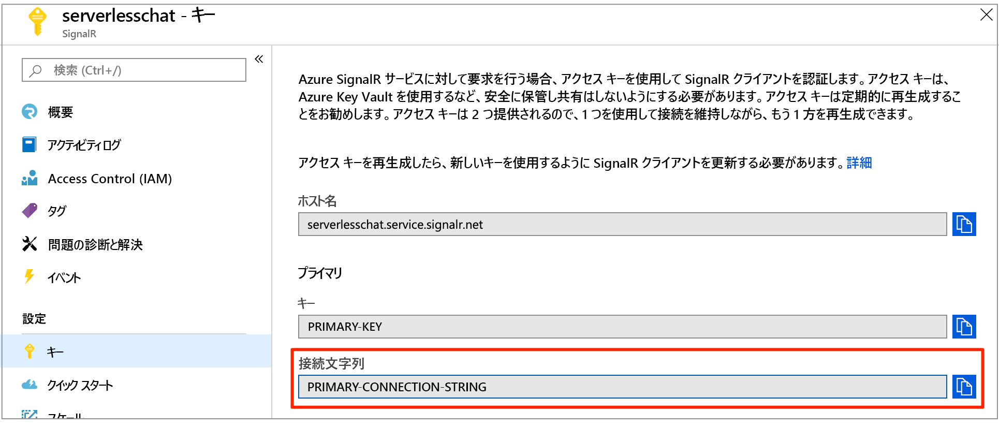

# <a name="quickstart-create-a-chat-room-with-azure-functions-and-signalr-service-using-python"></a>クイック スタート:Python を使用した Azure Functions と SignalR Service によるチャット ルームの作成

Azure SignalR Service を使用すると、アプリケーションにリアルタイム機能を簡単に追加できます。 Azure Functions は、インフラストラクチャを管理することなくコードを実行できるサーバーレス プラットフォームです。 このクイック スタートでは、SignalR Service および Functions を使用して、サーバーレスかつリアルタイムのチャット アプリケーションを構築する方法を説明します。

## <a name="prerequisites"></a>前提条件

このクイック スタートは、macOS、Windows、または Linux で実行できます。

[Visual Studio Code](https://code.visualstudio.com/) などのコード エディターがインストールされていることを確認してください。

Python Azure Function アプリをローカルで実行するために、[Azure Functions Core Tools](https://github.com/Azure/azure-functions-core-tools#installing) (バージョン 2.7.1505 以降) をインストールします。

Azure Functions には [Python 3.6 または 3.7](https://www.python.org/downloads/) が必要です。

[!INCLUDE [quickstarts-free-trial-note](../../includes/quickstarts-free-trial-note.md)]

## <a name="log-in-to-azure"></a>Azure にログインする

Azure アカウントで Azure Portal (<https://portal.azure.com/>) にサインインします。

[!INCLUDE [Create instance](includes/signalr-quickstart-create-instance.md)]

[!INCLUDE [Clone application](includes/signalr-quickstart-clone-application.md)]

## <a name="configure-and-run-the-azure-function-app"></a>Azure Function アプリを構成して実行する

1. Azure portal を開いているブラウザーのポータルの上部にある検索ボックスから、以前にデプロイした SignalR Service インスタンスの名前で検索し、インスタンスが正常に作成されたことを確認します。 インスタンスを選択して開きます。

    

1. **[Key]\(キー\)** を選択し、SignalR Service インスタンスの接続文字列を表示します。

1. プライマリ接続文字列を選択してコピーします。

    

1. コード エディターで、複製したリポジトリの *src/chat/python* フォルダーを開きます。

1. Python 関数をローカルで開発し、テストするには、Python 3.6 または 3.7 環境で作業する必要があります。 次のコマンドを実行して、`.venv` という名前の仮想環境を作成してアクティブにします。

    **Linux または macOS:**

    ```bash
    python3.7 -m venv .venv
    source .venv/bin/activate
    ```

    **Windows:**

    ```powershell
    py -3.7 -m venv .venv
    .venv\scripts\activate
    ```

1. *local.settings.sample.json* を *local.settings.json* に変更します。

1. **local.settings.json** で、**AzureSignalRConnectionString** 設定に接続文字列の値を貼り付けます。 ファイルを保存します。

1. フォルダーに Python 関数が編成されます。 各フォルダーには、関数で使用されるバインディングを定義する *function.json* と、関数の本体である *\_\_init\_\_.py* という 2 つのファイルがあります。 この関数アプリには、HTTP によってトリガーされる関数が 2 つあります。

    - **negotiate** - *SignalRConnectionInfo* 入力バインディングを使用し、有効な接続情報を生成して返却します。
    - **messages** - 要求本文でチャット メッセージを受信し、*SignalR* 出力バインディングを使用して接続されているすべてのクライアント アプリケーションにメッセージをブロードキャストします。

1. 仮想環境がアクティブになっているターミナルで、*src/chat/python* フォルダーにいることを確認します。 PIP を使用して、必要な Python パッケージをインストールします。

    ```bash
    python -m pip install -r requirements.txt
    ```

1. 関数アプリを実行します。

    ```bash
    func start
    ```

    

[!INCLUDE [Run web application](includes/signalr-quickstart-run-web-application.md)]

[!INCLUDE [Cleanup](includes/signalr-quickstart-cleanup.md)]

## <a name="next-steps"></a>次のステップ

このクイック スタートでは、VS Code でリアルタイムのサーバーレス アプリケーションを構築して実行しました。 次は、VS Code から Azure Functions をデプロイする方法を詳しく学びます。

> [!div class="nextstepaction"]
> [VS Code で Azure Functions をデプロイする](/azure/developer/javascript/tutorial-vscode-serverless-node-01)
