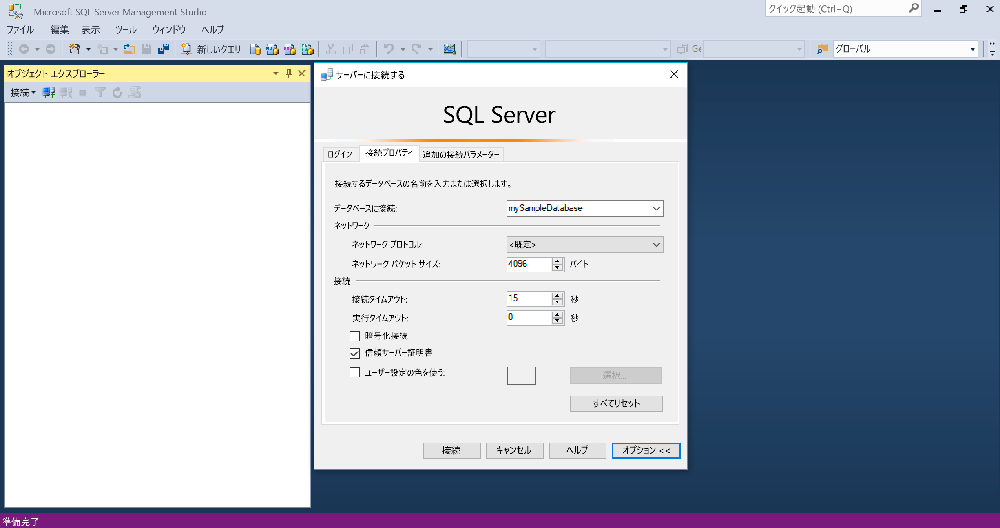
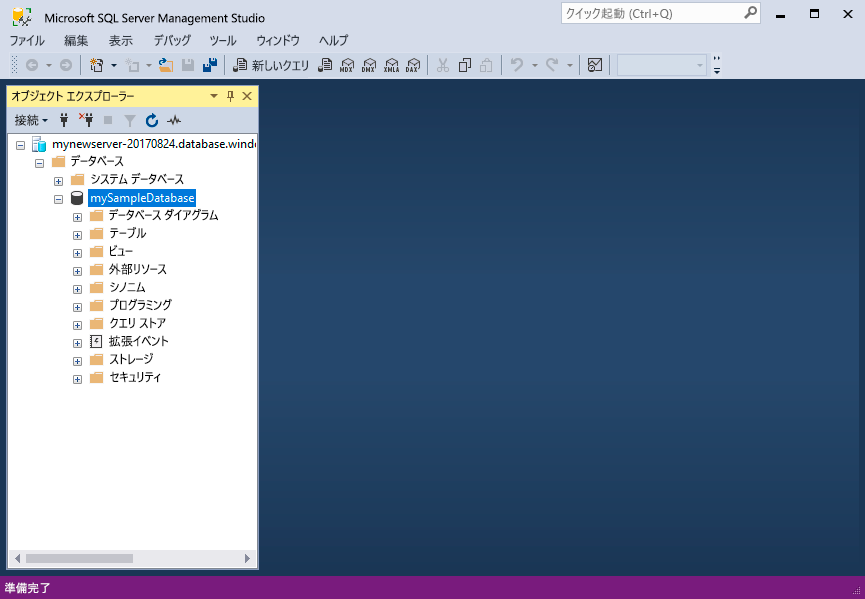
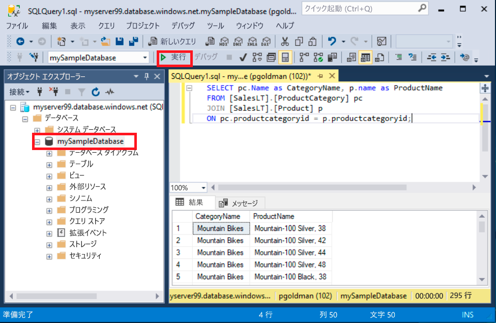

# <a name="quickstart-use-ssms-to-connect-to-and-query-azure-sql-database-or-azure-sql-managed-instance"></a>クイック スタート:SSMS を使用して Azure SQL データベースまたは Azure SQL マネージド インスタンスに接続してクエリを実行する
[!INCLUDE[appliesto-sqldb-sqlmi](../includes/appliesto-sqldb-sqlmi.md)]

このクイックスタートでは、SQL Server Management Studio (SSMS) を使用して Azure SQL データベースまたは Azure SQL マネージド インスタンスに接続し、いくつかのクエリを実行する方法について説明します。

## <a name="prerequisites"></a>前提条件

このクイックスタートを完了するには、次のアイテムが必要です。

- [SQL Server Management Studio (SSMS)](/sql/ssms/download-sql-server-management-studio-ssms/)。

- Azure SQL Database 内のデータベース。 以下のいずれかのクイック スタートを使用して、Azure SQL Database でデータベースを作成し、構成できます。

  || SQL Database | SQL Managed Instance | Azure VM 上の SQL Server |
  |:--- |:--- |:---|:---|
  | 作成| [ポータル](single-database-create-quickstart.md) | [ポータル](../managed-instance/instance-create-quickstart.md) | [ポータル](../virtual-machines/windows/sql-vm-create-portal-quickstart.md)
  || [CLI](scripts/create-and-configure-database-cli.md) | [CLI](https://medium.com/azure-sqldb-managed-instance/working-with-sql-managed-instance-using-azure-cli-611795fe0b44) |
  || [PowerShell](scripts/create-and-configure-database-powershell.md) | [PowerShell](../managed-instance/scripts/create-configure-managed-instance-powershell.md) | [PowerShell](../virtual-machines/windows/sql-vm-create-powershell-quickstart.md)
  | 構成 | [サーバーレベルの IP ファイアウォール規則](firewall-create-server-level-portal-quickstart.md)| [VM からの接続](../managed-instance/connect-vm-instance-configure.md)|
  |||[オンサイトからの接続](../managed-instance/point-to-site-p2s-configure.md) | [SQL Server への接続](../virtual-machines/windows/sql-vm-create-portal-quickstart.md)
  |データの読み込み|クイック スタートごとに読み込まれる Adventure Works|[Wide World Importers を復元する](../managed-instance/restore-sample-database-quickstart.md) | [Wide World Importers を復元する](../managed-instance/restore-sample-database-quickstart.md) |
  |||[GitHub](https://github.com/Microsoft/sql-server-samples/tree/master/samples/databases/adventure-works) の [BACPAC](database-import.md) ファイルから Adventure Works を復元またはインポートする| [GitHub](https://github.com/Microsoft/sql-server-samples/tree/master/samples/databases/adventure-works) の [BACPAC](database-import.md) ファイルから Adventure Works を復元またはインポートする|
  |||

  > [!IMPORTANT]
  > この記事のスクリプトは、Adventure Works データベースを使用するように記述されています。 マネージド インスタンスの場合は、Adventure Works データベースをインスタンス データベースにインポートするか、Wide World Importers データベースを使用するようにこの記事のスクリプトを修正する必要があります。

SSMS をインストールせずにいくつかのアドホック クエリを実行するだけの場合は、「[クイックスタート:Azure portal のクエリ エディターを使用して SQL データベースに照会する](connect-query-portal.md)」を参照してください。

## <a name="get-server-connection-information"></a>サーバーの接続情報を取得する

自分のデータベースに接続するために必要な接続情報を取得します。 このクイックスタートを完了するには、完全修飾[サーバー](logical-servers.md)名またはホスト名、データベース名、およびログイン情報が必要になります。

1. [Azure portal](https://portal.azure.com/) にサインインします。

2. クエリを実行する**データベース**または**マネージド インスタンス**に移動します。

3. **[概要]** ページで、SQL Database 内のデータベースの場合は **[サーバー名]** の横の完全修飾サーバー名を確認し、SQL マネージド インスタンスまたは VM 上の SQL Server インスタンスの場合は **[ホスト]** の横の完全修飾サーバー名 (または IP アドレス) を確認します。 サーバー名またはホスト名をコピーするには、名前をポイントして **[コピー]** アイコンを選択します。

> [!NOTE]
> Azure VM 上の SQL Server の接続情報については、「[SQL Server に接続する](../virtual-machines/windows/sql-vm-create-portal-quickstart.md#connect-to-sql-server)」を参照してください

## <a name="connect-to-your-database"></a>データベースに接続する

SSMS で、目的のサーバーに接続します。

> [!IMPORTANT]
> サーバーは、ポート 1433 でリッスンしています。 企業のファイアウォールの背後からサーバーに接続するには、そのファイアウォールでこのポートが開かれている必要があります。

1. SSMS を開きます。

2. **[サーバーに接続]** ダイアログ ボックスが表示されます。 次の情報を入力します。

   | 設定      | 推奨値    | 説明 |
   | ------------ | ------------------ | ----------- |
   | **サーバーの種類** | データベース エンジン | 必須値。 |
   | **サーバー名** | 完全修飾サーバー名 | **servername.database.windows.net** のようなものです。 |
   | **認証** | SQL Server 認証 | このチュートリアルでは、SQL 認証を使用します。 |
   | **Login** | サーバー管理者アカウントのユーザー ID | サーバーを作成するために使用するサーバー管理者アカウントのユーザー ID。 |
   | **パスワード** | サーバー管理者アカウントのパスワード | サーバーを作成するために使用するサーバー管理者アカウントのパスワード。 |
   ||||

   ![[サーバーに接続]](./media/connect-query-ssms/connect.png)  

3. **[サーバーに接続]** ダイアログ ボックスの **[オプション]** を選択します。 **[データベースへの接続]** ドロップダウン メニューで、**mySampleDatabase** を選択します。 「[前提条件](#prerequisites)」セクションのクイックスタートを完了すると、mySampleDatabase という名前の AdventureWorksLT データベースが作成されます。 AdventureWorks データベースの作業コピーの名前が mySampleDatabase と異なっている場合は、代わりにそれを選択します。

     

4. **[接続]** を選択します。 オブジェクト エクスプローラー ウィンドウが開きます。

5. データベースのオブジェクトを表示するには、 **[データベース]** を展開してから、自分のデータベース ノードを展開します。

     

## <a name="query-data"></a>クエリ データ

次の [SELECT](/sql/t-sql/queries/select-transact-sql/) Transact-SQL のコードを実行して、カテゴリごとに上位 20 個の製品を照会します。

1. オブジェクト エクスプローラーで **mySampleDatabase** を右クリックし、 **[新しいクエリ]** を選択します。 データベースに接続された新しいクエリ ウィンドウが開きます。

2. クエリ ウィンドウに、次の SQL クエリを貼り付けます。

   ```sql
   SELECT pc.Name as CategoryName, p.name as ProductName
   FROM [SalesLT].[ProductCategory] pc
   JOIN [SalesLT].[Product] p
   ON pc.productcategoryid = p.productcategoryid;
   ```

3. ツールバーで、 **[実行]** を選択してクエリを実行し、`Product` テーブルおよび `ProductCategory` テーブルからデータを取得します。

    

### <a name="insert-data"></a>データの挿入

次の [INSERT](/sql/t-sql/statements/insert-transact-sql/) Transact-SQL のコードを実行して、`SalesLT.Product` テーブルに新しい製品を作成します。

1. 前のクエリを次のクエリに置き換えます。

   ```sql
   INSERT INTO [SalesLT].[Product]
           ( [Name]
           , [ProductNumber]
           , [Color]
           , [ProductCategoryID]
           , [StandardCost]
           , [ListPrice]
           , [SellStartDate] )
     VALUES
           ('myNewProduct'
           ,123456789
           ,'NewColor'
           ,1
           ,100
           ,100
           ,GETDATE() );
   ```

2. **[実行]** を選択して、新しい行を `Product` テーブルに挿入します。 **メッセージ** ペインに、 **(1 行処理されました)** と表示されます。

#### <a name="view-the-result"></a>結果を表示する

1. 前のクエリを次のクエリに置き換えます。

   ```sql
   SELECT * FROM [SalesLT].[Product]
   WHERE Name='myNewProduct'
   ```

2. **[実行]** を選択します。 次の結果が表示されます。

   

### <a name="update-data"></a>データの更新

次の [UPDATE](/sql/t-sql/statements/update-transact-sql) Transact-SQL コードを実行して、新しい製品を変更します。

1. 上記のクエリを、前に作成した新しいレコードを返す次のクエリに置き換えます。

   ```sql
   UPDATE [SalesLT].[Product]
   SET [ListPrice] = 125
   WHERE Name = 'myNewProduct';
   ```

2. **[実行]** を選択して、`Product` テーブルの指定した行を更新します。 **メッセージ** ペインに、 **(1 行処理されました)** と表示されます。

### <a name="delete-data"></a>データの削除

次の [DELETE](/sql/t-sql/statements/delete-transact-sql/) Transact-SQL コードを実行して、新しい製品を削除します。

1. 前のクエリを次のクエリに置き換えます。

   ```sql
   DELETE FROM [SalesLT].[Product]
   WHERE Name = 'myNewProduct';
   ```

2. **[実行]** を選択して、`Product` テーブルの指定した行を削除します。 **メッセージ** ペインに、 **(1 行処理されました)** と表示されます。

## <a name="next-steps"></a>次のステップ

- SSMS については、[SQL Server Management Studio](/sql/ssms/sql-server-management-studio-ssms/) のページを参照してください。
- Azure Portal を使用して接続とクエリを実行するには、[Azure Portal の SQL クエリ エディターを使用した接続とクエリ実行](connect-query-portal.md)に関するページをご覧ください。
- Visual Studio Code を使用して接続とクエリを実行するには、[Visual Studio Code を使用した接続とクエリ実行](connect-query-vscode.md)に関するページを参照してください。
- .NET を使用して接続とクエリを実行するには、[.NET を使用した接続とクエリ実行](connect-query-dotnet-visual-studio.md)に関するページを参照してください。
- PHP を使用して接続とクエリを実行するには、[PHP を使用した接続とクエリ実行](connect-query-php.md)に関するページを参照してください。
- Node.js を使用して接続とクエリを実行するには、[Node.js を使用した接続とクエリ実行](connect-query-nodejs.md)に関するページを参照してください。
- Java を使用して接続とクエリを実行するには、[Java を使用した接続とクエリ実行](connect-query-java.md)に関するページを参照してください。
- Python を使用して接続とクエリを実行するには、[Python を使用した接続とクエリ実行](connect-query-python.md)に関するページを参照してください。
- Ruby を使用して接続とクエリを実行するには、[Ruby を使用した接続とクエリ実行](connect-query-ruby.md)に関するページを参照してください。
