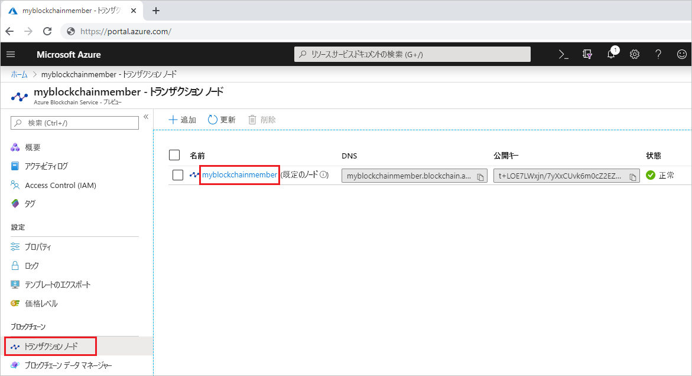
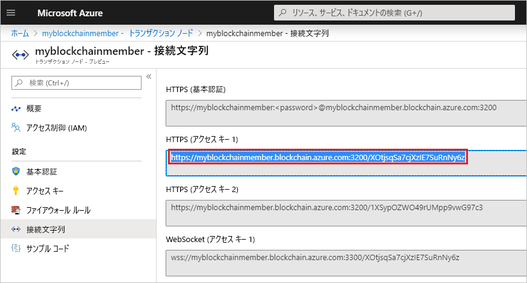

# <a name="quickstart-use-truffle-to-connect-to-azure-blockchain-service"></a>クイック スタート:Truffle を使用して Azure Blockchain Service に接続する

このクイックスタートでは、Truffle を使用して Azure Blockchain Service のトランザクション ノードに接続します。 そのうえで、Truffle の対話型コンソールを使って **web3** を呼び出し、ブロックチェーン ネットワークとやり取りします。

[!INCLUDE [quickstarts-free-trial-note](../../../includes/quickstarts-free-trial-note.md)]

## <a name="prerequisites"></a>前提条件

* 「[Quickstart: Azure portal を使用したブロックチェーン メンバーの作成](create-member.md)に関するページと、「[クイック スタート: Azure CLI を使用して Azure Blockchain Service ブロックチェーン メンバーを作成する](create-member-cli.md)」を完了していること
* [Truffle](https://github.com/trufflesuite/truffle) をインストールする。 Truffle では、[Node.js](https://nodejs.org)、[Git](https://git-scm.com/book/en/v2/Getting-Started-Installing-Git) など、いくつかのツールがインストールされている必要があります。
* [Python 2.7.15](https://www.python.org/downloads/release/python-2715/) をインストールする。 Python は Web3 に必要です。

## <a name="create-truffle-project"></a>Truffle プロジェクトを作成する

1. Node.js コマンド プロンプトまたはシェルを開きます。
1. ディレクトリを Truffle プロジェクト ディレクトリを作成する場所に変更します。
1. プロジェクト用のディレクトリを作成し、パスを新しいディレクトリに変更します。 たとえば、次のように入力します。

    ``` bash
    mkdir truffledemo
    cd truffledemo
    ```

1. Truffle プロジェクトを初期化します。

    ``` bash
    truffle init
    ```

1. プロジェクト フォルダーに Ethereum JavaScript API web3 をインストールします。 現在、バージョン web3 バージョン 1.0.0-beta.37 が必要です。

    ``` bash
    npm install web3@1.0.0-beta.37
    ```

    インストール中に npm の警告が表示されることがあります。
    
## <a name="configure-truffle-project"></a>Truffle プロジェクトを構成する

Truffle プロジェクトを構成するには、Azure portal からいくつかのトランザクション ノード情報が必要です。

1. [Azure Portal](https://portal.azure.com) にサインインします。
1. Azure Blockchain Service メンバーに移動します。 **[Transaction nodes]\(トランザクション ノード\)** と既定のトランザクション ノード リンクを選択します。

    

1. **[接続文字列]** を選択します。
1. **[HTTPS (Access key 1)]\(HTTPS (アクセス キー 1)\)** の接続文字列をコピーします。 この文字列は次のセクションで必要になります。

    

### <a name="edit-configuration-file"></a>構成ファイルを編集する

次に、トランザクション ノードのエンドポイントを使用して Truffle 構成ファイルを更新する必要があります。

1. **truffledemo** プロジェクト フォルダー内の Truffle 構成ファイル `truffle-config.js` をエディターで開きます。
1. ファイルの内容を、次の構成情報に置き換えます。 エンドポイント アドレスを含む変数を追加します。 山かっこの部分は、前のセクションで収集した値に置き換えます。

    ``` javascript
    var defaultnode = "<default transaction node connection string>";   
    var Web3 = require("web3");
    
    module.exports = {
      networks: {
        defaultnode: {
          provider: new Web3.providers.HttpProvider(defaultnode),
          network_id: "*"
        }
      }
    }
    ```

1. `truffle-config.js` に対する変更を保存します。

## <a name="connect-to-transaction-node"></a>トランザクション ノードに接続する

*Web3* を使用してトランザクション ノードに接続します。

1. Truffle コンソールを使用して、既定のトランザクション ノードに接続します。 コマンド プロンプトまたはシェルで、次のコマンドを実行します。

    ``` bash
    truffle console --network defaultnode
    ```

    Truffle によって既定のトランザクション ノードに接続され、対話型コンソールが提供されます。

    **web3** オブジェクトでメソッドを呼び出して、ブロックチェーン ネットワークと対話することができます。

1. **getBlockNumber** メソッドを呼び出して現在のブロック番号を返します。

    ```bash
    web3.eth.getBlockNumber();
    ```

    出力例:

    ```bash
    truffle(defaultnode)> web3.eth.getBlockNumber();
    18567
    ```
1. Truffle コンソールを終了します。

    ```bash
    .exit
    ```

## <a name="next-steps"></a>次の手順

このクイックスタートでは、Truffle を使用して Azure Blockchain Service の既定のトランザクション ノードに接続し、対話型コンソールを使用して現在のブロックチェーンのブロック番号を確認しました。

次は、Azure Blockchain Development Kit for Ethereum を使用してトランザクションを介したスマート コントラクト関数を作成、ビルド、デプロイ、実行するチュートリアルに挑戦してみてください。

> [!div class="nextstepaction"]
> [スマート コントラクトの作成、ビルド、Azure Blockchain Service へのデプロイ](send-transaction.md)
