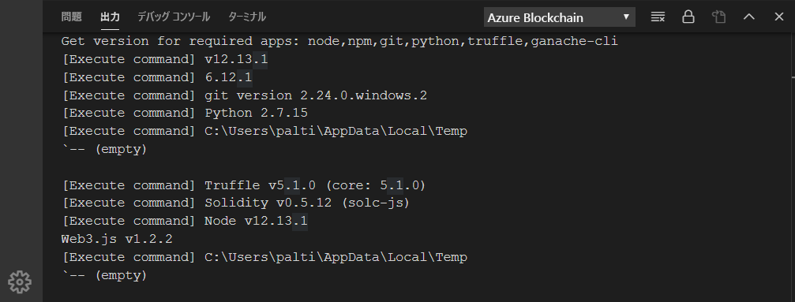
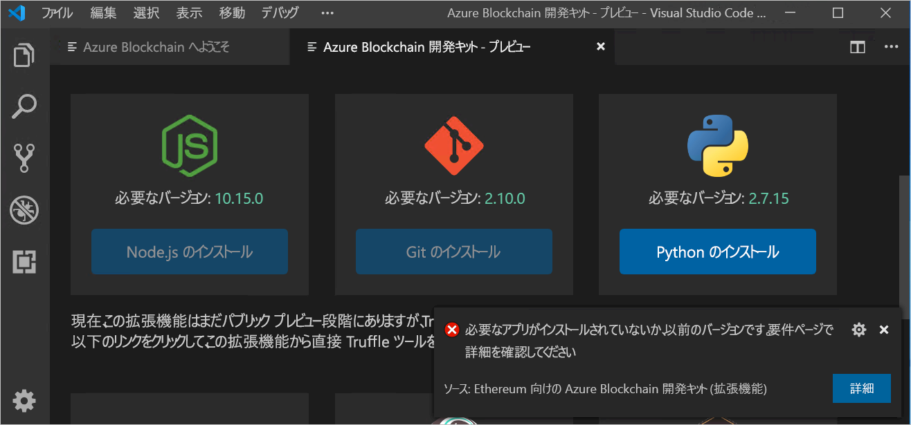

# クイック スタート:Visual Studio Code を使用して Azure Blockchain Service コンソーシアム ネットワークに接続する

このクイックスタートでは、Azure Blockchain Development Kit for Ethereum Visual Studio Code 拡張機能をインストールして使用し、Azure Blockchain Service 上のコンソーシアムに接続します。 Azure Blockchain Development Kit を使用すると、Ethereum 台帳上のスマート コントラクトの作成、接続、ビルド、デプロイを簡単に行うことができます。 

[!INCLUDE [quickstarts-free-trial-note](../../../includes/quickstarts-free-trial-note.md)]

## 前提条件

* 「[Quickstart: Azure portal を使用したブロックチェーン メンバーの作成](create-member.md)に関するページと、「[クイック スタート: Azure CLI を使用して Azure Blockchain Service ブロックチェーン メンバーを作成する](create-member-cli.md)」を完了していること
* [Visual Studio Code](https://code.visualstudio.com/Download)
* [Azure Blockchain Development Kit for Ethereum 拡張機能](https://marketplace.visualstudio.com/items?itemName=AzBlockchain.azure-blockchain)
* [Node.JS](https://nodejs.org)
* [Git](https://git-scm.com)
* [Python](https://www.python.org/downloads/release/python-2715/)。 python.exe をパスに追加します。 Azure Blockchain Development Kit では、パス内に Python が必要です。
* [Truffle](https://www.trufflesuite.com/docs/truffle/getting-started/installation)
* [Ganache CLI](https://github.com/trufflesuite/ganache-cli)

### Azure Blockchain Development Kit の環境を検証する

Azure Blockchain Development Kit では、自分の開発環境の前提条件が満たされていることが確認されます。 開発環境を検証するには:

VS Code コマンド パレットで、 **[Azure Blockchain: Show Welcome Page]\(Azure Blockchain: ウェルカム ページを表示\)** を選択します。

Azure Blockchain Development Kit によって、完了までに約 1 分かかる検証スクリプトが実行されます。 出力を表示するには、 **[ターミナル] > [新しいターミナル]** の順に選択します。 ターミナルのメニュー バーで、 **[出力]** タブを選択し、ドロップダウン リストの **[Azure Blockchain]** を選択します。 検証が成功すると、次の画像のように表示されます。

 必要なツールがない場合は、 **[Azure Blockchain Development Kit - Preview]\(Azure Blockchain Development Kit - プレビュー\)** という名前の新しいタブに、インストールが必要なアプリと、ツールをダウンロードするためのリンクの一覧が表示されます。

クイックスタートを続ける前に、不足している前提条件をすべてインストールします。

## コンソーシアム メンバーに接続する

Azure Blockchain Development Kit VS Code 拡張機能を使用して、コンソーシアム メンバーに接続できます。 コンソーシアムに接続したら、スマート コントラクトをコンパイル、ビルドし、Azure Blockchain Service コンソーシアム メンバーにデプロイできます。

Azure Blockchain Service コンソーシアム メンバーにアクセスできない場合は、前提条件の「[クイックスタート: Azure portal を使用したブロックチェーン メンバーの作成](create-member.md)に関するページと、「[クイック スタート: Azure CLI を使用して Azure Blockchain Service ブロックチェーン メンバーを作成する](create-member-cli.md)」を完了してください。

1. Visual Studio Code (VS Code) のエクスプローラー ウィンドウで、 **[Azure Blockchain]** 拡張機能を展開します。
1. **[Connect to Consortium]\(コンソーシアムに接続\)** を選択します。

   

    Azure 認証を求められた場合は、プロンプトに従って、ブラウザーを使用して認証します。
1. コマンド パレットのドロップダウンで **[Connect to Azure Blockchain Service consortium]\(Azure Blockchain Service コンソーシアムに接続\)** を選択します。
1. Azure Blockchain Service コンソーシアム メンバーに関連付けられているサブスクリプションとリソース グループを選択します。
1. 一覧からコンソーシアムを選択します。

コンソーシアムおよびブロックチェーン メンバーは、Visual Studio エクスプローラーのサイド バーに一覧表示されます。

## 次の手順

このクイックスタートでは、Azure Blockchain Development Kit for Ethereum Visual Studio Code 拡張機能を使用して、Azure Blockchain Service 上のコンソーシアムに接続しました。 次のチュートリアルで、Ethereum および Truffle 用の Azure Blockchain Development Kit を使用して、トランザクションを介したスマート コントラクト関数の作成、ビルド、デプロイ、実行を試してみます。

> [!div class="nextstepaction"]
> [Visual Studio Code を使用してスマート コントラクトを作成、ビルド、デプロイする](send-transaction.md)