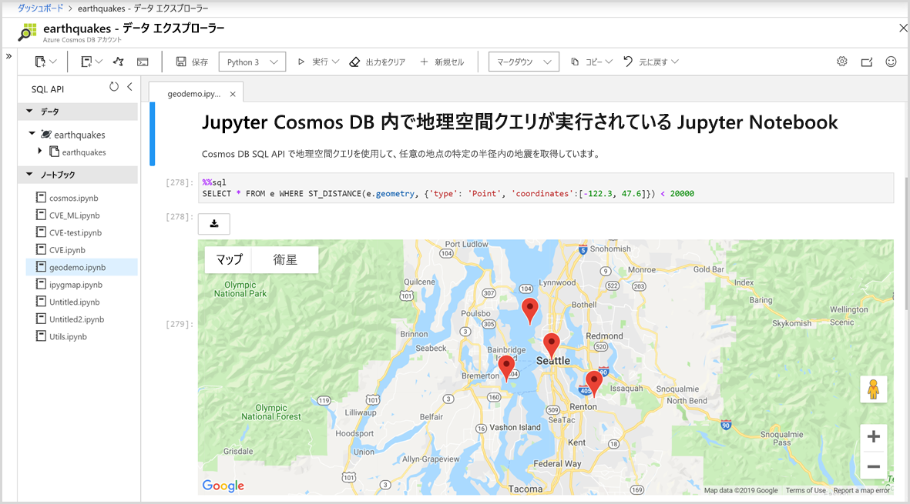

# Azure Cosmos DB に組み込まれている Jupyter Notebook のサポート (プレビュー)

Jupyter Notebook はオープン ソースの Web アプリケーションであり、ライブ コード、数式、視覚化、および説明テキストを含むドキュメントを作成して共有するために使用できます。 Azure Cosmos DB では、Cassandra、MongoDB、SQL、Gremlin、テーブルなど、すべての API の組み込み Jupyter Notebook がサポートされています。 組み込み Notebook がすべての Azure Cosmos DB API とデータ モデルをサポートしているので、対話形式でクエリを実行できます。 Jupyter Notebook は Azure Cosmos アカウント内で実行され、開発者はそれを使用して、データ探索、データ クリーニング、データ変換、数値シミュレーション、統計モデリング、データ視覚化、および機械学習を実行できます。

Jupyter Notebook では、追加コマンドをサポートすることによってカーネルの機能を拡張するマジック関数がサポートされています。 Cosmos マジックは、Jupyter Notebook で Python カーネルの機能を拡張して、Apache Spark に加えて Azure Cosmos SQL API のクエリを実行できるようにするコマンドです。 レンダリング コマンドに統合された豊富な視覚化ライブラリを使用することで、Python と SQL API のクエリを簡単に組み合わせて、データのクエリと視覚化を実行できます。
Azure portal では、次の図に示すように、Jupyter Notebook のエクスペリエンスが Azure Cosmos アカウントにネイティブに統合されています。

## Jupyter Notebook の利点

Jupyter Notebook は、もともと Python と R で記述されたデータ サイエンス アプリケーション向けに開発されましたが、次のようなさまざまな種類のプロジェクト向けにさまざまな方法で使用できます。

* ***データの可視化:** Jupyter Notebook を使用して、何らかのデータ セットをグラフィックとしてレンダリングする共有ノートブックの形式でデータを視覚化できます。 Jupyter Notebook では、視覚化を作成してそれらを共有し、共有コードとデータ セットに対して対話形式で変更を加えることができます。

* **コードの共有:** GitHub のようなサービスには、コードを共有する方法が用意されていますが、その大部分は対話形式ではありません。 Jupyter Notebook を使用すると、コードを表示して実行し、結果を Azure portal に直接表示できます。

* **ライブでのコード操作:** Jupyter ノートブックのコードは動的です。リアルタイムで漸次的に編集して再実行できます。 ノートブックには、コード、デモ、または概念実証 (POC) の入力ソースとして使用できるユーザー コントロール (スライダーやテキスト入力フィールドなど) を埋め込むこともできます。

* **コード サンプルとデータ探索の結果のドキュメント:** 一片のコードがあるときに、コードの各行が Azure Cosmos DB でどのように動作するかについて、リアルタイムの出力付きですべて説明することを望んでいる場合は、コードを Jupyter ノートブックに埋め込むことができます。 コードはそのまま完全に機能します。 ドキュメントと対話機能を同時に追加することができます。

* **Cosmos マジック コマンド:** Jupyter Notebook では、Azure Cosmos DB 用のカスタム マジック コマンドを使用して、対話型のコンピューティングを簡単に実行できるようにします。 たとえば、%% sql マジックを使用すると、ノートブック内で SQL API を直接使用して Cosmos コンテナーに対するクエリを実行できます。

* **オールインワン環境:** Jupyter Notebook では、コード、リッチ テキスト、画像、動画、アニメーション、数学式、プロット、マップ、対話型の図表、ウィジェット、およびグラフィカル ユーザー インターフェイスが単一のドキュメントに結合されます。

## Jupyter ノートブックの構成要素

Jupyter ノートブックには、さまざまな種類の構成要素を含めることができ、それぞれが個別のブロックにまとめられます。

* **テキストと HTML:** プレーン テキスト (HTML を生成するマークダウン構文に注釈を付けるテキスト) を、ドキュメントの任意の場所に挿入できます。 CSS スタイルをインラインで含めたり、ノートブックを生成するために使用されるテンプレートに追加したりすることもできます。

* **コードと出力:** Jupyter Notebook では、Python コードがサポートされます。 実行されたコードの結果は、コード ブロックの直後に表示され、コード ブロックは任意の順序で複数回実行できます。

* **視覚化:** Matplotlib、Plotly、Bokeh などのモジュールを使用して、コードからグラフィックスとグラフを生成できます。 出力と同様に、これらの視覚化は、それらを生成するコードの横にインラインで表示されます。

* **マルチメディア:** Jupyter Notebook は Web テクノロジ上に構築されているため、Web ページでサポートされているすべての種類のマルチメディアを表示できます。 これらの要素をノートブック内に HTML 要素として含めることも、`IPython.display` モジュールを使用してプログラムで生成することもできます。

* **データ:** Azure Cosmos コンテナーのデータとクエリの結果を、プログラムで Jupyter ノートブックにインポートできます。 たとえば、任意の Cosmos DB API またはネイティブに組み込まれている Apache Spark を使用して、データのクエリを実行するコードをノートブックに含めます。

## 次のステップ

Azure Cosmos DB に組み込まれている Jupyter Notebook の使用を開始するには、次の記事を参照してください。

* [Azure Cosmos アカウントでノートブックを有効にする](enable-notebooks.md)
* [Notebook の機能とコマンドを使用する](use-notebook-features-and-commands.md)

