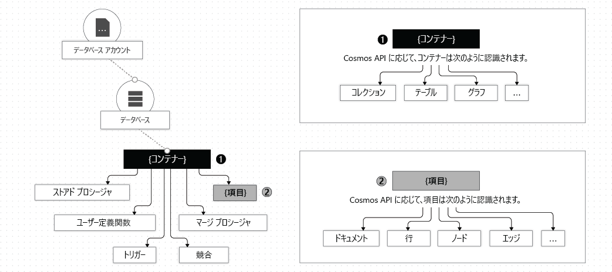

# <a name="quickstart-build-a-java-app-to-manage-azure-cosmos-db-sql-api-data"></a>クイック スタート:Azure Cosmos DB SQL API データを管理する Java アプリを作成する


> [!div class="op_single_selector"]
> * [.NET V3](create-sql-api-dotnet.md)
> * [.NET V4](create-sql-api-dotnet-V4.md)
> * [Java](create-sql-api-java.md)
> * [Node.js](create-sql-api-nodejs.md)
> * [Python](create-sql-api-python.md)
> * [Xamarin](create-sql-api-xamarin-dotnet.md)

このクイックスタートでは、Azure portal から Azure Cosmos DB の SQL API アカウントを作成して管理し、また GitHub からクローンされた Java アプリを使用します。 まず、Azure portal を使用して Azure Cosmos DB SQL API アカウントを作成し、SQL Java SDK を使用して Java アプリケーションを作成します。さらに Java アプリケーションを使用して Cosmos DB アカウントにリソースを追加します。 Azure Cosmos DB は、マルチモデル データベース サービスです。グローバルな分散と水平方向のスケーリング機能を備えたドキュメント データベースやテーブル データベース、キーと値のデータベース、グラフ データベースをすばやく作成し、クエリを実行することができます。

## <a name="prerequisites"></a>前提条件

- アクティブなサブスクリプションが含まれる Azure アカウント。 [無料で作成できます](https://azure.microsoft.com/free/?ref=microsoft.com&utm_source=microsoft.com&utm_medium=docs&utm_campaign=visualstudio)。 または、Azure サブスクリプションなしで、[Azure Cosmos DB を無料で試す](https://azure.microsoft.com/try/cosmosdb/)こともできます。 または、`https://localhost:8081` の URI でキー `C2y6yDjf5/R+ob0N8A7Cgv30VRDJIWEHLM+4QDU5DE2nQ9nDuVTqobD4b8mGGyPMbIZnqyMsEcaGQy67XIw/Jw==` を使用して [Azure Cosmos DB Emulator](https://aka.ms/cosmosdb-emulator) を使用することもできます。
- [Java Development Kit (JDK) 8](https://www.azul.com/downloads/azure-only/zulu/?&version=java-8-lts&architecture=x86-64-bit&package=jdk)。 JDK のインストール先フォルダーを指すように `JAVA_HOME` 環境変数を設定してください。
- [Maven バイナリ アーカイブ](https://maven.apache.org/download.cgi)。 Ubuntu で `apt-get install maven` を実行して Maven をインストールします。
- [Git](https://www.git-scm.com/downloads). Ubuntu で `sudo apt-get install git` を実行して Git をインストールします。

## <a name="introductory-notes"></a>概要

"*Cosmos DB アカウントの構造:* " API またはプログラミング言語に関係なく、Cosmos DB "*アカウント*" には 0個以上の "*データベース*" が含まれます。"*データベース*" (DB) には 0 個以上の "*コンテナー*" が含まれます。また、次の図に示すように、"*コンテナー*" には 0 個以上の項目が含まれます。



データベース、コンテナー、項目の詳細については、[こちら](databases-containers-items.md)を参照してください。 "*プロビジョニング済みスループット*" や "*パーティション キー*" など、いくつかの重要なプロパティが、コンテナーのレベルで定義されています。 

プロビジョニング済みスループットは要求ユニット (*RU*) 単位で測定されます。RU には通貨価格が設定されており、アカウント運用コストの大きな決定要因となります。 プロビジョニング済みスループットはコンテナー単位またはデータベース単位で選択できますが、通常はコンテナーレベルのスループット仕様が推奨されます。 スループットのプロビジョニングの詳細については、[こちら](set-throughput.md)を参照してください。

Cosmos DB コンテナーに項目を挿入すると、要求を処理するためのストレージとコンピューティングが追加されて、データベースが水平方向に拡張されます。 ストレージとコンピューティングの容量は "*パーティション*" と呼ばれる個別の単位で追加されます。ドキュメント内の 1 つのフィールドを選択し、これを各ドキュメントをパーティションにマップするパーティション キーにする必要があります。 パーティションを管理する方法として、各パーティションに、パーティション キー値の範囲を超えて、ほぼ等しいスライスを割り当てます。そのため、比較的ランダムまたは均等に分散されたパーティション キーを選択することをお勧めします。 そうしないと、一部のパーティションに非常に多くの要求が集中し ("*ホット パーティション*")、他のパーティションは少数の要求しか受け取らない ("*コールド パーティション*") 状況が発生しますが、これは回避する必要があります。 パーティション分割の詳細については、[こちら](partitioning-overview.md)を参照してください。

## <a name="create-a-database-account"></a>データベース アカウントの作成

ドキュメント データベースを作成するには、Azure Cosmos DB を含んだ SQL API アカウントを事前に作成しておく必要があります。

[!INCLUDE [cosmos-db-create-dbaccount](../../includes/cosmos-db-create-dbaccount.md)]

## <a name="add-a-container"></a>コンテナーの追加

[!INCLUDE [cosmos-db-create-collection](../../includes/cosmos-db-create-collection.md)]

<a id="add-sample-data"></a>
## <a name="add-sample-data"></a>サンプル データの追加

[!INCLUDE [cosmos-db-create-sql-api-add-sample-data](../../includes/cosmos-db-create-sql-api-add-sample-data.md)]

## <a name="query-your-data"></a>データのクエリ

[!INCLUDE [cosmos-db-create-sql-api-query-data](../../includes/cosmos-db-create-sql-api-query-data.md)]

## <a name="clone-the-sample-application"></a>サンプル アプリケーションの複製

次は、コードを使った作業に移りましょう。 GitHub から SQL API アプリの複製を作成し、接続文字列を設定して実行します。 プログラムでデータを処理することが非常に簡単であることがわかります。 

次のコマンドを実行して、サンプル レポジトリを複製します。 このコマンドは、コンピューター上にサンプル アプリのコピーを作成します。

```bash
git clone https://github.com/Azure-Samples/azure-cosmos-java-getting-started.git
```

## <a name="review-the-code"></a>コードの確認

この手順は省略可能です。 コード内のデータベース リソースの作成方法に関心がある場合は、次のスニペットを確認できます。 それ以外の場合は、「[アプリの実行](#run-the-app)」に進んでください。 

### <a name="managing-database-resources-using-the-synchronous-sync-api"></a>同期 API を使用してデータベース リソースを管理する

* `CosmosClient` の初期化。 `CosmosClient` は、Azure Cosmos データベース サービスのクライアント側の論理表現を提供します。 このクライアントは、サービスに対する要求の構成と実行に使用されます。
    
    [!code-java[](~/azure-cosmosdb-java-v4-getting-started/src/main/java/com/azure/cosmos/sample/sync/SyncMain.java?name=CreateSyncClient)]

* `CosmosDatabase` の作成。

    [!code-java[](~/azure-cosmosdb-java-v4-getting-started/src/main/java/com/azure/cosmos/sample/sync/SyncMain.java?name=CreateDatabaseIfNotExists)]

* `CosmosContainer` の作成。

    [!code-java[](~/azure-cosmosdb-java-v4-getting-started/src/main/java/com/azure/cosmos/sample/sync/SyncMain.java?name=CreateContainerIfNotExists)]

* `createItem` メソッドを使用した項目の作成。

    [!code-java[](~/azure-cosmosdb-java-v4-getting-started/src/main/java/com/azure/cosmos/sample/sync/SyncMain.java?name=CreateItem)]
   
* `readItem` メソッドを使用したポイント読み取りの実行。

    [!code-java[](~/azure-cosmosdb-java-v4-getting-started/src/main/java/com/azure/cosmos/sample/sync/SyncMain.java?name=ReadItem)]

* `queryItems` メソッドを使用して JSON に対する SQL クエリを実行します。

    [!code-java[](~/azure-cosmosdb-java-v4-getting-started/src/main/java/com/azure/cosmos/sample/sync/SyncMain.java?name=QueryItems)]

### <a name="managing-database-resources-using-the-asynchronous-async-api"></a>非同期 API を使用してデータベース リソースを管理する

* 非同期 API 呼び出しは、サーバーからの応答を待機することなく直ちに制御を戻します。 この点を踏まえ、非同期 API を使用して、前出のすべての管理タスクを遂行するための適切な設計パターンを示したものが以下のコード スニペットです。

* `CosmosAsyncClient` の初期化。 `CosmosAsyncClient` は、Azure Cosmos データベース サービスのクライアント側の論理表現を提供します。 このクライアントは、サービスに対する非同期要求の構成と実行に使用されます。
    
    [!code-java[](~/azure-cosmosdb-java-v4-getting-started/src/main/java/com/azure/cosmos/sample/async/AsyncMain.java?name=CreateAsyncClient)]

* `CosmosAsyncDatabase` の作成。

    [!code-java[](~/azure-cosmosdb-java-v4-getting-started/src/main/java/com/azure/cosmos/sample/sync/SyncMain.java?name=CreateDatabaseIfNotExists)]

* `CosmosAsyncContainer` の作成。

    [!code-java[](~/azure-cosmosdb-java-v4-getting-started/src/main/java/com/azure/cosmos/sample/sync/SyncMain.java?name=CreateContainerIfNotExists)]

* 同期 API と同様、項目の作成は `createItem` メソッドを使用して実行されます。 この例は、要求を発行して通知を出力する Reactive Stream をサブスクライブすることによって、多数の非同期 `createItem` 要求を効率よく発行する方法を示しています。 この単純な例は、そのままでは完了まで実行されて終了してしまうため、`CountDownLatch` インスタンスを使用して、項目の作成中はプログラムが終了しないようにしています。 **非同期プログラミングでは、非同期呼び出しをブロックしないことが適切なプラクティスとされています。現実のユースケースでは、無限に実行される main() ループから要求が生成されるので、非同期呼び出しをラッチで待機させる必要はありません。**

    [!code-java[](~/azure-cosmosdb-java-v4-getting-started/src/main/java/com/azure/cosmos/sample/async/AsyncMain.java?name=CreateItem)]
   
* 同期 API と同様、ポイント読み取りは `readItem` メソッドを使用して実行されます。

    [!code-java[](~/azure-cosmosdb-java-v4-getting-started/src/main/java/com/azure/cosmos/sample/async/AsyncMain.java?name=ReadItem)]

* 同期 API と同様、JSON に対する SQL クエリは、`queryItems` メソッドを使用して実行されます。

    [!code-java[](~/azure-cosmosdb-java-v4-getting-started/src/main/java/com/azure/cosmos/sample/async/AsyncMain.java?name=QueryItems)]

## <a name="run-the-app"></a>アプリを実行する

ここで Azure portal に戻って接続文字列情報を取得し、エンドポイント情報を使用してアプリを起動します。 これでアプリが、ホストされているデータベースと通信できます。

1. Git ターミナル ウィンドウで `cd` を使用して、サンプル コード フォルダーに移動します。

    ```bash
    cd azure-cosmos-java-getting-started
    ```

2. git ターミナル ウィンドウで、次のコマンドを実行して 必要な Java パッケージをインストールします。

    ```bash
    mvn package
    ```

3. Git ターミナル ウィンドウで、次のコマンドを使用して Java アプリケーションを起動します (SYNCASYNCMODE は、実行したいサンプル コードに応じて `sync` または `async` に置き換えます。また、YOUR_COSMOS_DB_HOSTNAME は引用符で囲んだポータルの URI 値に置き換え、YOUR_COSMOS_DB_MASTER_KEY は引用符で囲んだポータルのプライマリ キーに置き換えます)。

    ```bash
    mvn exec:java@SYNCASYNCMODE -DACCOUNT_HOST=YOUR_COSMOS_DB_HOSTNAME -DACCOUNT_KEY=YOUR_COSMOS_DB_MASTER_KEY

    ```

    ターミナル ウィンドウに、FamilyDB データベースが作成されたという通知が表示されます。 
    
4. `AzureSampleFamilyDB` という名前のデータベースがアプリによって作成されます。
5. `FamilyContainer` という名前のコンテナーがアプリによって作成されます。
6. アプリは、オブジェクト ID とパーティション キーの値 (この例では lastName) を使用してポイント読み取りを実行します。 
7. アプリは項目を照会して、姓が IN 条件 ('Andersen', 'Wakefield', 'Johnson') に該当するすべての家族を取得します。

7. 作成したリソースは、アプリによって削除されません。 ポータルに戻り、[リソースをクリーンアップ](#clean-up-resources)します。  料金が発生しないように、アカウントから削除します。

## <a name="review-slas-in-the-azure-portal"></a>Azure Portal での SLA の確認

[!INCLUDE [cosmosdb-tutorial-review-slas](../../includes/cosmos-db-tutorial-review-slas.md)]

## <a name="clean-up-resources"></a>リソースをクリーンアップする

[!INCLUDE [cosmosdb-delete-resource-group](../../includes/cosmos-db-delete-resource-group.md)]

## <a name="next-steps"></a>次のステップ

このクイックスタートでは、Azure Cosmos DB SQL API アカウントを作成し、データ エクスプローラーを使ってドキュメント データベースやコンテナーを作成する方法について説明しました。また、同じことをプログラムから行う Java アプリを実行する方法についても説明しました。 これで、Azure Cosmos DB アカウントに追加のデータをインポートできるようになりました。 

> [!div class="nextstepaction"]
> [Azure Cosmos DB へのデータのインポート](import-data.md)
