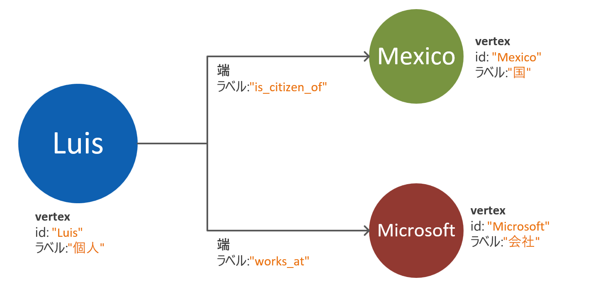
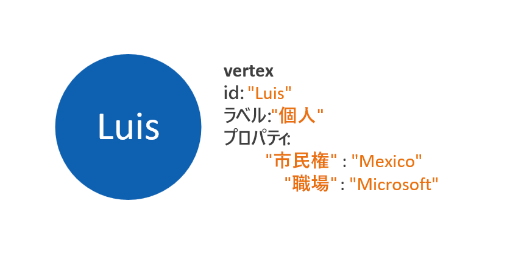
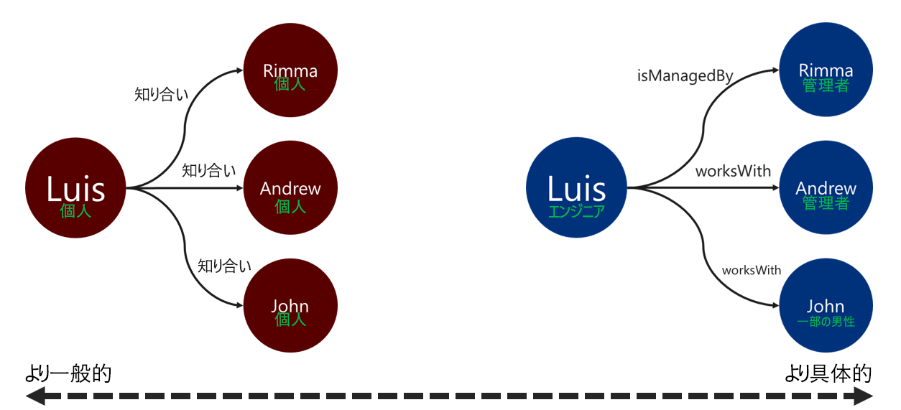

# Azure Cosmos DB Gremlin API のグラフ データのモデリング

次のドキュメントは、グラフ データのモデリングの推奨事項を提供することを目的としています。 この手順は、データの進化に合わせて、グラフ データベース システムのスケーラビリティとパフォーマンスを確保するうえで不可欠です。 効率的なデータ モデルは、大規模なグラフで特に重要です。

## 必要条件

このガイドに記載されているプロセスは、次の前提条件に基づいています。
 * 問題空間内の**エンティティ**が特定されている。 これらのエンティティは各要求に対して_アトミックに_使用されます。 つまり、このデータベース システムは複数のクエリ要求で 1 つのエンティティのデータを取得するようには設計されていません。
 * このデータベース システムの**読み取りと書き込みの要件**を理解している。 これらの要件は、グラフ データ モデルに必要な最適化の指針となります。
 * [Apache Tinkerpop プロパティ グラフ標準](https://tinkerpop.apache.org/docs/current/reference/#graph-computing)の原則について十分に理解している。

## グラフ データベースが必要になる場合

データ ドメイン内のエンティティとリレーションシップが次のいずれかの特性を備えている場合、グラフ データベース ソリューションを最適に適用できます。 

* エンティティが、わかりやすいリレーションシップにより**緊密に接続**されている。 このシナリオのメリットは、リレーションシップがストレージ内に保持されるという事実です。
* **循環リレーションシップ**または**自己参照エンティティ**がある。 このパターンは、リレーショナルまたはドキュメント データベースを使用する場合に課題となることがよくあります。
* エンティティ間に**動的に発展するリレーションシップ**がある。 このパターンは、多数のレベルがある階層またはツリー構造のデータに特に適用されます。
* エンティティ間に**多対多のリレーションシップ**がある。
* **エンティティとリレーションシップの両方に書き込みと読み取りの要件**がある。 

上記の条件を満たしている場合、グラフ データベース アプローチが**クエリの複雑さ**、**データ モデルのスケーラビリティ**、および**クエリ パフォーマンス**の面でメリットをもたらす可能性があります。

次の手順では、分析とトランザクション目的のどちらでグラフを使用するかを確認します。 グラフを高負荷な計算やデータ処理ワークロードに使用する場合は、[Cosmos DB Spark コネクタ](https://docs.microsoft.com/azure/cosmos-db/spark-connector)と [GraphX ライブラリ](https://spark.apache.org/graphx/)の使用について検討する価値があります。 

## グラフ オブジェクトを使用する方法

[Apache Tinkerpop プロパティ グラフ標準](https://tinkerpop.apache.org/docs/current/reference/#graph-computing)では、2 種類のオブジェクト **Vertex** と **Edge** を定義します。 

以下は、グラフ オブジェクトのプロパティのベスト プラクティスです。

| Object | プロパティ | 種類 | メモ |
| --- | --- | --- |  --- |
| Vertex | id | String | パーティションごとに一意に適用されます。 挿入時に値の指定がなかった場合には、自動生成された GUID が格納されます。 |
| Vertex | label | String | このプロパティは、頂点が表すエンティティの種類を定義するために使用されます。 値が指定されないと、既定値の "vertex" が使用されます。 |
| Vertex | properties | 文字列、ブール値、数値 | 各頂点にキーと値のペアとして格納される個々のプロパティの一覧。 |
| Vertex | パーティション キー | 文字列、ブール値、数値 | このプロパティでは、頂点とその外向きエッジを格納する場所を定義します。 [グラフのパーティション分割](graph-partitioning.md)の詳細をご覧ください。 |
| Edge | id | String | パーティションごとに一意に適用されます。 既定で自動生成されます。 エッジは、通常、ID によって一意に取得する必要がありません。 |
| Edge | label | String | このプロパティは、2 つの頂点のリレーションシップの種類を定義するために使用されます。 |
| Edge | properties | 文字列、ブール値、数値 | 各エッジにキーと値のペアとして格納される個々のプロパティの一覧。 |

> [!NOTE]
> エッジにはパーティション キー値が必要ありません。その値はそのソースとなる頂点に基づいて自動的に割り当てられるためです。 詳しくは、[グラフのパーティション分割](graph-partitioning.md)に関する記事をご覧ください。

## エンティティとリレーションシップのモデリングのガイドライン

以下は、Azure Cosmos DB Gremlin API グラフ データベースのデータ モデリングに対するアプローチの一連のガイドラインです。 これらのガイドラインでは、データ ドメインとそのクエリの既存の定義があることを前提としています。

> [!NOTE]
> 下記の手順は、推奨事項として示されています。 運用対応として検討する前に、最終的なモデルを評価し、テストする必要があります。 さらに、以下の推奨事項は、Azure Cosmos DB の Gremlin API の実装に固有です。 

### 頂点とプロパティのモデル化 

グラフ データ モデルの最初の手順では、識別されたすべてのエンティティを **Vertex オブジェクト**にマップします。 すべてのエンティティと頂点の 1 対 1 のマッピングは、最初の手順であり、変更されることがあります。

よくある落とし穴の 1 つとして、1 つのエンティティのプロパティを別々の頂点としてマップすることがあります。 同じエンティティを 2 つの異なる方法で表現する以下の例について考えてみましょう。

* **頂点に基づくプロパティ**:このアプローチでは、エンティティは 3 つの個別の頂点と 2 つのエッジを使用して、そのプロパティを記述します。 このアプローチにより、冗長性が軽減される可能性はありますが、モデルの複雑さが増します。 モデルの複雑さが増すと、待ち時間、クエリの複雑さ、および計算コストが増加する場合があります。 このモデルでは、パーティション分割で問題が発生する可能性もあります。

* **プロパティが埋め込まれた頂点**:このアプローチでは、キーと値のペアの一覧を利用して、頂点内でエンティティのすべてのプロパティを表します。 このアプローチにより、モデルの複雑さが軽減され、クエリがシンプルになり、トラバーサルのコスト効率が高くなります。

> [!NOTE]
> 上記の例は、エンティティ プロパティを分割する 2 つの方法の比較を示すためにのみ、簡略化されたグラフ モデルを示しています。

**プロパティが埋め込まれた頂点**パターンは、一般に、パフォーマンスとスケーラビリティの高いアプローチを提供します。 新しいグラフ データ モデルに対する既定のアプローチは、このパターンになる傾向があります。

ただし、プロパティの参照がメリットをもたらすことがあるシナリオもあります。 たとえば、参照されたプロパティが頻繁に更新される場合です。 個々の頂点を使用して、繰り返し変更されるプロパティを表すと、更新に必要な書き込み操作の量が最小限に抑えられます。

### エッジの方向を指定するリレーションシップのモデリング

頂点をモデル化した後、それらのリレーションシップを示すためにエッジを追加できます。 評価する必要がある最初の側面は、**リレーションシップの方向**です。 

Edge オブジェクトには、`out()` または `outE()` 関数を使用した場合にトラバーサルが従う既定の方向があります。 すべての頂点はその外向きエッジと共に格納されるため、この自然な方向を使用すると、効率的な操作になります。 

ただし、`in()` 関数を使用してエッジの反対方向にトラバースすると、必ずクロスパーティション クエリになります。 詳しくは、[グラフのパーティション分割](graph-partitioning.md)に関する記事をご覧ください。 絶えず `in()` 関数を使用してトラバースする必要がある場合、両方向にエッジを追加することをお勧めします。

エッジの方向を指定するには、`.addE()` Gremlin ステップに `.to()` または `.from()` 述語を使用します。 または、[Gremlin API 用 bulk executor ライブラリ](bulk-executor-graph-dotnet.md)を使用します。

> [!NOTE]
> Edge オブジェクトには、既定で方向があります。

### リレーションシップのラベル付け

わかりやすいリレーションシップ ラベルを使用すると、エッジ解決操作の効率を向上させることができます。 このパターンは、次の方法で適用できます。
* 一般的でない用語を使用して、リレーションシップにラベルを付ける。
* リレーションシップ名を使用して、ソースの頂点のラベルとターゲットの頂点のラベルを関連付ける。

トラバーサーがエッジのフィルター処理に使用するラベルを具体的にするほど良くなります。 この決定は、クエリのコストにも大きな影響を与える可能性があります。 クエリのコストは、[executionProfile ステップを使用](graph-execution-profile.md)していつでも評価できます。

## 次のステップ: 
* サポートされている [Gremlin ステップ](gremlin-support.md)の一覧を確認する。
* 大規模なグラフを扱うために[グラフ データベースのパーティション分割](graph-partitioning.md)について確認する。
* [実行プロファイル ステップ](graph-execution-profile.md)を使用して実際の Gremlin クエリを評価する。
