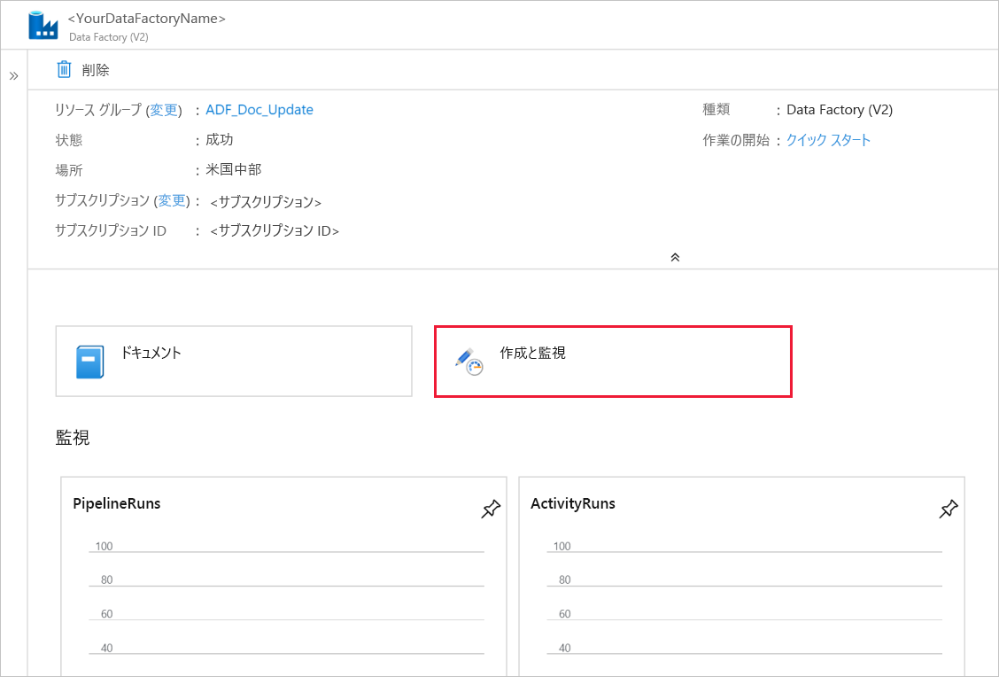

# データのコピー ツールを使用し LastModifiedDate に基づいて新しいファイルおよび変更されたファイルを増分コピーする

このチュートリアルでは、Azure portal を使用してデータ ファクトリを作成します。 次に、データのコピー ツールを使用して、**LastModifiedDate** を基に新しいファイルと変更されたファイルのみを Azure Blob ストレージから Azure Blob ストレージに増分的にコピーするパイプラインを作成します。

これにより、ADF はソース ストアのすべてのファイルをスキャンし、LastModifiedDate に基づいてファイル フィルターを適用して、前回以降の新しいファイルと更新されたファイルのみをターゲット ストアにコピーします。  ADF に大量のファイルをスキャンさせるが、ターゲットにコピーするのは少数のファイルだけの場合でも、ファイルのスキャンに時間がかかることは変わらないため、この場合も長時間の実行が見込まれることに注意してください。   

> [!NOTE]
> Azure Data Factory を初めて使用する場合は、「[Azure Data Factory の概要](introduction.md)」を参照してください。

このチュートリアルでは、以下のタスクを実行します。

> [!div class="checklist"]
> * データ ファクトリを作成します。
> * データのコピー ツールを使用してパイプラインを作成します。
> * パイプラインとアクティビティの実行を監視します。

## 前提条件

* **Azure サブスクリプション**:Azure サブスクリプションをお持ちでない場合は、開始する前に [無料アカウント](https://azure.microsoft.com/free/) を作成してください。
* **Azure ストレージ アカウント**:Blob ストレージを "_ソース_" および "_シンク_" データ ストアとして使用します。 Azure ストレージ アカウントがない場合は、「[ストレージ アカウントの作成](../storage/common/storage-quickstart-create-account.md)」の手順をご覧ください。

### Blob ストレージに 2 つのコンテナーを作成する

次の手順を行って、チュートリアルで使用する Blob ストレージを準備します。

1. **source** という名前のコンテナーを作成します。 この作業は、[Azure Storage Explorer](https://storageexplorer.com/) をはじめとするさまざまなツールを使用して実行できます。

2. **destination** という名前のコンテナーを作成します。 

## Data Factory の作成

1. 左側のメニューで、 **[リソースの作成]**  >  **[データ + 分析]**  >  **[Data Factory]** の順に選択します。 
   
   ![[新規] ウィンドウでの [Data Factory] の選択](./media/doc-common-process/new-azure-data-factory-menu.png)

2. **[新しいデータ ファクトリ]** ページで、 **[名前]** に「**ADFTutorialDataFactory**」と入力します。 
 
   データ ファクトリの名前は "_グローバルに一意_" にする必要があります。 次のエラー メッセージが表示される場合があります。
   
   ![[新しいデータ ファクトリ] のエラー メッセージ](./media/doc-common-process/name-not-available-error.png)

   データ ファクトリの名前の値に関するエラー メッセージが表示された場合は、別の名前を入力してください。 たとえば、 _**yourname**_ **ADFTutorialDataFactory** という名前を使用します。 Data Factory アーティファクトの名前付け規則については、[Data Factory の名前付け規則](naming-rules.md)に関する記事をご覧ください。
3. 新しいデータ ファクトリの作成先となる Azure **サブスクリプション**を選択します。 
4. **[リソース グループ]** で、次の手順のいずれかを行います。
     
    * **[Use existing]\(既存のものを使用\)** を選択し、ドロップダウン リストから既存のリソース グループを選択します。

    * **[新規作成]** を選択し、リソース グループの名前を入力します。 
         
    リソース グループの詳細については、[リソース グループを使用した Azure のリソースの管理](../azure-resource-manager/management/overview.md)に関するページを参照してください。

5. **[バージョン]** で、 **[V2]** を選択します。
6. **[場所]** で、データ ファクトリの場所を選択します。 サポートされている場所のみがドロップダウン リストに表示されます。 データ ファクトリで使用されるデータ ストア (Azure Storage、SQL Database など) やコンピューティング (Azure HDInsight など) は、他の場所やリージョンに存在していてもかまいません。
7. **[ダッシュボードにピン留めする]** をオンにします。 
8. **作成** を選択します。
9. ダッシュボードの **[Deploying Data Factory]\(データ ファクトリをデプロイしています\)** タイルで、処理の状態を確認します。

    ![[Deploying Data Factory]\(データ ファクトリをデプロイしています\) タイル](media/tutorial-copy-data-tool/deploying-data-factory.png)
10. 作成が完了すると、 **[Data Factory]** ホーム ページが表示されます。
   
    
11. 別のタブで Azure Data Factory ユーザー インターフェイス (UI) を開くには、 **[Author & Monitor]\(作成と監視\)** タイルを選択します。 

## データのコピー ツールを使用してパイプラインを作成する

1. **[Let's get started]\(始めましょう\)** ページで、 **[データのコピー]** タイルを選択してデータのコピー ツールを開きます。 

   
   
2. **[プロパティ]** ページで、次の手順を行います。

    a. **[タスク名]** に「**DeltaCopyFromBlobPipeline**」と入力します。

    b. **[Task cadence** **or Task schedule]\(タスクの周期またはスケジュール\)** で、 **[Run regularly on schedule]\(スケジュールに従って定期的に実行する\)** を選択します。

    c. **[Trigger type]\(トリガーの種類\)** で、 **[Tumbling Window]\(タンブリング ウィンドウ\)** を選択します。
    
    d. **[Recurrence]\(繰り返し\)** で、**15 分**と指定します。 
    
    e. **[次へ]** を選択します。 
    
    指定したタスク名のパイプラインが Data Factory UI によって作成されます。 

    ![[プロパティ] ページ](./media/tutorial-incremental-copy-lastmodified-copy-data-tool/copy-data-tool-properties-page.png)
    
3. **[ソース データ ストア]** ページで、次の手順を実行します。

    a. **[+ 新しい接続の作成]** を選択してして、接続を追加します。
    
    ![[ソース データ ストア] ページ](./media/tutorial-incremental-copy-lastmodified-copy-data-tool/source-data-store-page.png)

    b. ギャラリーから **[Azure Blob Storage]** を選択し、 **[続行]** を選択します。
    
    ![[ソース データ ストア] ページ](./media/tutorial-incremental-copy-lastmodified-copy-data-tool/source-data-store-page-select-blob.png)

    c. **[New Linked Service]\(新しいリンクされたサービス\)** ページで、 **[ストレージ アカウント名]** ボックスの一覧からストレージ アカウントを選択し、 **[完了]** をクリックします。
    
    ![[ソース データ ストア] ページ](./media/tutorial-incremental-copy-lastmodified-copy-data-tool/source-data-store-page-linkedservice.png)
    
    d. 新しく作成したリンクされたサービスを選択して、 **[次へ]** を選択します。 
    
   ![[ソース データ ストア] ページ](./media/tutorial-incremental-copy-lastmodified-copy-data-tool/source-data-store-page-select-linkedservice.png)

4. **[Choose the input file or folder]\(入力ファイルまたはフォルダーの選択\)** ページで、次の手順を実行します。
    
    a. **source** フォルダーを参照して選択し、 **[選択]** を選択します。
    
    ![[Choose the input file or folder]\(入力ファイルまたはフォルダーの選択\)](./media/tutorial-incremental-copy-lastmodified-copy-data-tool/choose-input-file-folder.png)
    
    b. **[File loading behavior]\(ファイル読み込み動作\)** で、 **[Incremental load: LastModifiedDate]\(増分読み込み: LastModifiedDate\)** を選択します。
    
    ![[Choose the input file or folder]\(入力ファイルまたはフォルダーの選択\)](./media/tutorial-incremental-copy-lastmodified-copy-data-tool/choose-loading-behavior.png)
    
    c. **[Binary copy]\(バイナリ コピー\)** をオンにして、 **[次へ]** を選択します。
    
     ![[Choose the input file or folder]\(入力ファイルまたはフォルダーの選択\)](./media/tutorial-incremental-copy-lastmodified-copy-data-tool/check-binary-copy.png)
     
5. **[Destination data store]\(コピー先データ ストア\)** ページで **[AzureBlobStorage]** を選択します。 これは、コピー元データ ストアと同じストレージ アカウントです。 **[次へ]** を選択します。

    ![[Destination data store]\(コピー先データ ストア\) ページ](./media/tutorial-incremental-copy-lastmodified-copy-data-tool/destination-data-store-page-select-linkedservice.png)
    
6. **[Choose the output file or folder]\(出力ファイルまたはフォルダーの選択\)** ページで、次の手順を実行します。
    
    a. **destination** フォルダーを参照して選択し、 **[選択]** をクリックします。
    
    
    
    b. **[次へ]** を選択します。
    
     
    
7. **[設定]** ページで **[次へ]** を選択します。 

    ![[設定] ページ](./media/tutorial-incremental-copy-lastmodified-copy-data-tool/settings-page.png)
    
8. **[Summary]\(概要\)** ページで設定を確認し、 **[次へ]** を選択します。

    
    
9. **[Deployment]\(デプロイ\)** ページで **[監視]** を選択してパイプライン (タスク) を監視します。

    ![[Deployment]\(デプロイ\) ページ](./media/tutorial-incremental-copy-lastmodified-copy-data-tool/deployment-page.png)
    
10. 左側の **[監視]** タブが自動的に選択されたことがわかります。 **[アクション]** 列には、アクティビティの実行の詳細を表示するリンクとパイプラインを再実行するリンクが表示されます。 **[更新]** を選択して一覧を更新し、 **[Actions]\(アクション\)** 列で **[View Activity Runs]\(アクティビティの実行の表示\)** リンクを選択します。 

    ![一覧を更新し、[View Activity Runs]\(アクティビティの実行の表示\) を選択します](./media/tutorial-incremental-copy-lastmodified-copy-data-tool/monitor-pipeline-runs1.png)

11. パイプラインにはアクティビティ (コピー アクティビティ) が 1 つしかないため、エントリが 1 つだけ表示されます。 コピー操作の詳細を確認するために、 **[アクション]** 列にある **[詳細]** リンク (眼鏡アイコン) を選択します。 

    
    
    BLOB ストレージ アカウントの **source** コンテナーにはファイルがないので、BLOB ストレージ アカウントの **destination** コンテナーにコピーされたファイルは表示されません。
    
    
    
12. 空のテキスト ファイルを作成し、**file1.txt** という名前を付けます。 このテキスト ファイルを、ストレージ アカウントの **source** コンテナーにアップロードします。 この作業は、[Azure Storage Explorer](https://storageexplorer.com/) をはじめとするさまざまなツールを使用して実行できます。   

    
    
13. **[Pipeline Runs]\(パイプライン実行\)** ビューに戻るために、 **[All Pipelines Runs]\(すべてのパイプライン実行\)** を選択し、同じパイプラインが再び自動的にトリガーされるまで待ちます。  

    ![[All Pipelines Runs]\(すべてのパイプライン実行\) を選択します](./media/tutorial-incremental-copy-lastmodified-copy-data-tool/monitor-pipeline-runs4.png)

14. 2 回目のパイプライン実行が表示されたら、その実行に対して **[View Activity Run]\(アクティビティの実行の表示\)** を選択します。 1 回目のパイプライン実行の場合と同じように詳細を確認します。  

    ![[View Activity Run]\(アクティビティの実行の表示\) を選択して詳細を確認します](./media/tutorial-incremental-copy-lastmodified-copy-data-tool/monitor-pipeline-runs5.png)

    BLOB ストレージ アカウントの **source** コンテナーから **destination** コンテナーに 1 つのファイル (file1.txt) がコピーされたことが表示されます。
    
    
    
15. 空のテキスト ファイルをもう 1 つ作成し、**file2.txt** という名前を付けます。 このテキスト ファイルを BLOB ストレージ アカウントの **source** コンテナーにアップロードします。   
    
16. 2 つ目のテキスト ファイルに対して手順 13 と 14 を繰り返します。 次のパイプライン実行では、ストレージ アカウントの **source** コンテナーから **destination** コンテナーに新しいファイル (file2.txt) だけがコピーされたことがわかります。  
    
    

    この状況は、[Azure Storage Explorer](https://storageexplorer.com/) を使用してファイルをスキャンする方法でも確認できます。
    
    

    
## 次のステップ
次のチュートリアルに進み、Azure 上の Apache Spark クラスターを使ってデータを変換する方法を学習します。

> [!div class="nextstepaction"]
>[Apache Spark クラスターを使用したクラウドのデータの変換に関するページ](tutorial-transform-data-spark-portal.md)