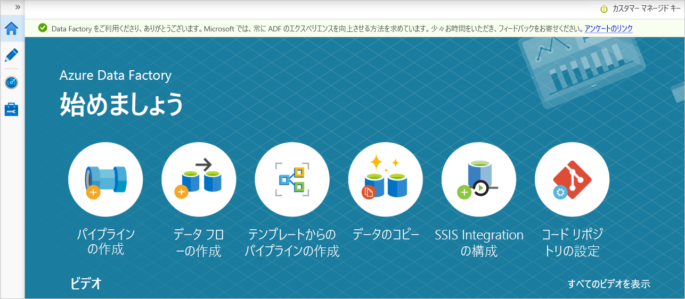

# データのコピー ツールを使用することにより、パーティション分割されたファイル名に基づく新しいファイルを増分コピーする

このチュートリアルでは、Azure Portal を使用してデータ ファクトリを作成します。 次に、時間でパーティション分割されたファイル名に基づく新しいファイルを Azure Blob Storage から Azure Blob Storage に増分コピーするパイプラインを、データのコピー ツールを使用して作成します。 

> [!NOTE]
> Azure Data Factory を初めて使用する場合は、「[Azure Data Factory の概要](introduction.md)」を参照してください。

このチュートリアルでは、以下の手順を実行します。

> [!div class="checklist"]
> * データ ファクトリを作成します。
> * データのコピー ツールを使用してパイプラインを作成します。
> * パイプラインとアクティビティの実行を監視します。

## 前提条件

* **Azure サブスクリプション**:Azure サブスクリプションをお持ちでない場合は、開始する前に [無料アカウント](https://azure.microsoft.com/free/) を作成してください。
* **Azure ストレージ アカウント**:Blob Storage を "_ソース_" および "_シンク_" データ ストアとして使用します。 Azure ストレージ アカウントがない場合は、「[ストレージ アカウントの作成](../storage/common/storage-quickstart-create-account.md)」の手順をご覧ください。

### Blob ストレージに 2 つのコンテナーを作成する

次の手順を行って、チュートリアルで使用する Blob ストレージを準備します。

1. **source** という名前のコンテナーを作成します。  ご自分のコンテナー内に、フォルダー パスを **2019/02/26/14** として作成します。 空のテキスト ファイルを作成し、**file1.txt** という名前を付けます。 ご利用のストレージ アカウント内のフォルダー パス **source/2019/02/26/14** に file1.txt をアップロードします。  この作業は、[Azure Storage Explorer](https://storageexplorer.com/) をはじめとするさまざまなツールを使用して実行できます。
    
    ![[ファイルのアップロード]](./media/tutorial-incremental-copy-partitioned-file-name-copy-data-tool/upload-file.png)
    
    > [!NOTE]
    > フォルダー名は、UTC 時間に合わせて調整してください。  たとえば、現在の UTC 時間が 2019 年 2 月 26 日、午後 2 時 03 分である場合は、**source/{Year}/{Month}/{Day}/{Hour}/** のルールに従って、**source/2019/02/26/14/** というフォルダー パスを作成できます。

2. **destination** という名前のコンテナーを作成します。 この作業は、[Azure Storage Explorer](https://storageexplorer.com/) をはじめとするさまざまなツールを使用して実行できます。

## Data Factory の作成

1. 左側のメニューで、 **[リソースの作成]**  >  **[データ + 分析]**  >  **[Data Factory]** の順に選択します。 
   
   ![[新規] ウィンドウでの [Data Factory] の選択](./media/doc-common-process/new-azure-data-factory-menu.png)

2. **[新しいデータ ファクトリ]** ページで、 **[名前]** に「**ADFTutorialDataFactory**」と入力します。 
    
    データ ファクトリの名前は "_グローバルに一意_" にする必要があります。 次のエラー メッセージが表示される場合があります。
   
   ![[新しいデータ ファクトリ] のエラー メッセージ](./media/doc-common-process/name-not-available-error.png)
   
   データ ファクトリの名前の値に関するエラー メッセージが表示された場合は、別の名前を入力してください。 たとえば、 _**yourname**_ **ADFTutorialDataFactory** という名前を使用します。 Data Factory アーティファクトの名前付け規則については、[Data Factory の名前付け規則](naming-rules.md)に関するページを参照してください。
3. 新しいデータ ファクトリの作成先となる Azure **サブスクリプション**を選択します。 
4. **[リソース グループ]** で、次の手順のいずれかを行います。
     
    a. **[Use existing (既存のものを使用)]** を選択し、ドロップダウン リストから既存のリソース グループを選択します。

    b. **[新規作成]** を選択し、リソース グループの名前を入力します。 
         
    リソース グループの詳細については、[リソース グループを使用した Azure のリソースの管理](../azure-resource-manager/resource-group-overview.md)に関するページを参照してください。

5. **[バージョン]** で、バージョンとして **[V2]** を選択します。
6. **[場所]** で、データ ファクトリの場所を選択します。 サポートされている場所のみがドロップダウン リストに表示されます。 データ ファクトリによって使用されるデータ ストア (Azure Storage、SQL Database など) やコンピューティング (Azure HDInsight など) は、他の場所やリージョンに存在していてもかまいません。
7. **[ダッシュボードにピン留めする]** をオンにします。 
8. **作成** を選択します。
9. ダッシュボードの **[Deploying Data Factory]\(データ ファクトリをデプロイしています\)** タイルに処理の状態が表示されます。

    ![[Deploying data factory]\(データ ファクトリをデプロイしています\) タイル](media/tutorial-copy-data-tool/deploying-data-factory.png)
10. 作成が完了すると、 **[Data Factory]** ホーム ページが表示されます。
   
    
11. 別のタブで Azure Data Factory ユーザー インターフェイス (UI) を起動するには、 **[Author & Monitor]\(作成と監視\)** タイルを選択します。 

## データのコピー ツールを使用してパイプラインを作成する

1. **[Let's get started]\(始めましょう\)** ページで、 **[データのコピー]** タイルを選択してデータのコピー ツールを起動します。 

   
   
2. **[プロパティ]** ページで、次の手順を行います。

    a. **[タスク名]** に「**DeltaCopyFromBlobPipeline**」と入力します。

    b. **[Task cadence or Task schedule]\(タスクの周期またはスケジュール\)** で、 **[Run regularly on schedule]\(スケジュールに従って定期的に実行する\)** を選択します。

    c. **[Trigger type]\(トリガーの種類\)** で、 **[Tumbling Window]\(タンブリング ウィンドウ\)** を選択します。
    
    d. **[Recurrence]\(繰り返し\)** で、**1 時間**と指定します。 
    
    e. **[次へ]** を選択します。 
    
    指定したタスク名のパイプラインが Data Factory UI によって作成されます。 

    ![[プロパティ] ページ](./media/tutorial-incremental-copy-partitioned-file-name-copy-data-tool/copy-data-tool-properties-page.png)
3. **[ソース データ ストア]** ページで、次の手順を実行します。

    a. **[+ 新しい接続の作成]** をクリックして、接続を追加します。

    ![[ソース データ ストア] ページ](./media/tutorial-incremental-copy-partitioned-file-name-copy-data-tool/source-data-store-page.png)
    
    b. ギャラリーから **[Azure Blob Storage]** を選択して、 **[続行]** をクリックします。

    ![[ソース データ ストア] ページ](./media/tutorial-incremental-copy-partitioned-file-name-copy-data-tool/source-data-store-page-select-blob.png)
    
    c. **[New Linked Service]\(新しいリンクされたサービス\)** ページで、 **[ストレージ アカウント名]** ボックスの一覧からストレージ アカウントを選択して、 **[完了]** をクリックします。
    
    ![[ソース データ ストア] ページ](./media/tutorial-incremental-copy-partitioned-file-name-copy-data-tool/source-data-store-page-linkedservice.png)
    
    d. 新しく作成したリンクされたサービスを選択して、 **[次へ]** をクリックします。 
    
   ![[ソース データ ストア] ページ](./media/tutorial-incremental-copy-partitioned-file-name-copy-data-tool/source-data-store-page-select-linkedservice.png)
4. **[Choose the input file or folder]\(入力ファイルまたはフォルダーの選択\)** ページで、次の手順を行います。
    
    a. **source** コンテナーを選択してから、 **[選択]** を選択します。
    
    ![[Choose the input file or folder]\(入力ファイルまたはフォルダーの選択\)](./media/tutorial-incremental-copy-partitioned-file-name-copy-data-tool/choose-input-file-folder.png)
    
    b. **[File loading behavior]\(ファイル読み込み動作\)** で、 **[Incremental load: time-partitioned folder/file names]\(段階的に読み込み: 時間でパーティション分割されたフォルダー/ファイル名\)** を選択します。
    
    ![[Choose the input file or folder]\(入力ファイルまたはフォルダーの選択\)](./media/tutorial-incremental-copy-partitioned-file-name-copy-data-tool/choose-loading-behavior.png)
    
    c. 動的フォルダー パスを **source/{year}/{month}/{day}/{hour}/** のルールに従って作成し、形式を次のように変更します。
    
    ![[Choose the input file or folder]\(入力ファイルまたはフォルダーの選択\)](./media/tutorial-incremental-copy-partitioned-file-name-copy-data-tool/input-file-name.png)
    
    d. **[Binary copy]\(バイナリ コピー\)** をオンにして、 **[次へ]** をクリックします。
    
    ![[Choose the input file or folder]\(入力ファイルまたはフォルダーの選択\)](./media/tutorial-incremental-copy-partitioned-file-name-copy-data-tool/check-binary-copy.png)     
5. **[Destination data store]\(コピー先データ ストア\)** ページで、データ コピー元ストアと同じストレージ アカウントである **AzureBlobStorage** を選択し、 **[次へ]** をクリックします。

    ![[Destination data store]\(コピー先データ ストア\) ページ](./media/tutorial-incremental-copy-partitioned-file-name-copy-data-tool/destination-data-store-page-select-linkedservice.png) 
6. **[Choose the output file or folder]\(出力ファイルまたはフォルダーの選択\)** ページで、次の手順を行います。
    
    a. **destination** フォルダーを参照して選択し、 **[選択]** をクリックします。
    
       
    
    b. 動的フォルダー パスを **source/{year}/{month}/{day}/{hour}/** のルールに従って作成し、形式を次のように変更します。
    
        
    
    c. **[次へ]** をクリックします。
    
      
7. **[設定]** ページで **[次へ]** を選択します。 

    ![[設定] ページ](./media/tutorial-incremental-copy-partitioned-file-name-copy-data-tool/settings-page.png)  
8. **[サマリー]** ページで設定を確認し、 **[次へ]** を選択します。

    
    
9. **[Deployment]\(デプロイ\)** ページで **[監視]** を選択してパイプライン (タスク) を監視します。
    ![[Deployment]\(デプロイ\) ページ](./media/tutorial-incremental-copy-partitioned-file-name-copy-data-tool/deployment-page.png)
    
10. 左側の **[監視]** タブが自動的に選択されたことがわかります。  パイプラインの実行が自動的にトリガーされるまで待機する必要があります (約 1 時間後)。  それが実行されると、 **[アクション]** 列には、アクティビティの実行の詳細を表示するリンクとパイプラインを再実行するリンクが表示されます。 **[更新]** を選択して一覧を更新し、 **[Actions]\(アクション\)** 列で **[View Activity Runs]\(アクティビティの実行の表示\)** リンクを選択します。 

    
11. パイプライン内のアクティビティ (コピー アクティビティ) は 1 つだけなので、エントリは 1 つのみです。 ソース ファイル (file1.txt) が **source/2019/02/26/14** から **destination/2019/02/26/14/** に同じファイル名でコピーされたことがわかります。  

    
    
    Azure Storage Explorer (https://storageexplorer.com/) ) を使用してファイルをスキャンしても、同じことを確認できます。
    
    
12. 別の空のテキスト ファイルを作成し、**file2.txt** という新しい名前を付けます。 ご利用のストレージ アカウント内のフォルダー パス **source/2019/02/26/15** にファイル file2.txt をアップロードします。   この作業は、[Azure Storage Explorer](https://storageexplorer.com/) をはじめとするさまざまなツールを使用して実行できます。   
    
    
    
    > [!NOTE]
    > 新しいフォルダー パスを作成する必要がないか注意してください。 フォルダー名は、UTC 時間に合わせて調整してください。  たとえば、現在の UTC 時間が 2019 年 2 月 26 日、午後 3 時 20 分である場合は、**source/{Year}/{Month}/{Day}/{Hour}/** のルールに従って、**source/2019/02/26/15/** というフォルダー パスを作成できます。
    
13. **[Pipeline Runs]\(パイプライン実行\)** ビューに戻るには、 **[All Pipelines Runs]\(すべてのパイプライン実行\)** を選択し、もう 1 時間経過してから同じパイプラインが再び自動的にトリガーされるまで待ちます。  

    

14. 2 つ目のパイプライン実行が表示されたらその **[View Activity Run]\(アクティビティ実行の表示\)** を選択し、同じことを行って詳細を確認します。  

    
    
    ソース ファイル (file2.txt) が **source/2019/02/26/15** から **destination/2019/02/26/15/** に同じファイル名でコピーされたことがわかります。
    
     
    
    Azure Storage Explorer (https://storageexplorer.com/) ) を使用して **destination** コンテナー内でファイルをスキャンしても、同じことを確認できます。
    
    

    
## 次の手順
次のチュートリアルに進み、Azure 上の Spark クラスターを使ってデータを変換する方法について学習しましょう。

> [!div class="nextstepaction"]
>[クラウド内の Spark クラスターを使用してデータを変換する](tutorial-transform-data-spark-portal.md)