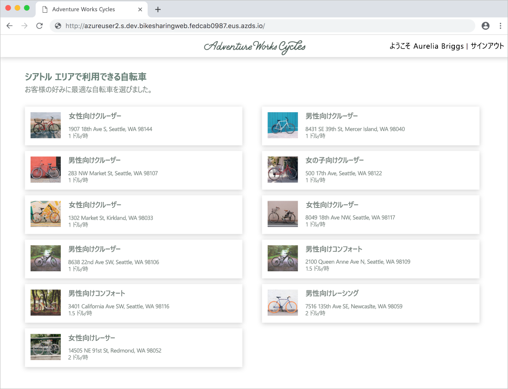

# <a name="quickstart-team-development-on-kubernetes---azure-dev-spaces"></a>クイック スタート:Kubernetes 上でのチーム開発 - Azure Dev Spaces

このガイドでは、以下の方法について説明します。

- Azure のマネージド Kubernetes クラスターで Azure Dev Spaces をセットアップする。
- 複数のマイクロサービスを伴う大規模アプリケーションを開発空間にデプロイする。
- 完全なアプリケーションのコンテキスト内の分離開発空間で単一のマイクロサービスをテストする。


## <a name="prerequisites"></a>前提条件

- Azure サブスクリプション。 Azure サブスクリプションをお持ちでない場合は、[無料のアカウント](https://azure.microsoft.com/free)を作成できます。
- [Azure CLI がインストールされていること](/cli/azure/install-azure-cli?view=azure-cli-latest)。
- [Helm 3 がインストールされていること][helm-installed]。

## <a name="create-an-azure-kubernetes-service-cluster"></a>Azure Kubernetes Service クラスターを作成する

[サポートされているリージョン][supported-regions]で AKS クラスターを作成する必要があります。 下記のコマンドを使用すると、*MyResourceGroup* というリソース グループと *MyAKS* という AKS クラスターが作成されます。

```cmd
az group create --name MyResourceGroup --location eastus
az aks create -g MyResourceGroup -n MyAKS --location eastus --disable-rbac --generate-ssh-keys
```

## <a name="enable-azure-dev-spaces-on-your-aks-cluster"></a>AKS クラスターで Azure Dev Spaces を有効にする

`use-dev-spaces` コマンドを使用して AKS クラスターで Dev Spaces を有効にし、プロンプトに従います。 下記のコマンドを使用すると、*MyResourceGroup* グループ内の *MyAKS* クラスターで Dev Spaces が有効になり、*dev* という開発空間が作成されます。

> [!NOTE]
> この `use-dev-spaces` コマンドでは、Azure Dev Spaces CLI がまだインストールされていない場合にはこれもインストールされます。 Azure Dev Spaces CLI を Azure Cloud Shell にインストールすることはできません。

```cmd
az aks use-dev-spaces -g MyResourceGroup -n MyAKS --space dev --yes
```

## <a name="get-sample-application-code"></a>サンプル アプリケーション コードを取得する

この記事では、[Azure Dev Spaces 自転車シェア サンプル アプリケーション](https://github.com/Azure/dev-spaces/tree/master/samples/BikeSharingApp)を使用して、Azure Dev Spaces の使い方のデモを行います。

GitHub からアプリケーションを複製して、そのディレクトリに移動します。

```cmd
git clone https://github.com/Azure/dev-spaces
cd dev-spaces/samples/BikeSharingApp/
```

## <a name="retrieve-the-hostsuffix-for-dev"></a>*dev* の HostSuffix を取得する

`azds show-context` コマンドを使用して *dev* の HostSuffix を表示します。

```cmd
$ azds show-context

Name                ResourceGroup     DevSpace  HostSuffix
------------------  ----------------  --------  -----------------------
MyAKS               MyResourceGroup   dev       fedcab0987.eus.azds.io
```

## <a name="update-the-helm-chart-with-your-hostsuffix"></a>HostSuffix で Helm Chart を更新する

[charts/values.yaml](https://github.com/Azure/dev-spaces/blob/master/samples/BikeSharingApp/charts/values.yaml) を開き、`<REPLACE_ME_WITH_HOST_SUFFIX>` のすべてのインスタンスを以前に取得した HostSuffix 値に置き換えます。 変更を保存し、ファイルを閉じます。

## <a name="run-the-sample-application-in-kubernetes"></a>Kubernetes でサンプル アプリケーションを実行する

Kubernetes でサンプル アプリケーションを実行するためのコマンドは、既存のプロセスの一部であり、Azure Dev Spaces ツールへの依存関係はありません。 この場合、Helm が、このサンプル アプリケーションを実行するために使用されるツールですが、クラスター内の名前空間でアプリケーション全体を実行するために他のツールを使用することも可能です。 Helm コマンドは、以前に作成した *dev* という開発空間を対象としていますが、この開発空間は Kubernetes 名前空間でもあります。 その結果、開発空間は、他の名前空間と同様に他のツールの対象になることがあります。

デプロイに使用したツールとは無関係に、アプリケーションがクラスターで実行した後でチーム開発に Azure Dev Spaces を使用できます。

`helm install` コマンドを使用して、クラスター上でサンプル アプリケーションをセットアップしインストールします。

```cmd
cd charts/
helm install bikesharingsampleappsampleapp . --dependency-update --namespace dev --atomic
```

`helm install` コマンドは、完了までに数分かかる場合があります。 サンプル アプリケーションをクラスターにインストールした後で、クラスターで Dev Spaces を有効にして以来、`azds list-uris` コマンドを使用して、現在選択されている *dev* 内のサンプル アプリケーションの URL を表示します。

```cmd
$ azds list-uris
Uri                                                 Status
--------------------------------------------------  ---------
http://dev.bikesharingweb.fedcab0987.eus.azds.io/  Available
http://dev.gateway.fedcab0987.eus.azds.io/         Available
```

`azds list-uris` コマンドからパブリック URL を開いて、*bikesharingweb* サービスに移動します。 上記の例では、*bikesharingweb* サービスのパブリック URL は `http://dev.bikesharingweb.fedcab0987.eus.azds.io/` です。 ユーザーとして *Aurelia Briggs (顧客)* を選択します。 最上部に「*ようこそ Aurelia Briggs | サインアウト*」のテキストが表示されていることを確認します。



## <a name="create-child-dev-spaces"></a>子開発空間を作成する

`azds space select` コマンドを使用して、*dev* の下に 2 つの子空間を作成します。

```cmd
azds space select -n dev/azureuser1 -y
azds space select -n dev/azureuser2 -y
```

上記のコマンドは、*dev* の下に *azureuser1* および *azureuser2* という名前の 2 つの子空間を作成します。 これら 2 つの子空間は、サンプル アプリケーションに変更を加えるために使用する、開発者の *azureuser1* および *azureuser2* 用の個別の開発空間を表します。

`azds space list` コマンドを使用して、すべての開発空間を一覧表示し、*dev/azureuser2* が選択されていることを確認します。

```cmd
$ azds space list
   Name            DevSpacesEnabled
-  --------------  ----------------
   default         False
   dev             True
   dev/azureuser1  True
*  dev/azureuser2  True
```

`azds list-uris` を使用して、現在選択されている空間 (*dev/azureuser2*) 内のサンプル アプリケーションの URL を表示します。

```cmd
$ azds list-uris
Uri                                                             Status
--------------------------------------------------              ---------
http://azureuser2.s.dev.bikesharingweb.fedcab0987.eus.azds.io/  Available
http://azureuser2.s.dev.gateway.fedcab0987.eus.azds.io/         Available
```

`azds list-uris` コマンドで表示される URL に *azureuser2.s.dev* のプレフィックスが付いていることを確認します。 このプレフィックスがあれば、選択されている現在の空間が、*dev* の子である *azureuser2* であると確認できます。

`azds list-uris` コマンドからパブリック URL を開いて、*dev/azureuser2* 開発空間の *bikesharingweb* サービスに移動します。 上記の例では、*bikesharingweb* サービスのパブリック URL は `http://azureuser2.s.dev.bikesharingweb.fedcab0987.eus.azds.io/` です。 ユーザーとして *Aurelia Briggs (顧客)* を選択します。 最上部に「*ようこそ Aurelia Briggs | サインアウト*」のテキストが表示されていることを確認します。

## <a name="update-code"></a>コードの更新

テキスト エディターで *BikeSharingWeb/components/Header.js* を開き、[`userSignOut` className を持つ span 要素](https://github.com/Azure/dev-spaces/blob/master/samples/BikeSharingApp/BikeSharingWeb/components/Header.js#L16)内のテキストを変更します。

```html
<span className="userSignOut">
    <Link href="/devsignin"><span tabIndex="0">Welcome {props.userName} | Sign out</span></Link>
</span>
```

変更を保存し、ファイルを閉じます。

## <a name="build-and-run-the-updated-bikesharingweb-service-in-the-devazureuser2-dev-space"></a>*dev/azureuser2* 開発空間で、更新された bikesharingweb サービスをビルドして実行する

*BikeSharingWeb/* に移動し、`azds up` コマンドを実行します。

```cmd
$ cd ../BikeSharingWeb/
$ azds up

Using dev space 'dev/azureuser2' with target 'MyAKS'
Synchronizing files...2s
...
Service 'bikesharingweb' port 'http' is available at http://azureuser2.s.dev.bikesharingweb.fedcab0987.eus.azds.io/
Service 'bikesharingweb' port 80 (http) is available at http://localhost:54256
...
```

このコマンドは、*dev/azureuser2* 開発空間で、*bikesharingweb* サービスをビルドして実行します。 このサービスは、*dev* で実行している *bikesharingweb* サービスに加えて実行し、*azureuser2.s* URL プレフィックスを持つ要求にのみ使用されます。 親開発空間と子開発空間との間でどのようにルーティングが行われるかの詳細については、「[Azure Dev Spaces のしくみと構成方法](how-dev-spaces-works.md)」を参照してください。

`azds up` コマンドの出力に表示されているパブリック URL を開いて、*dev/azureuser2* 開発空間の *bikesharingweb* サービスに移動します。 ユーザーとして *Aurelia Briggs (顧客)* を選択します。 更新されたテキストが右上隅に表示されていることを確認します。 この変更がすぐに表示されない場合は、ページを更新するか、ブラウザーのキャッシュをクリアする必要があります。


> [!NOTE]
> `azds up` の実行中にサービスに移動すると、`azds up` コマンドの出力に HTTP 要求のトレースも表示されます。 それらのトレースを、サービスのトラブルシューティングやデバッグに活かすことができます。 トレースは、`azds up` の実行時に `--disable-http-traces` を使用して無効にできます。

## <a name="verify-other-dev-spaces-are-unchanged"></a>その他の開発空間が変更されていないことを確認する

`azds up` コマンドがまだ実行している場合、*Ctrl + C* キーを押します。

```cmd
$ azds list-uris --all
Uri                                                             Status
--------------------------------------------------              ---------
http://azureuser1.s.dev.bikesharingweb.fedcab0987.eus.azds.io/  Available
http://azureuser1.s.dev.gateway.fedcab0987.eus.azds.io/         Available
http://azureuser2.s.dev.bikesharingweb.fedcab0987.eus.azds.io/  Available
http://azureuser2.s.dev.gateway.fedcab0987.eus.azds.io/         Available
http://dev.bikesharingweb.fedcab0987.eus.azds.io/               Available
http://dev.gateway.fedcab0987.eus.azds.io/                      Available
```

ブラウザーで *dev* バージョンの *bikesharingweb* に移動し、*Aurelia Briggs (顧客)* をユーザーとして選択し、右上隅に元のテキストが表示されていることを確認します。 *dev/azureuser1* URL を使用してこれらの手順を繰り返します。 変更は、*dev/azureuser2* バージョンの *bikesharingweb* にのみ適用されることに注意してください。 このように変更を *dev/azureuser2* に分離することにより、*azureuser2* は *azureuser1* に影響することなく変更を加えられます。

これらの変更を *dev* および *dev/azureuser1* で反映させるには、チームの既存のワークフローまたは CI/CD パイプラインに従う必要があります。 たとえば、このワークフローには、バージョン管理システムに対する変更のコミットと、CI/CD パイプラインまたは Helm などのツールを使用した更新のデプロイが含まれることがあります。

## <a name="clean-up-your-azure-resources"></a>Azure リソースをクリーンアップする

```cmd
az group delete --name MyResourceGroup --yes --no-wait
```

## <a name="next-steps"></a>次のステップ

Azure Dev Spaces を使用して複数のコンテナーにまたがるより複雑なアプリを開発する方法と、別の空間で別のバージョンまたは分岐を使用して作業することによって共同開発を簡略化する方法について学習します。

> [!div class="nextstepaction"]
> [複数のコンテナーの操作とチーム開発](multi-service-nodejs.md)

[helm-installed]: https://helm.sh/docs/intro/install/
[supported-regions]: https://azure.microsoft.com/global-infrastructure/services/?products=kubernetes-service
