# <a name="quickstart-create-a-hybrid-mode-instance-with-azure-portal--azure-database-migration-service"></a>クイック スタート:Azure portal と Azure Database Migration Service を使用してハイブリッド モード インスタンスを作成する

Azure Database Migration Service のハイブリッド モードを使うと、オンプレミスでホストされている移行 worker と、クラウドで実行されている Azure Database Migration Service のインスタンスを併用して、データベースの以降を管理できます。 ハイブリッド モードは、オンプレミス ネットワークと Azure の間にサイト間接続がないシナリオで、またはサイト間接続の帯域幅が限られている場合に、特に便利です。

>[!NOTE]
>現在、ハイブリッド モードで動作する Azure Database Migration Service は、次のデータベースへの SQL Server 移行をサポートします。
>
>- Azure SQL Database Managed Instance。ダウンタイムはほぼゼロです (オンライン)。
>- Azure SQL Database 単一データベース。多少のダウンタイムを伴います (オフライン)。
>- MongoDb から Azure CosmosDB。ダウンタイムはほぼゼロです (オンライン)。
>- MongoDb から Azure CosmosDB。多少のダウンタイムを伴います (オフライン)。

このクイックスタートでは、Azure portal を使用してハイブリッド モードで Azure Database Migration Service のインスタンスを作成します。 その後、オンプレミス ネットワークにハイブリッド worker をダウンロードしてインストールし、設定します。 プレビューの間は、Azure Database Migration Service のハイブリッド モードを使用して、SQL Server のオンプレミスのインスタンスから Azure SQL Database に、データを移行できます。

> [!NOTE]
> Azure Database Migration Service ハイブリッド インストーラーは、Microsoft Windows Server 2012 R2、Window Server 2016、Windows Server 2019、Windows 10 で動作します。

> [!IMPORTANT]
> Azure Database Migration Service ハイブリッド インストーラーには .NET 4.7.2 以降が必要です。 最新バージョンの .NET については、「[.NET Framework のダウンロード](https://dotnet.microsoft.com/download/dotnet-framework)」ページで確認してください。

Azure サブスクリプションをお持ちでない場合は、開始する前に[無料](https://azure.microsoft.com/free/)アカウントを作成してください。

## <a name="sign-in-to-the-azure-portal"></a>Azure portal にサインインする

Web ブラウザーを開いて [Microsoft Azure Portal](https://portal.azure.com/) にアクセスし、資格情報を入力して Portal にサインインします。

既定のビューはサービス ダッシュボードです。

## <a name="register-the-resource-provider"></a>リソース プロバイダーの登録

Azure Database Migration Service の最初のインスタンスを作成する前に、Microsoft.DataMigration リソース プロバイダーを登録します。

1. Azure portal で **[サブスクリプション]** を選択し、Azure Database Migration Service のインスタンスを作成するサブスクリプションを選択して、 **[リソース プロバイダー]** を選択します。

    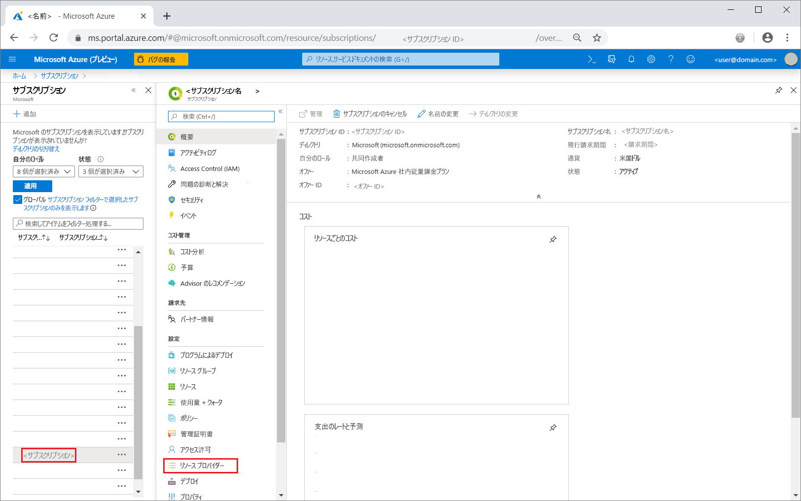

2. 移行を検索し、**Microsoft.DataMigration** の右側にある **[登録]** を選択します。

    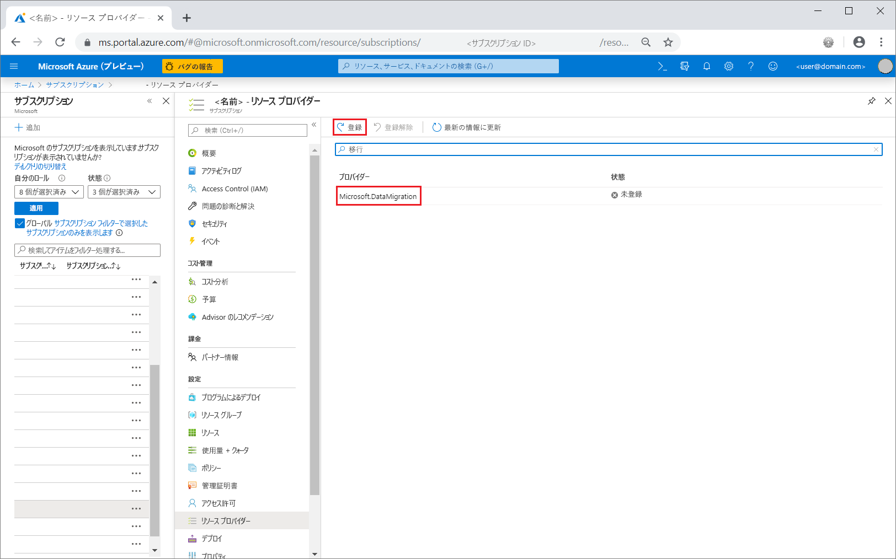

## <a name="create-an-instance-of-the-service"></a>サービスのインスタンスを作成します。

1. **[+ リソースの作成]** を選択して、Azure Database Migration Service のインスタンスを作成します。

2. Marketplace で "migration" を検索し、 **[Azure Database Migration Service]** を選択します。 **[Azure Database Migration Service]** 画面で **[作成]** を選択します。

3. **[移行サービスの作成]** 画面で:

    - Azure Database Migration Service のインスタンスを識別する、覚えやすい一意の**サービス名**を選択します。
    - インスタンスを作成する Azure **サブスクリプション**を選択します。
    - 既存の**リソース グループ**を選択するか、新しいリソース グループを作成します。
    - ソースまたはターゲット サーバーに最も近い **[場所]** を選択します。
    - **[サービス モード]** では、 **[ハイブリッド (プレビュー)]** を選択します。

           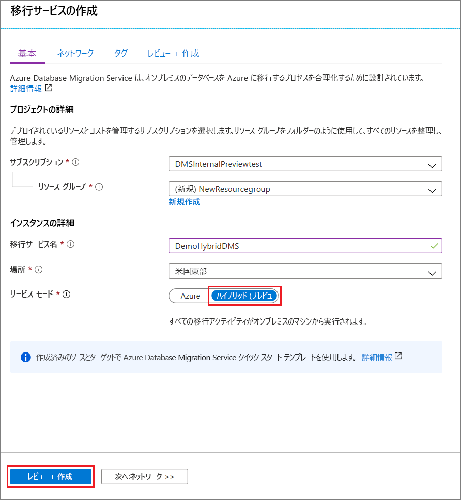

4. **[Review + create]\(レビュー + 作成\)** を選択します。

5. **[確認および作成]** タブで、使用条件を確認し、表示されるその他の情報を確認してから、 **[作成]** を選択します。

    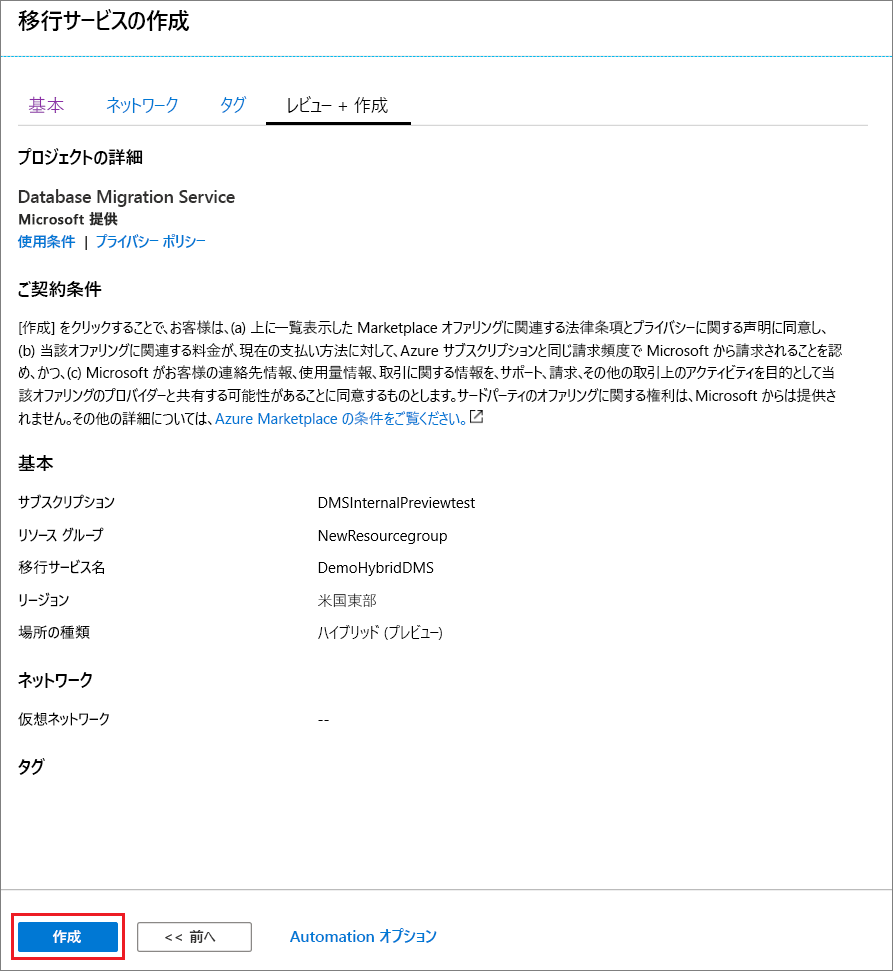

    しばらくすると、ハイブリッド モードの Azure Database Migration Service のインスタンスが作成され、使用できるようになります。 Azure Database Migration Service のインスタンスは、次の図のように表示されます。

    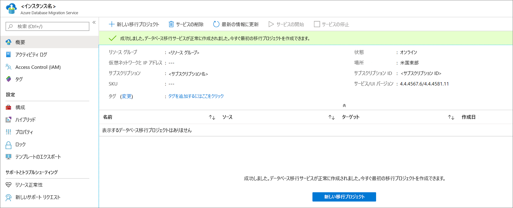

6. サービスが作成されたら、 **[プロパティ]** を選択し、 **[リソース ID]** ボックスに表示されている値をコピーします。この値を使用して、Azure Database Migration Service のハイブリッド worker をインストールします。

    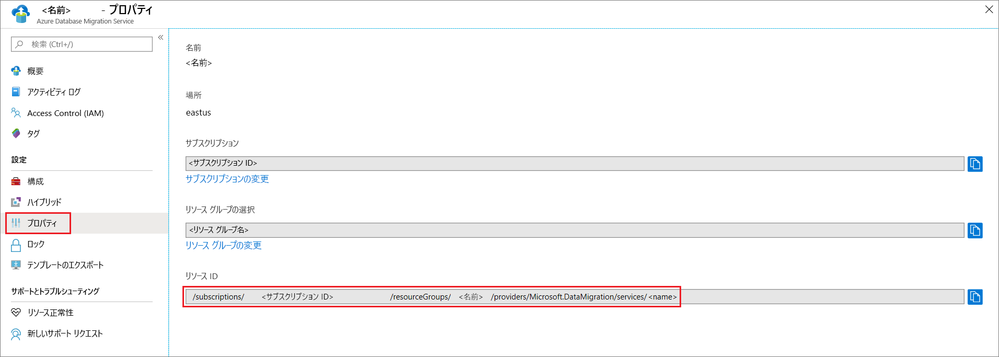

## <a name="create-azure-app-registration-id"></a>Azure アプリの登録 ID を作成する

オンプレミスのハイブリッド worker がクラウド内の Azure Database Migration Service と通信するために使用できる Azure アプリ登録 ID を作成する必要があります。

1. Azure portal で、 **[Azure Active Directory]** 、 **[アプリの登録]** 、 **[新しい登録]** の順に選択します。
2. アプリケーションの名前を指定してから、 **[サポートされているアカウントの種類]** でサポートするアカウントの種類を選択して、アプリケーションを使用できるユーザーを指定します。

    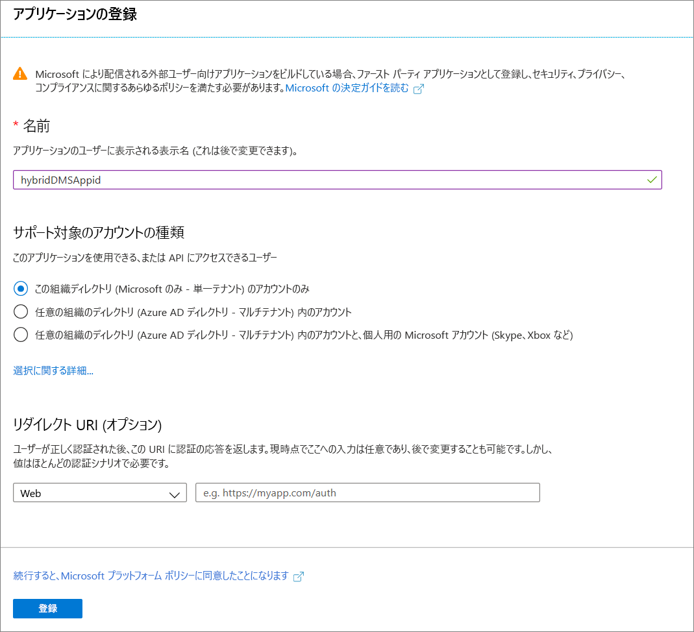

3. **[リダイレクト URI (省略可能)]** フィールドでは既定値を使用し、 **[登録]** を選択します。

4. アプリ ID の登録が完了したら、ハイブリッド worker のインストール時に使用するので、 **[アプリケーション (クライアント) ID]** を記録しておきます。

5. Azure portal で Azure Database Migration Service に移動し、 **[アクセス制御 (IAM)]** を選択した後、 **[ロールの割り当ての追加]** を選択して、アプリ ID に共同作成者のアクセス権を割り当てます。

    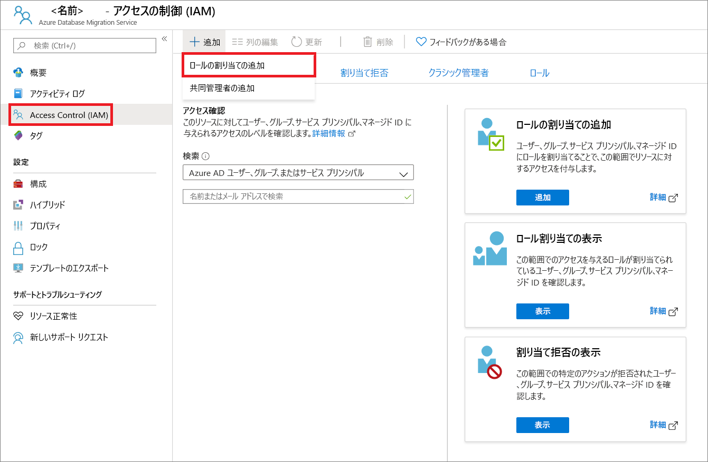

6. ロールとして **[共同作成者]** を選択し、 **[Azure AD のユーザー、グループ、サービス プリンシパル]** にアクセス権を割り当ててから、アプリ ID 名を選択します。

    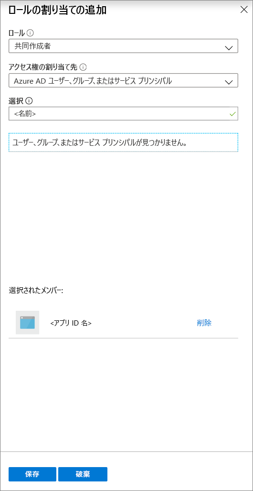

7. **[保存]** を選択して、Azure Database Migration Service リソースに対するアプリ ID のロールの割り当てを保存します。

## <a name="download-and-install-the-hybrid-worker"></a>ハイブリッド worker をダウンロードしてインストールする

1. Azure portal で、Azure Database Migration Service のお使いのインスタンスに移動します。

2. **[設定]** で **[ハイブリッド]** を選択し、 **[Installer download]\(インストーラーのダウンロード\)** を選択して、ハイブリッド worker をダウンロードします。

    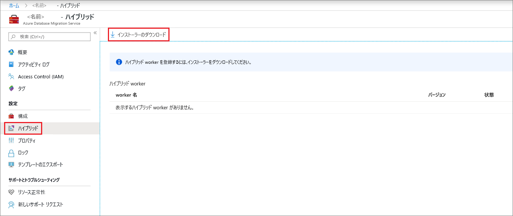

3. Azure Database Migration Service ハイブリッド worker をホストするサーバーで、ZIP ファイルを抽出します。

    > [!IMPORTANT]
    > Azure Database Migration Service ハイブリッド インストーラーには .NET 4.7.2 以降が必要です。 最新バージョンの .NET については、「[.NET Framework のダウンロード](https://dotnet.microsoft.com/download/dotnet-framework)」ページで確認してください。

4. インストール フォルダーで **dmsSettings.json** ファイルを見つけて開き、**ApplicationId** と **resourceId** を指定して、ファイルを保存します。

    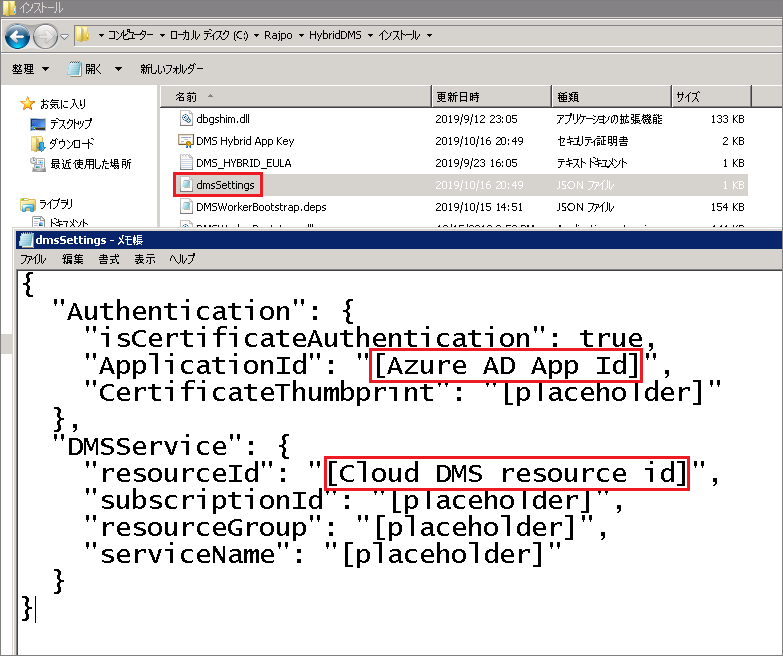

5. 次のコマンドを使用して、ハイブリッド worker からの通信の認証を行うために Azure Database Migration Service で使用できる証明書を生成します。

    ```
    <drive>:\<folder>\Install>DMSWorkerBootstrap.exe -a GenerateCert
    ```

    証明書は Install フォルダーに生成されます。

    

6. Azure portal でアプリ ID に移動し、 **[管理]** で **[証明書とシークレット]** を選択した後、 **[証明書のアップロード]** を選択して、生成した公開証明書を選択します。

    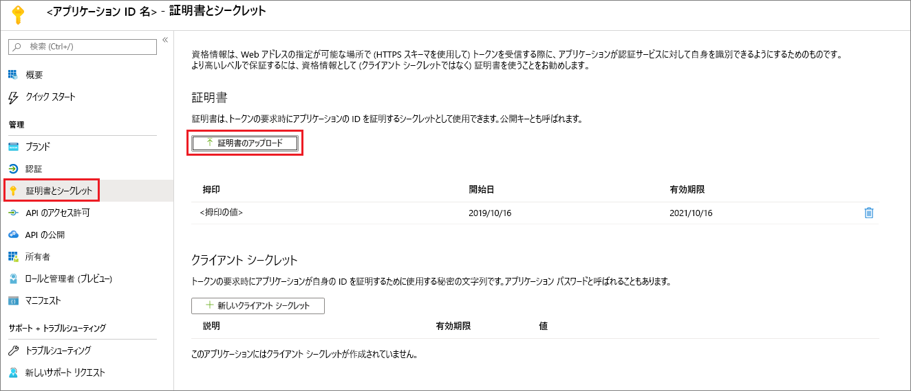

7. 次のコマンドを実行して、オンプレミスのサーバーに Azure Database Migration Service ハイブリッド worker をインストールします。

    ```
    <drive>:\<folder>\Install>DMSWorkerBootstrap.exe -a Install -IAcceptDMSLicenseTerms
    ```

    > [!NOTE]
    > インストール コマンドを実行するときに、次のパラメーターを使用することもできます。
    >
    > - **-TelemetryOptOut** - worker からのテレメトリの送信を停止します。ただし、最小限のログは引き続きローカルで記録されます。  インストーラーからも引き続きテレメトリが送信されます。
    > - **-p {InstallLocation}** - インストール パスを変更できます (既定では "C:\Program Files\DatabaseMigrationServiceHybrid")。

8. インストーラーがエラーなしで実行されると、Azure Database Migration Service でサービスがオンライン状態として表示され、データベースを移行できる状態になります。

    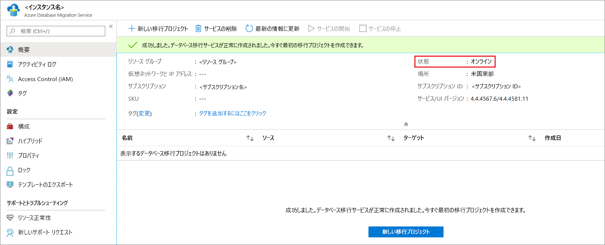

## <a name="uninstall-azure-database-migration-service-hybrid-mode"></a>Azure Database Migration Service のハイブリッド モードをアンインストールする

現状では、Azure Database Migration Service ハイブリッド モードのアンインストールは、オンプレミス サーバー上の Azure Database Migration Service ハイブリッド worker インストーラーで、次のコマンドを使用することによってのみ、サポートされています。

```
<drive>:\<folder>\Install>DMSWorkerBootstrap.exe -a uninstall
```

> [!NOTE]
> アンインストール コマンドを実行するときに、"-ReuseCert" パラメーターを使用することもできます。このパラメーターを使用すると、generateCert ワークフローによって生成された AdApp 証明書が維持されます。  過去に生成してアップロードした証明書をそのまま使用することができます。

## <a name="set-up-the-azure-database-migration-service-hybrid-worker-using-powershell"></a>PowerShell を使用して Azure Database Migration Service ハイブリッド worker を設定する

Azure Database Migration Service のハイブリッド worker のインストール手段は Azure portal だけではありません。[PowerShell スクリプト](https://techcommunity.microsoft.com/gxcuf89792/attachments/gxcuf89792/MicrosoftDataMigration/119/1/DMS_Hybrid_Script.zip)も用意されています。ハイブリッド モードで Azure Database Migration Service の新しいインスタンスを作成した後、そのスクリプトを使用して worker のインストール手順を自動化することができます。 スクリプト:

1. 新しい AdApp を作成します。
2. インストーラーをダウンロードします。
3. generateCert ワークフローを実行します。
4. 証明書をアップロードします。
5. AdApp を共同作成者として Azure Database Migration Service インスタンスに追加します。
6. インストール ワークフローを実行します。

このスクリプトは、必要なすべてのアクセス許可がユーザーの環境に既に存在する状況での、簡単なプロトタイプ作成を意図したものです。 実際の運用環境では、AdApp と Cert とで要件が異なる場合があるため、スクリプトの実行に失敗することがあります。

> [!IMPORTANT]
> このスクリプトは、Azure Database Migration Service のハイブリッド モードのインスタンスが既に存在すること、また、AdApps をテナントに作成したり、サブスクリプションの RBAC に変更を加えたりするためのアクセス許可が、ご利用の Azure アカウントにあることを前提としています。

スクリプトの先頭にパラメーターを入力し、管理者権限の PowerShell インスタンスからスクリプトを実行してください。

## <a name="next-steps"></a>次のステップ

> [!div class="nextstepaction"]
> [SQL Server を Azure SQL Database マネージド インスタンスにオンラインで移行する](tutorial-sql-server-managed-instance-online.md)
> [SQL Server を Azure SQL Database の単一データベースまたはプールされたデータベースにオフラインで移行する](tutorial-sql-server-to-azure-sql.md)
