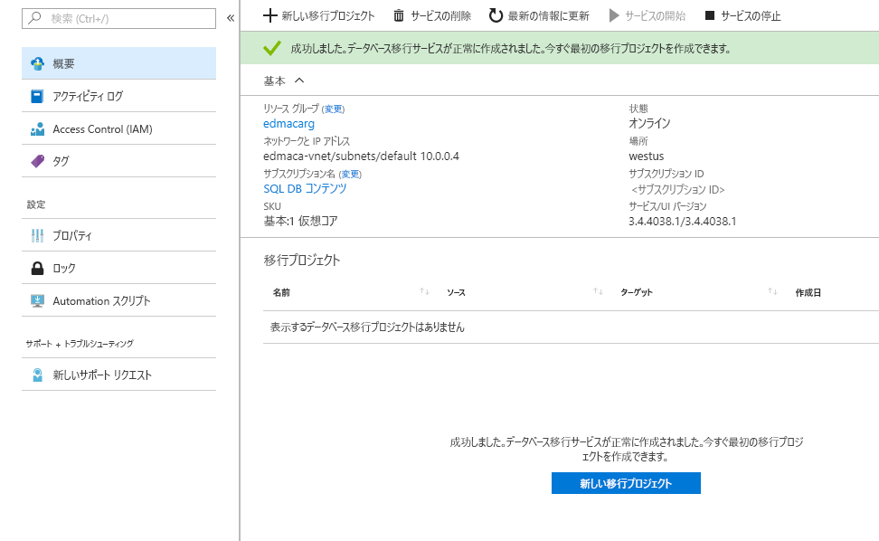

# クイック スタート:Azure Portal を使用して Azure Database Migration Service のインスタンスを作成する

このクイック スタートでは、Azure portal を使用して Azure Database Migration Service のインスタンスを作成します。  インスタンスを作成したら、それを使用して SQL Server から Azure SQL Database にデータを移行できます。

Azure サブスクリプションをお持ちでない場合は、開始する前に[無料](https://azure.microsoft.com/free/)アカウントを作成してください。

## Azure portal にサインインする

Web ブラウザーを開いて [Microsoft Azure Portal](https://portal.azure.com/) にアクセスし、資格情報を入力して Portal にサインインします。

既定のビューはサービス ダッシュボードです。

## リソース プロバイダーの登録

Database Migration Service の最初のインスタンスを作成する前に、Microsoft.DataMigration リソース プロバイダーを登録します。

1. Azure Portal で、 **[すべてのサービス]** を選択してから、 **[サブスクリプション]** を選択します。

2. Azure Database Migration Service のインスタンスを作成するサブスクリプションを選択してから、 **[リソース プロバイダー]** を選びます。

3. 移行を検索し、**Microsoft.DataMigration** の右側にある **[登録]** を選択します。

    

## サービスのインスタンスを作成します。

1. **[+ リソースの作成]** を選択して、Azure Database Migration Service のインスタンスを作成します。

2. マーケットプレースで "migration" を検索し、 **[Azure Database Migration Service]** を選択します。 **[Azure Database Migration Service]** 画面で **[作成]** を選択します。

3. **[移行サービスの作成]** 画面で:

    - Azure Database Migration Service のインスタンスを識別する、覚えやすい一意の**サービス名**を選択します。
    - インスタンスを作成する Azure **サブスクリプション**を選択します。
    - 既存の**リソース グループ**を選択するか、新しいリソース グループを作成します。
    - ソースまたはターゲット サーバーに最も近い **[場所]** を選択します。
    - 既存の**仮想ネットワーク**を選択するか、新たに作成します。

        仮想ネットワークによって、ソース データベースとターゲット環境へのアクセスが Azure Database Migration Service に提供されます。

        Azure portal で仮想ネットワークを作成する方法の詳細については、[Azure portal を使用した仮想ネットワークの作成](https://aka.ms/vnet)に関する記事を参照してください。

    - [Basic:1 vCore]\(Basic: 1 仮想コア\) を **[価格レベル]** で選択します。

        

4. **［作成］** を選択します

    しばらくすると、Azure Database Migration Service のインスタンスが作成され、使用できるようになります。 Azure Database Migration Service は、次の図のように表示されます。

    

## リソースをクリーンアップする

このクイック スタートで作成したリソースは、[Azure リソース グループ](../azure-resource-manager/management/overview.md)を削除することでクリーンアップできます。 リソース グループを削除するには、作成した Azure Database Migration Service のインスタンスに移動します。 **リソース グループ**名を選択し、 **[リソース グループの削除]** を選択します。 この操作により、リソース グループ内のすべての資産だけでなく、グループ自体も削除されます。

## 次のステップ

> [!div class="nextstepaction"]
> [SQL Server の Azure SQL Database への移行](tutorial-sql-server-to-azure-sql.md)
