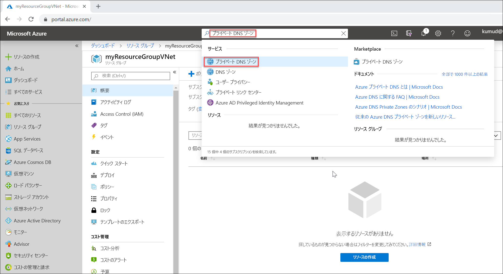

# <a name="quickstart-create-an-azure-private-dns-zone-using-the-azure-portal"></a>クイック スタート:Azure portal を使用して Azure プライベート DNS ゾーンを作成する

このクイックスタートでは、Azure portal を使用して最初のプライベート DNS ゾーンとレコードを作成する手順について説明します。

DNS ゾーンは、特定のドメインの DNS レコードをホストするために使用されます。 Azure DNS でドメインのホストを開始するには、そのドメイン名用に DNS ゾーンを作成する必要があります。 ドメインの DNS レコードはすべて、この DNS ゾーン内に作成されます。 仮想ネットワークにプライベート DNS ゾーンを発行するには、そのゾーン内のレコードを解決することが認められた仮想ネットワークの一覧を指定します。  これらを "*リンクされている*" 仮想ネットワーク と呼びます。 また、自動登録を有効にすると、仮想マシンの作成または削除、あるいはその IP アドレスの変更を行うたびに、Azure DNS でそのゾーン レコードも更新されます。

このクイックスタートでは、次の方法について説明します。

> [!div class="checklist"]
> * プライベート DNS ゾーンの作成
> * 仮想ネットワークの作成
> * 仮想ネットワークのリンク
> * テスト用仮想マシンの作成
> * 追加の DNS レコードの作成
> * プライベート ゾーンのテスト

Azure サブスクリプションがない場合は、開始する前に[無料アカウント](https://azure.microsoft.com/free/?WT.mc_id=A261C142F)を作成してください。

好みに応じて、[Azure PowerShell](private-dns-getstarted-powershell.md) または [Azure CLI](private-dns-getstarted-cli.md) を使用してこのクイックスタートの手順を実行することもできます。

## <a name="create-a-private-dns-zone"></a>プライベート DNS ゾーンの作成

次の例では、**MyAzureResourceGroup** というリソース グループに **private.contoso.com** という DNS ゾーンを作成します。

DNS ゾーンにはドメインの DNS エントリが含まれています。 Azure DNS でドメインのホストを開始するには、そのドメイン名用に DNS ゾーンを作成します。



1. ポータル検索バーの検索テキスト ボックスに「**プライベート DNS ゾーン**」と入力し、**Enter** キーを押します。
1. **[プライベート DNS ゾーン]** を選択します。
2. **[Create private dns zone]\(プライベート DNS ゾーンの作成\)** を選択します。

1. **[Create Private DNS zone]\(プライベート DNS ゾーンの作成\)** ページで、以下の値を入力または選択します。

   - **[リソース グループ]** : **[新規作成]** を選択し、「*MyAzureResourceGroup*」と入力して、 **[OK]** を選択します。 Azure サブスクリプション内で一意となるリソース グループ名を使用してください。 
   -  **Name**:この例では、「*private.contoso.com*」と入力します。
1. **[リソース グループの場所]** には **[米国中西部]** を選択します。

1. **[確認および作成]** を選択します。

1. **作成** を選択します。

ゾーンの作成には数分かかることがあります。

## <a name="create-a-virtual-network"></a>仮想ネットワークの作成

1. ポータル ページの左上で、 **[リソースの作成]** 、 **[ネットワーク]** 、 **[仮想ネットワーク]** の順に選択します。
2. **[名前]** に「**myAzureVNet**」と入力します。
3. **[リソース グループ]** では、 **[MyAzureResourceGroup]** を選択します。
4. **[場所]** には **[米国中西部]** を選択します。
5. その他は既定値のままにして **[作成]** を選択します。

## <a name="link-the-virtual-network"></a>仮想ネットワークのリンク

プライベート DNS ゾーンを仮想ネットワークにリンクさせるには、仮想ネットワーク リンクを作成します。


1. **MyAzureResourceGroup** リソース グループを開き、**private.contoso.com** プライベート ゾーンを選択します。
2. 左側のウィンドウで、 **[Virtual network links]\(仮想ネットワーク リンク\)** を選択します。
3. **[追加]** を選択します。
4. **[リンク名]** に「**myLink**」と入力します。
5. **[仮想ネットワーク]** で **[myAzureVNet]** を選択します。
6. **[Enable auto registration]\(自動登録を有効にする\)** チェック ボックスをオンにします。
7. **[OK]** を選択します。

## <a name="create-the-test-virtual-machines"></a>テスト用仮想マシンの作成

次に、プライベート DNS ゾーンをテストできるように 2 つの仮想マシンを作成します。

1. ポータル ページの左上で **[リソースの作成]** を選択し、 **[Windows Server 2016 Datacenter]** を選択します。
1. リソース グループに **[MyAzureResourceGroup]** を選択します。
1. 仮想マシンの名前には「**myVM01**」と入力します。
1. **[リージョン]** に **[米国中西部]** を選択します。
1. 管理者のユーザー名には、「**azureadmin**」と入力します。
2. パスワードとして「**Azure12345678**」を入力し、確認のためにもう一度パスワードを入力します。

5. **[パブリック受信ポート]** で **[選択したポートを許可する]** を選択し、 **[受信ポートを選択]** で **[RDP (3389)]** を選択します。
10. そのページの他の値は既定のままとし、 **[Next: Disks >]\(次へ: ディスク >\)** をクリックします。
11. **[ディスク]** ページは既定値のままとし、 **[Next: Networking >]\(次へ: ネットワーク >\)** をクリックします。
1. 仮想ネットワークに **[myAzureVNet]** が選択されていることを確認します。
1. そのページの他の値は既定のままとし、 **[Next: Management >]\(次へ: 管理 >\)** をクリックします。
2. **[ブート診断]** に **[オフ]** を選択します。その他は既定値のままとし、 **[Review + create]\(確認と作成\)** を選択します。
1. 設定を確認し、 **[作成]** をクリックします。

これらの手順を繰り返して、**myVM02** という名前の別の仮想マシンを作成します。

両方の仮想マシンが完成するまでに数分かかります。

## <a name="create-an-additional-dns-record"></a>追加の DNS レコードの作成

 次の例では、リソース グループ **MyAzureResourceGroup** の DNS ゾーン **private.contoso.com** に、相対名が **db** のレコードを作成します。 レコード セットの完全修飾名は、**db.private.contoso.com** になります。 レコードの種類は "A" で、IP アドレスは **myVM01** です。

1. **MyAzureResourceGroup** リソース グループを開き、**private.contoso.com** プライベート ゾーンを選択します。
2. **+ [レコード セット]** を選択します。
3. **[名前]** に「**db**」と入力します。
4. 表示されている **myVM01** の IP アドレスを **[IP アドレス]** に入力します。 仮想マシンが起動されたときに、これが自動的に登録されることが必要です。
5. **[OK]** を選択します。

## <a name="test-the-private-zone"></a>プライベート ゾーンのテスト

これで、**private.contoso.com** プライベート ゾーンでの名前解決をテストできます。

### <a name="configure-vms-to-allow-inbound-icmp"></a>受信 ICMP を許可するように VM を構成する

名前解決は ping コマンドを使用してテストできます。 そこで、両方の仮想マシン上のファイアウォールを、受信 ICMP パケットを許可するように構成します。

1. myVM01 に接続し、管理者特権で Windows PowerShell ウィンドウを開きます。
2. 次のコマンドを実行します。

   ```powershell
   New-NetFirewallRule –DisplayName "Allow ICMPv4-In" –Protocol ICMPv4
   ```

MyVM02 についても同じ手順を繰り返します。

### <a name="ping-the-vms-by-name"></a>VM を名前で ping する

1. myVM02 の Windows PowerShell コマンド プロンプトから、自動的に登録されたホスト名を使用して myVM01 を ping します。
   ```
   ping myVM01.private.contoso.com
   ```
   次のような出力が表示されます。
   ```
   PS C:\> ping myvm01.private.contoso.com

   Pinging myvm01.private.contoso.com [10.2.0.4] with 32 bytes of data:
   Reply from 10.2.0.4: bytes=32 time<1ms TTL=128
   Reply from 10.2.0.4: bytes=32 time=1ms TTL=128
   Reply from 10.2.0.4: bytes=32 time<1ms TTL=128
   Reply from 10.2.0.4: bytes=32 time<1ms TTL=128

   Ping statistics for 10.2.0.4:
       Packets: Sent = 4, Received = 4, Lost = 0 (0% loss),
   Approximate round trip times in milli-seconds:
       Minimum = 0ms, Maximum = 1ms, Average = 0ms
   PS C:\>
   ```
2. 次に、前に作成した **db** 名を ping します。
   ```
   ping db.private.contoso.com
   ```
   次のような出力が表示されます。
   ```
   PS C:\> ping db.private.contoso.com

   Pinging db.private.contoso.com [10.2.0.4] with 32 bytes of data:
   Reply from 10.2.0.4: bytes=32 time<1ms TTL=128
   Reply from 10.2.0.4: bytes=32 time<1ms TTL=128
   Reply from 10.2.0.4: bytes=32 time<1ms TTL=128
   Reply from 10.2.0.4: bytes=32 time<1ms TTL=128

   Ping statistics for 10.2.0.4:
       Packets: Sent = 4, Received = 4, Lost = 0 (0% loss),
   Approximate round trip times in milli-seconds:
       Minimum = 0ms, Maximum = 0ms, Average = 0ms
   PS C:\>
   ```

## <a name="delete-all-resources"></a>すべてのリソースの削除

このクイックスタートで作成したリソースが不要になったときに削除するには、**MyAzureResourceGroup** リソース グループを削除します。


## <a name="next-steps"></a>次の手順

> [!div class="nextstepaction"]
> [Azure DNS Private Zones のシナリオ](private-dns-scenarios.md)

