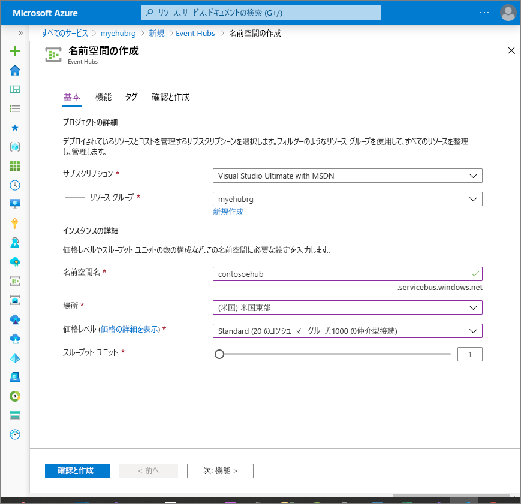
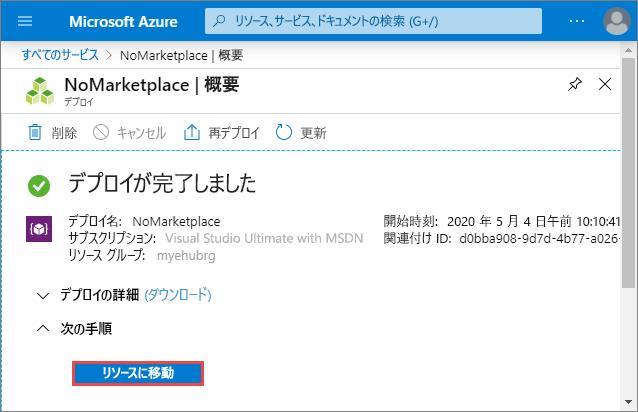
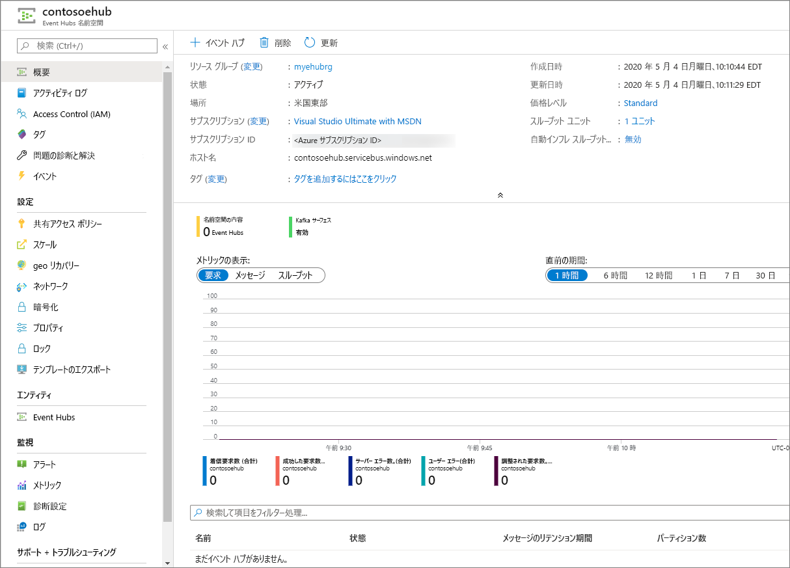

# クイック スタート:Azure portal を使用したイベント ハブの作成
Azure Event Hubs はビッグ データ ストリーミング プラットフォームであり、毎秒数百万のイベントを受け取って処理できるイベント インジェスト サービスです。 Event Hubs では、分散されたソフトウェアやデバイスから生成されるイベント、データ、またはテレメトリを処理および格納できます。 イベント ハブに送信されたデータは、任意のリアルタイム分析プロバイダーやバッチ処理/ストレージ アダプターを使用して、変換および保存できます。 Event Hubs の詳しい概要については、[Event Hubs の概要](event-hubs-about.md)と [Event Hubs の機能](event-hubs-features.md)に関するページをご覧ください。

このクイック スタートでは、[Azure portal](https://portal.azure.com) を使用してイベント ハブを作成します。

## 前提条件

このクイック スタートを実行するには、以下が必要です。

- Azure のサブスクリプション。 お持ちでない場合は、開始する前に[無料アカウントを作成](https://azure.microsoft.com/free/)してください。
- [Visual Studio 2019)](https://www.visualstudio.com/vs) 以降
- [.NET Standard SDK](https://www.microsoft.com/net/download/windows) バージョン 2.0 以降。

## リソース グループを作成する

リソース グループは、Azure リソースの論理的なコレクションです。 すべてのリソースのデプロイと管理はリソース グループで行われます。 リソース グループを作成するには:

1. [Azure portal](https://portal.azure.com) にサインインします。
2. 左側のナビゲーションで、 **[リソース グループ]** をクリックします。 **[追加]** をクリックします。

   ![リソース グループ - [追加] ボタン](./media/event-hubs-quickstart-portal/resource-groups1.png)

2. **[サブスクリプション]** で、リソース グループを作成したい Azure サブスクリプションの名前を選択します。
3. **リソース グループの一意の名前**を入力します。 現在選択されている Azure サブスクリプションでその名前を使用できるかどうかが、すぐに自動で確認されます。
4. リソース グループの**リージョン**を選択します。
5. **[確認および作成]** を選択します。

   
6. **[確認および作成]** ページで、 **[作成]** を選択します。 

## Event Hubs 名前空間を作成します

Event Hubs 名前空間は一意のスコープ コンテナーを提供します。このコンテナーは、1 つ以上のイベント ハブを作成する完全修飾ドメイン名によって参照されます。 ポータルを使用してリソース グループに名前空間を作成するには、以下の操作を実行します。

1. Azure portal で、画面の左上にある **[リソースの作成]** をクリックします。
2. 左側のメニューで **[すべてのサービス]** を選択し、 **[Analytics]** カテゴリの **[Event Hubs]** の横にある**星 (`*`)** を選択します。 左側のナビゲーション メニューの **[お気に入り]** に **[Event Hubs]** が追加されていることを確認します。 
    
   
3. 左側のナビゲーション メニューの **[お気に入り]** の下の **[Event Hubs]** を選択し、ツール バーの **[追加]** を選択します。

   ![[追加] ボタン](./media/event-hubs-quickstart-portal/event-hubs-add-toolbar.png)
4. **[名前空間の作成]** ページで、次の手順を実行します。
    1. 名前空間を作成する**サブスクリプション**を選択します。
    2. 前の手順で作成した**リソース グループ**を選択します。 
    3. 名前空間の**名前**を入力します。 その名前が使用できるかどうかがすぐに自動で確認されます。
    4. 名前空間の**場所**を選択します。    
    5. **価格レベル** (Basic または Standard) を選択します。  
    6. **[throughput units]\(スループット ユニット\)** 設定はそのままにしておきます。 スループット ユニットの詳細については、[Event Hubs のスケーラビリティ](event-hubs-scalability.md#throughput-units)に関するページを参照してください  
    5. ページの下部にある **[確認および作成]** を選択します。

       
   6. **[確認および作成]** ページで、設定を確認し、 **[作成]** を選択します。 デプロイが完了するまで待ちます。 

       ![[確認および作成] ページ](./media/event-hubs-quickstart-portal/review-create.png)
   7. **[デプロイ]** ページで、 **[リソースに移動]** を選択して、対象の名前空間のページに移動します。 

      
   8. 次の例のような **[Event Hubs 名前空間]** ページが表示されていることを確認します。 

              

       > [!NOTE]
       > Azure Event Hubs は、Kafka エンドポイントを提供します。 このエンドポイントにより、Event Hubs 名前空間で [Apache Kafka](https://kafka.apache.org/intro) メッセージ プロトコルと API をネイティブに認識することができます。 この機能を利用すれば、プロトコル クライアントを変更したり、独自のクラスターを実行したりすることなく、Kafka トピックの場合と同様に、イベント ハブと通信することができます。 Event Hubs は、[Apache Kafka バージョン 1.0](https://kafka.apache.org/10/documentation.html) 以降をサポートします。 詳細については、[Apache Kafka アプリケーションからの Event Hubs の使用](event-hubs-for-kafka-ecosystem-overview.md)に関するページを参照してください。
    
## イベント ハブの作成

名前空間内にイベント ハブを作成するには、以下の操作を実行します。

1. [Event Hubs 名前空間] ページで、左側のメニューから **[Event Hubs]** を選択します。
1. ウィンドウの上部にある **[+ イベント ハブ]** をクリックします。
   
    
1. イベント ハブの名前を入力し、 **[作成]** をクリックします。
   
    
4. アラートを通じてイベント ハブの作成状態を確認することができます。 次の図に示すように、作成されたイベント ハブがイベント ハブの一覧に表示されます。

    

## 次のステップ

この記事では、リソース グループ、Event Hubs 名前空間、イベント ハブを作成しました。 イベント ハブとの間でイベントを送信または受信するためのステップ バイ ステップの手順については、以下の**イベントの送受信**のチュートリアルを参照してください。 

- [.NET Core](get-started-dotnet-standard-send-v2.md)
- [Java](get-started-java-send-v2.md)
- [Python](get-started-python-send-v2.md)
- [JavaScript](get-started-java-send-v2.md)
- [Go](event-hubs-go-get-started-send.md)
- [C (送信のみ)](event-hubs-c-getstarted-send.md)
- [Apache Storm (受信のみ)](event-hubs-storm-getstarted-receive.md)

[Azure portal]: https://portal.azure.com/
[3]: ./media/event-hubs-quickstart-portal/sender1.png
[4]: ./media/event-hubs-quickstart-portal/receiver1.png
