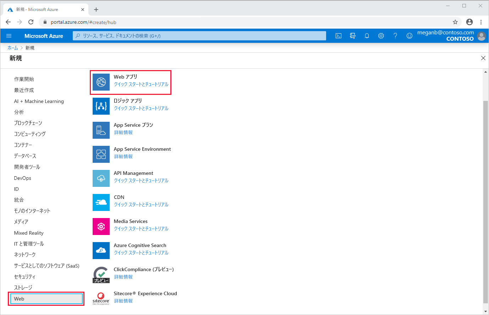
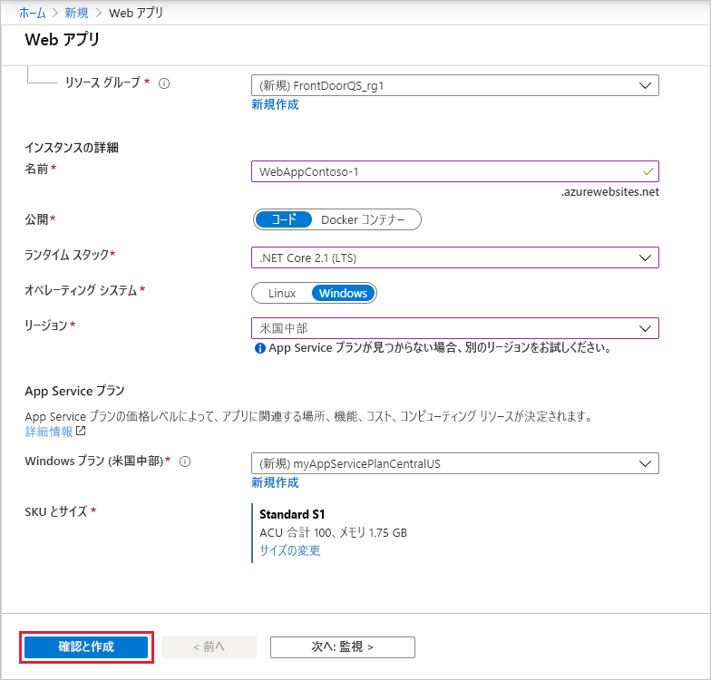
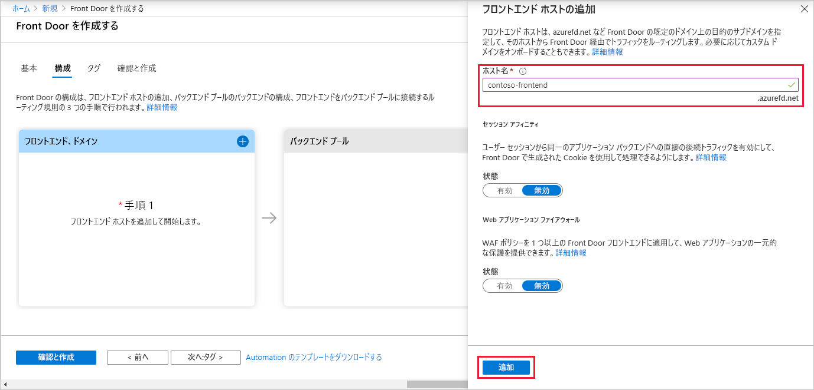
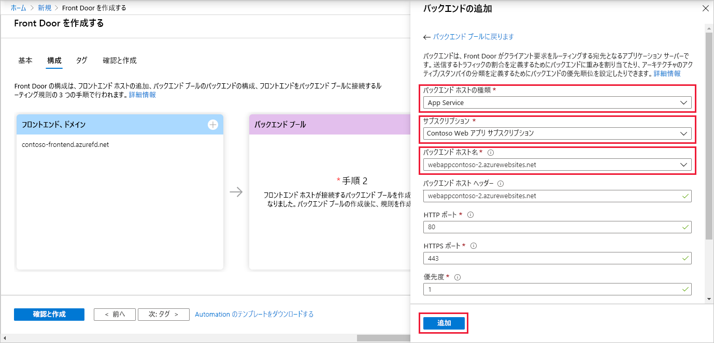
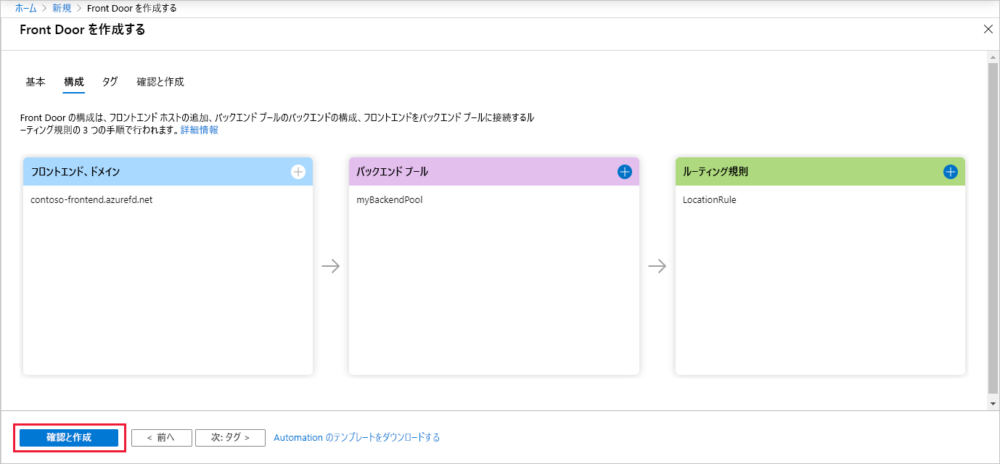

# クイック スタート:グローバル Web アプリケーションの高可用性を実現するフロント ドアを作成する

Azure portal で Azure Front Door を使用して Web アプリケーションの高可用性を設定してみましょう。

このクイックスタートでは、別々の Azure リージョンで実行される、Web アプリケーションの 2 つのインスタンスを Azure Front Door でプールします。 等しく重み付けされた同じ優先度のバックエンドに基づいて Front Door の構成を作成します。 この構成では、アプリケーションが実行されている最も近いサイトにトラフィックが誘導されます。 Web アプリケーションは、Azure Front Door によって絶えず監視されます。 最も近いサイトが利用できない状態になると、サービスによって、使用可能な次のサイトへの自動フェールオーバーが行われます。

## 前提条件

- アクティブなサブスクリプションが含まれる Azure アカウント。 [無料でアカウントを作成できます](https://azure.microsoft.com/free/?WT.mc_id=A261C142F)。

## Web アプリの 2 つのインスタンスを作成する

このクイックスタートには、別々の Azure リージョンで実行される、Web アプリケーションの 2 つのインスタンスが必要です。 どちらの Web アプリケーション インスタンスも "*アクティブ/アクティブ* " モードで実行されるため、トラフィックをどちらでも受け入れることができます。 この構成は、一方がフェールオーバーとして機能する "*アクティブ/スタンバイ*" 構成とは異なります。

まだ Web アプリがない場合は、次の手順に従ってサンプル Web アプリをセットアップしてください。

1. Azure Portal ( https://portal.azure.com ) にサインインします。

1. ホーム ページまたは Azure メニューから **[リソースの作成]** を選択します。

1. **[Web]**  >  **[Web アプリ]** の順に選択します。

   

1. **[Web アプリ]** で、使用する**サブスクリプション**を選択します。

1. **[リソース グループ]** には **[新規作成]** を選択します。 **[名前]** に「*FrontDoorQS_rg1*」と入力し、 **[OK]** を選択します。

1. **[インスタンスの詳細]** で、Web アプリの一意の**名前**を入力します。 この例では *WebAppContoso-1* を使用します。

1. **[ランタイム スタック]** を選択します (この例では *[.NET Core 2.1 (LTS)]* )。

1. リージョンを選択します ( *[米国中部]* など)。

1. **[Windows プラン]** で **[新規作成]** を選択します。 **[名前]** に「*myAppServicePlanCentralUS*」と入力し、 **[OK]** を選択します。

1. **[SKU とサイズ]** が **[Standard S1 100 total ACU, 1.75 GB memory]\(Standard S1 100 合計 ACU、1.75 GB メモリ\)** になっていることを確認します。

1. **[確認および作成]** を選択し、 **[概要]** を確認して、 **[作成]** を選択します。 デプロイが完了するまでに数分かかる場合があります。

   

デプロイが完了したら、もう 1 つ Web アプリを作成します。 次の値を除き、同じ手順と値を使用します。

| 設定          | 値     |
| ---              | ---  |
| **リソース グループ**   | **[新規]** を選択し、「*FrontDoorQS_rg2*」と入力します。 |
| **名前**             | Web アプリの一意の名前を入力します (この例では *WebAppContoso-2*)。  |
| **リージョン**           | 異なるリージョンを選択します (この例では *[米国中南部]* )。 |
| **App Service プラン** > **Windows プラン**         | **[新規]** を選択し、「*myAppServicePlanSouthCentralUS*」と入力して、 **[OK]** を選択します。 |

## アプリケーション用のフロント ドアを作成する

2 つの Web アプリ サーバーのうち待ち時間が短い方にユーザー トラフィックを誘導するように Azure Front Door を構成します。 最初に、Azure Front Door のフロントエンド ホストを追加します。

1. ホーム ページまたは Azure メニューから **[リソースの作成]** を選択します。 **[ネットワーク]**  >  **[フロント ドア]** を選択します。

1. **[フロント ドアを作成する]** で **[サブスクリプション]** を選択します。

1. **[リソース グループ]** で **[新規]** を選択し、「*FrontDoorQS_rg0*」と入力して **[OK]** を選択します。  代わりに既存のリソース グループを使用することもできます。

1. リソース グループを作成した場合は、 **[リソース グループの場所]** を選択し、 **[次へ: 構成]** を選択します。

1. **[Frontends/domains]\(フロントエンド/ドメイン\)** で、 **[+]** を選択して **[フロントエンド ホストの追加]** を開きます。

1. グローバルに一意のホスト名を **[ホスト名]** に入力します。 この例では、*contoso-frontend* を使用します。 **[追加]** を選択します。

   

次に、2 つの Web アプリを含んだバックエンド プールを作成します。

1. 引き続き **[フロント ドアを作成する]** の **[バックエンド プール]** で **[+]** を選択し、 **[バックエンド プールの追加]** を開きます。

1. **[名前]** に「*myBackendPool*」と入力します。

1. **[バックエンドの追加]** を選択します。 **[バックエンド ホストの種類]** で *[App Service]* を選択します。

1. ご利用のサブスクリプションを選択し、 **[バックエンド ホスト名]** から、作成した 1 つ目の Web アプリを選択します。 この例では、*WebAppContoso-1* という Web アプリが該当します。 **[追加]** を選択します。

1. もう一度 **[バックエンドの追加]** を選択します。 **[バックエンド ホストの種類]** で *[App Service]* を選択します。

1. ご利用のサブスクリプションをもう一度選択し、作成した 2 つ目の Web アプリを **[バックエンド ホスト名]** から選択します。 **[追加]** を選択します。

   

最後に、ルーティング規則を追加します。 フロントエンド ホストは、ルーティング規則によってバックエンド プールにマップされます。 この規則によって、`contoso-frontend.azurefd.net` への要求が **myBackendPool** に転送されます。

1. 引き続き **[フロント ドアを作成する]** の **[ルーティング規則]** で **[+]** を選択し、ルーティング規則を構成します。

1. **[規則を追加する]** の **[名前]** に「*LocationRule*」と入力します。 すべて既定値のままにし、 **[追加]** を選択してルーティング規則を追加します。

   >[!WARNING]
   > Front Door 内の各フロントエンド ホストに、既定のパス (`\*`) が関連付けられたルーティング規則があることを確認する**必要があります**。 つまり、すべてのルーティング規則について、既定のパス (`\*`) で定義された各フロントエンド ホストに対するルーティング規則が少なくとも 1 つは存在する必要があります。 そうなっていないと、エンド ユーザーのトラフィックが正しくルーティングされない可能性があります。

1. **[確認および作成]** 、 **[作成]** の順に選択します。

   

## Azure Front Door の動作を確認する

フロント ドアを作成した後、グローバルに構成がデプロイされるまでに数分かかります。 完了したら、作成したフロントエンド ホストにアクセスします。 ブラウザーで `contoso-frontend.azurefd.net` にアクセスしてください。 要求は、バックエンド プール内の指定されたサーバーの中から、自分に最も近いサーバーに自動的にルーティングされます。

それらのアプリをこのクイックスタートで作成した場合は、情報ページが表示されます。

即時グローバル フェールオーバーの動作をテストするために、次の手順を試してみましょう。

1. 前述したように、ブラウザーを開き、フロントエンド アドレス (`contoso-frontend.azurefd.net`) にアクセスします。

1. Azure portal で、*App Services* を検索して選択します。 下へスクロールして、いずれかの Web アプリを探します (この例では **WebAppContoso-1**)。

1. Web アプリを選択し、 **[停止]** 、 **[はい]** の順に選択して確認します。

1. ブラウザーを最新の情報に更新します。 同じ情報ページが表示されるはずです。

   >[!TIP]
   >これらの操作では、わずかな待ち時間が発生します。 場合によっては、再度、最新の情報に更新する必要があります。

1. もう一方の Web アプリを探し、同様に停止します。

1. ブラウザーを最新の情報に更新します。 今回はエラー メッセージが表示されます。

   

## リソースをクリーンアップする

作業が完了したら、作成した項目はすべて削除してかまいません。 リソース グループを削除すると、その内容も削除されます。 このフロント ドアを使用する予定がない場合は、不要な料金が発生しないようリソースを削除してください。

1. Azure portal で **[リソース グループ]** を探して選択するか、Azure portal のメニューから **[リソース グループ]** を選択します。

1. フィルターを使用するか、下へスクロールしてリソース グループを探します (**FrontDoorQS_rg0** など)。

1. リソース グループを選択し、 **[リソース グループの削除]** を選択します。

   >[!WARNING]
   >このアクションは元に戻すことができません。

1. リソース グループの名前を入力して確認し、 **[削除]** を選択します。

他の 2 つのグループについても手順を繰り返します。

## 次のステップ

次の記事に進んで、フロント ドアにカスタム ドメインを追加する方法を学習してください。
> [!div class="nextstepaction"]
> [カスタム ドメインの追加](front-door-custom-domain.md)
