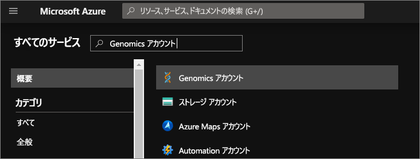
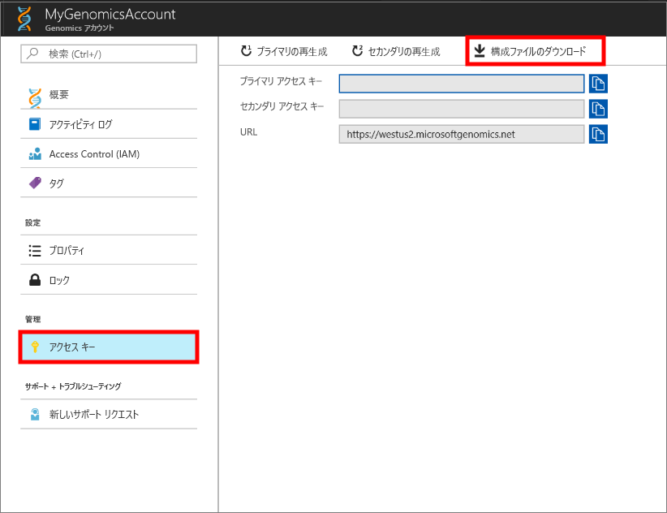
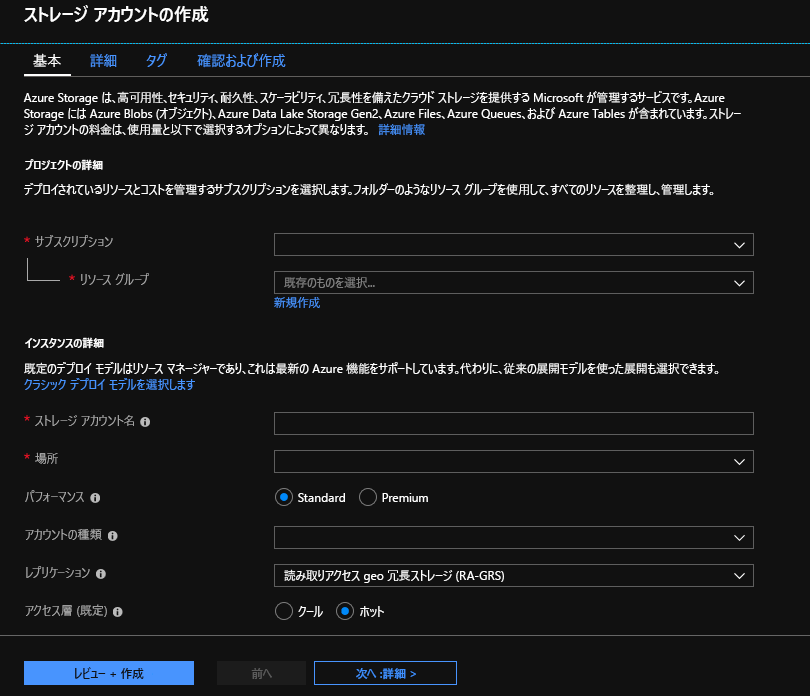

# <a name="quickstart-run-a-workflow-through-the-microsoft-genomics-service"></a>クイック スタート:Microsoft Genomics サービス経由でワークフローを実行する

このクイックスタートでは、Azure Blob Storage アカウントに入力データをアップロードし、Python Genomics クライアントを使用して、Microsoft Genomics サービスでワークフローを実行します。 Microsoft Genomics は、Raw 読み取りから始まり、アライメントされたリードの作成およびバリアント呼び出しなどのゲノムを迅速に処理できる二次解析のための、スケーラブルでセキュリティに保護されたサービスです。 

## <a name="prerequisites"></a>前提条件

- アクティブなサブスクリプションが含まれる Azure アカウント。 [無料でアカウントを作成できます](https://azure.microsoft.com/free/?ref=microsoft.com&utm_source=microsoft.com&utm_medium=docs&utm_campaign=visualstudio)。 
- [Python 2.7.12 以上](https://www.python.org/downloads/release/python-2714/)が `pip` と共にインストールされ、システム パスに `python` が追加されていること。 Microsoft Genomics クライアントは、Python 3 とは互換性がありません。 

## <a name="set-up-create-a-microsoft-genomics-account-in-the-azure-portal"></a>設定: Azure portal で Microsoft Genomics アカウントを作成する

Microsoft Genomics アカウントを作成するには、Azure portal の [[Create a Genomics account]\(Genomics アカウントの作成\)](https://portal.azure.com/#create/Microsoft.Genomics) に移動します。 Azure サブスクリプションをまだお持ちでない場合は、Microsoft Genomics アカウントを作成する前に、サブスクリプションを作成してください。 


以下の情報を使用して、上記の画像に示したように Genomics アカウントを構成します。 

 |**設定**          |  **推奨値**  | **フィールドの説明** |
 |:-------------       |:-------------         |:----------            |
 |サブスクリプション         | お使いのサブスクリプション名|これは、Azure サービスの課金単位です。サブスクリプションの詳細については、[サブスクリプション](https://account.azure.com/Subscriptions)に関するページをご覧ください。 |      
 |Resource group       | MyResourceGroup       |  リソース グループを使用すると、複数の Azure リソース (Storage アカウント、Genomics アカウントなど) を1 つのグループにまとめて、管理を簡単にできます。 詳細については、「[リソース グループ](https://docs.microsoft.com/azure/azure-resource-manager/resource-group-overview#resource-groups)」を参照してください。 有効なリソース グループ名については、「[名前付け規則](/azure/architecture/best-practices/resource-naming)」をご覧ください。 |
 |アカウント名         | MyGenomicsAccount     |一意のアカウント識別子を選択します。 有効な名前については、「[名前付け規則](/azure/architecture/best-practices/resource-naming)」をご覧ください。 |
 |場所                   | 米国西部 2                    |    サービスは、米国西部 2、西ヨーロッパ、および東南アジアで利用可能です。 |

最上部のメニュー バーにある **[通知]** を選択すると、デプロイ プロセスを監視できます。


Microsoft Genomics の詳細については、「[Microsoft Genomics とは](overview-what-is-genomics.md)」を参照してください。

## <a name="set-up-install-the-microsoft-genomics-python-client"></a>設定: Microsoft Genomics Python クライアントをインストールする

ローカル環境に Python と Microsoft Genomics Python クライアントの両方をインストールする必要があります。 

### <a name="install-python"></a>Python のインストール

Microsoft Genomics Python クライアントは、Python 2.7.12 以降の 2.7.xx バージョンと互換性があります。 バージョン 2.7.14 を推奨します。 ダウンロードは[こちら](https://www.python.org/downloads/release/python-2714/)で検索できます。 

> [!IMPORTANT]
> Python 3.x には Python 2.7.xx との互換性がありません。  MSGen は Python 2.7 アプリケーションです。 MSGen を実行するときは、アクティブな Python 環境で 2.7.xx バージョンの Python が使用されていることを確認してください。 3\.x バージョンの Python で MSGen を使用しようとすると、エラーが発生する可能性があります。

### <a name="install-the-microsoft-genomics-client"></a>Microsoft Genomics クライアントのインストール

Python `pip` を使用して Microsoft Genomics クライアントの `msgen` をインストールします。 次の手順では、Python が既にシステム パスにあることを前提としています。 `pip` のインストールが認識されない問題が生じた場合は、システム パスに Python とスクリプトのサブフォルダーを追加する必要があります。

```
pip install --upgrade --no-deps msgen
pip install msgen
```

`msgen` をシステム全体のバイナリとしてインストールしてシステム全体の Python パッケージに変更を加えることが好ましくない場合は、`pip` と共に `–-user` フラグを使用します。
パッケージ ベースのインストールまたは setup.py を使用すると、必要なすべての必須パッケージがインストールされます。 それ以外の場合は、以下に示す `msgen` 用の基本の必須パッケージがインストールされます。 

 * [Azure-storage](https://pypi.python.org/pypi/azure-storage) 
 * [Requests](https://pypi.python.org/pypi/requests) 

`pip` を使用して、`easy_install`または標準の `setup.py` プロシージャ経由で、これらのパッケージをインストールできます。 

### <a name="test-the-microsoft-genomics-client"></a>Microsoft Genomics クライアントのテスト
Microsoft Genomics クライアントをテストするには、お使いの Genomics アカウントから config ファイルをダウンロードします。 Azure portal の左上にある **[すべてのサービス]** を選択し、Genomics アカウントを検索、選択して、自分の Genomics アカウントに移動します。



先ほど作成した Genomics アカウントを選択して、 **[アクセス キー]** に移動し、構成ファイルをダウンロードします。



次のコマンドを使って、Microsoft Genomics Python クライアントが動作することをテストします。

```Python
msgen list -f "<full path where you saved the config file>"
```

## <a name="create-a-microsoft-azure-storage-account"></a>Microsoft Azure Storage アカウントを作成する 
Microsoft Genomics サービスでは、Azure Storage アカウントのブロック BLOB として、入力が格納されることを期待します。 また、Azure Storage アカウントにあるユーザー指定コンテナーに、出力ファイルをブロック BLOB として書き込みます。 入力と出力は、さまざまなストレージ アカウントに配置できます。
お使いのデータが既に Azure Storage アカウントにある場合、Genomics アカウントと同じ場所にそのデータを配置するだけでかまいません。 それ以外の場合は、Microsoft Genomics サービスを実行するときにエグレス料金が発生します。 まだ Azure Storage アカウントを持っていない場合は、アカウントを作成してデータをアップロードする必要があります。 ストレージ アカウントの概要やサービスの提供内容など、Azure Storage アカウントの詳細情報については、[こちら](https://docs.microsoft.com/azure/storage/common/storage-create-storage-account)から検索できます。 Azure Storage アカウントを作成するには、Azure portal の [[ストレージ アカウントの作成]](https://portal.azure.com/#create/Microsoft.StorageAccount-ARM) に移動します。  



以下の情報を使用して、上記の画像に示したようにストレージ アカウントを構成します。 アカウントが BlobStorage であり、汎用的な目的でないことだけを指定して、ストレージ アカウントの標準オプションのほとんどを使用します。 BLOB ストレージでは、ダウンロードおよびアップロードの 2 ～ 5倍の高速化が可能です。  既定のデプロイ モデルである Azure Resource Manager が推奨されます。  

 |**設定**          |  **推奨値**  | **フィールドの説明** |
 |:-------------------------       |:-------------         |:----------            |
 |サブスクリプション         | お使いの Azure サブスクリプション |サブスクリプションの詳細については、[サブスクリプション](https://account.azure.com/Subscriptions)に関するページをご覧ください。 |      
 |Resource group       | MyResourceGroup       |  お使いの Genomics アカウントと同じリソース グループを選択できます。 有効なリソース グループ名については、[名前付けルール](/azure/architecture/best-practices/resource-naming)に関するページを参照してください。 |
 |ストレージ アカウント名         | MyStorageAccount     |一意のアカウント識別子を選択します。 有効な名前については、[名前付けルール](/azure/architecture/best-practices/resource-naming)に関するページを参照してください。 |
 |場所                  | 米国西部 2                  | お使いの Genomics アカウントの場所と同じ場所を使用し、エグレス料金を削減すると共に待ち時間を短縮します。  | 
 |パフォーマンス                  | Standard                   | 既定値は Standard です。 Standard および Premium ストレージ アカウントの詳細については、[Microsoft Azure Storage の概要](https://docs.microsoft.com/azure/storage/common/storage-introduction)に関するページを参照してください。    |
 |アカウントの種類       | BlobStorage       |  BLOB ストレージでは、汎用的な目的の場合より、2 ～ 5 倍のダウンロードおよびアップロードの高速化が可能です。 |
 |レプリケーション                  | ローカル冗長ストレージ                  | ローカル冗長ストレージでは、お使いのストレージ アカウントが作成されたリージョンのデータセンター内に、データをレプリケートします。 詳細については、「[Azure Storage のレプリケーション](https://docs.microsoft.com/azure/storage/common/storage-redundancy)」をご覧ください。    |
 |アクセス層                  | ホット                   | ホット アクセスは、ストレージ アカウント内のオブジェクトへのアクセス頻度が高いことを示します。    |

次に、 **[確認および作成]** を選択してストレージ アカウントを作成します。 Genomics アカウントの作成時と同様に、最上部のメニュー バーにある **[通知]** を選択して、デプロイ プロセスを監視できます。 

## <a name="upload-input-data-to-your-storage-account"></a>入力データをストレージ アカウントにアップロードする

Microsoft Genomics サービスでは、入力ファイルとして paired end 読み取り (fastq または bam ファイル) が想定されています。 独自のデータをアップロードするか、またはユーザー向けに提供されている一般利用可能なサンプル データの使用を検討するかを選択できます。 一般利用可能なサンプル データを使用する場合は、以下でホストされます。

[https://msgensampledata.blob.core.windows.net/small/chr21_1.fq.gz](https://msgensampledata.blob.core.windows.net/small/chr21_1.fq.gz)
[https://msgensampledata.blob.core.windows.net/small/chr21_2.fq.gz](https://msgensampledata.blob.core.windows.net/small/chr21_2.fq.gz)

ストレージ アカウント内では、入力データ用に 1 つの BLOB コンテナーと、出力データ用に 2 つ目の BLOB コンテナーを作成する必要があります。  入力データをお使いの入力用 BLOB コンテナーにアップロードします。 アップロードを行うために、[Microsoft Azure Storage Explorer](https://azure.microsoft.com/features/storage-explorer/)、[BlobPorter](https://github.com/Azure/blobporter)、[AzCopy](https://docs.microsoft.com/azure/storage/common/storage-use-azcopy?toc=%2fazure%2fstorage%2fblobs%2ftoc.json) など、さまざまなツールを使用できます。 

## <a name="run-a-workflow-through-the-microsoft-genomics-service-using-the-python-client"></a>Python クライアントを使用して Microsoft Genomics サービス経由でワークフローを実行する 

Microsoft Genomics サービス経由でワークフローを実行するために、*config.txt* ファイルを編集してお使いのデータの入力および出力ストレージ コンテナーを指定します。
お使いの Genomics アカウントからダウンロードした *config.txt* ファイルを開きます。 ユーザーによる指定が必要なセクションは、サブスクリプション キーと下部にある 6 つの項目、ストレージ アカウント名、入力および出力用のキーとコンテナー名です。 この情報を検索するには、Azure portal 内でお使いのストレージ アカウントの**アクセス キー**に移動するか、Azure Storage Explorer から直接移動します。  


GATK4 を実行したい場合は、`process_name` パラメーターを `gatk4` に設定します。

既定では、Genomics サービスから VCF ファイルが出力されます。 VCF 出力 (GATK 3.x では `-emitRefConfidence` に、GATK 4.x では `emit-ref-confidence` に相当) ではなく gVCF 出力を希望する場合は、*config.txt* に `emit_ref_confidence` パラメーターを追加し、それを `gvcf` に設定してください (上図参照)。  VCF 出力に戻す場合は、*config.txt* ファイルからそれを削除するか、`emit_ref_confidence` パラメーターを `none` に設定します。 

### <a name="submit-your-workflow-to-the-microsoft-genomics-service-the-microsoft-genomics-client"></a>Microsoft Genomics クライアントを使用して Microsoft Genomics サービスにワークフローを送信する

Microsoft Genomics Python クライアントを使用して、次のコマンドを使ってワークフローを送信します。

```python
msgen submit -f [full path to your config file] -b1 [name of your first paired end read] -b2 [name of your second paired end read]
```

次のコマンドを使ってワークフローの状態を表示できます。 
```python
msgen list -f c:\temp\config.txt 
```

ワークフローが完了すると、構成した出力コンテナーにあるお使いの Azure Storage アカウントの出力ファイルを表示できます。 

## <a name="next-steps"></a>次のステップ
この記事では、サンプル入力データを Azure Storage にアップロードして、`msgen` Python クライアント経由で Microsoft Genomics サービスにワークフローを送信しました。 Microsoft Genomics サービスで使用できる他の入力 ファイルの種類の詳細については、[一組の FASTQ](quickstart-input-pair-FASTQ.md) | [BAM](quickstart-input-BAM.md) | [複数の FASTQ または BAM](quickstart-input-multiple.md) に関するページをご覧ください。 このチュートリアルは、[Azure notebook チュートリアル](https://aka.ms/genomicsnotebook)を使って考察することもできます。
