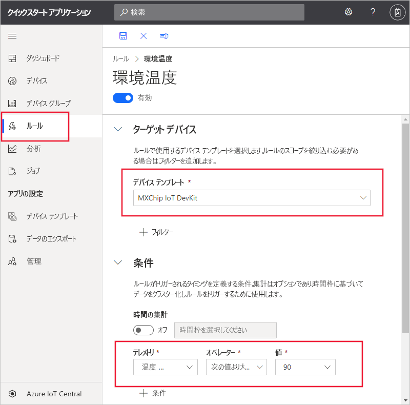
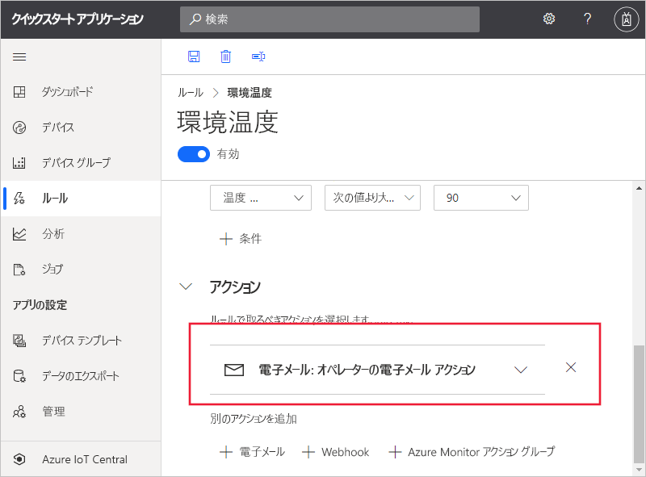

# クイック スタート:Azure IoT Central でデバイスのルールとアクションを構成する

*この記事は、オペレーター、ビルダー、および管理者に適用されます。*

このクイックスタートでは、デバイスのセンサーによってレポートされる温度が華氏 90&deg; を超えた場合にメールを送信する規則を作成します。

## 前提条件

作業を開始する前に、「[Azure IoT Central アプリケーションの作成](./quick-deploy-iot-central.md)」と[IoT Central アプリケーションへのシミュレーションされたデバイスの追加](./quick-create-pnp-device.md)に関する 2 つのクイックスタートを完了して、作業に使用する **MXChip IoT DevKit** デバイス テンプレートを作成する必要があります。

## テレメトリベースのルールを作成する

1. 新しいテレメトリベースのルールを対象のアプリケーションに追加するには、左側のペインで **[規則]** を選択します。

1. 新しい規則を作成するには、 **+** を選択します。

1. ルール名として「**Environmental temperature**」と入力します。

1. **[ターゲット デバイス]** セクションで、デバイス テンプレートとして **[MXChip IoT DevKit]** を選択します。 このオプションは、デバイス テンプレートの種類によってルールが適用されるデバイスをフィルター処理します。 **[+ フィルター]** を選択することで、さらにフィルター条件を追加できます。

1. **[条件]** セクションで、ルールをトリガーする条件を定義します。 次の情報を使用して、温度テレメトリに基づいて条件を定義します。

    | フィールド        | Value            |
    | ------------ | ---------------- |
    | Measurement  | 気温      |
    | 演算子     | が次の値より大きい  |
    | Value        | 90               |

    さらに条件を追加するには、 **[+ 条件]** を選択します。

    

1. ルールがトリガーされたときに実行するメール アクションを追加するには、 **[+ 電子メール]** を選択します。

1. 次の表の情報を使用してアクションを定義してから、 **[完了]** を選択します。

    | 設定   | Value                                             |
    | --------- | ------------------------------------------------- |
    | Display name | オペレーターの電子メール アクション                          |
    | ターゲット        | メール アドレス                                |
    | Notes     | 環境温度がしきい値を超えました。 |

    > [!NOTE]
    > メール通知を受け取るには、メール アドレスが[アプリケーションのユーザー ID](howto-administer.md) である必要があります。また、そのユーザーが少なくとも一度アプリケーションにサインインしている必要があります。

    

1. **[保存]** を選択します。 ルールが **[ルール]** ページに表示されます。

## ルールをテストする

ルールは保存した後すぐに有効になります。 ルールで定義された条件が満たされると、アプリケーションによって、アクションで指定したメール アドレスにメッセージが送信されます。

> [!NOTE]
> テストの完了後は、ルールを無効にして、受信トレイに届くアラートを停止してください。

## 次のステップ

このクイック スタートでは、次の方法について説明しました。

* テレメトリベースのルールを作成する
* アクションを追加する

アプリケーションに接続されているデバイスの監視の詳細については、以下のクイックスタートをご覧ください。

> [!div class="nextstepaction"]
> [Azure IoT Central を使用してデバイスを監視する](quick-monitor-devices.md)。
