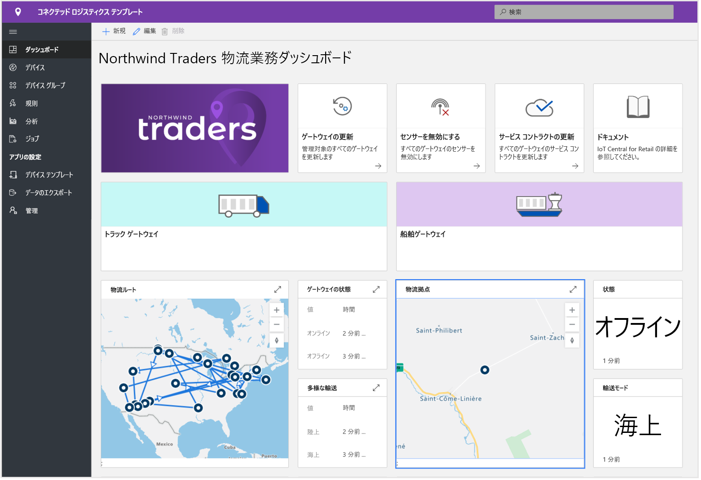
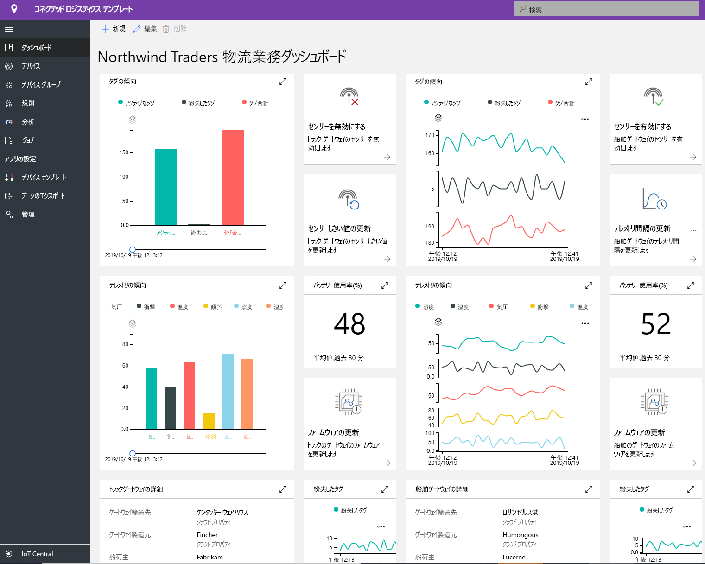
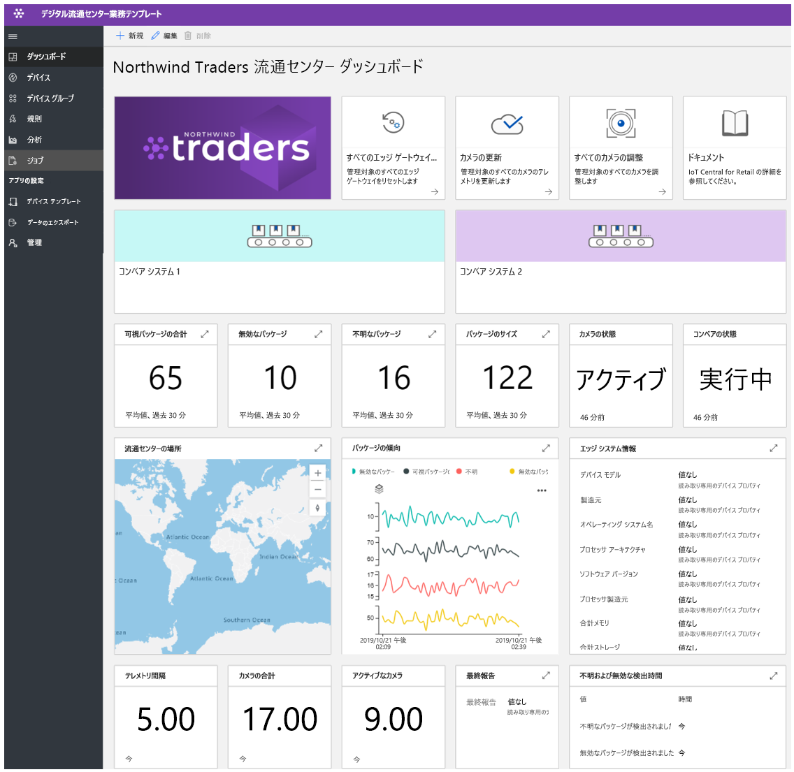
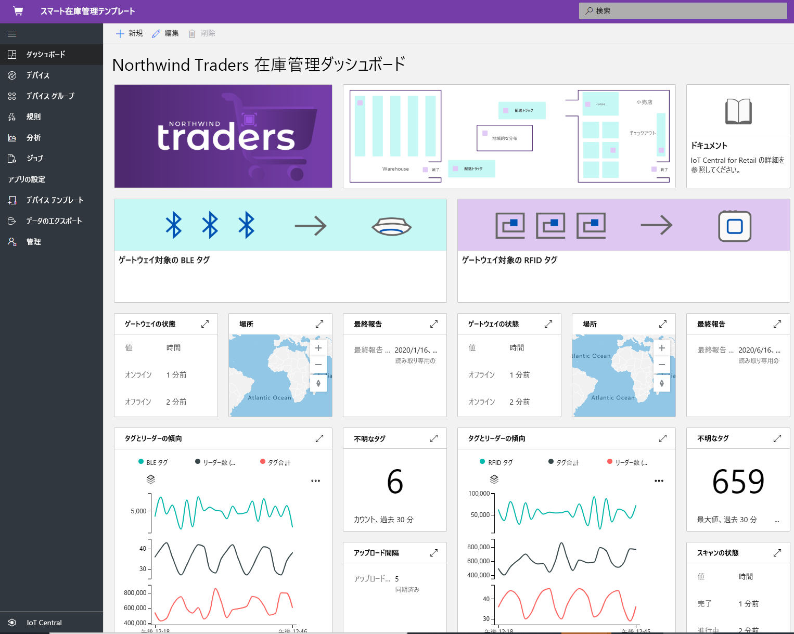

# Azure IoT Central を使用した小売ソリューションの構築

[!INCLUDE [iot-central-pnp-original](../../../includes/iot-central-pnp-original-note.md)]

Azure IoT Central は、スケーラブルなアプリケーションの構築と管理を容易にする、ソリューション ビルダー向けのモノのインターネット (IoT) アプリ プラットフォームです。 この記事では、IoT Central に含まれる、流通業に特化したアプリケーション テンプレートのいくつかについて説明します。 ソリューション ビルダーは、公開されているテンプレートを活用して IoT ソリューションを構築し、サプライ チェーンの最適化、顧客の店内エクスペリエンスの向上、より効率的な在庫追跡を実現できます。

> [!div class="mx-imgBorder"]
> 

## コネクテッド ロジスティクス ソリューションとは
グローバル物流費は、2020 年には、業界別の GDP として最大の 10.6 兆ドルに達するものと予想されています。 物流費の合計の過半数 (70%) を占めるのは、商品輸送です。 輸送業者は、厳しい競争圧力とさまざまな制約にさらされています。 3PL 業者は、短縮し続ける時間枠と増大する一方の報酬費用への対応を求められています。 物流は、地政学的リスク、極端な気象現象によるリスク、犯罪のリスクにもさらされています。 

IoT センサーを使用することにより、さまざまな環境条件を収集し、監視できます。これには、気温、湿度、傾斜、衝撃、光、GPS を利用した多モード輸送全体 (空輸、海運、陸送) の積み荷位置が含まれます。 センサー、デバイス、天気、イベントから収集されたデータは、クラウドベースのビジネス インテリジェンス システムと統合できます。 コネクテッド ロジスティクス ソリューションには次の利点があります。
* リアルタイムのトレースと追跡を利用した積み荷輸送 
* リアルタイムの環境条件監視とコールド チェーンを利用した積み荷の保護
* 積み荷の盗難、紛失、破損に対するセキュリティ
* ジオフェンス、ルートの最適化、フリート管理 車両分析
* 出発と到着の予測と予測可能性 

### すぐに使えるエクスペリエンス
パートナーは、テンプレートを活用してエンド ツー エンドのコネクテッド ロジスティクス ソリューションを開発し、上述の利点を実現できます。 次の公開テンプレートは、IoT Central のデバイスのデバイス接続、構成、および管理に重点が置かれています。 

> [!div class="mx-imgBorder"]
> 

> [!div class="mx-imgBorder"]
> 

上のダッシュボードはサンプル エクスペリエンスであり、目的のユース ケースに合わせてこのアプリケーションを完全にカスタマイズできます。

[エンド ツー エンドのチュートリアル](./tutorial-iot-central-connected-logistics-pnp.md)を始めましょう。こちらでは、コネクテッド ロジスティクス ソリューション テンプレートの 1 つを活用してソリューションを構築する方法について説明しています。

## デジタル流通センター ソリューションとは
多くの製造元と流通業者が世界各地に拠点を持つようになるにつれて、それぞれのサプライ チェーンはかつてなく複雑になっています。 流通センターは主要な課題になりつつあります。 流通センターと倉庫は、eコマースの圧力にさらされています。 コンシューマーは、多彩な商品が提供されることや、それらの商品が購入後 1 日から 2 日で手元に届くことを期待するようになっています。 流通センターは、このような傾向に順応すると同時に、抱えている非効率性の問題を克服することを求められています。 

今日、手作業への過度な依存が原因で、流通センターのコストの 55-65% をピッキングと梱包が占めています。 手作業のために流通センターでの処理が遅れるのも問題ですが、スタッフの需要が急速に変動すること (休暇期のスタッフは 10 倍に増加) は、出荷量に対応することをさらに一層困難にしています。 この季節変動が、転職率の高さやミスの発生要因になっており、コストのかかる再作業の必要性も増えています。
IoT 対応カメラを活用したソリューションでは、デジタル フィードバック ループが可能になり、革新的なベネフィットを実現できます。 流通センター全体のデータがこうして集約されることにより、アクションにつながる分析情報を得ることができ、結果として、さらに良いデータが得られます。

主な利点は以下のとおりです。 
* 商品の到着からコンベヤー システムを移動する間、カメラが商品を監視
* 問題のある商品の特定と、修理のための発送
* 注文の効率的な追跡
* コストの削減、生産性の向上、利用率の最大化

### すぐに使えるエクスペリエンス
パートナーは、このアプリケーション テンプレートを活用してデジタル流通センターを構築し、アクションにつながる分析情報を得て、上述の利点を実現できます。 この公開テンプレートは、IoT Central のカメラとエッジ デバイスのデバイス接続構成と管理に重点が置かれています。 

> [!div class="mx-imgBorder"]
> 

上のダッシュボードはサンプル エクスペリエンスであり、目的のユース ケースに合わせてこのアプリケーションを完全にカスタマイズできます。

[エンド ツー エンドのチュートリアル](./tutorial-iot-central-digital-distribution-center-pnp.md)を始めましょう。こちらでは、デジタル流通センターのテンプレートの 1 つを活用してソリューションを構築する方法について説明しています。

## ストア内分析条件監視とは
競争が激化する中、流通業者は、実店舗を利用して人々を引き寄せるために、独自性がある特別なものを顧客に提供する新しい方法を模索しています。 多くの流通業者は、店内の環境条件が競合他社との差別化を図るツールとして重要な役割を果たすことを認識しています。 流通業者は、店内の諸条件を常に良好に保つことにより、顧客に快適なエクスペリエンスを提供することを望んでいます。  

IoT Central のストア内分析条件監視アプリケーション テンプレートは、エンド ツー エンド ソリューションを構築するために使用できるキャンバスを、ソリューション ビルダーに提供します。 このアプリケーション テンプレートを使用すると、さまざまなセンサー デバイスを使用して、販売店の環境をデジタル接続して監視できます。 これらのセンサー デバイスがキャプチャする有意義な信号をビジネスの分析情報に変換することにより、流通業者は運用コストを削減し、顧客が好むエクスペリエンスを実現できます。

このアプリケーション テンプレートで次のことを行えます。

*  さまざまな IoT センサーを IoT Central アプリケーション インスタンスにシームレスに接続する。
*  環境内のゲートウェイ デバイスとセンサー ネットワークの正常性を監視および管理する。
*  店内の環境条件に関するカスタム ルールを作成し、適切なアラートをトリガーする。
*  店内の環境条件を、販売店のチームが活用できる分析情報に変換する。
* 集計された分析情報を、既存または新規のビジネス アプリケーションにエクスポートして、販売スタッフのメンバーを支援する。

### すぐに使えるエクスペリエンス
このアプリケーション テンプレートには、すぐに使用可能なデバイス テンプレート セットとオペレーター エクスペリエンスが用意されています。 これによって、シミュレートされたデバイスのセットを活用して、ダッシュボードの要素にデータを読み込むことができます。 [ストア内分析条件監視](https://aka.ms/conditiontemplate)アプリ テンプレートを使用して IoT Central アプリケーションをデプロイすると、次に示すような既定のアプリケーション ダッシュボードが表示されます。 

> [!div class="mx-imgBorder"]
> 

上のダッシュボードはサンプル エクスペリエンスであり、目的のユース ケースに合わせてこのアプリケーションを完全にカスタマイズできます。 

[エンド ツー エンドのチュートリアル](./tutorial-in-store-analytics-create-app-pnp.md)を始めましょう。こちらでは、ストア内分析条件監視テンプレートの 1 つを活用してソリューションを構築する方法について説明しています。

## ストア内分析レジとは
競争がますます激化する中、現代の流通業者は、顧客の期待を超え、また来店したいと思わせるような店内エクスペリエンスを実現する圧力に絶えずさらされています。 一部の流通業者がこのニーズを満たすテクノロジをデプロイし始めているものの、ほとんど意識されていない分野があります。それは、レジのエクスペリエンスです。

ソリューション ビルダーは、IoT Central のストア内分析レジ アプリケーション テンプレートを使用することにより、店舗のレジ ゾーンに関する有意義な分析情報で販売スタッフを支援するエクスペリエンスを構築できます。 これによって、シミュレートされたデバイスのセットを活用して、販売店内の各レジの通路の混雑状況を判断できます。 センサーにより、各レジの通路の人数と平均待ち時間をキャプチャできます。

このテンプレートは、次のことを実現するベースライン IoT ソリューションを提供し、ソリューション ビルダーが Go-To-Market プランを推進するのに役立ちます。 

* さまざまな IoT センサーを IoT Central アプリケーション インスタンスにシームレスに接続する。
* 環境内のゲートウェイ デバイスとセンサー ネットワークの正常性を監視および管理する。
* 店内のレジ条件に関するカスタム ルールを作成し、適切なアラートをトリガーする。
* 店内のレジ条件を、販売店のチームが活用できる分析情報に変換する。
* 集計された分析情報を、既存または新規のビジネス アプリケーションにエクスポートして、販売スタッフのメンバーを支援する。

### すぐに使えるエクスペリエンス
このアプリケーション テンプレートには、すぐに使用可能なデバイス テンプレート セットとオペレーター エクスペリエンスが用意されています。 これによって、シミュレートされたデバイスのセットを活用して、ダッシュボードの要素にデータを読み込むことができます。 [ストア内分析レジ](https://aka.ms/checkouttemplate) アプリ テンプレートを使用して IoT Central アプリケーションをデプロイすると、次に示すような既定のアプリケーション ダッシュボードが表示されます。 

> [!div class="mx-imgBorder"]
> 

上のダッシュボードはサンプル エクスペリエンスであり、目的のユース ケースに合わせてこのアプリケーションを完全にカスタマイズできます。 

[エンド ツー エンドのチュートリアル](./tutorial-in-store-analytics-create-app-pnp.md)を始めましょう。こちらでは、ストア内分析レジ テンプレートの 1 つを活用してソリューションを構築する方法について説明しています。

## スマート在庫管理ソリューションとは
"在庫" とは、流通業者が抱えている商品在庫のことです。 どの流通業者も、供給と物流のリード タイムを考慮した在庫を必要とします。 在庫は、すべての流通業者が取引する必要がある最も重要なリソースと言えます。 オムニチャネル化した現代社会では、在庫管理は、適切な製品を適切な場所に適切なタイミングで確保するための重要な要件となっています。 在庫過多も在庫不足も、流通業者のビジネスに悪影響を及ぼしかねません。 毎年、不十分な在庫管理能力が原因で、流通業者は収益の 8-10% を損失しています。

無線 IC タグ (RFID)、ビーコン、カメラによって実現される IoT データを活用することで、この大きな課題に大きな規模で対処することが可能になります。 IoT シグナルに元々備わっている接続性とリアルタイム分析が、在庫に関する流通業者の課題に革新をもたらしました。  センサー、デバイス、天気、イベントから収集されたデータは、クラウドベースのビジネス インテリジェンス システムと統合できます。  
スマート在庫管理は、次の利点をもたらします。 
* 組織で在庫切れを防ぎ、必要なカスタマー サービス レベルを確保する。 
* ほぼリアルタイムな在庫精度の詳細分析と分析情報。
* 顧客の注文に応える適切な在庫量を決定する。

### すぐに使えるエクスペリエンス
パートナーは、テンプレートを活用してエンド ツー エンドのスマート在庫管理ソリューションを開発し、上述の利点を実現できます。 この公開テンプレートは、IoT Central の RFID および Bluetooth Low Energy (BLE) リーダーのデバイス接続、構成、管理に重点が置かれています。 

> [!div class="mx-imgBorder"]
> 

上のダッシュボードはサンプル エクスペリエンスであり、目的のユース ケースに合わせてこのアプリケーションを完全にカスタマイズできます。 

[エンド ツー エンドのチュートリアル](./tutorial-iot-central-smart-inventory-management-pnp.md)を始めましょう。こちらでは、スマート在庫管理テンプレートの 1 つを活用してソリューションを構築する方法について説明しています。

## 次の手順
流通ソリューションの構築を開始するには:
* ストア内分析アプリケーション テンプレートの 1 つを活用してソリューションを構築する方法について説明している[エンド ツー エンドのチュートリアル](./tutorial-in-store-analytics-create-app-pnp.md)を開始する。
* [コネクテッド ロジスティクス ソリューション テンプレート](./tutorial-iot-central-connected-logistics-pnp.md)のデプロイ方法を学習する。
* [デジタル流通センター テンプレート](./tutorial-iot-central-digital-distribution-center-pnp.md)のデプロイ方法を学習する。
* [スマート在庫管理テンプレート](./tutorial-iot-central-smart-inventory-management-pnp.md)のデプロイ方法を学習する。
* 「[IoT Central の概要](../core/overview-iot-central-pnp.md)」を参照して、IoT Central をさらに詳しく学習する。
