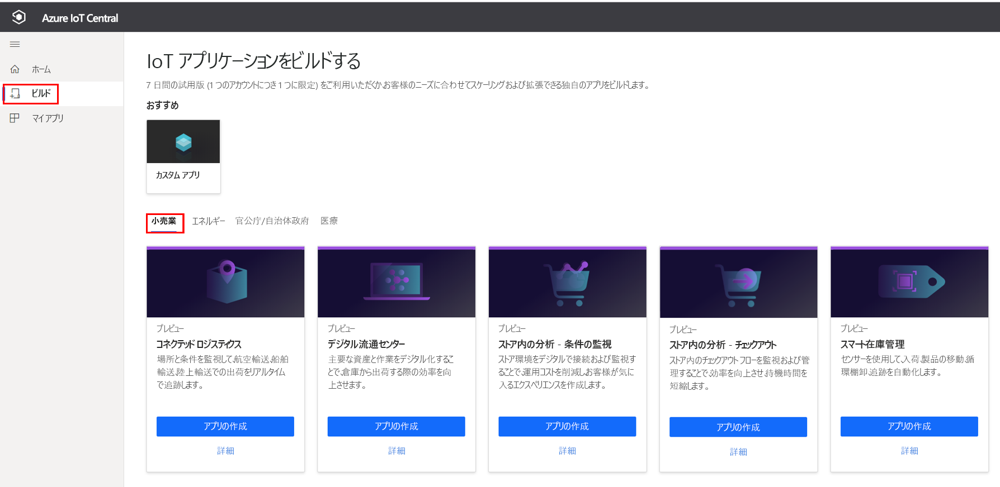
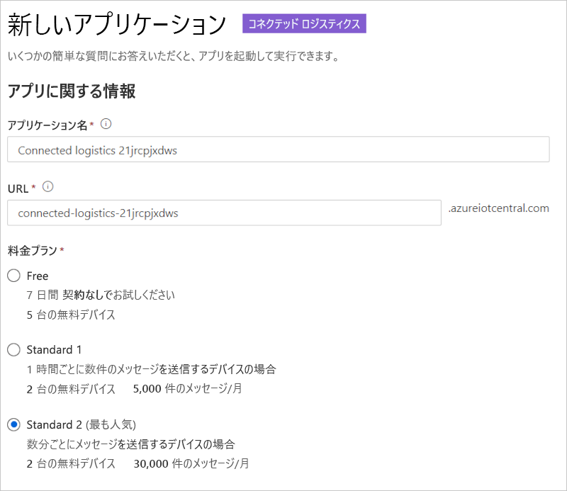
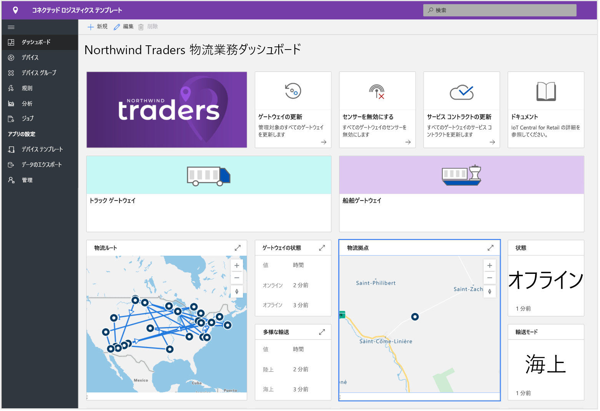
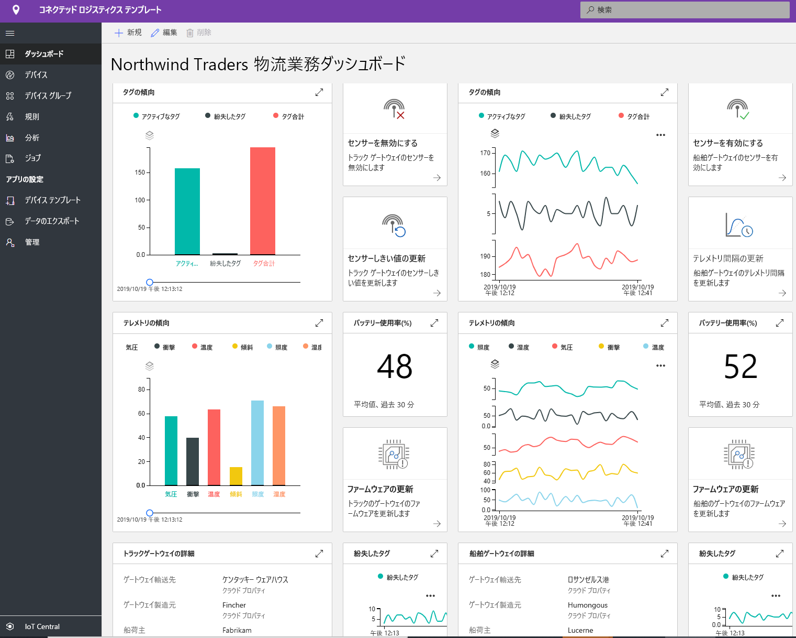
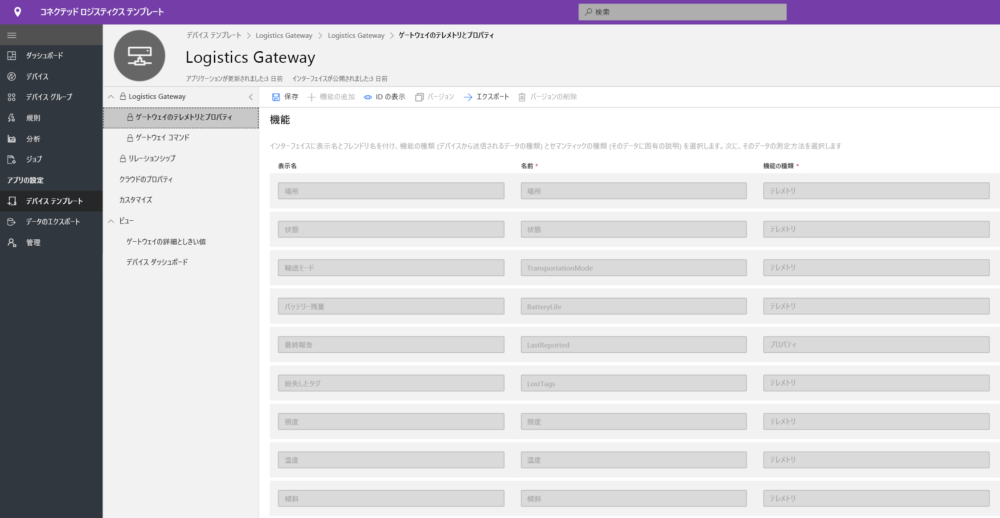
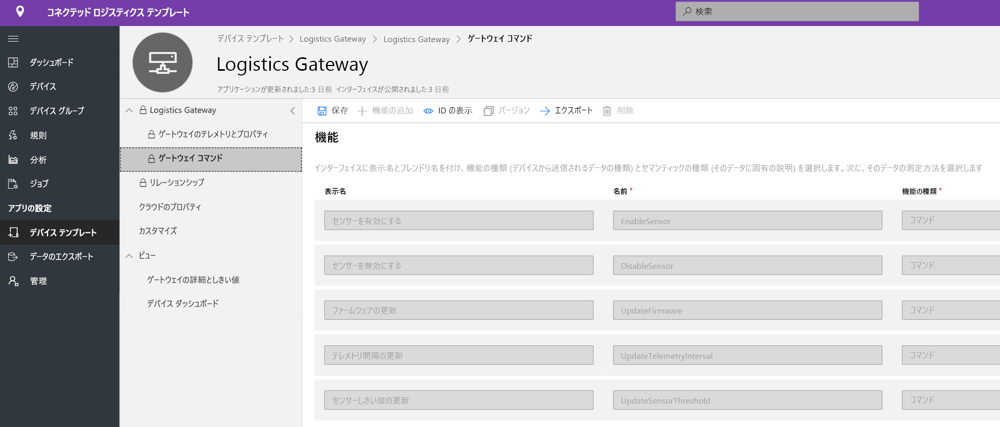
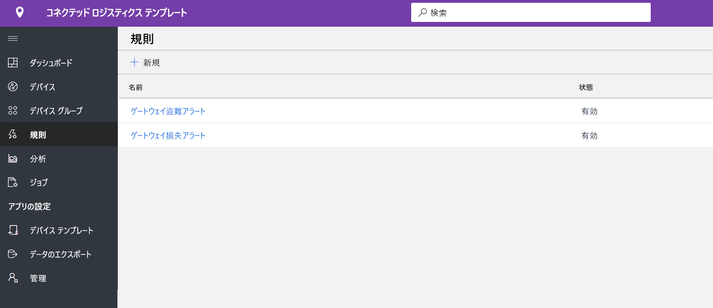
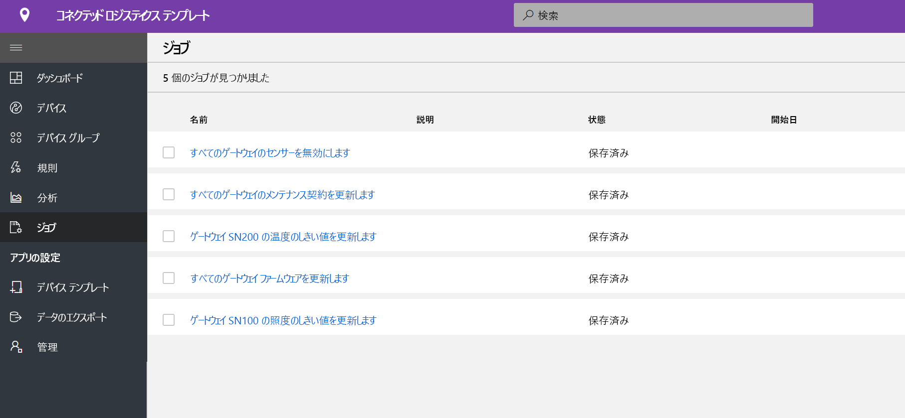
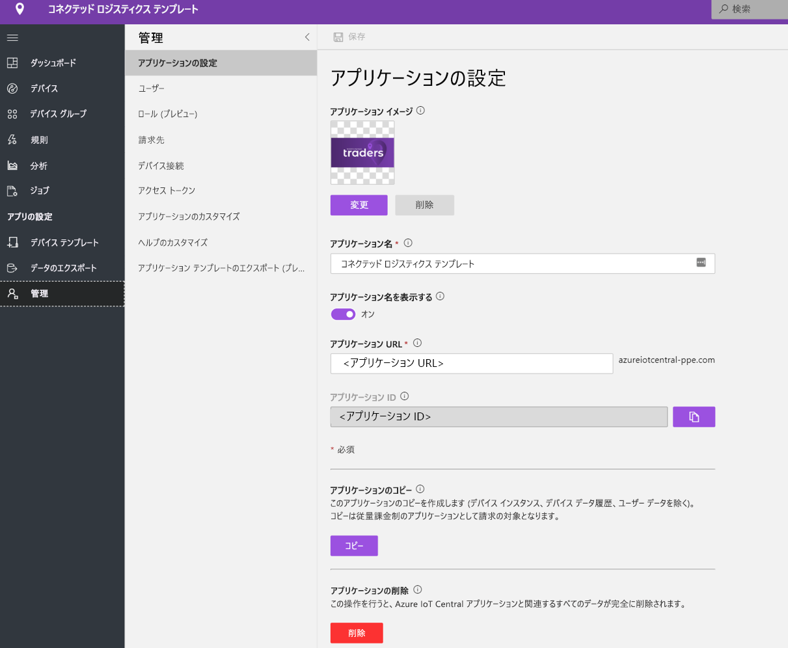

# チュートリアル:コネクテッド ロジスティクス アプリケーション テンプレートをデプロイして調べる

[!INCLUDE [iot-central-pnp-original](../../../includes/iot-central-pnp-original-note.md)]

このチュートリアルでは、IoT Central の**コネクテッド ロジスティクス** アプリケーション テンプレートをデプロイする方法について説明します。 テンプレートをデプロイする方法、既定で含まれるもの、次にできることについて説明します。

このチュートリアルで学習する内容は次のとおりです。 
* コネクテッド ロジスティクス アプリケーションを作成します 
* アプリケーションを調べる 

## 前提条件
* このアプリをデプロイするために必要な特定の前提条件はありません
* Azure サブスクリプションを用意することをお勧めしますが、なくても試してみることはできます

## コネクテッド ロジスティクス アプリケーション テンプレートを作成する
以下の手順でアプリケーションを作成できます
1. Azure IoT Central のアプリケーション マネージャー Web サイトに移動します。 左側のナビゲーションバーから **[ビルド]** を選択し、 **[Retail]\(小売り\)** タブをクリックします。

> [!div class="mx-imgBorder"]
> 

2. **[Connected Logistics Application]\(コネクテッド ロジスティクス アプリケーション\)** の **[アプリの作成]** を選択します

3. **[アプリの作成]** を選択すると、[新しいアプリケーション] フォームが開き、次のように要求された詳細が設定されます。
   * **[アプリケーション名]** : 既定の推奨名を使用するか、わかりやすいアプリケーション名を入力できます。
   * **[URL]** : 既定の推奨 URL を使用するか、わかりやすい一意の URL を入力できます。 次に、Azure サブスクリプションが既にある場合は、既定の設定をお勧めします。そうでない場合は、7 日間の無料試用版で開始し、無料試用期限が切れる前にいつでも従量課金制に切り替えることができます。
   * **[課金情報]** : リソースをプロビジョニングするには、ディレクトリ、Azure サブスクリプション、リージョンの詳細が必要です。
   * **[作成]** : ページの下部にある [作成] を選択して、アプリケーションをデプロイします。

> [!div class="mx-imgBorder"]
> 

## アプリケーションを調べる 

## ダッシュボード

アプリ テンプレートが正常にデプロイされると、既定のダッシュボードがコネクテッド ロジスティクスのオペレーターを対象とするポータルになります。 Northwind Traders 社は、海上と陸上の貨物を管理する架空のロジスティクス プロバイダーです。 このダッシュボードには、出荷に関するテレメトリを提供する 2 つの異なるゲートウェイと、関連するコマンド、ジョブ、アクションが表示されます。 このダッシュボードは、重要なロジスティクス デバイス操作アクティビティが表示されるように事前に構成されています。
ダッシュボードは、2 つの異なるゲートウェイ デバイス管理操作に論理的に分割されています。 
   * トラック輸送の物流経路と海上輸送の場所の詳細は、すべてのマルチモーダル輸送に不可欠な要素です
   * ゲートウェイの状態と関連情報を表示します 

> [!div class="mx-imgBorder"]
> 

   * ゲートウェイ、アクティブなタグ、不明なタグの合計数を簡単に追跡できます。
   * ファームウェアの更新、センサーの無効化、センサーの有効化、センサーしきい値の更新、テレメトリ間隔の更新、デバイス サービス コントラクトの更新などのデバイス管理操作を実行できます。
   * デバイスのバッテリ消費量を表示します

> [!div class="mx-imgBorder"]
> 

## デバイス テンプレート

[デバイス テンプレート] タブをクリックすると、ゲートウェイ機能モデルが表示されます。 機能モデルは、 **[Gateway Telemetry & Property]\(ゲートウェイ テレメトリとプロパティ\)** と **[Gateway Commands]\(ゲートウェイ コマンド\)** という 2 つの異なるインターフェイスを中心に構成されています

**[Gateway Telemetry & Property]\(ゲートウェイ テレメトリとプロパティ\)** - このインターフェイスには、センサーに関連するすべてのテレメトリ、場所、デバイス情報と、センサーのしきい値や更新間隔などのデバイス ツイン プロパティ機能が表示されます。

> [!div class="mx-imgBorder"]
> 

**[Gateway Commands]\(ゲートウェイ コマンド\)** - このインターフェイスには、すべてのゲートウェイ コマンド機能が整理されています

> [!div class="mx-imgBorder"]
> 

## ルール
[Rules]\(規則\) タブを選択して、このアプリケーション テンプレートに存在する 2 つの異なる規則を表示します。 これらの規則は、詳細な調査のためオペレーターにメールで通知するように構成されています。
 
**[Gateway theft alert]\(ゲートウェイ盗難アラート\)** : この規則は、輸送中にセンサーによって予期しない光が検出された場合にトリガーされます。 オペレーターは、潜在的な盗難を調査するためにすぐに通知を受け取る必要があります。
 
**[Unresponsive Gateway]\(応答しないゲートウェイ\)** : この規則は、ゲートウェイが長期間にわたってクラウドに報告しない場合にトリガーされます。 バッテリ低下モード、接続喪失、デバイス正常性により、ゲートウェイが応答していない可能性があります。

> [!div class="mx-imgBorder"]
> 

## [ジョブ]
[ジョブ] タブを選択すると、このアプリケーション テンプレートの一部として存在する 5 つの異なるジョブが表示されます。

> [!div class="mx-imgBorder"]
> 

ジョブ機能を利用して、ソリューション全体の操作を実行できます。 ジョブでは、デバイス コマンドとツイン機能を使用して、すべてのゲートウェイでの特定のセンサーの無効化や、出荷モードとルートに応じたセンサーのしきい値の変更などのタスクが実行されます。 
   * これは、海上輸送中にバッテリーを節約するために感電センサーを無効にしたり、コールド チェーン輸送中に温度しきい値を下げたりする標準的な操作です。 
 
   * ジョブを使うと、ゲートウェイでのファームウェアの更新やサービス コントラクトの更新など、システム全体の操作を実行して、メンテナンス アクティビティを最新の状態に保つことができます。

## リソースのクリーンアップ
このアプリケーションをもう使わない場合は、 **[管理]**  >  **[アプリケーションの設定]** に移動し、 **[削除]** をクリックすることによって、アプリケーション テンプレートを削除します。

> [!div class="mx-imgBorder"]
> 

## 次の手順
* [コネクテッド ロジスティクスの概念](./architecture-connected-logistics-pnp.md)についてさらに詳しく学習します
* 他の [IoT Central 小売りテンプレート](./overview-iot-central-retail-pnp.md)についてさらに詳しく学習します
* [IoT Central の概要](../preview/overview-iot-central.md)についてさらに詳しく学習します
