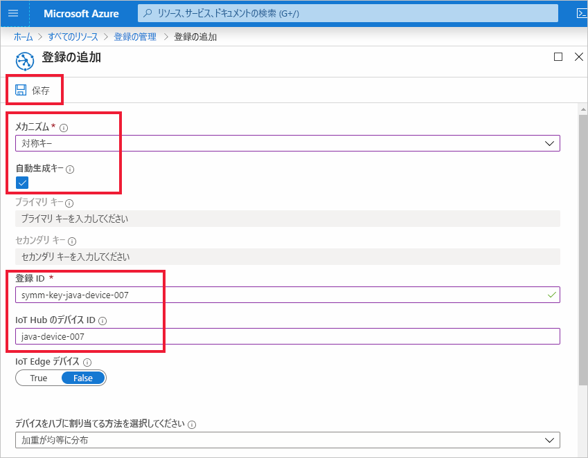
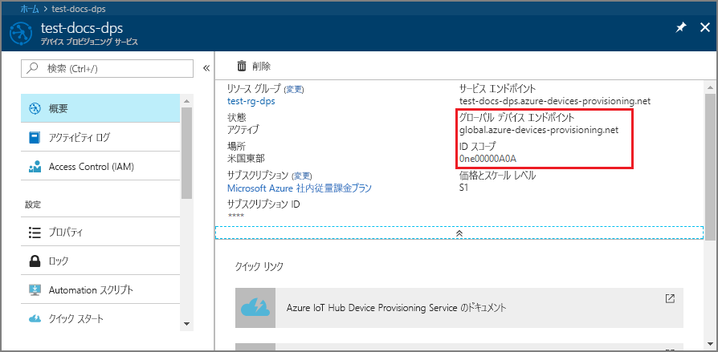
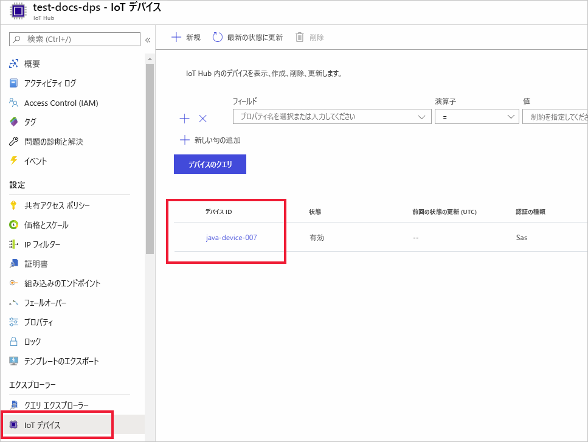

# <a name="quickstart-provision-a-simulated-device-to-iot-hub-with-symmetric-keys"></a>クイック スタート:対称キーを使用してシミュレートされたデバイスを IoT Hub にプロビジョニングする

このクイック スタートでは、Windows 開発マシン上でデバイス シミュレーターを作成して実行する方法について説明します。 ここでは、Device Provisioning Service (DPS) インスタンスとの認証と IoT ハブへの割り当てに対称キーを使用するように、このシミュレートされたデバイスを構成します。 [Java 用 Microsoft Azure IoT SDK](https://github.com/Azure/azure-iot-sdk-java) のサンプル コードを使用して、プロビジョニングを開始するデバイスのブート シーケンスをシミュレートします。 デバイスは、DPS サービス インスタンスへの個々の登録に基づいて認識され、IoT ハブに割り当てられます。

この記事では、個々の登録を使用したプロビジョニングについて説明しますが、登録グループも使用できます。 登録グループを使用する場合は、いくつかの違いがあります。 たとえば、デバイスの一意の登録 ID を持つ派生デバイス キーを使用する必要があります。 対称キー登録グループはレガシ デバイスのみには限定されませんが、[対称キーの構成証明を使用してレガシ デバイスをプロビジョニングする方法](how-to-legacy-device-symm-key.md)に関する記事に登録グループの例が記載されています。 詳細については、[対称キーの構成証明のグループ登録](concepts-symmetric-key-attestation.md#group-enrollments)に関する記事を参照してください。

自動プロビジョニングの処理に慣れていない場合は、「[自動プロビジョニングの概念](concepts-auto-provisioning.md)」を確認してください。 

また、このクイック スタートを続行する前に、[Azure portal での IoT Hub Device Provisioning Service の設定](./quick-setup-auto-provision.md)に関するページの手順も済ませておいてください。 このクイック スタートでは、Device Provisioning Service インスタンスを既に作成している必要があります。

この記事は、Windows ベースのワークスペース向けです。 ただし、Linux でもこの手順を実行できます。 Linux の例については、「[How to provision for multitenancy](how-to-provision-multitenant.md)」(マルチテナント方式のプロビジョニング) を参照してください。


[!INCLUDE [quickstarts-free-trial-note](../../includes/quickstarts-free-trial-note.md)]


## <a name="prerequisites"></a>前提条件

* [Java SE Development Kit 8](https://aka.ms/azure-jdks) 以降がマシンにインストールされていることを確認します。

* [Maven](https://maven.apache.org/install.html) をダウンロードし、インストールします。

* [Git](https://git-scm.com/download/) の最新バージョンがインストールされている。

<a id="setupdevbox"></a>

## <a name="prepare-the-java-sdk-environment"></a>Java SDK 環境を準備する 

1. マシンに Git がインストールされ、コマンド ウィンドウからアクセスできる環境変数に追加されていることを確認します。 **Git Bash** (ローカル Git リポジトリと対話する際に使用するコマンドライン アプリ) など、インストールする各種 `git` ツールの最新バージョンについては、[Software Freedom Conservancy の Git クライアント ツール](https://git-scm.com/download/)に関するページを参照してください。 

2. コマンド プロンプトを開きます。 デバイス シミュレーション コード サンプルの GitHub リポジトリを複製します。
    
    ```cmd/sh
    git clone https://github.com/Azure/azure-iot-sdk-java.git --recursive
    ```
3. ルート `azure-iot-sdk-java` ディレクトリに移動し、プロジェクトをビルドして、必要なパッケージすべてをダウンロードします。
   
   ```cmd/sh
   cd azure-iot-sdk-java
   mvn install -DskipTests=true
   ```

## <a name="create-a-device-enrollment"></a>デバイス登録を作成する

1. [Azure portal](https://portal.azure.com) にサインインし、左側のメニューの **[すべてのリソース]** を選択して、Device Provisioning Service (DPS) インスタンスを開きます。

2. **[登録を管理します]** タブを選択し、上部にある **[個別登録の追加]** を選択します。 

3. **[登録の追加]** パネルで次の情報を入力して、 **[保存]** を押します。

   - **メカニズム**:ID 構成証明の*メカニズム*として **[対称キー]** を選択します。

   - **自動生成キー**:このボックスをオンにします。

   - **登録 ID**:登録を識別する登録 ID を入力します。 小文字の英字、数字、ダッシュ ('-') 文字のみを使用します。 たとえば、「**symm-key-java-device-007**」とします。

   - **IoT Hub のデバイス ID**:デバイス識別子を入力します。 たとえば、「**java-device-007**」とします。

     

4. 登録を保存したら、**主キー**と**セカンダリ キー**が生成され、登録エントリに追加されます。 対称キーのデバイス登録は、 *[個々の登録]* タブの *[登録 ID]* 列に **symm-key-java-device-007** と表示されます。 

    登録を開き、生成された**主キー**の値をコピーします。 このキーの値と**登録 ID** は、後でデバイスの Java コードを更新する際に使用します。


<a id="firstbootsequence"></a>

## <a name="simulate-device-boot-sequence"></a>ブート シーケンスをシミュレートする

このセクションでは、デバイスのブート シーケンスを DPS インスタンスに送信するようにデバイスのサンプル コードを更新します。 このブート シーケンスにより、デバイスが認識、認証され、DPS インスタンスにリンクされた IoT ハブに割り当てられます。

1. Device Provisioning Service メニューから、 **[概要]** を選択し、"_ID スコープ_" と "_Provisioning Service のグローバル エンドポイント_" をメモします。

    

2. Java デバイス サンプル コードを開いて編集します。 デバイスのサンプル コードの完全パスは次のとおりです。

    `azure-iot-sdk-java/provisioning/provisioning-samples/provisioning-symmetrickey-sample/src/main/java/samples/com/microsoft/azure/sdk/iot/ProvisioningSymmetricKeySampleSample.java`

   - DPS インスタンスの "_ID スコープ_" と "_Provisioning Service のグローバル エンドポイント_" を追加します。 個別の登録に対して選択した登録 ID とプライマリ対称キーも追加してください。 変更を保存します。 

      ```java
        private static final String SCOPE_ID = "[Your scope ID here]";
        private static final String GLOBAL_ENDPOINT = "[Your Provisioning Service Global Endpoint here]";
        private static final String SYMMETRIC_KEY = "[Enter your Symmetric Key here]";
        private static final String REGISTRATION_ID = "[Enter your Registration ID here]";
      ```

3. ビルドを実行するために、コマンド プロンプトを開きます。 Java SDK リポジトリのプロビジョニング サンプル プロジェクト フォルダーに移動します。

    ```cmd/sh
    cd azure-iot-sdk-java/provisioning/provisioning-samples/provisioning-symmetrickey-sample
    ```

4. サンプルをビルドした後、`target` フォルダーに移動して、作成した .jar ファイルを実行します。

    ```cmd/sh
    mvn clean install
    cd target
    java -jar ./provisioning-symmetrickey-sample-{version}-with-deps.jar
    ```

5. 予想される出力は次のようになります。

    ```cmd/sh
      Starting...
      Beginning setup.
      Waiting for Provisioning Service to register
      IotHUb Uri : <Your DPS Service Name>.azure-devices.net
      Device ID : java-device-007
      Sending message from device to IoT Hub...
      Press any key to exit...
      Message received! Response status: OK_EMPTY
    ```

6. Azure Portal で、ご利用のプロビジョニング サービスにリンクされている IoT Hub に移動し、 **[Device Explorer]** ブレードを開きます。 シミュレートされた対称キーのデバイスをハブにプロビジョニングすると、そのデバイス ID が**有効**な "*状態*" として **[Device Explorer]** ブレードに表示されます。  サンプル デバイス アプリケーションを稼働させる前にこのブレードを開いていた場合は、一番上にある **[最新の情報に更新]** を押すことが必要になる場合があります。 

     

> [!NOTE]
> *[Initial device twin state]\(初期のデバイス ツインの状態\)* をデバイスの登録エントリの既定値から変更した場合、デバイスはハブから目的のツインの状態をプルし、それに従って動作することができます。 詳細については、「[IoT Hub のデバイス ツインの理解と使用](../iot-hub/iot-hub-devguide-device-twins.md)」を参照してください。
>


## <a name="clean-up-resources"></a>リソースをクリーンアップする

引き続きデバイス クライアント サンプルを使用する場合は、このクイックスタートで作成したリソースをクリーンアップしないでください。 使用する予定がない場合は、次の手順を使用して、このクイックスタートで作成したすべてのリソースを削除してください。

1. マシンに表示されているデバイス クライアント サンプルの出力ウィンドウを閉じます。
1. Azure portal の左側のメニューで **[すべてのリソース]** を選択し、Device Provisioning Service を選択します。 サービスの **[登録を管理します]** を開き、 **[個々の登録]** タブを選択します。このクイックスタートで登録したデバイスの "*登録 ID*" の隣にあるチェック ボックスをオンにして、ペイン上部の **[削除]** を押します。 
1. Azure portal の左側のメニューにある **[すべてのリソース]** を選択し、IoT ハブを選択します。 ハブの **[IoT デバイス]** を開き、このクイックスタートで登録したデバイスの "*デバイス ID*" の隣にあるチェック ボックスをオンにして、ペイン上部の **[削除]** を押します。

## <a name="next-steps"></a>次のステップ

このクイックスタートでは、シミュレートされたデバイスを Windows マシン上に作成し、ポータル上の Azure IoT Hub Device Provisioning Service で対称キーを使用して IoT ハブにプロビジョニングしました。 プログラムでデバイスを登録する方法については、X.509 デバイスのプログラミングによる登録のクイックスタートに進みます。 

> [!div class="nextstepaction"]
> [Azure クイックスタート - X.509 デバイスを Azure IoT Hub Device Provisioning Service に登録する](quick-enroll-device-x509-java.md)
