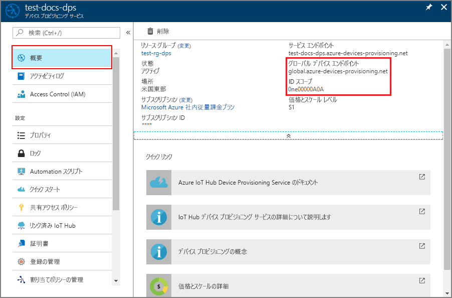

# <a name="quickstart-create-and-provision-an-x509-simulated-device-using-nodejs-device-sdk-for-iot-hub-device-provisioning-service"></a>クイック スタート:IoT Hub Device Provisioning Service 対応の Node.js device SDK を使用して、シミュレートされた X.509 デバイスを作成してプロビジョニングする
[!INCLUDE [iot-dps-selector-quick-create-simulated-device-x509](../../includes/iot-dps-selector-quick-create-simulated-device-x509.md)]

以下の手順では、Device Provisioning Service で登録エントリを作成する方法、開発マシン上で X.509 デバイスをシミュレートする方法、そのシミュレートされたデバイスを Device Provisioning Service と接続する方法、[Azure IoT Hub Node.js device SDK](https://github.com/Azure/azure-iot-sdk-node) を使用してデバイスを IoT ハブに登録する方法について説明します。

自動プロビジョニングの処理に慣れていない場合は、「[自動プロビジョニングの概念](concepts-auto-provisioning.md)」も確認してください。 また、先に進む前に、[Azure Portal での IoT Hub Device Provisioning Service の設定](./quick-setup-auto-provision.md)に関するページの手順も済ませておいてください。 

Azure IoT Device Provisioning Service では、次の 2 種類の登録がサポートされています。
- [登録グループ](concepts-service.md#enrollment-group)：複数の関連するデバイスを登録するために使用します。
- [個々の登録](concepts-service.md#individual-enrollment):単一デバイスを登録するために使用します。

この記事では、個別登録の使用方法を示します。

[!INCLUDE [IoT Device Provisioning Service basic](../../includes/iot-dps-basic.md)]

## <a name="prepare-the-environment"></a>環境の準備 

1. 先に進む前に、[Azure Portal での IoT Hub Device Provisioning Service の設定](./quick-setup-auto-provision.md)に関するページの手順を完了します。

2. マシンに [Node.js v4.0 以降](https://nodejs.org)がインストールされていることを確認します。

3. マシンに [Git](https://git-scm.com/download/) がインストールされ、コマンド ウィンドウからアクセスできる環境変数に追加されていることを確認します。 

4. マシンに [OpenSSL](https://www.openssl.org/) がインストールされ、コマンド ウィンドウからアクセスできる環境変数に追加されていることを確認します。 このライブラリは、ソースからビルドしてインストールするか、または[サード パーティ](https://wiki.openssl.org/index.php/Binaries) ([例](https://sourceforge.net/projects/openssl/)) からダウンロードしてインストールすることができます。 

    > [!NOTE]
    > "_ルート_"、"_中間_"、"_リーフ_" の X.509 証明書すべてまたはいずれかを既に作成している場合は、この手順および証明書の生成に関する以下のすべての手順を省略してかまいません。
    >

## <a name="create-a-self-signed-x509-device-certificate-and-individual-enrollment-entry"></a>自己署名 X.509 デバイス証明書と個々の登録エントリを作成する

このセクションでは、自己署名 X.509 証明書を使用します。次の点に留意することが重要です。

* 自己署名証明書はテスト目的専用であるため、運用環境では使用しないでください。
* 自己署名証明書の既定の有効期限は 1 年間です。

[Azure IoT SDK for Node.js](https://github.com/Azure/azure-iot-sdk-node.git) のサンプル コードを使用して、シミュレートされたデバイスの個々の登録エントリで使用する証明書を作成します。


1. コマンド プロンプトを開きます。 コード サンプルの GitHub リポジトリを複製します。
    
    ```cmd/sh
    git clone https://github.com/Azure/azure-iot-sdk-node.git --recursive
    ```

2. 証明書ジェネレーター スクリプトに移動し、プロジェクトをビルドします。 

    ```cmd/sh
    cd azure-iot-sdk-node/provisioning/tools
    npm install
    ```

3. 独自の _certificate-name_ を使用してスクリプトを実行し、"_リーフ_" X.509 証明書を作成します。 リーフ証明書の共通名は[登録 ID](https://docs.microsoft.com/azure/iot-dps/concepts-device#registration-id) になるため、必ず小文字の英数字とハイフンのみを使用してください。

    ```cmd/sh
    node create_test_cert.js device {certificate-name}
    ```

4. [Azure Portal](https://portal.azure.com) にサインインし、左側のメニューの **[すべてのリソース]** をクリックして、Device Provisioning Service インスタンスを開きます。

5. Device Provisioning Service の概要ブレードで、 **[Manage enrollments]\(登録の管理\)** を選択します。 **[個別登録]** タブを選択し、上部にある **[個別登録の追加]** ボタンをクリックします。 

6. **[Add Enrollment] (登録の追加)** パネルで、次の情報を入力します。
   - ID 構成証明の "*メカニズム*" として **[X.509]** を選択します。
   - *[Primary certificate .pem or .cer file]\(プライマリ証明書 .pem または .cer ファイル\)* の *[ファイルの選択]* をクリックし、前の手順で作成した証明書ファイル **{certificate-name}_cert.pem** を選択します。  
   - 必要に応じて、次の情報を入力することができます。
     - プロビジョニング サービスにリンクされた IoT ハブを選択します。
     - 一意のデバイス ID を入力します。 デバイスに名前を付ける際に機密データを含めないようにしてください。 
     - **[Initial device twin state]\(初期のデバイス ツインの状態\)** をデバイスの目的の初期構成で更新します。
     - 作業が完了したら、 **[保存]** をクリックします。 

     [](./media/quick-create-simulated-device-x509-node/device-enrollment.png#lightbox)

     登録に成功すると、 *[個々の登録]* タブの *[登録 ID]* 列に X.509 デバイスが **{certificate-name}** として表示されます。この値は、後で使用するためにメモしておきます。

## <a name="simulate-the-device"></a>デバイスをシミュレートする

[Azure IoT Hub Node.js device SDK](https://github.com/Azure/azure-iot-sdk-node) を使用すれば、デバイスを簡単にシミュレートできます。 詳細については、[デバイスの概念](https://docs.microsoft.com/azure/iot-dps/concepts-device)に関するページを参照してください。

1. Azure Portal で、Device Provisioning サービスの **[概要]** ブレードを選択し、 **_[グローバル デバイス エンドポイント]_** と **_[ID スコープ]_** の値を書き留めます。

     

2. "_証明書_" と "_キー_" を同じフォルダーにコピーします。

    ```cmd/sh
    copy .\{certificate-name}_cert.pem ..\device\samples\{certificate-name}_cert.pem
    copy .\{certificate-name}_key.pem ..\device\samples\{certificate-name}_key.pem
    ```

3. デバイスのテスト スクリプトに移動し、プロジェクトをビルドします。 

    ```cmd/sh
    cd ..\device\samples
    npm install
    ```

4. **register\_x509.js** ファイルを編集します。 次の変更を行った後に、ファイルを保存します。
    - `provisioning host` を、上記の**手順 1** で書き留めた " **_グローバル デバイス エンドポイント_** " に置き換えます。
    - `id scope` を、上記の**手順 1** で書き留めた " **_ID スコープ_** " に置き換えます。 
    - `registration id` を、前のセクションで書き留めた " **_登録 ID_** " に置き換えます。
    - `cert filename` と `key filename` を、上記の**手順 2** でコピーしたファイルに置き換えます。 

5. スクリプトを実行し、デバイスが正常にプロビジョニングされたことを確認します。

    ```cmd/sh
    node register_x509.js
    ```   

6. ポータルで、ご利用のプロビジョニング サービスにリンクされている IoT Hub に移動し、 **[IoT デバイス]** ブレードを開きます。 シミュレートされた X.509 デバイスをハブにプロビジョニングすると、そのデバイス ID が**有効**な "*状態*" で **[IoT デバイス]** ブレードに表示されます。 サンプル デバイス アプリケーションを実行する前に既にブレードが開いていた場合は、必要に応じて一番上にある **[最新の情報に更新]** ボタンをクリックしてください。 

     

    *[Initial device twin state]\(初期のデバイス ツインの状態\)* をデバイスの登録エントリの既定値から変更した場合、デバイスはハブから目的のツインの状態をプルし、それに従って動作することができます。 詳細については、「[IoT Hub のデバイス ツインの理解と使用](../iot-hub/iot-hub-devguide-device-twins.md)」を参照してください。


## <a name="clean-up-resources"></a>リソースのクリーンアップ

引き続きデバイス クライアント サンプルを使用する場合は、このクイックスタートで作成したリソースをクリーンアップしないでください。 使用する予定がない場合は、次の手順を使用して、このクイックスタートで作成したすべてのリソースを削除してください。

1. マシンに表示されているデバイス クライアント サンプルの出力ウィンドウを閉じます。
2. Azure Portal の左側のメニューにある **[すべてのリソース]** をクリックし、Device Provisioning サービスを選択します。 サービスの **[登録を管理します]** ブレードを開き、 **[個々の登録]** タブをクリックします。このクイックスタートで登録したデバイスの*登録 ID* を選択し、上部の **[削除]** ボタンをクリックします。 
3. Azure Portal の左側のメニューにある **[すべてのリソース]** をクリックし、IoT ハブを選択します。 ハブの **[IoT Devices]\(IoT デバイス\)** ブレードを開き、このクイックスタートで登録したデバイスの "*デバイス ID*" を選択し、一番上の **[削除]** ボタンをクリックします。


## <a name="next-steps"></a>次の手順

このクイック スタートでは、シミュレートされた X.509 デバイスを作成し、ポータルで Azure IoT Hub Device Provisioning Service を使って IoT ハブにプロビジョニングしました。 プログラミングによって X.509 デバイスを登録する方法については、X.509 デバイスのプログラミングによる登録のクイックスタートに進みます。 

> [!div class="nextstepaction"]
> [Azure クイックスタート - Azure IoT Hub Device Provisioning Service への X.509 デバイスの登録](quick-enroll-device-x509-node.md)
