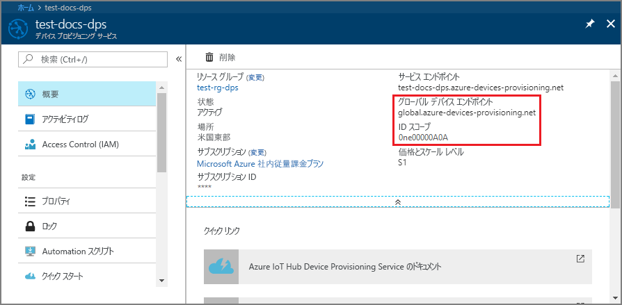
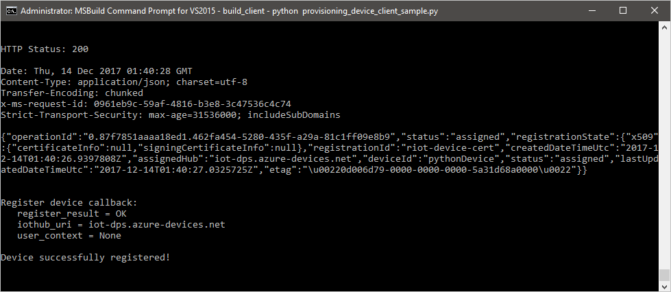

# <a name="quickstart-create-and-provision-a-simulated-x509-device-using-python-device-sdk-for-iot-hub-device-provisioning-service"></a>クイック スタート:IoT Hub Device Provisioning Service 対応の Python デバイス SDK を使用して、シミュレートされた X.509 デバイスを作成してプロビジョニングする

[!INCLUDE [iot-dps-selector-quick-create-simulated-device-x509](../../includes/iot-dps-selector-quick-create-simulated-device-x509.md)]

このクイックスタートでは、シミュレートされた X.509 デバイスを Windows コンピューターに作成しました。 デバイス サンプル Python コードから、Device Provisioning Service (DPS) への個別登録を使用して、このシミュレートされたデバイスを IoT ハブに接続します。

## <a name="prerequisites"></a>前提条件

- [自動プロビジョニングの概念](concepts-auto-provisioning.md)の確認。
- [Azure portal での IoT Hub Device Provisioning Service の設定](./quick-setup-auto-provision.md)が完了していること。
- アクティブなサブスクリプションが含まれる Azure アカウント。 [無料で作成できます](https://azure.microsoft.com/free/?ref=microsoft.com&utm_source=microsoft.com&utm_medium=docs&utm_campaign=visualstudio)。
- [Visual Studio 2015 以上](https://visualstudio.microsoft.com/vs/) (C++ によるデスクトップ開発が有効であること)。
- [CMake ビルド システム](https://cmake.org/download/)
- [Git](https://git-scm.com/download/).

> [!IMPORTANT]
> この記事は、非推奨となっている V1 Python SDK にのみ適用されます。 V2 では、Iot Hub Device Provisioning Service 用のデバイス クライアントとサービス クライアントはまだ利用できません。 チームは現在、V2 を機能パリティに移行する作業に取り組んでいます。

[!INCLUDE [IoT Device Provisioning Service basic](../../includes/iot-dps-basic.md)]

## <a name="prepare-the-environment"></a>環境の準備 

1. 'C++ によるデスクトップ開発' ワークロードが Visual Studio インストールに対して有効になった [Visual Studio](https://visualstudio.microsoft.com/vs/) 2015 以降がインストールされていることを確認してください。

2. [CMake ビルド システム](https://cmake.org/download/)をダウンロードしてインストールします。

3. マシンに `git` がインストールされ、コマンド ウィンドウからアクセスできる環境変数に追加されていることを確認します。 **Git Bash** (ローカル Git リポジトリと対話する際に使用するコマンドライン アプリ) など、インストールする各種 `git` ツールの最新バージョンについては、[Software Freedom Conservancy の Git クライアント ツール](https://git-scm.com/download/)に関するページを参照してください。 

4. コマンド プロンプトまたは Git Bash を開きます。 デバイス シミュレーション コード サンプルの GitHub リポジトリを複製します。
    
    ```cmd/sh
    git clone https://github.com/Azure/azure-iot-sdk-python.git --recursive
    ```

5. この GitHub リポジトリのローカル コピーに、CMake ビルド プロセス用のフォルダーを作成します。 

    ```cmd/sh
    cd azure-iot-sdk-python/c
    mkdir cmake
    cd cmake
    ```

6. 次のコマンドを実行して、プロビジョニング クライアントの Visual Studio ソリューションを作成します。

    ```cmd/sh
    cmake -Duse_prov_client:BOOL=ON ..
    ```


## <a name="create-a-self-signed-x509-device-certificate-and-individual-enrollment-entry"></a>自己署名 X.509 デバイス証明書と個々の登録エントリを作成する

このセクションでは、自己署名 X.509 証明書を使用します。 次の点に注意することが重要です。

* 自己署名証明書はテスト目的専用であるため、運用環境では使用しないでください。
* 自己署名証明書の既定の有効期限は 1 年間です。

Azure IoT C SDK のサンプル コードを使用して、シミュレートされたデバイスの個々の登録エントリで使用する証明書を作成します。

Azure IoT Device Provisioning Service では、次の 2 種類の登録がサポートされています。

- [登録グループ](concepts-service.md#enrollment-group)：複数の関連するデバイスを登録するために使用します。
- [個別登録](concepts-service.md#individual-enrollment): 単一デバイスを登録するために使用します。

この記事では、個別登録の使用方法を示します。

1. *cmake* フォルダーに生成されたソリューション (`azure_iot_sdks.sln`) を開き、Visual Studio でビルドします。

2. **Provision\_Tools** フォルダーの **dice\_device\_enrollment** プロジェクトを右クリックし、 **[スタートアップ プロジェクトに設定]** を選択します。 ソリューションを実行する 

3. 出力ウィンドウで、確認を求められたら個々の登録について「`i`」と入力します。 シミュレートされたデバイスについて、ローカルで生成された X.509 証明書が出力ウィンドウに表示されます。 
    
    最初の証明書をクリップボードにコピーします。 初めて見つかった次の行から始めます。
    
        -----BEGIN CERTIFICATE----- 
        
    次の行が初めて見つかったらコピーを終了します。
    
        -----END CERTIFICATE-----
        
    この両方の行も含めるようにしてください。 

    
 
4. ご使用の Windows マシンに **_X509testcertificate.pem_** という名前のファイルを作成して任意のエディターで開き、クリップボードの内容をこのファイルにコピーします。 ファイルを保存します。 

5. Azure portal にサインインし、左側のメニューにある **[すべてのリソース]** を選択してプロビジョニング サービスを開きます。

6. Device Provisioning Service のメニューで、 **[登録を管理します]** を選択します。 **[個々の登録]** タブを選択したうえで、上部にある **[個別登録の追加]** を選択します。 

7. **[登録の追加]** パネルで、次の情報を入力します。
   - ID 構成証明の "*メカニズム*" として **[X.509]** を選択します。
   - *[プライマリ証明書の .pem ファイルまたは .cer ファイル]* の *[ファイルの選択]* を選択し、前の手順で作成した証明書ファイル **X509testcertificate.pem** を選択します。
   - 必要に応じて、次の情報を入力することができます。
     - プロビジョニング サービスにリンクされた IoT ハブを選択します。
     - 一意のデバイス ID を入力します。 デバイスに名前を付ける際に機密データを含めないようにしてください。 
     - **[Initial device twin state]\(初期のデバイス ツインの状態\)** をデバイスの目的の初期構成で更新します。
   - 作業が完了したら、 **[保存]** を押します。 

     [](./media/python-quick-create-simulated-device-x509/device-enrollment.png#lightbox)

   登録に成功すると、 *[個々の登録]* タブの *[登録 ID]* 列に X.509 デバイスが **riot-device-cert** として表示されます。 

## <a name="simulate-the-device"></a>デバイスをシミュレートする

1. Device Provisioning Service のメニューで、 **[概要]** を選択します。 _[ID スコープ]_ と _[グローバル サービス エンドポイント]_ をメモします。

    

2. [Python 2.x または 3.x](https://www.python.org/downloads/) をダウンロードしてインストールします。 必ず、セットアップに必要な 32 ビットまたは 64 ビットのインストールを使用してください。 インストール中に求められた場合は、プラットフォーム固有の環境変数に Python を追加します。 Python 2.x を使用している場合は、[*pip* (Python パッケージ管理システム) のインストールまたはアップグレード](https://pip.pypa.io/en/stable/installing/)が必要な場合があります。
    
    > [!NOTE] 
    > Windows を使用している場合は、[Visual Studio 2015 の Visual C++ 再頒布可能パッケージ](https://support.microsoft.com/help/2977003/the-latest-supported-visual-c-downloads)もインストールしてください。 pip パッケージで C の DLL を読み込んだり実行したりするには再頒布可能パッケージが必要となります。

3. [これらの手順](https://github.com/Azure/azure-iot-sdk-python/blob/v1-deprecated/doc/python-devbox-setup.md)に従って、Python パッケージをビルドします。

   > [!NOTE]
   > `pip` を使用する場合は、`azure-iot-provisioning-device-client` パッケージもインストールされていることを確認してください。

4. samples フォルダーに移動します。

    ```cmd/sh
    cd azure-iot-sdk-python/provisioning_device_client/samples
    ```

5. Python IDE を使用して、**provisioning\_device\_client\_sample.py** という名前の Python スクリプトを編集します。 _GLOBAL\_PROV\_URI_ 変数と _ID\_SCOPE_ 変数を前述の値に変更します。

    ```python
    GLOBAL_PROV_URI = "{globalServiceEndpoint}"
    ID_SCOPE = "{idScope}"
    SECURITY_DEVICE_TYPE = ProvisioningSecurityDeviceType.X509
    PROTOCOL = ProvisioningTransportProvider.HTTP
    ```

6. サンプルを実行します。 

    ```cmd/sh
    python provisioning_device_client_sample.py
    ```

7. アプリケーションが接続され、デバイスが登録され、登録成功メッセージが表示されます。

    

8. ポータルで、ご利用のプロビジョニング サービスにリンクされている IoT Hub に移動し、 **[Device Explorer]** ブレードを開きます。 シミュレートされた X.509 デバイスをハブにプロビジョニングすると、そのデバイス ID が**有効**な "*状態*" として **[Device Explorer]** ブレードに表示されます。 サンプル デバイス アプリケーションを稼働させる前にこのブレードを開いていた場合は、一番上にある **[最新の情報に更新]** を押すことが必要になる場合があります。 

     

> [!NOTE]
> *[Initial device twin state]\(初期のデバイス ツインの状態\)* をデバイスの登録エントリの既定値から変更した場合、デバイスはハブから目的のツインの状態をプルし、それに従って動作することができます。 詳細については、「[IoT Hub のデバイス ツインの理解と使用](../iot-hub/iot-hub-devguide-device-twins.md)」を参照してください。
>

## <a name="clean-up-resources"></a>リソースをクリーンアップする

引き続きデバイス クライアント サンプルを使用する場合は、このクイックスタートで作成したリソースをクリーンアップしないでください。 使用する予定がない場合は、次の手順を使用して、このクイックスタートで作成したすべてのリソースを削除してください。

1. マシンに表示されているデバイス クライアント サンプルの出力ウィンドウを閉じます。
2. Azure portal の左側のメニューで **[すべてのリソース]** を選択し、Device Provisioning Service を選択します。 サービスの **[登録を管理します]** ブレードを開き、 **[個々の登録]** タブを選択します。このクイックスタートで登録したデバイスの "*登録 ID*" の隣にあるチェック ボックスをオンにして、ペイン上部の **[削除]** を押します。 
3. Azure portal の左側のメニューにある **[すべてのリソース]** を選択し、IoT ハブを選択します。 ハブの **[IoT デバイス]** ブレードを開き、このクイックスタートで登録したデバイスの "*デバイス ID*" の隣にあるチェック ボックスをオンにして、ペイン上部の **[削除]** を押します。

## <a name="next-steps"></a>次のステップ

このクイックスタートでは、ポータルでシミュレートされた X.509 デバイスを Windows マシン上に作成し、Azure IoT Hub Device Provisioning Service を使用して IoT ハブにプロビジョニングしました。 プログラムで X.509 デバイスを登録する方法については、プログラムによる X.509 デバイスの登録のクイックスタートに進みます。 

> [!div class="nextstepaction"]
> [Azure クイックスタート - X.509 デバイスを Azure IoT Hub Device Provisioning Service に登録する](quick-enroll-device-x509-python.md)
