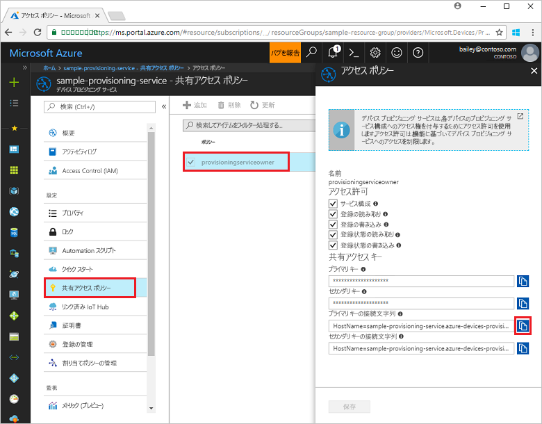
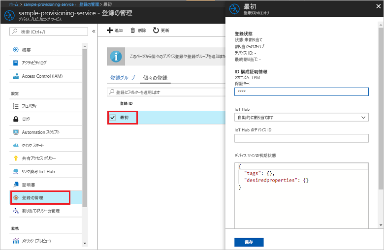

# <a name="quickstart-enroll-tpm-device-to-iot-hub-device-provisioning-service-using-nodejs-service-sdk"></a>クイック スタート:Node.js Service SDK を使用して TPM デバイスを IoT Hub Device Provisioning Service に登録する

[!INCLUDE [iot-dps-selector-quick-enroll-device-tpm](../../includes/iot-dps-selector-quick-enroll-device-tpm.md)]

このクイックスタートでは、Node.js Service SDK とサンプル Node.js アプリケーションを使用して、Azure IoT Hub Device Provisioning Service で TPM デバイスの個別登録をプログラムで作成します。 必要に応じて、この個々の登録エントリを使用して、シミュレートされた TPM デバイスをプロビジョニング サービスに登録することができます。

## <a name="prerequisites"></a>前提条件

- [Azure portal での IoT Hub Device Provisioning Service の設定](./quick-setup-auto-provision.md)が完了していること。
- アクティブなサブスクリプションが含まれる Azure アカウント。 [無料で作成できます](https://azure.microsoft.com/free/?ref=microsoft.com&utm_source=microsoft.com&utm_medium=docs&utm_campaign=visualstudio)。
- [Node.js v4.0 以上](https://nodejs.org)。 このクイックスタートの中で、後から [Node.js Service SDK](https://github.com/Azure/azure-iot-sdk-node) をインストールします。
- 保証キー (省略可)。 このキーは、[シミュレートされたデバイスの作成とプロビジョニング](quick-create-simulated-device.md)に関するページの手順に従って取得します。 Azure portal を使用して個別登録を作成しないでください。

## <a name="create-the-individual-enrollment-sample"></a>個々の登録サンプルを作成する 

 
1. 作業フォルダーのコマンド ウィンドウから次のコマンドを実行します。
  
    ```cmd\sh
    npm install azure-iot-provisioning-service
    ```  

2. テキスト エディターを使用して、作業フォルダーに **create_individual_enrollment.js** ファイルを作成します。 次のコードをファイルに追加して保存します。

    ```
    'use strict';

    var provisioningServiceClient = require('azure-iot-provisioning-service').ProvisioningServiceClient;

    var serviceClient = provisioningServiceClient.fromConnectionString(process.argv[2]);
    var endorsementKey = process.argv[3];

    var enrollment = {
      registrationId: 'first',
      attestation: {
        type: 'tpm',
        tpm: {
          endorsementKey: endorsementKey
        }
      }
    };

    serviceClient.createOrUpdateIndividualEnrollment(enrollment, function(err, enrollmentResponse) {
      if (err) {
        console.log('error creating the individual enrollment: ' + err);
      } else {
        console.log("enrollment record returned: " + JSON.stringify(enrollmentResponse, null, 2));
      }
    });
    ```

## <a name="run-the-individual-enrollment-sample"></a>個々の登録サンプルを実行する
  
1. サンプルを実行するには、プロビジョニング サービスの接続文字列が必要です。 
    1. Azure portal にサインインし、左側のメニューの **[すべてのリソース]** を選択して、Device Provisioning Service を開きます。 
    2. **[共有アクセス ポリシー]** を選択して、プロパティを開くために使用するアクセス ポリシーを選択します。 **[アクセス ポリシー]** ウィンドウで、主キーの接続文字列をコピーしてメモします。 

        


2. デバイスの保証キーも必要です。 [シミュレートされたデバイスの作成とプロビジョニング](quick-create-simulated-device.md)のクイックスタートに従ってシミュレートされた TPM デバイスを作成した場合は、そのデバイス用に作成されたキーを使用します。 それ以外の場合でサンプルの個別登録を作成するには、[Node.js Service SDK](https://github.com/Azure/azure-iot-sdk-node) に付属している次の保証キーを使用できます。

    ```
    AToAAQALAAMAsgAgg3GXZ0SEs/gakMyNRqXXJP1S124GUgtk8qHaGzMUaaoABgCAAEMAEAgAAAAAAAEAxsj2gUScTk1UjuioeTlfGYZrrimExB+bScH75adUMRIi2UOMxG1kw4y+9RW/IVoMl4e620VxZad0ARX2gUqVjYO7KPVt3dyKhZS3dkcvfBisBhP1XH9B33VqHG9SHnbnQXdBUaCgKAfxome8UmBKfe+naTsE5fkvjb/do3/dD6l4sGBwFCnKRdln4XpM03zLpoHFao8zOwt8l/uP3qUIxmCYv9A7m69Ms+5/pCkTu/rK4mRDsfhZ0QLfbzVI6zQFOKF/rwsfBtFeWlWtcuJMKlXdD8TXWElTzgh7JS4qhFzreL0c1mI0GCj+Aws0usZh7dLIVPnlgZcBhgy1SSDQMQ==
    ```

3. TPM デバイスの個々の登録を作成するには、次のコマンドを実行します (コマンド引数は引用符で囲みます)。
 
     ```cmd\sh
     node create_individual_enrollment.js "<the connection string for your provisioning service>" "<endorsement key>"
     ```
 
3. 作成が正常に完了すると、コマンド ウィンドウに新しい個々の登録のプロパティが表示されます。

     

4. 個々の登録が作成されたことを確認します。 Azure Portal の Device Provisioning Service の概要ブレードで、 **[登録を管理します]** を選択します。 **[個々の登録]** タブを選択し、新しい登録エントリ (*1 つ目*) を選択して、エントリの保証キーと他のプロパティを確認します。

     
 
TPM デバイスの個々の登録を作成したので、シミュレートされたデバイスを登録する場合は、[シミュレートされたデバイスの作成とプロビジョニング](quick-create-simulated-device.md)に関するページに記載されている残りの手順を続行できます。 そのクイックスタートでは、Azure portal を使用して個々の登録を作成する手順はスキップしてください。

## <a name="clean-up-resources"></a>リソースをクリーンアップする
Node.js サービスのサンプルを調べる予定の場合は、このクイックスタートで作成したリソースをクリーンアップしないでください。 使用する予定がない場合は、次の手順を使用して、このクイックスタートで作成したすべてのリソースを削除してください。

1. マシンに表示されている Node.js サンプルの出力ウィンドウを閉じます。
1. シミュレートされた TPM デバイスを作成した場合は、TPM シミュレーター ウィンドウを閉じます。
2. Azure portal で Device Provisioning サービスに移動し、 **[登録を管理します]** を選択し、 **[個々の登録]** タブを選択します。このクイックスタートを使用して作成した登録エントリの "*登録 ID*" の横にあるチェック ボックスをオンにして、ペイン上部の **[削除]** を押します。 
 
## <a name="next-steps"></a>次のステップ
このクイックスタートでは、TPM デバイスの個々の登録エントリをプログラムで作成し、TPM のシミュレートされたデバイスをマシンに作成し、Azure IoT Hub Device Provisioning Service を使って IoT ハブにプロビジョニングしました。 Device Provisioning に関する理解をさらに深めるには、Azure Portal における Device Provisioning Service の設定に関するチュートリアルに進んでください。 
 
> [!div class="nextstepaction"]
> [Azure IoT Hub Device Provisioning Service のチュートリアル](./tutorial-set-up-cloud.md)