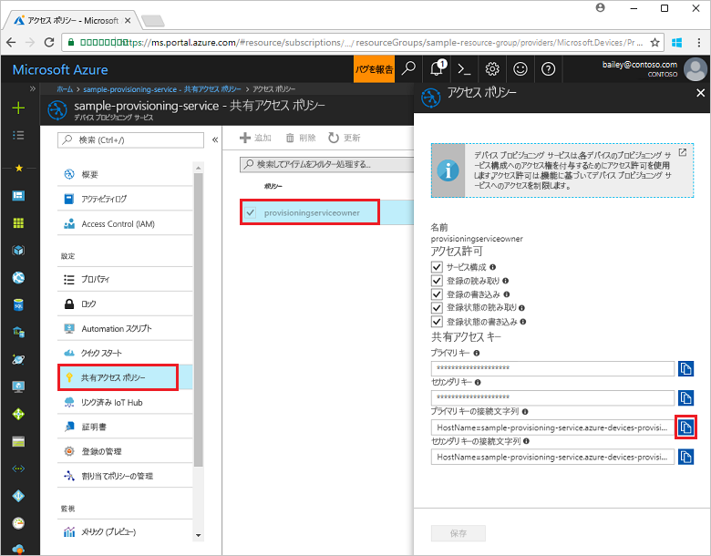
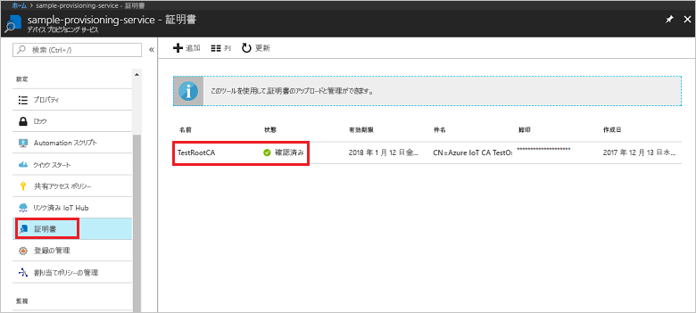

# <a name="quickstart-enroll-x509-devices-to-the-device-provisioning-service-using-nodejs"></a>クイック スタート:Node.js を使用して X.509 デバイスを Device Provisioning Service に登録する

[!INCLUDE [iot-dps-selector-quick-enroll-device-x509](../../includes/iot-dps-selector-quick-enroll-device-x509.md)]

このクイックスタートでは、Node.js を使用して中間またはルートの CA の X.509 証明書を使用する登録グループをプログラムで作成します。 登録グループは IoT SDK for Node.js と Node.js のサンプル アプリケーションを使用して作成されます。

## <a name="prerequisites"></a>前提条件

- [Azure portal での IoT Hub Device Provisioning Service の設定](./quick-setup-auto-provision.md)が完了していること。
- アクティブなサブスクリプションが含まれる Azure アカウント。 [無料で作成できます](https://azure.microsoft.com/free/?ref=microsoft.com&utm_source=microsoft.com&utm_medium=docs&utm_campaign=visualstudio)。
- [Node.js v4.0 以上](https://nodejs.org)。 このクイックスタートの中で、後から [IoT SDK for Node.js](https://github.com/Azure/azure-iot-sdk-node) をインストールします。
- [Git](https://git-scm.com/download/).
- [Azure IoT C SDK](https://github.com/Azure/azure-iot-sdk-c).

## <a name="prepare-test-certificates"></a>テスト証明書を準備する

このクイック スタートでは、中間またはルートの CA の X.509 証明書の公開部分が含まれる .pem ファイルまたは .cer が必要です。 この証明書はプロビジョニング サービスにアップロードされ、サービスによって検証される必要があります。

Azure IoT Hub と Device Provisioning Service と共に X.509 証明書ベースの公開キー基盤 (PKI) を使用する方法について詳しくは、[X.509 CA 証明書セキュリティの概要](https://docs.microsoft.com/azure/iot-hub/iot-hub-x509ca-overview)に関するページを参照してください。

[Azure IoT C SDK](https://github.com/Azure/azure-iot-sdk-c) には、X.509 証明書チェーンを作成し、そのチェーンからルートまたは中間証明書をアップロードし、サービスで所有証明を実行して証明書を検証するために役立つテスト ツールが含まれています。 SDK ツールで作成される証明書は、**開発テストにのみ**使用するよう設計されています。 これらの証明書は**運用環境では使用しないでください**。 30 日後に有効期限が切れるハード コーディングされたパスワード ("1234") が含まれます。 運用環境での使用に適した証明書の取得について詳しくは、Azure IoT Hub ドキュメントの「[X.509 CA 証明書の入手方法](https://docs.microsoft.com/azure/iot-hub/iot-hub-x509ca-overview#how-to-get-an-x509-ca-certificate)」をご覧ください。

このテスト ツールを使用して証明書を生成するには、次の手順を実行します。
 
1. Azure IoT C SDK の[最新リリース](https://github.com/Azure/azure-iot-sdk-c/releases/latest)のタグ名を見つけます。

2. コマンド プロンプトまたは Git Bash シェルを開き、お使いのコンピューターの作業フォルダーに変更します。 次のコマンドを実行して、最新リリースの [Azure IoT C SDK](https://github.com/Azure/azure-iot-sdk-c) GitHub リポジトリを複製します。 `-b` パラメーターの値として、前の手順で見つけたタグを使用します。

    ```cmd/sh
    git clone -b <release-tag> https://github.com/Azure/azure-iot-sdk-c.git
    cd azure-iot-sdk-c
    git submodule update --init
    ```

    この操作は、完了するまでに数分かかります。

   テスト ツールは複製したリポジトリの *azure-iot-sdk-c/tools/CACertificates* にあります。

3. 「[Managing test CA certificates for samples and tutorials](https://github.com/Azure/azure-iot-sdk-c/blob/master/tools/CACertificates/CACertificateOverview.md)」(サンプルおよびチュートリアルのためのテスト用 CA 証明書の管理) の手順に従います。 


## <a name="create-the-enrollment-group-sample"></a>登録グループのサンプルを作成する 

Azure IoT Device Provisioning Service では、次の 2 種類の登録がサポートされています。

- [登録グループ](concepts-service.md#enrollment-group)：複数の関連するデバイスを登録するために使用します。
- [個別登録](concepts-service.md#individual-enrollment): 単一デバイスを登録するために使用します。

登録グループでは、証明書チェーン内の共通の署名証明書を共有するデバイスに関してプロビジョニング サービスへのアクセスを制御します。 詳細については、「[X.509 証明書を使用してプロビジョニング サービスへのデバイスのアクセスを制御する](./concepts-security.md#controlling-device-access-to-the-provisioning-service-with-x509-certificates)」を参照してください。
 
1. 作業フォルダーのコマンド ウィンドウから次のコマンドを実行します。
  
     ```cmd\sh
     npm install azure-iot-provisioning-service
     ```  

2. テキスト エディターを使用して、作業フォルダーに **create_enrollment_group.js** ファイルを作成します。 次のコードをファイルに追加して保存します。

    ```
    'use strict';
    var fs = require('fs');

    var provisioningServiceClient = require('azure-iot-provisioning-service').ProvisioningServiceClient;

    var serviceClient = provisioningServiceClient.fromConnectionString(process.argv[2]);

    var enrollment = {
      enrollmentGroupId: 'first',
      attestation: {
        type: 'x509',
        x509: {
          signingCertificates: {
            primary: {
              certificate: fs.readFileSync(process.argv[3], 'utf-8').toString()
            }
          }
        }
      },
      provisioningStatus: 'disabled'
    };

    serviceClient.createOrUpdateEnrollmentGroup(enrollment, function(err, enrollmentResponse) {
      if (err) {
        console.log('error creating the group enrollment: ' + err);
      } else {
        console.log("enrollment record returned: " + JSON.stringify(enrollmentResponse, null, 2));
        enrollmentResponse.provisioningStatus = 'enabled';
        serviceClient.createOrUpdateEnrollmentGroup(enrollmentResponse, function(err, enrollmentResponse) {
          if (err) {
            console.log('error updating the group enrollment: ' + err);
          } else {
            console.log("updated enrollment record returned: " + JSON.stringify(enrollmentResponse, null, 2));
          }
        });
      }
    });
    ```

## <a name="run-the-enrollment-group-sample"></a>登録グループのサンプルを実行する
 
1. サンプルを実行するには、プロビジョニング サービスの接続文字列が必要です。 
    1. Azure portal にサインインし、左側のメニューの **[すべてのリソース]** を選択して、Device Provisioning Service を開きます。 
    2. **[共有アクセス ポリシー]** をクリックして、プロパティを開くために使用するアクセス ポリシーを選択します。 **[アクセス ポリシー]** ウィンドウで、主キーの接続文字列をコピーしてメモします。 

        


3. 「[テスト証明書を準備する](quick-enroll-device-x509-node.md#prepare-test-certificates)」に記載されているように、プロビジョニング サービスにアップロードされ検証された X.509 中間またはルート CA 証明書を含む .pem ファイルも必要です。 証明書がアップロードされ、検証済みであることを確認するには、Azure portal の Device Provisioning Service の概要ページで **[証明書]** を選択します。 グループの登録に使用する証明書を見つけ、その状態値が*検証済み*であることを確認します。

     

1. 証明書の[登録グループ](concepts-service.md#enrollment-group)を作成するには、次のコマンドを実行します (コマンド引数は引用符で囲みます)。
 
     ```cmd\sh
     node create_enrollment_group.js "<the connection string for your provisioning service>" "<your certificate's .pem file>"
     ```
 
3. 作成が正常に完了すると、コマンド ウィンドウに新しい登録グループのプロパティが表示されます。

     

4. 登録グループが作成されていることを確認します。 Azure Portal の Device Provisioning Service の概要ブレードで、 **[登録を管理します]** を選択します。 **[登録グループ]** タブを選択し、新しい登録エントリ (*1 つ目*) があることを確認します。

     
 
## <a name="clean-up-resources"></a>リソースをクリーンアップする
Node.js サービスのサンプルを調べる予定の場合は、このクイックスタートで作成したリソースをクリーンアップしないでください。 使用する予定がない場合は、次の手順を使用して、このクイックスタートで作成したすべての Azure リソースを削除してください。
 
1. マシンに表示されている Node.js サンプルの出力ウィンドウを閉じます。
2. Azure portal で Device Provisioning Service に移動し、 **[登録を管理します]** 、 **[登録グループ]** タブの順に選択します。このクイックスタートを使用して登録した X.509 デバイスの "*グループ名*" の隣にあるチェック ボックスをオンにして、ペイン上部にある **[削除]** を押します。    
3. Azure portal の Device Provisioning サービスから、 **[証明書]** を選択し、このクイックスタート用にアップロードした証明書を選択したら、 **[証明書の詳細]** ウィンドウの上部にある **[削除]** を押します。  
 
## <a name="next-steps"></a>次のステップ

このクイックスタートでは、Azure IoT Hub Device Provisioning Service を使用して X.509 中間またはルート CA 証明書のグループ登録を作成しました。 Device Provisioning に関する理解をさらに深めるには、Azure Portal における Device Provisioning Service の設定に関するチュートリアルに進んでください。 

[Node.js デバイス プロビジョニング サンプル](https://github.com/Azure/azure-iot-sdk-node/tree/master/provisioning/device/samples)も参照してください。
 
> [!div class="nextstepaction"]
> [Azure IoT Hub Device Provisioning Service のチュートリアル](./tutorial-set-up-cloud.md)
