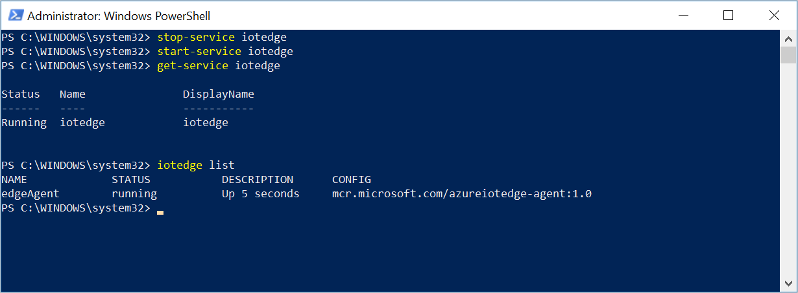

# <a name="quickstart-deploy-your-first-iot-edge-module-to-a-virtual-windows-device"></a>クイック スタート:初めての IoT Edge モジュールを仮想 Windows デバイスにデプロイする

このクイックスタートでは、コンテナー化されたコードを IoT Edge 仮想デバイスにデプロイして、Azure IoT Edge をテストします。 IoT Edge を使用すると、ご利用のデバイス上のコードをリモートで管理できるため、より多くのワークロードをエッジに送信できます。 このクイックスタートでは、IoT Edge デバイス用に Azure 仮想マシンを使用することをお勧めします。これにより、テスト マシンをすばやく作成し、前提条件をインストールし、さらにテストが完了したら削除することができます。 

このクイック スタートでは、次の方法について説明します。

1. IoT Hub を作成します。
2. IoT Edge デバイスを IoT ハブに登録します。
3. IoT Edge ランタイムをご自分の仮想デバイスにインストールして開始します。
4. モジュールを IoT Edge デバイスにリモートでデプロイし、テレメトリを IoT Hub に送信します。


このクイックスタートでは、Windows 仮想マシンを作成し、IoT Edge デバイスになるように構成する手順について説明します。 その後、モジュールを Azure portal からご自身のデバイスに展開できます。 このクイック スタートで展開するモジュールは、温度、湿度、および圧力のデータを生成するシミュレートされたセンサーです。 その他の Azure IoT Edge チュートリアルは、ここで行う作業を基盤としており、ビジネスに関する分析情報を得るためにシミュレートされたデータを分析するモジュールを展開します。

アクティブな Azure サブスクリプションをお持ちでない場合は、開始する前に[無料アカウント](https://azure.microsoft.com/free)を作成してください。

[!INCLUDE [cloud-shell-try-it.md](../../includes/cloud-shell-try-it.md)]

このクイック スタートの多くの手順は、Azure CLI を使用して実行します。Azure IoT には、追加機能を有効にする拡張機能が用意されています。

Azure IoT の拡張機能を Cloud Shell インスタンスに追加します。

   ```azurecli-interactive
   az extension add --name azure-cli-iot-ext
   ```

## <a name="prerequisites"></a>前提条件

クラウド リソース:

* このクイック スタートで使用するすべてのリソースを管理するためのリソース グループです。

   ```azurecli-interactive
   az group create --name IoTEdgeResources --location westus2
   ```

IoT Edge デバイス:

* IoT Edge デバイスとして機能する Windows 仮想マシン。 この仮想マシンを作成するには、次のコマンドを使用します。 *{password}* は、セキュリティで保護されたパスワードに置き換えます。

  ```azurecli-interactive
  az vm create --resource-group IoTEdgeResources --name EdgeVM --image MicrosoftWindowsDesktop:Windows-10:rs5-pro:latest --admin-username azureuser --admin-password {password} --size Standard_DS1_v2
  ```

  新しい仮想マシンを作成して起動するまでに数分かかる場合があります。 その後、仮想マシンに接続するときに使用するための RDP ファイルをダウンロードできます。

  1. Azure portal で、新しい Windows 仮想マシンに移動します。
  1. **[接続]** を選択します。
  1. **[RDP]** タブで、 **[RDP ファイルのダウンロード]** を選択します。

  リモート デスクトップ接続でこのファイルを開き、`az vm create` コマンドで指定した管理者名とパスワードを使用して Windows 仮想マシンに接続します。


> [!NOTE]
> このクイックスタートでは、わかりやすくするための Windows デスクトップの仮想マシンを使用します。 運用シナリオ向けに一般提供されている Windows オペレーティング システムについては、「[Azure IoT Edge のサポートされるシステム](support.md)」を参照してください。
>
> IoT Core を実行しているデバイスなど、IoT Edge 用に独自の Windows デバイスを構成する準備ができたら、「[Windows に Azure IoT Edge ランタイムをインストールする](how-to-install-iot-edge-windows.md)」の手順を行います。

## <a name="create-an-iot-hub"></a>IoT Hub の作成

このクイック スタートでは、最初に Azure CLI を使用して IoT ハブを作成します。


このクイック スタートでは無料レベルの IoT Hub を使用できます。 IoT Hub を以前に使用したことがあり、無料のハブを作成済みである場合は、その IoT ハブを使用できます。 各サブスクリプションで使用できる無料 IoT ハブは 1 つのみです。

次のコードにより、無料の **F1** ハブがリソース グループ **IoTEdgeResources** に作成されます。 *{hub_name}* は、IoT ハブの一意の名前に置き換えてください。

   ```azurecli-interactive
   az iot hub create --resource-group IoTEdgeResources --name {hub_name} --sku F1
   ```

   サブスクリプションに無料のハブが既に 1 つあるためにエラーが発生する場合は、SKU を **S1** に変更します。 IoT ハブの名前が利用できないというエラーが発生した場合、自分以外のだれかが既にその名前のハブを所有していることを意味します。 新しい名前を試してください。

## <a name="register-an-iot-edge-device"></a>IoT Edge デバイスを登録する

新しく作成された IoT ハブに IoT Edge デバイスを登録します。


お使いの IoT ハブと通信できるようにシミュレートされたデバイスのデバイス ID を作成します。 デバイス ID はクラウドに置かれるので、デバイスの一意の接続文字列を使用して、物理デバイスとデバイス ID とを関連付けることになります。

IoT Edge デバイスは、一般的な IoT デバイスとは異なる動作をし、別に管理できるため、この ID は IoT Edge デバイス用として `--edge-enabled` フラグで宣言します。

1. Azure Cloud Shell で、次のコマンドを入力して、**myEdgeDevice** という名前のデバイスをハブに作成します。

   ```azurecli-interactive
   az iot hub device-identity create --device-id myEdgeDevice --hub-name {hub_name} --edge-enabled
   ```

   iothubowner ポリシー キーに関するエラーが表示された場合は、Cloud Shell で最新バージョンの azure-cli-iot-ext 拡張機能が実行されていることを確認してください。

2. デバイスの接続文字列を取得します。この接続文字列により、IoT Hub 内で物理デバイスとその ID をリンクさせます。

   ```azurecli-interactive
   az iot hub device-identity show-connection-string --device-id myEdgeDevice --hub-name {hub_name}
   ```

3. JSON 出力から `connectionString` キーの値をコピーして保存します。 この値はデバイスの接続文字列です。 次のセクションでは、この接続文字列を使用して IoT Edge ランタイムを構成します。

   

## <a name="install-and-start-the-iot-edge-runtime"></a>IoT Edge ランタイムをインストールして開始する

Azure IoT Edge ランタイムを IoT Edge デバイスにインストールし、デバイスの接続文字列を使用してその構成を行います。


IoT Edge ランタイムはすべての IoT Edge デバイスに展開されます。 これは 3 つのコンポーネントで構成されます。 **IoT Edge セキュリティ デーモン**は、IoT Edge デバイスが起動するたびに開始され、IoT Edge エージェントを起動してデバイスをブートストラップします。 **IoT Edge エージェント**は、IoT Edge ハブなど、IoT Edge デバイス上のモジュールのデプロイと監視を管理します。 **IoT Edge ハブ**は、IoT Edge デバイス上のモジュール間、およびデバイスと IoT ハブの間の通信を処理します。

インストール スクリプトには、IoT Edge デバイス上のコンテナー イメージを管理する Moby というコンテナー エンジンも含まれています。

ランタイムのインストール中に、デバイスの接続文字列を求められます。 Azure CLI から取得した文字列を使用してください。 この文字列によって、Azure 内の IoT Edge デバイス ID と物理デバイスとが関連付けられます。

### <a name="connect-to-your-iot-edge-device"></a>IoT Edge デバイスに接続する

このセクションの手順はすべて IoT Edge デバイス上で実行されるため、ここでリモート デスクトップ経由でその仮想マシンに接続します。

### <a name="install-and-configure-the-iot-edge-service"></a>IoT Edge サービスをインストールして構成する

PowerShell を使用して IoT Edge ランタイムをダウンロードし、インストールします。 IoT Hub から取得したデバイスの接続文字列を使用して、目的のデバイスを構成します。

1. まだの場合は、[新しい Azure IoT Edge デバイスの登録](how-to-register-device.md)に関するページの手順に従って、デバイスを登録し、デバイス接続文字列を取得します。

2. 仮想マシン内で、管理者として PowerShell を実行します。

   >[!NOTE]
   >IoT Edge をインストールするには、PowerShell (x86) ではなく PowerShell の AMD64 セッションを使用します。 どのセッションの種類を使用しているかがわからない場合は、次のコマンドを実行します。
   >
   >```powershell
   >(Get-Process -Id $PID).StartInfo.EnvironmentVariables["PROCESSOR_ARCHITECTURE"]
   >```

3. **Deploy-IoTEdge** コマンドを実行すると、ご使用の Windows マシンがサポートされているバージョンであることが確認され、コンテナーの機能が有効化され、Moby ランタイムがダウンロードされた後、IoT Edge ランタイムがダウンロードされます。

   ```powershell
   . {Invoke-WebRequest -useb aka.ms/iotedge-win} | Invoke-Expression; `
   Deploy-IoTEdge -ContainerOs Windows
   ```

4. 場合によってはマシンが自動的に再起動します。 Deploy-IoTEdge コマンドから再起動を促すメッセージが表示された場合は、再起動します。 

5. 再び PowerShell を管理者として実行します。

6. **Initialize-IoTEdge** コマンドを使用して、お使いのマシンに IoT Edge ランタイムを構成します。 このコマンドでは、Windows コンテナーを使用した手動プロビジョニングが既定で設定されます。 

   ```powershell
   . {Invoke-WebRequest -useb aka.ms/iotedge-win} | Invoke-Expression; `
   Initialize-IoTEdge -ContainerOs Windows
   ```

7. **DeviceConnectionString** を求められたら、前のセクションでコピーした文字列を入力します。 接続文字列の前後に引用符は含めないでください。

### <a name="view-the-iot-edge-runtime-status"></a>IoT Edge ランタイムの状態を確認する

ランタイムが正常にインストールされ、構成されていることを確認します。

1. IoT Edge サービスの状態を確認します。

   ```powershell
   Get-Service iotedge
   ```

2. サービスのトラブルシューティングが必要な場合は、サービス ログを取得します。

   ```powershell
   . {Invoke-WebRequest -useb aka.ms/iotedge-win} | Invoke-Expression; Get-IoTEdgeLog
   ```

3. IoT Edge デバイス上で実行されているすべてのモジュールを表示します。 初めてサービスが開始されたので、**edgeAgent** モジュールが実行されていることのみが確認できます。 edgeAgent モジュールは既定で実行され、デバイスにデプロイする追加モジュールのインストールと起動に役立ちます。

   ```powershell
   iotedge list
   ```

   

インストールが完了し、IoT Edge エージェント モジュールが起動するまでに数分かかる場合があります。

IoT Edge デバイスの構成はこれで完了です。 クラウドからモジュールをデプロイして実行することができます。

## <a name="deploy-a-module"></a>モジュールを展開する

Azure IoT Edge デバイスをクラウドから管理し、IoT Hub に利用統計情報を送信するモジュールをデプロイします。


[!INCLUDE [iot-edge-deploy-module](../../includes/iot-edge-deploy-module.md)]

## <a name="view-generated-data"></a>生成されたデータを表示する

このクイック スタートでは、新しい IoT Edge デバイスを登録し、そこに IoT Edge ランタイムをインストールしました。 その後、Azure portal を使用して、IoT Edge モジュールをデプロイし、デバイス自体を変更せずにモジュールをデバイスで実行しました。

この場合は、プッシュしたモジュールによって、テストに使用できるサンプル データが作成されます。 シミュレートされた温度センサー モジュールによって、後でテストに使用できる環境データが生成されます。 シミュレートされたセンサーは、マシンと、マシンの周囲の環境の両方を監視します。 たとえば、このセンサーは、サーバー ルーム、工場のフロア、または風力タービンに配置されている可能性があります。 メッセージには、周囲の温度と湿度、機械の温度と圧力、タイムスタンプが含まれます。 IoT Edge のチュートリアルでは、このモジュールによって作成されたデータを分析用のテスト データとして使用します。

IoT Edge デバイスで、クラウドからデプロイされたモジュールが実行されていることを確認します。

```powershell
iotedge list
```

   

温度センサー モジュールからクラウドに送信されているメッセージを確認します。

```powershell
iotedge logs SimulatedTemperatureSensor -f
```

   >[!TIP]
   >IoT Edge のコマンドでは、モジュール名を参照する際に大文字と小文字が区別されます。

   

[Visual Studio Code 用の Azure IoT Hub Toolkit の拡張機能](https://marketplace.visualstudio.com/items?itemName=vsciot-vscode.azure-iot-toolkit) (旧称: Azure IoT Toolkit 拡張機能) を使用して、IoT ハブに到着したメッセージを監視することもできます。

## <a name="clean-up-resources"></a>リソースのクリーンアップ

IoT Edge のチュートリアルに進む場合は、このクイック スタートで登録および設定したデバイスを使用できます。 それ以外の場合は、課金されないようにするために、作成した Azure リソースを削除してもかまいません。

新しいリソース グループで仮想マシンと IoT ハブを作成した場合、そのグループと関連するすべてのリソースを削除できます。 リソース グループの内容を再確認して、残しておくべきものがないことを確認してください。 グループ全体を削除したくない場合は、リソースを個別に削除してもかまいません。

**IoTEdgeResources** グループを削除します。

```azurecli-interactive
az group delete --name IoTEdgeResources
```

## <a name="next-steps"></a>次の手順

このクイック スタートでは、IoT Edge デバイスを作成し、Azure IoT Edge クラウド インターフェイスを使用してコードをデバイスにデプロイしました。 その環境に関する生データを生成するテスト デバイスができあがりました。

次の手順では、ビジネス ロジックを実行する IoT Edge モジュールの作成を開始できるように、ローカル開発環境を設定します。 

> [!div class="nextstepaction"]
> [Windows デバイス用の IoT Edge モジュールの開発を始める](tutorial-develop-for-windows.md)
