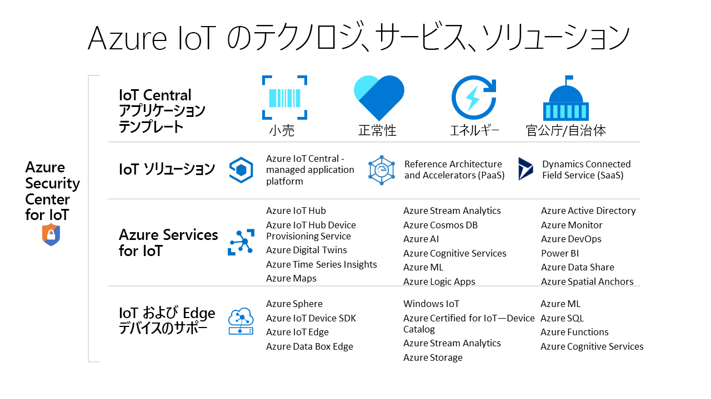

# IoT ソリューションを作成するための Azure のテクノロジとサービス

Azure IoT のテクノロジとサービスでは、組織のデジタル変革を実現するさまざまな IoT ソリューションを作成する方法を提供しています。 たとえば、次のように操作できます。

- マネージド IoT アプリケーション プラットフォームである [Azure IoT Central](https://apps.azureiotcentral.com) を使用して、エンタープライズレベルの安全な IoT ソリューションを作成してデプロイする。 IoT Central は、ソリューション開発プロセスを能率化する、業界 (小売、医療など) ごとの一連のアプリケーション テンプレートを備えています。
- Azure IoT [ソリューション アクセラレータ](https://www.azureiotsolutions.com)用にオープンソース コード ベースを拡張し、リモート監視や予測メンテナンスなどの一般的な IoT シナリオを実装する。
- [Azure IoT Hub](../iot-hub/about-iot-hub.md) や [Azure IoT device SDK](../iot-hub/iot-hub-devguide-sdks.md) などの Azure IoT プラットフォーム サービスを使用して、カスタム IoT ソリューションをゼロから作成する。

## Azure IoT Central

[IoT Central アプリケーション プラットフォーム](https://apps.azureiotcentral.com)は、エンタープライズレベルの IoT ソリューションの開発、管理、保守に伴う負担とコストを削減します。 IoT Central のカスタマイズ可能な Web UI で、デバイスの状態を監視し、ルールを作成して、ライフ サイクル全体を通して何百万ものデバイスとそのデータを管理することができます。 IoT Central 内の API サーフェスによりプログラムによるアクセスが可能になり、IoT ソリューションを構成したりそれらと連携したりすることができます。

Azure IoT Central は、カスタム IoT ソリューションの作成に使用できるフル マネージドのアプリケーション プラットフォームです。 ソリューションを作成するために、IoT Central では、アプリケーション テンプレートが使用されます。 汎用的なソリューションのためのテンプレートに加え、エネルギー、医療、行政、小売など、業界固有のテンプレートも用意されています。 IoT Central アプリケーション テンプレートを使用すると、IoT Central アプリケーションを数分でデプロイでき、その後、テーマ、ダッシュボード、ビューを使ってそれをカスタマイズすることができます。

[Azure Certified for IoT デバイス カタログ](https://catalog.azureiotsolutions.com)からデバイスを選択すれば、簡単に自分のソリューションに接続することができます。 IoT Central の Web UI を使用してデバイスを監視、管理することで、デバイスとその接続を正常な状態に保つことができます。 IoT Central アプリケーションを別のビジネス アプリケーションと統合するには、コネクタと API を使用します。

フル マネージドのアプリケーション プラットフォームとして、IoT Central にはシンプルで予測可能な価格モデルが採用されています。

## Azure IoT ソリューション アクセラレータ

[Azure IoT ソリューション アクセラレータ](https://www.azureiotsolutions.com)は、エンタープライズレベルのカスタマイズ可能なソリューションの集まりです。 それらのソリューションをそのままデプロイすることも、オープンソースの Java または .NET ソース コードを使用してカスタム IoT ソリューションを開発することもできます。

Azure IoT ソリューション アクセラレータは、IoT ソリューションを高度に制御する手段となります。 一般的な IoT シナリオを想定した事前構築済みのソリューションがソリューション アクセラレータには含まれており、ご利用の Azure サブスクリプションにそれらを数分でデプロイすることができます。 このシナリオには以下が含まれます。

  - リモート監視
  - コネクテッド ファクトリ
  - 予測的なメンテナンス
  - デバイスのシミュレーション

すべてのソリューション アクセラレータのオープンソースのコード ベースは GitHub で入手できます。 コードをダウンロードし、実際の IoT 要件に合わせてソリューション アクセラレータをカスタマイズしてください。

ソリューション アクセラレータには、Azure IoT Hub や Azure Storage などの Azure サービスが使用されており、それらのサービスについてはご自身の Azure サブスクリプションで管理する必要があります。

## カスタム ソリューション

IoT ソリューションをゼロから作成したり、IoT Central またはソリューション アクセラレータを使用して作成されたソリューションを拡張したりするには、以下に示した Azure IoT のテクノロジとサービスの 1 つ以上を使用します。

### デバイス

いずれかの [Azure IoT スタート キット](https://catalog.azureiotsolutions.com/kits)を使用して IoT デバイスを開発するか、または使用するデバイスを [Azure Certified for IoT デバイス カタログ](https://catalog.azureiotsolutions.com)から選択します。 オープンソースの[デバイス SDK](../iot-hub/iot-hub-devguide-sdks.md) を使用して埋め込みコードを実装します。 デバイス SDK は複数のオペレーティング システム (Linux、Windows など) およびリアルタイム オペレーティング システムをサポートしています。 [C](https://github.com/Azure/azure-iot-sdk-c)、[Node.js](https://github.com/Azure/azure-iot-sdk-node)、[Java](https://github.com/Azure/azure-iot-sdk-java)、[.NET](https://github.com/Azure/azure-iot-sdk-csharp)、[Python](https://github.com/Azure/azure-iot-sdk-python) など、複数のプログラミング言語用の SDK があります。

[IoT プラグ アンド プレイ プレビュー](../iot-pnp/overview-iot-plug-and-play.md) サービスを使用すれば、デバイス用の埋め込みコードの作成方法をさらに省力化できます。 IoT プラグ アンド プレイを使用することで、ソリューション開発者は埋め込みコードを記述することなく、自分のソリューションにデバイスを統合できます。 IoT プラグ アンド プレイの中核となるのは、デバイスの機能を記述する "_デバイス機能モデル_" スキーマです。 埋め込みデバイス コードを生成したり、クラウドベースのソリューション (IoT Central アプリケーションなど) を構成したりするには、このデバイス機能モデルを使用します。

[Azure IoT Edge](../iot-edge/about-iot-edge.md) では、IoT ワークロードの一部を Azure Cloud Services からデバイスにオフロードすることができます。 IoT Edge では、ソリューションでの待ち時間を短縮したり、デバイスとクラウドとの間でやり取りされるデータの量を削減したり、オフラインのシナリオを実現したりすることができます。 IoT Edge デバイスは、IoT Central やいくつかのソリューション アクセラレータから管理することができます。

[Azure Sphere](https://docs.microsoft.com/azure-sphere/product-overview/what-is-azure-sphere) とは、インターネットに接続されたデバイスのための通信およびセキュリティ機能が組み込まれている、セキュリティで保護された高水準のアプリケーション プラットフォームです。 セキュリティで保護されたマイクロコントローラー ユニット、カスタムの Linux ベース オペレーティングシステム、継続的で更新可能なセキュリティを提供するクラウドベースのセキュリティ サービスが含まれています。

### クラウドの接続

[Azure IoT Hub](../iot-hub/about-iot-hub.md) サービスは、何百万台もの IoT デバイスとクラウドベースのソリューションとの間で、セキュリティで保護された信頼性の高い双方向通信を実現します。 [Azure IoT Hub Device Provisioning Service](../iot-dps/about-iot-dps.md) は、IoT Hub のヘルパー サービスです。 このサービスでは、適切な IoT Hub に対し、デバイスの Just-In-Time プロビジョニングを人間が介入することなくゼロタッチで行えます。 これらの機能を利用すると、安全かつスケーラブルな方法で膨大な数のデバイスをプロビジョニングすることができます。

IoT Hub は、ソリューション アクセラレータの核となるコンポーネントです。これを使用すると、IoT 実装に伴う次のような課題を解決することができます。

* 大量のデバイスの接続と管理。
* 大量のテレメトリ インジェスト。
* コマンドとデバイスの制御。
* デバイスに対するセキュリティの強制。

### 物理世界とデジタル世界との橋渡しをする

[Azure Digital Twins](../digital-twins/about-digital-twins.md) は、物理環境をモデル化できるようにする IoT サービスです。 人、空間、デバイスの間の関係をモデル化する空間インテリジェンス グラフが使用されています。 デジタル世界と物理世界をまたいでデータを関連付けることで、コンテキスト認識ソリューションを作成することができます。

IoT Central はデジタル ツインを使用することで、現実世界のデバイスおよびデータをデジタル モデルと同期させます。そうして接続されたデバイスは、そのデジタル モデルを使用してユーザーが監視、管理することができます。

### データと分析

IoT デバイスは、一般的に、センサーからの温度の測定値など、時系列データを大量に生成します。 [Azure Time Series Insights](../time-series-insights/time-series-insights-overview.md) は、IoT ハブに接続してデバイスからのテレメトリ ストリームを読み取り、そのデータを保存します。ユーザーは、それを照会して可視化することができます。

[Azure Maps](/azure/azure-maps) は、最新のマッピング データを使用して、精度の高い地理的なコンテキストを Web とモバイル アプリケーションに提供する一連の地理空間サービスです。 REST API、Web ベースの JavaScript コントロール、Android SDK のいずれかを使用してアプリケーションを作成できます。

## 次のステップ

実際に体験するために、次のいずれかのクイックスタートをお試しください。

- [Azure IoT Central アプリケーションの作成](../iot-central/core/quick-deploy-iot-central.md)
- [デバイスから IoT ハブへのテレメトリの送信](../iot-hub/quickstart-send-telemetry-cli.md)
- [クラウドベースのリモート監視ソリューションを試す](../iot-accelerators/quickstart-remote-monitoring-deploy.md)
