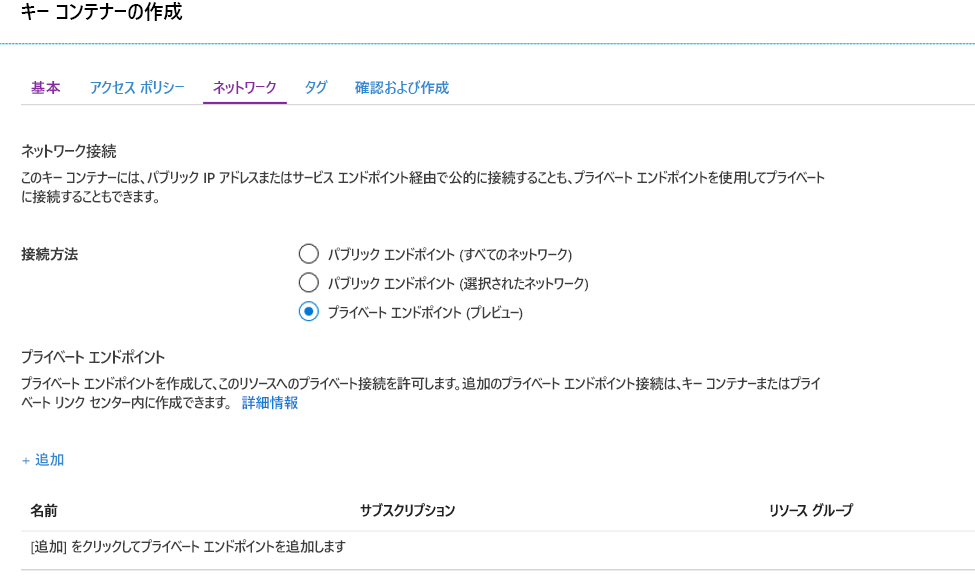
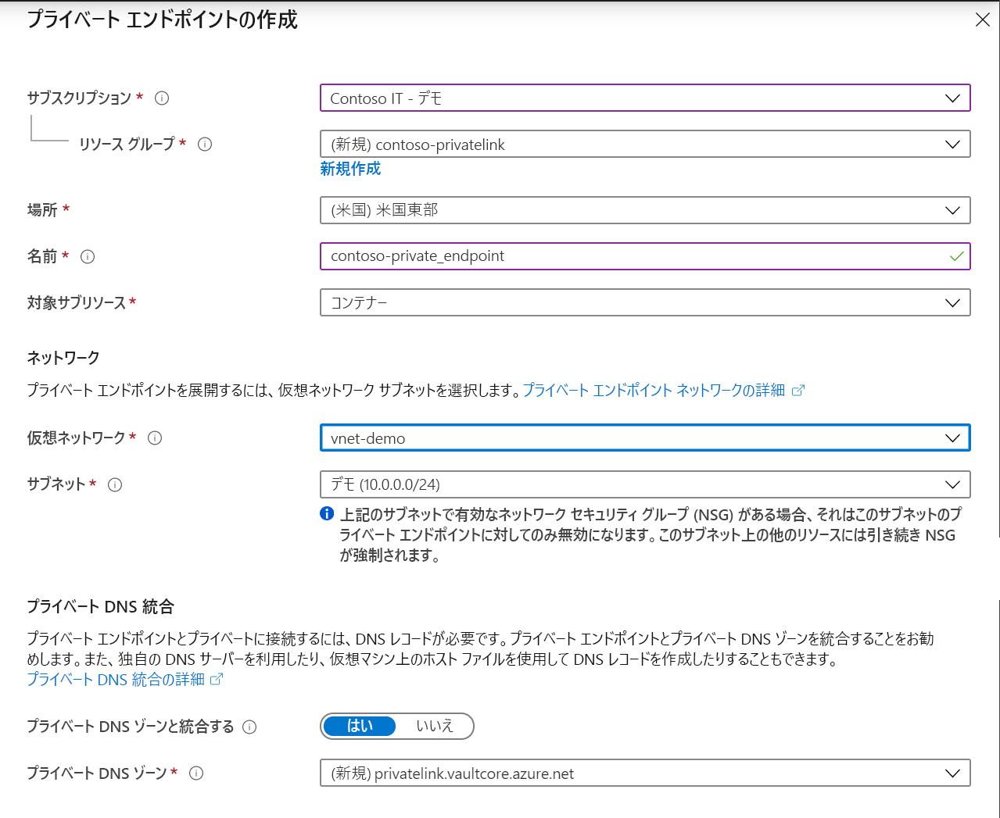

# <a name="integrate-key-vault-with-azure-private-link"></a>Key Vault を Azure Private Link と統合する

Azure Private Link サービスを使用すると、自分の仮想ネットワーク内のプライベート エンドポイント経由で、Azure サービス (Azure Key Vault、Azure Storage、Azure Cosmos DB など) と、Azure でホストされている顧客またはパートナー サービスにアクセスできます。

Azure プライベート エンドポイントは、Azure Private Link を使用するサービスにプライベートかつ安全に接続するためのネットワーク インターフェイスです。 プライベート エンドポイントは、ご自分の VNet からのプライベート IP アドレスを使用して、サービスを実質的に VNet に取り込みます。 サービスへのすべてのトラフィックをプライベート エンドポイント経由でルーティングできるため、ゲートウェイ、NAT デバイス、ExpressRoute または VPN 接続、パブリック IP アドレスは必要ありません。 仮想ネットワークとサービスの間のトラフィックは、Microsoft のバックボーン ネットワークを経由して、パブリック インターネットからの公開を排除します。 最高レベルの細分性でアクセスを制御しながら Azure リソースのインスタンスに接続できます。

詳細については、「[Azure Private Link とは](../../private-link/private-link-overview.md)」を参照してください。

## <a name="prerequisites"></a>前提条件

キー コンテナーを Azure Private Link と統合するには、次のものが必要です。

- キー コンテナー。
- Azure 仮想ネットワーク。
- 仮想ネットワーク内のサブネット。
- キー コンテナーと仮想ネットワークの両方に対する所有者または共同作成者のアクセス許可。

プライベート エンドポイントと仮想ネットワークは、同じリージョンに存在する必要があります。 ポータルを使用してプライベート エンドポイントのリージョンを選択すると、自動的にフィルター処理が行われ、そのリージョン内にある仮想ネットワークのみが表示されます。 キー コンテナーは、別のリージョンに配置することができます。

プライベート エンドポイントは、ご自分の仮想ネットワーク内のプライベート IP アドレスを使用します。

## <a name="establish-a-private-link-connection-to-key-vault-using-the-azure-portal"></a>Azure portal を使用してキー コンテナーへのプライベート リンク接続を確立する 

最初に、[Azure portal を使用した仮想ネットワークの作成](../../virtual-network/quick-create-portal.md)に関するページの手順に従って、仮想ネットワークを作成します。

その後、新しいキー コンテナーを作成するか、既存のキー コンテナーへのプライベート リンク接続を確立できます。

### <a name="create-a-new-key-vault-and-establish-a-private-link-connection"></a>新しいキー コンテナーを作成し、プライベート リンク接続を確立する

新しいキー コンテナーは、[Azure portal を使用した Azure Key Vault からのシークレットの設定と取得](../secrets/quick-create-portal.md)に関するページの手順に従って作成できます。

キー コンテナーの基本的な構成の後、[ネットワーク] タブを選択し、次の手順に従います。

1. [ネットワーク] タブで [プライベート エンドポイント] を選択します。
1. [+ 追加] ボタンをクリックしてプライベート エンドポイントを追加します。

    
 
1. [プライベート エンドポイントの作成] ブレードの [場所] フィールドで、自分の仮想ネットワークが配置されているリージョンを選択します。 
1. [名前] フィールドに、このプライベート エンドポイントを識別できるわかりやすい名前を作成します。 
1. ドロップダウン メニューから、このプライベート エンドポイントを作成する仮想ネットワークとサブネットを選択します。 
1. [プライベート DNS ゾーンと統合する] オプションはそのままにします。  
1. [OK] を選択します。

    
 
これで、構成されたプライベート エンドポイントが表示されるようになります。 このプライベート エンドポイントを削除および編集するオプションが表示されるようになりました。 [レビュー + 作成] ボタンを選択してキー コンテナーを作成します。 デプロイが完了するまでに 5 から 10 分かかります。 

### <a name="establish-a-private-link-connection-to-an-existing-key-vault"></a>既存のキー コンテナーへのプライベート リンク接続を確立する

既にキー コンテナーがある場合は、次の手順に従ってプライベート リンク接続を作成できます。

1. Azure portal にサインインします。 
1. 検索バーで、「キー コンテナー」と入力します。
1. 一覧から、プライベート エンドポイントを追加するキー コンテナーを選択します。
1. [設定] で [ネットワーク] タブを選択します。
1. ページの上部にある [プライベート エンドポイント接続] タブを選択します。
1. ページの上部にある [+ プライベート エンドポイント] ボタンを選択します。

     

このブレードを使用することで、任意の Azure リソース用のプライベート エンドポイントを作成できます。 ドロップダウン メニューを使用してリソースの種類を選択し、自分のディレクトリ内のリソースを選択することも、リソース ID を使用して任意の Azure リソースに接続することもできます。 [プライベート DNS ゾーンと統合する] オプションはそのままにします。  


## <a name="establish-a-private-link-connection-to-key-vault-using-cli"></a>CLI を使用してキー コンテナーへのプライベート リンク接続を確立する

### <a name="login-to-azure-cli"></a>Azure CLI にログインする
```console
az login 
```
### <a name="select-your-azure-subscription"></a>Azure サブスクリプションを選択する 
```console
az account set --subscription {AZURE SUBSCRIPTION ID}
```
### <a name="create-a-new-resource-group"></a>新しいリソース グループを作成する 
```console
az group create -n {RG} -l {AZURE REGION}
```
### <a name="register-microsoftkeyvault-as-a-provider"></a>Microsoft.KeyVault をプロバイダーとして登録する 
```console
az provider register -n Microsoft.KeyVault
```
### <a name="create-a-new-key-vault"></a>新しいキー コンテナーを作成する
```console
az keyvault create --name {KEY VAULT NAME} --resource-group {RG} --location {AZURE REGION}
```
### <a name="turn-on-key-vault-firewall"></a>Key Vault のファイアウォールをオンにする
```console
az keyvault update --name {KEY VAULT NAME} --resource-group {RG} --default-action deny
```
### <a name="create-a-virtual-network"></a>仮想ネットワークを作成します
```console
az network vnet create --resource-group {RG} --name {vNet NAME} --location {AZURE REGION}
```
### <a name="add-a-subnet"></a>サブネットの追加
```console
az network vnet subnet create --resource-group {RG} --vnet-name {vNet NAME} --name {subnet NAME} --address-prefixes {addressPrefix}
```
### <a name="disable-virtual-network-policies"></a>仮想ネットワーク ポリシーを無効にする 
```console
az network vnet subnet update --name {subnet NAME} --resource-group {RG} --vnet-name {vNet NAME} --disable-private-endpoint-network-policies true
```
### <a name="add-a-private-dns-zone"></a>プライベート DNS ゾーンを追加する 
```console
az network private-dns zone create --resource-group {RG} --name privatelink.vaultcore.azure.net
```
### <a name="link-private-dns-zone-to-virtual-network"></a>仮想ネットワークにプライベート DNS ゾーンをリンクする 
```console
az network private-dns link vnet create --resource-group {RG} --virtual-network {vNet NAME} --zone-name privatelink.vaultcore.azure.net --name {dnsZoneLinkName} --registration-enabled true
```
### <a name="add-private-dns-records"></a>プライベート DNS レコードを追加する
```console
# https://docs.microsoft.com/en-us/azure/dns/private-dns-getstarted-cli#create-an-additional-dns-record
az network private-dns zone list -g $rg_name
az network private-dns record-set a add-record -g $rg_name -z "privatelink.vaultcore.azure.net" -n $vault_name -a $kv_network_interface_private_ip
az network private-dns record-set list -g $rg_name -z "privatelink.vaultcore.azure.net"

# From home/public network, you wil get a public IP. If inside a vnet with private zone, nslookup will resolve to the private ip.
nslookup $vault_name.vault.azure.net
nslookup $vault_name.privatelink.vaultcore.azure.net
```
### <a name="create-a-private-endpoint-automatically-approve"></a>プライベート エンドポイントを作成する (自動的に承認する) 
```console
az network private-endpoint create --resource-group {RG} --vnet-name {vNet NAME} --subnet {subnet NAME} --name {Private Endpoint Name}  --private-connection-resource-id "/subscriptions/{AZURE SUBSCRIPTION ID}/resourceGroups/{RG}/providers/Microsoft.KeyVault/vaults/ {KEY VAULT NAME}" --group-ids vault --connection-name {Private Link Connection Name} --location {AZURE REGION}
```
### <a name="create-a-private-endpoint-manually-request-approval"></a>プライベート エンドポイントを作成する (承認を手動で要求する) 
```console
az network private-endpoint create --resource-group {RG} --vnet-name {vNet NAME} --subnet {subnet NAME} --name {Private Endpoint Name}  --private-connection-resource-id "/subscriptions/{AZURE SUBSCRIPTION ID}/resourceGroups/{RG}/providers/Microsoft.KeyVault/vaults/ {KEY VAULT NAME}" --group-ids vault --connection-name {Private Link Connection Name} --location {AZURE REGION} --manual-request
```
### <a name="show-connection-status"></a>接続状態を表示する 
```console
az network private-endpoint show --resource-group {RG} --name {Private Endpoint Name}
```
## <a name="manage-private-link-connection"></a>プライベート リンク接続を管理する

プライベート エンドポイントを作成する際は、接続を承認する必要があります。 作成しているプライベート エンドポイントの接続先となるリソースが自分のディレクトリ内にある場合は、十分なアクセス許可を持っていれば、自分で接続要求を承認することができます。別のディレクトリ内にある Azure リソースに接続する場合は、そのリソースの所有者が接続要求を承認するまで待つ必要があります。

プロビジョニングの状態には次の 4 つがあります。

| サービス プロバイダーのアクション | サービス コンシューマーのプライベート エンドポイントの状態 | 説明 |
|--|--|--|
| なし | 保留中 | 接続が手動で作成されており、プライベート リンク リソースの所有者からの承認を待っています。 |
| 承認 | Approved | 接続が自動または手動で承認され、使用する準備が整っています。 |
| Reject | 拒否 | プライベート リンク リソースの所有者によって接続が拒否されました。 |
| [削除] | [Disconnected]\(切断済み\) | プライベート リンク リソースの所有者によって接続が削除されました。プライベート エンドポイントは情報が多くなり、クリーンアップのために削除する必要があります。 |
 
###  <a name="how-to-manage-a-private-endpoint-connection-to-key-vault-using-the-azure-portal"></a>Azure portal を使用してキー コンテナーへのプライベート エンドポイント接続を管理する方法 

1. Azure ポータルにログインします。
1. 検索バーで、「キー コンテナー」と入力します。
1. 管理するキー コンテナーを選択します。
1. [ネットワーク] タブを選択します。
1. 保留中の接続がある場合は、プロビジョニング状態に [保留] と表示されている接続が一覧表示されます。 
1. 承認するプライベート エンドポイントを選択します。
1. [承認] ボタンを選択します。
1. 拒否するプライベート エンドポイント接続がある場合は、保留中の要求か既存の接続かにかかわらず、該当する接続を選択し、[拒否] ボタンをクリックします。

    

##  <a name="how-to-manage-a-private-endpoint-connection-to-key-vault-using-azure-cli"></a>Azure CLI を使用してキー コンテナーへのプライベート エンドポイント接続を管理する方法

### <a name="approve-a-private-link-connection-request"></a>プライベート リンク接続要求を承認する
```console
az keyvault private-endpoint-connection approve --approval-description {"OPTIONAL DESCRIPTION"} --resource-group {RG} --vault-name {KEY VAULT NAME} –name {PRIVATE LINK CONNECTION NAME}
```

### <a name="deny-a-private-link-connection-request"></a>プライベート リンク接続要求を拒否する
```console
az keyvault private-endpoint-connection reject --rejection-description {"OPTIONAL DESCRIPTION"} --resource-group {RG} --vault-name {KEY VAULT NAME} –name {PRIVATE LINK CONNECTION NAME}
```

### <a name="delete-a-private-link-connection-request"></a>プライベート リンク接続要求を削除する
```console
az keyvault private-endpoint-connection delete --resource-group {RG} --vault-name {KEY VAULT NAME} --name {PRIVATE LINK CONNECTION NAME}
```

## <a name="validate-that-the-private-link-connection-works"></a>プライベート リンク接続が機能することを検証する

プライベート エンドポイント リソースの同一サブネット内にあるリソースが、プライベート IP アドレスを使用して自分のキー コンテナーに接続していること、そしてそれらがプライベート DNS ゾーンに正しく統合されていることを検証する必要があります。

最初に、[Azure portal での Windows 仮想マシンの作成](../../virtual-machines/windows/quick-create-portal.md)に関するページの手順に従って、仮想マシンを作成します。

[ネットワーク] タブで、次の操作を行います。

1. 仮想ネットワークとサブネットを指定します。 新しい仮想ネットワークを作成することも、既存のものを選択することもできます。 既存のものを選択する場合は、リージョンが一致することを確認します。
1. パブリック IP リソースを指定します。
1. [NIC ネットワーク セキュリティ グループ] で [なし] を選択します。
1. [負荷分散] で [いいえ] を選択します。

コマンド ラインを開き、次のコマンドを実行します。

```console
nslookup <your-key-vault-name>.vault.azure.net
```

nslookup コマンドを実行して、パブリック エンドポイントを介してキー コンテナーの IP アドレスを解決すると、次のような結果が表示されます。

```console
c:\ >nslookup <your-key-vault-name>.vault.azure.net

Non-authoritative answer:
Name:    
Address:  (public IP address)
Aliases:  <your-key-vault-name>.vault.azure.net
```

nslookup コマンドを実行して、プライベート エンドポイントを介してキー コンテナーの IP アドレスを解決すると、次のような結果が表示されます。

```console
c:\ >nslookup your_vault_name.vault.azure.net

Non-authoritative answer:
Name:    
Address:  10.1.0.5 (private IP address)
Aliases:  <your-key-vault-name>.vault.azure.net
          <your-key-vault-name>.privatelink.vaultcore.azure.net
```

## <a name="limitations-and-design-considerations"></a>制限事項と設計に関する考慮事項

> [!NOTE]
> プライベート エンドポイントが有効なキー コンテナーのサブスクリプションあたりの上限は、調整可能です。 以下に記載した上限は、あくまで既定値です。 サービスに適用される上限の引き上げをご希望の場合には、akv-privatelink@microsoft.com まで電子メールをお送りください。 いただいたご依頼は、ケースごとの事情を考慮して承認します。

**価格**: 価格情報については、[Azure Private Link の価格](https://azure.microsoft.com/pricing/details/private-link/)に関するページを参照してください。

**制限事項**: Azure Key Vault のプライベート エンドポイントは、Azure パブリック リージョンでのみ使用できます。

**キー コンテナーあたりのプライベート エンドポイントの最大数**: 64。

**プライベート エンドポイントのあるキー コンテナーのサブスクリプションあたりの既定の数**:400。

詳細については、[Azure Private Link サービスの制限事項](../../private-link/private-link-service-overview.md#limitations)に関するセクションを参照してください。

## <a name="next-steps"></a>次の手順

- [Azure Private Link](../../private-link/private-link-service-overview.md) の詳細
- [Azure Key Vault](overview.md) の詳細を確認する
