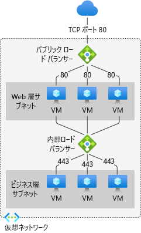
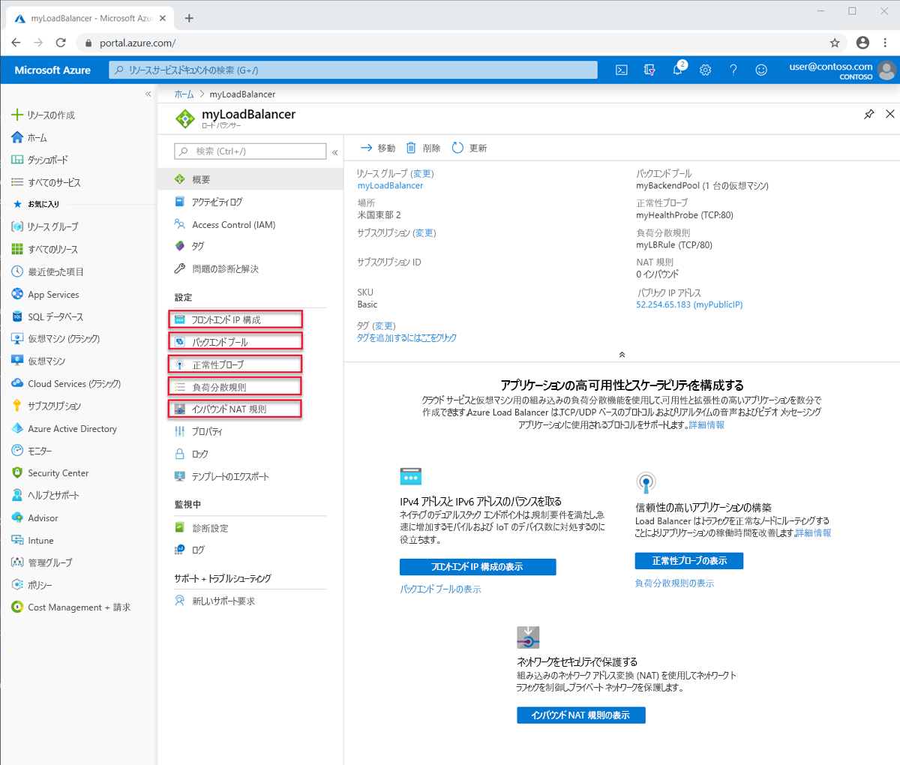

# Azure Load Balancer のコンポーネント

Azure Load Balancer には、その操作に必要な重要なコンポーネントがいくつか含まれています。 これらのコンポーネントは、ご利用のサブスクリプションで、Azure portal、Azure CLI、Azure PowerShell、またはテンプレートを使用して構成できます。

## フロントエンド IP 構成

ロード バランサーの IP アドレスです。 クライアントにとっての接続点となります。 これらのアドレスは、次のいずれかになります。

- **パブリック IP アドレス**
- **プライベート IP アドレス**

選択した IP アドレスによって、作成されるロード バランサーの**種類**が決まります。 プライベート IP アドレスを選択した場合は、内部ロード バランサーが作成されます。 パブリック IP アドレスを選択した場合は、パブリック ロード バランサーが作成されます。

|  | パブリック ロード バランサー  | 内部ロード バランサー |
| ---------- | ---------- | ---------- |
| フロントエンド IP の構成| パブリック IP アドレス | プライベート IP アドレス|
| 説明 | パブリック ロード バランサーは、受信トラフィックのパブリック IP およびポートを、VM のプライベート IP およびポートにマップします。 ロード バランサーは、VM からの応答トラフィックについてはその逆にマップします。 負荷分散規則を適用することで、特定の種類のトラフィックを複数の VM やサービスに分散できます。 たとえば、複数の Web サーバー間で Web 要求のトラフィックの負荷を分散できます。| 内部ロード バランサーは、仮想ネットワーク内のリソースにトラフィックを分散させます。 負荷分散の対象となる、仮想ネットワークのフロントエンド IP アドレスは、Azure によってアクセスが制限されます。 フロントエンド IP アドレスと仮想ネットワークは、インターネット エンドポイントに直接公開されることはありません。 社内の基幹業務アプリケーションは Azure で実行され、Azure 内またはオンプレミス リソースからアクセスされます。 |
| サポートされている SKU | Basic、Standard | Basic、Standard |

## バックエンド プール

受信要求を処理する仮想マシンのグループまたは仮想マシン スケール セット内のインスタンスのグループ。 コスト効果に優れた方法でスケーリングして大量の受信トラフィックに対処するために、コンピューティングのガイドラインでは通常、バックエンド プールにインスタンスを追加することが推奨されます。 

ロード バランサーは、インスタンスがスケールアップまたはスケールダウンされると、自動再構成を通じてすぐに自身を再構成します。 バックエンド プールの VM を追加または削除すると、追加操作なしに、ロード バランサーが再構成されます。 バックエンド プールのスコープは、仮想ネットワーク内の任意の仮想マシンです。 

バックエンド プールの設計方法を検討するときは、個々のバックエンド プール リソースを最小限の数に設計して、管理操作の期間を最適化します。 データ プレーンのパフォーマンスやスケールに違いはありません。

## 正常性プローブ

正常性プローブは、バックエンド プール内のインスタンスの正常性を判断する目的で使用されます。 正常性プローブには、異常しきい値を定義できます。 プローブで応答できない場合、ロード バランサーは異常なインスタンスへの新しい接続の送信を停止します。 プローブの失敗は、既存の接続には影響しません。 接続は、アプリケーションが以下を実行するまで続行されます。

- フローを終了する
- アイドル タイムアウトが発生する
- VM がシャットダウンする

Load Balancer は、エンドポイントにさまざまな種類の正常性プローブを提供します。

- TCP
- HTTP
- HTTPS

Basic Load Balancer では、HTTPS プローブはサポートされていません。 Basic Load Balancer は、すべての TCP 接続 (確立済み接続を含む) を終了します。

## 負荷分散規則

ロード バランサーが何を行うかは、負荷分散規則で指定します。 負荷分散規則は、フロントエンドの特定の IP 構成およびポートをバックエンドの複数の IP アドレスおよびポートにマップします。

## 受信 NAT のルール

インバウンド NAT 規則は、フロントエンド IP アドレスから仮想ネットワーク内のバックエンド インスタンスにトラフィックを転送します。 ポート フォワーディングも、負荷分散と同じハッシュベースの分散によって実行されます。 

使用例としては、仮想ネットワーク内の個々の VM インスタンスに対するリモート デスクトップ プロトコル (RDP) セッションや SSH (Secure Shell) セッションが挙げられます。 複数の内部エンドポイントを、同じフロントエンド IP アドレスのポートにマップできます。 フロントエンド IP アドレスを使用すると、ジャンプ ボックスを追加しなくても VM をリモート管理できます。

## アウトバウンド規則

すべての仮想マシン、またはバックエンド プールによって識別されたインスタンスを対象とするアウトバウンド ネットワーク アドレス変換 (NAT) は、アウトバウンド規則によって構成します。

Basic Load Balancer では、アウトバウンド規則がサポートされていません。

## 次のステップ

- Load Balancer の使用を開始するには、[パブリック Standard Load Balancer の作成](quickstart-load-balancer-standard-public-portal.md)に関するページを参照してください。
- [Azure Load Balancer](load-balancer-overview.md) についてさらに詳しく学習する。
- [パブリック IP アドレス](https://docs.microsoft.com/azure/virtual-network/virtual-network-public-ip-address)について学習する。
- [プライベート IP アドレス](https://docs.microsoft.com/azure/virtual-network/virtual-network-ip-addresses-overview-arm#private-ip-addresses)について学習する。
- [Standard Load Balancer と可用性ゾーン](load-balancer-standard-availability-zones.md)の使用について学習する。
- [Standard Load Balancer の診断](load-balancer-standard-diagnostics.md)について学習する。
- [アイドル時の TCP リセット](load-balancer-tcp-reset.md)について学習する。
- [HA ポート負荷分散ルールでの Standard Load Balancer](load-balancer-ha-ports-overview.md) について学習する。
- [複数のフロントエンドでの Load Balancer](load-balancer-multivip-overview.md) の使用について学習する。
- [ネットワーク セキュリティ グループ](../virtual-network/security-overview.md)の詳細を確認する。
- [プローブの種類](load-balancer-custom-probe-overview.md#types)について学習する。
- [ロード バランサーの制限](https://docs.microsoft.com/azure/azure-resource-manager/management/azure-subscription-service-limits#load-balancer)について詳細を確認する。
- [ポート フォワーディング](https://docs.microsoft.com/azure/load-balancer/tutorial-load-balancer-port-forwarding-portal)の使用について学習する。
- [ロード バランサーのアウトバウンド規則](https://docs.microsoft.com/azure/load-balancer/load-balancer-outbound-rules-overview)について詳細を確認する。
