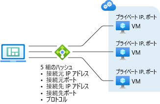

# Azure Load Balancer の概念

ロード バランサーは、UDP と TCP の両方のアプリケーションに対していくつかの機能を提供します。 

## 負荷分散アルゴリズム
負荷分散規則を作成して、フロントエンドのトラフィックをバックエンド プールに分散させることができます。 Azure Load Balancer は、ハッシュ アルゴリズムを使用してインバウンド フロー (バイトではなくフロー) の分散を行い、 バックエンド プール インスタンスへのフローのヘッダーを書き換えます。 バックエンド エンドポイントが正常であることを正常性プローブが示している場合、サーバーは新しいフローを受信できます。

既定では、Load Balancer は 5 タプル ハッシュを使用します。

ハッシュには次のものが含まれます。

- **ソース IP アドレス**
- **ソース ポート**
- **宛先 IP アドレス**
- **宛先ポート**
- **使用可能なサーバーにフローをマップするための IP プロトコル番号**

送信元 IP アドレスへのアフィニティは、2 タプル ハッシュまたは 3 タプル ハッシュを使用して作成されます。 同じフローのパケットは、負荷分散されたフロントエンドの背後にある同じインスタンスに到着します。 

クライアントが同じ送信元 IP から新しいフローを開始するとき、送信元ポートが変化します。 その結果、5 タプルのハッシュによって、トラフィックは別のバックエンド エンドポイントに向かうことになります。
詳細については、「[Azure Load Balancer の分散モードを構成する](./load-balancer-distribution-mode.md)」を参照してください。

次の図は、ハッシュベースの分散を示しています。

  

  *図:ハッシュベースの分散*

## アプリケーションの独立と透過性

Load Balancer は、TCP、UDP、またはアプリケーション レイヤーと直接やり取りしません。 TCP または UDP アプリケーションのシナリオがサポートされています。 Load Balancer がフローを終了または開始したり、フローのペイロードと対話したりすることはなく、 アプリケーション レイヤーのゲートウェイ機能を提供することもありません。 プロトコル ハンドシェイクは、常にクライアントとバックエンド プール インスタンスの間で直接発生します。 受信フローへの応答は常に、仮想マシンからの応答です。 仮想マシンにフローが到着するときは、元のソース IP アドレスも保持されます。

* すべてのエンドポイントは、VM によって応答されます。 たとえば、TCP ハンドシェイクは、クライアントと選択されたバックエンド VM との間で行われます。 フロントエンドへの要求に対する応答は、バックエンドの VM によって生成される応答です。 フロントエンドへの接続を正常に検証するときは、少なくとも 1 つのバックエンド仮想マシンへの接続を全体にわたって検証していることになります。
* アプリケーション ペイロードはロード バランサーに対して透過的です。 任意の UDP または TCP アプリケーションをサポートできます。
* ロード バランサーは TCP ペイロードとやり取りせず、TLS オフロードを提供しているため、包括的な暗号化シナリオを構築できます。 ロード バランサーを使用すると、VM 自体の TLS 接続が終了されることで、TLS アプリケーションの大規模なスケールアウトを実現できます。 たとえば、TLS セッションのキー容量は、バックエンド プールに追加する VM の数と種類によってのみ制限されます。

## Load Balancer の用語
| 概念 | これはどういうことですか? | 詳細ドキュメント |
| ---------- | ---------- | ----------|
送信接続 | バックエンド プールからパブリック IP へのフローは、フロントエンドにマップされます。 アウトバウンド接続は、負荷分散アウトバウンド規則によって、フロントエンドのパブリック IP アドレスに変換されます。 この構成には次の利点があります。 フロントエンドを別のサービス インスタンスに動的にマップできるため、サービスのアップグレードやディザスター リカバリーが簡単にできます。 容易なアクセス制御リスト (ACL) の管理。 フロントエンド IP として表される ACL は、サービスをスケールアップ、スケールダウン、または再デプロイしても変更されません。 送信接続をマシンより少ない数の IP アドレスに変換すると、安全な受信者リストの実装負荷を軽減できます。| 送信元ネットワーク アドレス変換 (SNAT) と Azure Load Balancer の詳細については、[SNAT と Azure Load Balancer](load-balancer-outbound-connections.md) に関するページを参照してください。
可用性ゾーン | Standard Load Balancer は、Availability Zones を利用できるリージョンで追加機能をサポートします。 これらの機能は、Standard Load Balancer のすべての機能に追加されます。  Availability Zones 構成は、パブリックと内部の両方の種類の Standard Load Balancer で使用できます。ゾーン冗長フロントエンドは、すべてのゾーンで専用インフラストラクチャを同時に使用することで、ゾーンの障害に対応します。 さらに、特定のゾーンにフロントエンドを保証することができます。 ゾーンのフロントエンドは、1 つのゾーンの専用インフラストラクチャによって提供されます。 バックエンド プールではクロスゾーン負荷分散を使用できます。 仮想ネットワーク内のすべての仮想マシン リソースがバックエンド プールの一部になることができます。Basic Load Balancer ではゾーンはサポートされません。| 詳細については、[可用性ゾーン関連の機能の詳細な説明](load-balancer-standard-availability-zones.md)に関するページと、[可用性ゾーンの概要](../availability-zones/az-overview.md)に関するページを参照してください。
| HA ポート | アプリケーションがスケーラブルで高信頼性になるように、HA ポートの負荷分散規則を構成できます。 内部ロード バランサーのフロントエンド IP の一時ポートに対しては、フローごとの負荷分散が、これらの規則によって実現します。 個々のポートを指定するのは実用的ではなかったり、望ましくなかったりする場合にも、この機能は有効です。 HA ポート規則を使用すると、アクティブ/パッシブまたはアクティブ/アクティブの n+1 シナリオを作成することができます。 こららのシナリオは、ネットワーク仮想アプライアンスおよび大きな範囲のインバウンド ポートを必要とするすべてのアプリケーションが対象となります。 正常性プローブを使って、新しいフローを受信する必要があるバックエンドを決定できます。  ネットワーク セキュリティ グループを使って、ポート範囲のシナリオをエミュレートできます。 Basic Load Balancer では、HA ポートがサポートされていません。 | [HA ポートの詳細な説明](load-balancer-ha-ports-overview.md)に関するページを参照してください
| 複数のフロントエンド | ロード バランサーは、複数のフロントエンドで複数のルールをサポートします。  Standard Load Balancer は、この機能をアウトバウンドのシナリオにまで広げます。 アウトバウンド規則は、インバウンド規則の逆です。 アウトバウンド規則では、アウトバウンド接続用の関連付けが作成されます。 Standard Load Balancer は、負荷分散規則を介して、仮想マシン リソースに関連付けられているすべてのフロントエンドを使います。 さらに、負荷分散ルールのパラメーターにより、アウトバウンド接続のために負荷分散ルールを抑制することができ、特定のフロントエンドを選ぶことが (何も選ばないことも) できます。 これに対し、Basic Load Balancer は単一のフロントエンドをランダムに選びます。 どのフロントエンドを選ぶかを制御する機能はありません。|

## 制限事項

- ロード バランサーの規則は、2 つの仮想ネットワークにまたがることはできません。  フロントエンドとそのバックエンド インスタンスは、同じ仮想ネットワークに配置されている必要があります。  

- 仮想ネットワークなしの Web Worker ロールやその他の Microsoft プラットフォーム サービスにアクセスできるのは、Standard 内部 Load Balancer の内側にあるインスタンスのみです。 各サービス自体または基になるプラットフォームは予告なく変更される場合があるため、このアクセス性に依存しないでください。 Standard 内部ロード バランサーを使用しているときにアウトバウンド接続が必要な場合には、[アウトバウンド接続](load-balancer-outbound-connections.md)を構成する必要があります。

- ロード バランサーは特定の TCP または UDP プロトコルに対する負荷分散とポート フォワーディングを行います。 負荷分散規則と受信 NAT 規則は TCP および UDP をサポートしますが、ICMP を含む他の IP プロトコルはサポートしていません。

- 内部 Load Balancer のフロントエンドへのバックエンド VM からのアウトバウンド フローは失敗します。

- 負荷分散規則では、IP フラグメントの転送はサポートされていません。 UDP パケットと TCP パケットの IP の断片化は負荷分散規則ではサポートされていません。 HA ポートの負荷分散規則を使用すると、既存の IP フラグメントを転送できます。 詳細については、「[高可用性ポートの概要](load-balancer-ha-ports-overview.md)」を参照してください。

## 次のステップ

- Load Balancer の使用を始めるには、[パブリック Standard Load Balancer の作成](quickstart-load-balancer-standard-public-portal.md)に関するページを参考に Load Balancer を 1 つ作成し、カスタム IIS 拡張機能がインストールされている VM を作成して、Web アプリを VM 間で負荷分散します。
- [Azure Load Balancer のアウトバウンド接続](load-balancer-outbound-connections.md)について学習する。
- [Azure Load Balancer](load-balancer-overview.md) についてさらに詳しく学習する。
- [正常性プローブ](load-balancer-custom-probe-overview.md)について学習する。
- [Standard Load Balancer の診断](load-balancer-standard-diagnostics.md)について学習する。
- [ネットワーク セキュリティ グループ](../virtual-network/security-overview.md)の詳細を確認する。
