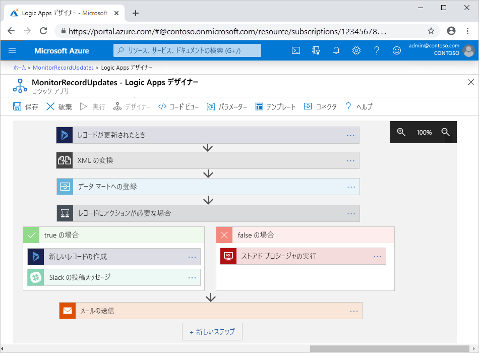

# 概要 - Azure Logic Apps とは

[Azure Logic Apps](https://azure.microsoft.com/services/logic-apps) は、企業または組織の間でアプリ、データ、システム、サービスを統合する必要がある場合に、タスク、ビジネス プロセス、[ワークフロー](#logic-app-concepts)のスケジュール設定、自動化、調整に役立つクラウド サービスです。 Logic Apps を使えば、クラウド、オンプレミス、その両方のどこにあるかを問わず、アプリの[統合](https://azure.microsoft.com/product-categories/integration/)、データの統合、システムの統合、Enterprise Application Integration (EAI)、および企業間 (B2B) 通信が可能になるスケーラブルなソリューションを設計および構築する作業を簡略化できます。

ロジック アプリを使って自動化できるワークロードには、たとえば次のようなものがあります。

* オンプレミス システムとクラウド サービスの間で命令を処理し、ルーティングする。

* 各種のシステム、アプリ、サービスでイベントが発生したときに Office 365 でメール通知を送信する。

* アップロードされたファイルを SFTP サーバーまたは FTP サーバーから Azure Storage に移動する。

* 特定の話題のツイートを監視したり、そこに込められた感情を分析したり、確認が必要な項目についてアラートやタスクを作成したりする。

Azure Logic Apps を使用してエンタープライズ統合ソリューションを構築する際には、[数百のすぐに使えるコネクタ](../connectors/apis-list.md)がある、現在も増加中のギャラリーから選択できます。このギャラリーには、Azure Service Bus、Azure Functions、Azure Storage、SQL Server、Office 365、Dynamics、Salesforce、BizTalk、SAP、Oracle DB、ファイル共有などのサービスが用意されています。 [コネクタ](#logic-app-concepts)には、データにリアル タイムで安全にアクセスして処理するロジック アプリを作成するための[トリガー](#logic-app-concepts)、[アクション](#logic-app-concepts)、またはその両方が備わっています。

> [!VIDEO https://channel9.msdn.com/Blogs/Azure/Introducing-Azure-Logic-Apps/player]

## Logic Apps のしくみ 

ロジック アプリを使ったワークフローはいずれも、トリガーによって起動します。そして、トリガーは特定のイベントが発生するか、新たに利用可能になったデータが特定の条件を満たした時点で起動します。 Logic Apps のコネクタによって提供される多くのトリガーには、ワークロードの実行頻度を設定できる基本的なスケジューリング機能が備わっています。 より複雑なスケジューリングや高度な繰り返しの場合は、ワークフローの最初のステップとして繰り返しトリガーを使用できます。 詳細については、[スケジュールベースのワークフロー](../logic-apps/concepts-schedule-automated-recurring-tasks-workflows.md)に関するページを参照してください。

トリガーが起動するたびに、Logic Apps エンジンによって、ワークフロー内でアクションを実行するロジック アプリ インスタンスが作成されます。 これらのアクションにはデータ変換のほか、条件文、switch 文、ループ、分岐などのワークフロー制御が含まれることもあります。 たとえば、このロジック アプリは "レコードが更新されたとき" という条件が組み込まれている Dynamics 365 トリガーによって起動するものです。 トリガーがこの条件に一致するイベントを検出すると、トリガーが起動し、ワークフローのアクションを実行します。 ここで実行されるアクションとしては、XML の変換、データの更新、条件分岐、メール通知があります。

ロジック アプリは、Logic Apps デザイナーを使って視覚的に作成できます。Logic Apps デザイナーは、ブラウザーを通じて Azure portal で使用できるほか、Visual Studio でも使用できます。 ロジック アプリをさらにカスタマイズするときは、"コード ビュー" エディターを使うと、JavaScript Object Notation (JSON) でロジック アプリの定義を作成したり編集したりすることができます。 一定のタスクについては、Azure PowerShell コマンドや Azure Resource Manager テンプレートを使用することもできます。 ロジック アプリは Azure のクラウドにデプロイされ、そこで実行されます。 さらに詳細な概要については、ビデオ「[Use Azure Enterprise Integration Services to run cloud apps at scale (Azure のエンタープライズ統合サービスを使って大規模なクラウド アプリを実行する)](https://channel9.msdn.com/Events/Connect/2017/T119/)」を参照してください。

## Logic Apps を使う理由

ロジック アプリなら Microsoft のマネージド コネクタとして事前構築済みの API が用意されているため、ビジネスのデジタル化が進む中でも、従来のシステムと最新のシステムと最先端のシステムを簡単にすばやく接続できます。 このため、アプリのビジネス ロジックと機能に集中できます。 アプリのビルド、ホスティング、スケール、管理、メンテナンス、監視に関する心配は無用です。 そのような問題は、Logic Apps が代わりに処理してくれます。 さらに、支払いは従量[課金モデル](../logic-apps/logic-apps-pricing.md)に基づき、使用した分のみとなります。

多くの場合、コードを記述する必要はありません。 もっとも、コードの記述が必要な場合には、[Azure Functions](../azure-functions/functions-overview.md) を使ってコード スニペットを作成し、ロジック アプリからオンデマンドで実行できます。 また、ロジック アプリと Azure サービス、カスタム アプリ、またはその他のソリューションのイベントとの間でやり取りが必要な場合には、ロジック アプリと [Azure Event Grid](../event-grid/overview.md) を併用するとイベントを監視、ルーティング、公開できます。

Logic Apps、Functions、Event Grid はいずれも Microsoft Azure によって完全に管理されており、ソリューションのビルド、ホスティング、スケール、管理、監視、メンテナンスに関する心配から解放されます。 ["サーバーレス" のアプリとソリューション](../logic-apps/logic-apps-serverless-overview.md) を作成できる機能が備わっているため、ビジネス ロジックだけに集中できます。 ここに挙げたサービスは、お客様のニーズに合わせて自動でスケールできるだけでなく、統合にかかる時間を短縮したり、最小限のコードで堅牢なクラウド アプリを作成するために役立てたりすることができます。

企業が Logic Apps を他の Azure サービスや Microsoft 製品と組み合わせることによってどのようにアジリティを高め、自らの中核となるビジネスに集中できるようになったかについては、[お客様事例](https://aka.ms/logic-apps-customer-stories)を参照してください。

ここでは、Logic Apps の機能とメリットを詳しく紹介します。

### 使いやすいツールで視覚的にワークフローを構築

ビジュアルを使ったデザイン ツールが用意されており、時間の節約と複雑なプロセスの簡略化が可能です。 ロジック アプリの作成は、最初から最後まで Logic Apps デザイナーを使って進めることができます。このツールは、ブラウザーを使って Azure ポータルからアクセスできるほか、Visual Studio からも利用できます。 ワークフローの起動にはトリガーを使用します。[コネクタ ギャラリー](../connectors/apis-list.md)から追加できるアクションの数に上限はありません。

### ロジック アプリ テンプレートを使って時間を節約

[テンプレート ギャラリー](../logic-apps/logic-apps-create-logic-apps-from-templates.md)にある定義済みのワークフローを選んで使用すれば、よく使われるソリューションを今まで以上に短期間で作成できます。 サービスとしてのソフトウェア (SaaS) アプリのための単純な接続を実現するものから、高度な B2B ソリューションの構築に役立つものや、"単に楽しむための" ものまで、さまざまなテンプレートがあります。 詳細については、[事前構築済みのテンプレートからロジック アプリを作成する方法](../logic-apps/logic-apps-create-logic-apps-from-templates.md)に関するページを参照してください。

### 異なる環境にまたがる別個のシステムを接続

パターンやワークフローによっては、説明は簡単でもコードで実装するのは困難なこともあります。 ロジック アプリなら、各種のシステムがオンプレミスの環境とクラウド環境のどちらに存在していても、シームレスに接続できます。 たとえば、クラウドのマーケティング ソリューションをオンプレミスの請求システムに接続したり、エンタープライズ サービス バスを使ってさまざまな API とシステムのメッセージングを一元化したりすることが可能になります。 ロジック アプリは、このようなシナリオに役立つ再利用可能かつ再構成可能なソリューションを提供するにあたり、高速で信頼性と一貫性に優れた方法を提供するものです。

### エンタープライズ統合と B2B のシナリオに最上級のサポートを実現

企業でも組織でも、相互に電子的なやり取りをするにあたっては業界標準のメッセージ プロトコルや形式を使用しています。しかし、具体的なプロトコルや形式を見ると EDIFACT、AS2、X12 など、さまざまに異なります。 [Enterprise Integration Pack (EIP)](../logic-apps/logic-apps-enterprise-integration-overview.md) の機能を使えば、パートナーが使用しているメッセージ形式をユーザーの組織のシステムが解釈して処理できる形式に変換するロジック アプリを作成できます。 Logic Apps はこのようなやり取りを円滑に処理すると共に、暗号化とデジタル署名を使ってその安全を確保します。

最初は現在のシステムとサービスを使用して小規模な運用から始め、自分のペースで段階的に利用を増やしていくことをお勧めします。 準備ができたら、以下に示す Logic Apps と EIP のさまざまな機能を使って高度な統合シナリオを実装し、スケールアップしていきましょう。

* 次の製品およびサービスを使って作成:

  * [Microsoft BizTalk Server](https://docs.microsoft.com/biztalk/core/introducing-biztalk-server)
  * [Azure Service Bus](../service-bus-messaging/service-bus-messaging-overview.md)
  * [Azure Functions](../azure-functions/functions-overview.md)
  * [Azure API Management](../api-management/api-management-key-concepts.md)

* [XML メッセージ](../logic-apps/logic-apps-enterprise-integration-xml.md)の処理

* [フラット ファイル](../logic-apps/logic-apps-enterprise-integration-flatfile.md)の処理

* [EDIFACT](../logic-apps/logic-apps-enterprise-integration-edifact.md)、[AS2](../logic-apps/logic-apps-enterprise-integration-as2.md)、[X12](../logic-apps/logic-apps-enterprise-integration-x12.md) プロトコルによるメッセージのやり取り

* [統合アカウント](../logic-apps/logic-apps-enterprise-integration-accounts.md)により、以下をはじめとする B2B アーティファクトを一箇所で格納、管理

  * [パートナー](../logic-apps/logic-apps-enterprise-integration-partners.md)
  * [アグリーメント](../logic-apps/logic-apps-enterprise-integration-agreements.md) 
  * [XML 変換マップ](../logic-apps/logic-apps-enterprise-integration-maps.md)
  * [XML 検証スキーマ](../logic-apps/logic-apps-enterprise-integration-schemas.md)

たとえば、Microsoft BizTalk Server を使っている場合、ロジック アプリで [BizTalk Server コネクタ](../connectors/apis-list.md#on-premises-connectors)を使用して、ご利用の BizTalk Server と通信することができます。 その後、[統合アカウント コネクタ](../connectors/apis-list.md#integration-account-connectors) (Enterprise Integration Pack に付属) を追加することで、BizTalk と同様の操作をロジック アプリで拡張したり実行したりすることができます。

逆に、[Microsoft BizTalk Server Adapter for Logic Apps](https://www.microsoft.com/download/details.aspx?id=54287) を使用して、BizTalk Server からロジック アプリに接続して通信を行うこともできます。 BizTalk Server で [BizTalk Server Adapter を設定して使用する](https://docs.microsoft.com/biztalk/core/logic-app-adapter)方法をご覧ください。

### 1 回の作成で何度も再利用

複数の環境とリージョンにわたって[ロジック アプリ デプロイを自動化](../logic-apps/logic-apps-azure-resource-manager-templates-overview.md)できるように、Azure Resource Manager テンプレートとしてロジック アプリを作成します。

### Azure 仮想ネットワーク内のリソースにアクセスする

"[*統合サービス環境*" (ISE)](../logic-apps/connect-virtual-network-vnet-isolated-environment-overview.md) を作成するときに、ロジック アプリは [Azure 仮想ネットワーク](../virtual-network/virtual-networks-overview.md)内にあるセキュリティで保護されたリソース (仮想マシン (VM) や他のシステムまたはサービスなど) にアクセスできます。 ISE は、専用のリソースを使用し、"グローバル" なマルチテナント Logic Apps サービスとは別に実行される分離された Logic Apps サービスのインスタンスです。

自分専用の分離されたインスタンスでロジック アプリを実行することで、他の Azure テナントが自分のアプリのパフォーマンスに与える可能性がある影響 (["うるさい隣人" エフェクト](https://en.wikipedia.org/wiki/Cloud_computing_issues#Performance_interference_and_noisy_neighbors)とも呼ばれる) を減らすことができます。 ISE には、次の利点があります。

* 自分専用の静的 IP アドレス。これらの IP アドレスは、マルチテナント サービスのロジック アプリによって共有される静的 IP アドレスとは区別されています。 また、送信先システムとの通信のために、単一の予測可能な静的パブリック アウトバウンド IP アドレスを自分で設定することもできます。 このようにすると、それらの送信先システムで ISE ごとに追加のファイアウォールを設定する必要はありません。

* 実行継続時間、ストレージのリテンション期間、スループット、HTTP の要求と応答のタイムアウト、メッセージのサイズ、カスタム コネクタの要求の上限が引き上げられました。 詳細については、[Azure Logic Apps の制限と構成](../logic-apps/logic-apps-limits-and-config.md)に関するページを参照してください。

ISE を作成すると、Azure によってその ISE が Azure 仮想ネットワークに "*挿入*"(デプロイ) されます。 アクセスを必要とする統合アカウントやロジック アプリの場所としてその ISE を使用することができます。 ISE の作成について詳しくは、[Azure Logic Apps から Azure Virtual Network への接続](../logic-apps/connect-virtual-network-vnet-isolated-environment.md)に関するページをご覧ください。

### 組み込みの拡張機能

カスタム コードを実行するために必要なコネクタが見つからない場合には、独自のコード スニペットを作成し、[Azure Functions](../azure-functions/functions-overview.md) を使ってオンデマンドで呼び出せば、ロジック アプリを拡張できます。 独自の [API](../logic-apps/logic-apps-create-api-app.md) や[カスタム コネクタ](../logic-apps/custom-connector-overview.md)を作成し、ロジック アプリから呼び出すこともできます。

### 使用した分だけお支払い
  
Logic Apps では、App Service プランで以前に作成したロジック アプリがないかぎり、使用量に応じた[課金および測定](../logic-apps/logic-apps-pricing.md)が採用されます。

Logic Apps の詳細については、以下のビデオで紹介しています。

* [Logic Apps を使った統合 - "ゼロ" から "ヒーロー" へ](https://channel9.msdn.com/Events/Build/2017/C9R17)
* [Microsoft Azure Logic Apps を使用したエンタープライズ統合](https://channel9.msdn.com/Events/Ignite/Microsoft-Ignite-Orlando-2017/BRK2188)
* [Logic Apps を使用して高度なビジネス プロセスを構築する](https://channel9.msdn.com/Events/Ignite/Microsoft-Ignite-Orlando-2017/BRK3179)

## Logic Apps と Functions、WebJobs、Power Automate の違い

ここに挙げたサービスはいずれも、別個のシステムをつなげるための "接着剤" のような役割を果たします。 どのサービスにもそれぞれ長所とメリットが存在するため、十分な機能を備えたスケーラブルな統合システムを短期間で構築するためには、各サービスの機能を組み合わせるのが一番です。 詳細については、[Logic Apps、Functions、WebJobs、Power Automate の比較](../azure-functions/functions-compare-logic-apps-ms-flow-webjobs.md)に関する記事を参照してください。

## キーワード

* **ワークフロー**: ビジネス プロセスを一連のステップとして視覚化、設計、構築、自動化、デプロイします。

* **マネージド コネクタ**: ロジック アプリにはデータ、サービス、システムへのアクセスが必要です。 データへの接続とアクセスおよびデータの操作のために設計された事前構築済みの Microsoft のマネージ コネクタを利用できます。 [Azure Logic Apps のコネクタ](../connectors/apis-list.md)に関するページを参照してください。

* **トリガー**: 多くの Microsoft マネージド コネクタには、イベントや新しいデータが一定の条件を満たした場合に起動するトリガーが用意されています。 イベントとしては、メールを受信したり、Azure Storage アカウントに対する変更が検出されたりした場合などが考えられます。 トリガーが起動するたびに、Logic Apps エンジンによって、ワークフローを実行するロジック アプリ インスタンスが新たに作成されます。

* **Actions**:アクションとは、トリガーの後に発生するステップすべてを指します。 各アクションは通常、マネージ コネクタ、カスタム API、またはカスタム コネクタにより定義される 1 件の操作にマップされています。

* **Enterprise Integration Pack**: Logic Apps には、高度な統合シナリオ向けに BizTalk Server の機能が含まれています。 Enterprise Integration Pack は、ロジック アプリが検証や変換などを簡単に実行するためのコネクタを提供するものです。

## はじめに

Logic Apps は、Microsoft Azure でホストされている多くのサービスの 1 つです。 このため、利用開始には Azure サブスクリプションが必要です。 サブスクリプションをお持ちでない場合には、[無料の Azure アカウントにサインアップ](https://azure.microsoft.com/free/)してください。

Azure サブスクリプションをお持ちであれば、[初めてのロジック アプリの作成に関するクイック スタート](../logic-apps/quickstart-create-first-logic-app-workflow.md)をお試しください。このクイックスタートでは、RSS フィードを使って Web サイトの新しいコンテンツを監視し、新しいコンテンツが公開された時点でメールを送信する方法を紹介しています。

## 次のステップ

* [スケジュールに基づいたロジック アプリでトラフィックをチェックする](../logic-apps/tutorial-build-schedule-recurring-logic-app-workflow.md)
* [Azure を使ったサーバーレス ソリューション](../logic-apps/logic-apps-serverless-overview.md)の詳細を確認する
* [Enterprise Integration Pack によるB2B 統合](../logic-apps/logic-apps-enterprise-integration-overview.md)の詳細を確認する
