# クイック スタート:Azure Logic Apps を使用して自動化されたタスク、プロセス、およびワークフローを作成する - Visual Studio

[Azure Logic Apps](../logic-apps/logic-apps-overview.md) と Visual Studio を使用して、企業および組織の間でアプリ、データ、システム、サービスを統合するタスクとプロセスを自動化するワークフローを作成できます。 このクイック スタートでは、Visual Studio でロジック アプリを作成し、そのアプリを Azure にデプロイすることによってこれらのワークフローを設計および構築する方法を示します。 これらのタスクは Azure portal でも実行できます。しかし、Visual Studio を使用すれば、ロジック アプリをソース管理に追加したり、さまざまなバージョンを発行したり、異なるデプロイ環境用の Azure Resource Manager テンプレートを作成したりできます。

Azure Logic Apps が初めてであり、その基本的な概念だけを必要としている場合は、[Azure Portal でのロジック アプリの作成に関するクイック スタート](../logic-apps/quickstart-create-first-logic-app-workflow.md)をお試しください。 ロジック アプリ デザイナーは、Azure Portal と Visual Studio の両方で同じように動作します。

このクイック スタートでは、Visual Studio で Azure Portal クイック スタートと同じロジック アプリを作成します。 このロジック アプリは Web サイトの RSS フィードを監視し、そのフィード内の新しい項目ごとに電子メールを送信します。 完成したロジック アプリは、次の高レベルのワークフローのようになります。

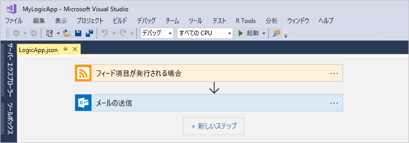

## 前提条件

* Azure サブスクリプション。 サブスクリプションをお持ちでない場合には、[無料の Azure アカウントにサインアップ](https://azure.microsoft.com/free/)してください。

* まだお持ちでない場合は、以下のツールをダウンロードしてインストールしてください。

  * [Visual Studio 2019、2017、または 2015 - Community Edition 以降](https://aka.ms/download-visual-studio)。 このクイック スタートでは、Visual Studio Community 2017 を使用します。

    > [!IMPORTANT]
    > Visual Studio 2019 または 2017 をインストールする場合は、 **[Azure の開発]** ワークロードを選択してください。

  * [Microsoft Azure SDK for .NET (2.9.1 以降)](https://azure.microsoft.com/downloads/)。 [Azure SDK for .NET](https://docs.microsoft.com/dotnet/azure/dotnet-tools?view=azure-dotnet) の詳細を参照してください。

  * [Azure PowerShell](https://github.com/Azure/azure-powershell#installation)

  * 必要なバージョンの Visual Studio 拡張機能用の最新の Azure Logic Apps ツール。

    * [Visual Studio 2019](https://aka.ms/download-azure-logic-apps-tools-visual-studio-2019)

    * [Visual Studio 2017](https://aka.ms/download-azure-logic-apps-tools-visual-studio-2017)

    * [Visual Studio 2015](https://aka.ms/download-azure-logic-apps-tools-visual-studio-2015)
  
    Azure Logic Apps Tools は、Visual Studio Marketplace から直接ダウンロードしてインストールできます。または、[この拡張機能を Visual Studio 内からインストールする方法](https://docs.microsoft.com/visualstudio/ide/finding-and-using-visual-studio-extensions)を確認できます。 インストールが完了したら、必ず Visual Studio を再起動してください。

* 組み込みのロジック アプリ デザイナーを使用する際の Web へのアクセス

  デザイナーが Azure でリソースを作成し、ロジック アプリでコネクタからプロパティやデータを読み取るには、インターネット接続が必要です。 たとえば、Dynamics CRM Online の接続の場合、デザイナーは CRM インスタンスをチェックして、既定のプロパティやカスタム プロパティを確認します。

* Logic Apps でサポートされるメール アカウント (Office 365 Outlook、Outlook.com、Gmail など)。 その他のプロバイダーについては、[こちらのコネクタ一覧](https://docs.microsoft.com/connectors/)を参照してください。 この例では Office 365 Outlook を使います。 別のプロバイダーを使用する場合も、全体的な手順は同じです。ただし、UI がやや異なる場合があります。

  > [!IMPORTANT]
  > Gmail コネクタの使用を希望する場合、ロジック アプリで制限なしにこのコネクタを使用できるのは、G-Suite ビジネス アカウントだけです。 Gmail コンシューマー アカウントを持っている場合は、Google によって承認された特定のサービスのみでこのコネクタを使用できるほか、[認証に使用する Google クライアント アプリを Gmail コネクタで作成する](https://docs.microsoft.com/connectors/gmail/#authentication-and-bring-your-own-application)ことができます。 詳細については、「[Azure Logic Apps での Google コネクタのデータ セキュリティとプライバシー ポリシー](../connectors/connectors-google-data-security-privacy-policy.md)」を参照してください。

## Azure リソース グループ プロジェクトを作成する

最初に、[Azure リソース グループ プロジェクト](../azure-resource-manager/templates/create-visual-studio-deployment-project.md)を作成します。 Azure リソース グループとリソースについて詳しくは、[こちら](../azure-resource-manager/management/overview.md)を参照してください。

1. Visual Studio を起動します。 Azure のアカウントを使用してサインインします。

1. **[ファイル]** メニューで、 **[新規作成]**  >  **[プロジェクト]** の順に選択します  (Ctrl + Shift + N)

   ![[ファイル] メニューで [新規作成]、[プロジェクト] の順に選択する](./media/quickstart-create-logic-apps-with-visual-studio/create-new-visual-studio-project.png)

1. **[インストール済み]** で、 **[Visual C#]** または **[Visual Basic]** を選択します。 **[クラウド]**  >  **[Azure リソース グループ]** の順に選択します。 プロジェクトに名前を付けます。例:

   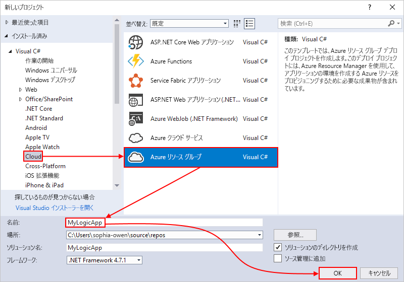

   > [!NOTE]
   > リソース グループ名には、文字、数字、ピリオド (`.`)、アンダースコア (`_`)、ハイフン (`-`)、およびかっこ (`(`、`)`) のみを含めることができます。ただし、リソース グループ名をピリオド (`.`) で "*終了する*" ことはできません。
   >
   > **[クラウド]** または **[Azure リソース グループ]** が表示されない場合は、Azure SDK for Visual Studio がインストールされていることを確認してください。

   Visual Studio 2019 を使用している場合は、以下の手順に従ってください。

   1. **[新しいプロジェクトの作成]** ボックスで、Visual C# または Visual Basic の **[Azure リソース グループ]** プロジェクトを選択します。 **[次へ]** を選択します。

   1. 使用する Azure リソース グループの名前やその他のプロジェクト情報を指定します。 **［作成］** を選択します

1. テンプレートの一覧で、 **[ロジック アプリ]** テンプレートを選択します。 **[OK]** を選択します。

   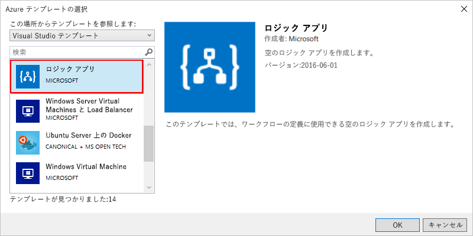

   プロジェクトが作成された後、ソリューション エクスプローラーが開かれ、ソリューションが表示されます。 ソリューションで、**LogicApp.json** ファイルはロジック アプリの定義を格納するだけでなく、デプロイのために使用できる Azure Resource Manager テンプレートにもなっています。

   

## 空のロジック アプリを作成する

Azure リソース グループ プロジェクトが作成されたら、 **[空のロジック アプリ]** テンプレートを使用してロジック アプリを作成します。

1. ソリューション エクスプローラーで、**LogicApp.json** ファイルのショートカット メニューを開きます。 **[Open With Logic App Designer]\(ロジック アプリ デザイナーで開く\)** を選択します  (Ctrl + L)

   

   > [!TIP]
   > このコマンドが Visual Studio 2019 にない場合は、Visual Studio の最新の更新プログラムが適用されていることを確認してください。

   Visual Studio では、ロジック アプリや接続のリソースを作成してデプロイするために Azure サブスクリプションと Azure リソース グループを指定するよう求められます。

1. **[サブスクリプション]** で、Azure サブスクリプションを選択します。 **[リソース グループ]** で、 **[新規作成]** を選択して別の Azure リソース グループを作成します。

   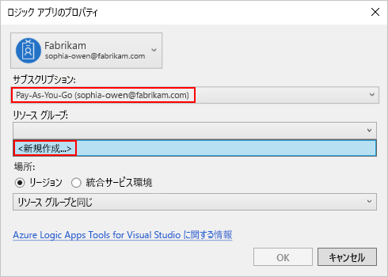

   | 設定 | 値の例 | 説明 |
   | ------- | ------------- | ----------- |
   | ユーザー アカウント | Fabrikam   sophia-owen@fabrikam.com | Visual Studio にサインインしたときに使用したアカウント |
   | **サブスクリプション** | 従量課金制   (sophia-owen@fabrikam.com) | Azure サブスクリプションの名前および関連付けられたアカウント |
   | **リソース グループ** | MyLogicApp-RG   (米国西部) | ロジック アプリのリソースを格納およびデプロイするための Azure リソース グループと場所 |
   | **場所** | **[Same as Resource Group]\(リソース グループと同じ\)** | ロジック アプリをデプロイする場所の種類と特定の場所。 場所の種類は、Azure リージョンまたは既存の[統合サービス環境 (ISE)](connect-virtual-network-vnet-isolated-environment.md) です。 
このクイックスタートでは、場所の種類を **[リージョン]** に設定し、場所を **[Same as Resource Group]\(リソース グループと同じ\)** に設定します。 
**注**:リソース グループ プロジェクトを作成した後で、[場所の種類と場所を変更する](manage-logic-apps-with-visual-studio.md#change-location)ことができますが、異なる場所の種類はロジック アプリにさまざまな影響を与えます。 |
   ||||

1. Logic Apps デザイナーが開き、紹介ビデオやよく使用されるトリガーが含まれたページが表示されます。 ビデオやトリガーの後の **[テンプレート]** まで下へスクロールし、 **[空のロジック アプリ]** を選択します。

   ![[空のロジック アプリ] を選択する](./media/quickstart-create-logic-apps-with-visual-studio/choose-blank-logic-app-template.png)

## ロジック アプリ ワークフローを構築する

次に、新しいフィード項目が現れると起動される RSS [トリガー](../logic-apps/logic-apps-overview.md#logic-app-concepts)を追加します。 ロジック アプリはすべて、特定の条件が満たされると起動されるトリガーで開始されます。 トリガーが起動されるたびに、ワークフローを実行するロジック アプリ インスタンスが Logic Apps エンジンによって作成されます。

1. ロジック アプリ デザイナーの検索ボックスの下の **[すべて]** を選択します。 検索ボックスに「rss」と入力します。 トリガーの一覧から、**フィード項目が発行される場合**

   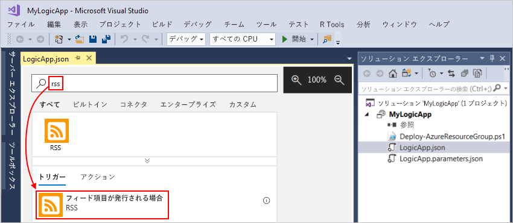

1. デザイナーにトリガーが表示されたら、[Azure Portal クイック スタート](../logic-apps/quickstart-create-first-logic-app-workflow.md#add-rss-trigger)にあるワークフロー手順に従ってロジック アプリの構築を完了してから、この記事に戻ります。 完了すると、ロジック アプリは次の例のようになります。

   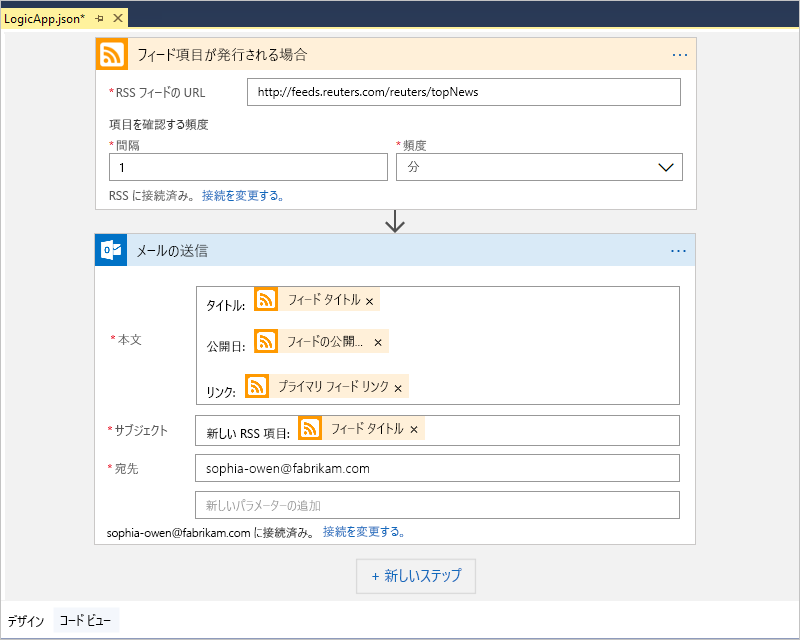

1. Visual Studio ソリューションを保存します。 (Ctrl + S キー)。

## ロジック アプリを Azure にデプロイする

ロジック アプリを実行してテストする前に、Visual Studio からそのアプリを Azure にデプロイします。

1. ソリューション エクスプローラーのプロジェクトのショートカット メニューで、 **[デプロイ]**  >  **[新規作成]** の順に選択します。 メッセージに従って Azure アカウントでサインインします。

   

1. このデプロイでは、既定の Azure サブスクリプション、リソース グループ、およびその他の設定を保持します。 **[デプロイ]** を選択します。

   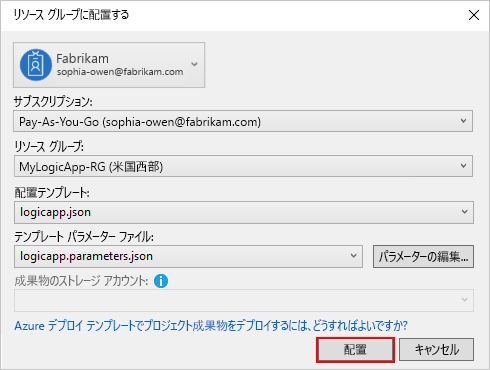

1. **[パラメーターの編集]** ボックスが表示された場合は、ロジック アプリのリソース名を指定します。 設定を保存します。

   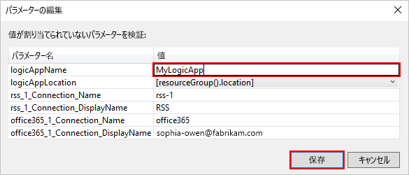

   デプロイが開始されると、Visual Studio の **[出力]** ウィンドウにアプリのデプロイ状態が表示されます。 状態が表示されない場合、 **[Show output from]\(出力元の表示\)** の一覧を開いて、Azure リソース グループを選択します。

   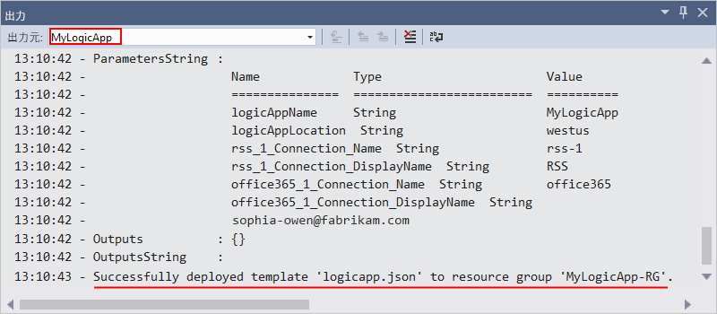

   選択したコネクタにユーザーからの入力が必要な場合は、バックグラウンドで PowerShell ウィンドウが開き、必要なパスワードまたはシークレット キーの入力を求められます。 その情報を入力すると、デプロイが続行されます。

   

   デプロイが完了すると、ロジック アプリは Azure Portal で有効になり、指定されたスケジュールで (1 分ごとに) 実行されます。 新しいフィード項目が検出されるとトリガーが起動され、それにより、ロジック アプリのアクションを実行するワークフロー インスタンスが作成されます。 ロジック アプリは、新しい項目ごとに電子メールを送信します。 新しい項目が検出されない場合、トリガーは起動されず、ワークフローのインスタンス化を "スキップ" します。 ロジック アプリは、次の間隔まで待ってからチェックします。

   このロジック アプリが送信するサンプルの電子メールを次に示します。 電子メールが届かない場合は、迷惑メール フォルダーを確認してください。

   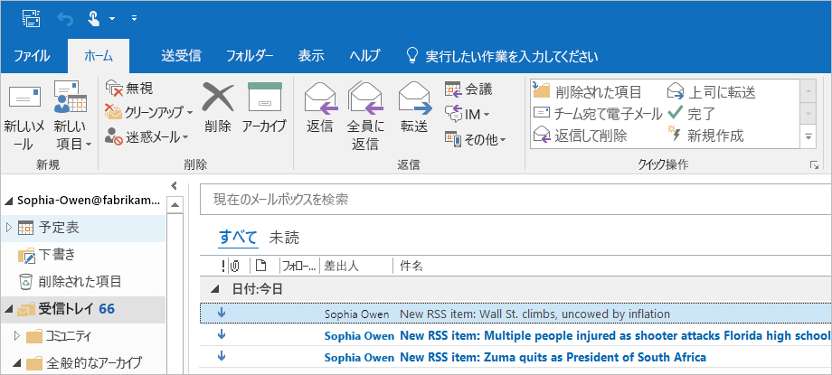

これで、Visual Studio でロジック アプリが正常に構築およびデプロイされました。 ロジック アプリを管理して実行履歴を確認するには、「[Manage logic apps with Visual Studio (Visual Studio でロジック アプリを管理する)](../logic-apps/manage-logic-apps-with-visual-studio.md)」を参照してください。

## 新しいロジック アプリを追加する

既存の Azure リソース グループ プロジェクトがある場合は、[JSON アウトライン] ウィンドウを使用してそのプロジェクトに新しい空のロジック アプリを追加できます。

1. ソリューション エクスプローラーで、`<logic-app-name>.json` ファイルを開きます。

1. **[表示]** メニューの **[その他のウィンドウ]**  >  **[JSON アウトライン]** を選択します。

1. テンプレート ファイルにリソースを追加するには、[JSON アウトライン] ウィンドウの上部にある **[リソースの追加]** を選択します。 または、[JSON アウトライン] ウィンドウで、 **[リソース]** ショートカット メニューを開き、 **[新しいリソースの追加]** を選びます。

   ![[JSON アウトライン] ウィンドウ](./media/quickstart-create-logic-apps-with-visual-studio/json-outline-window-add-resource.png)

1. **[リソースの追加]** ダイアログ ボックスの検索ボックスで、`logic app` を検索し、 **[ロジック アプリ]** を選びます。 ロジック アプリの名前を指定し、 **[追加]** を選びます。

   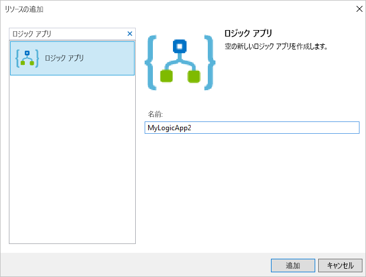

## リソースをクリーンアップする

ロジック アプリの使用を完了したら、ロジック アプリと関連リソースが含まれているリソース グループを削除します。

1. ロジック アプリの作成に使用したのと同じアカウントで、[Azure Portal](https://portal.azure.com) にサインインします。

1. Azure portal メニューで **[リソース グループ]** を選択するか、または任意のページから **[リソース グループ]** を検索して選択します。 ロジック アプリのリソース グループを選択します。

1. **[概要]** ページで、 **[リソース グループの削除]** を選択します。 確認のためにリソース グループ名を入力し、 **[削除]** を選択します。

   ![[リソース グループ] > [概要] > [リソース グループの削除]](./media/quickstart-create-logic-apps-with-visual-studio/clean-up-resources.png)

1. ローカル コンピューターで Visual Studio ソリューションを削除します。

## 次のステップ

この記事では、Visual Studio を使用してロジック アプリの構築、デプロイ、実行を行いました。 Visual Studio でロジック アプリの高度なデプロイを管理および実行する方法の詳細については、次の記事を参照してください。

> [!div class="nextstepaction"]
> [Visual Studio でロジック アプリを管理する](../logic-apps/manage-logic-apps-with-visual-studio.md)
