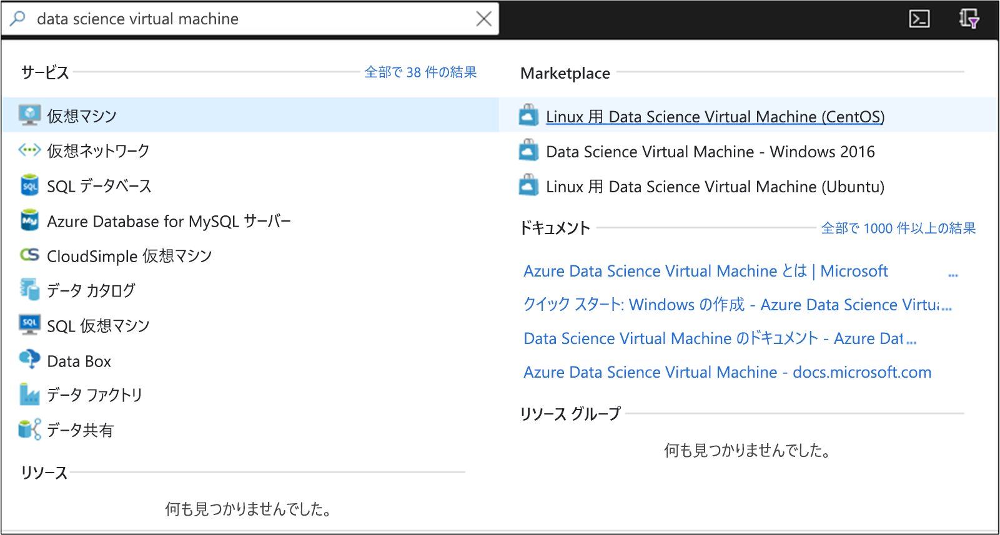
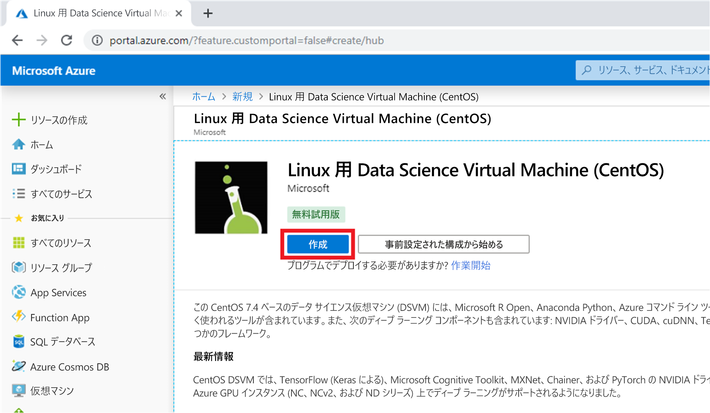

# <a name="quickstart-set-up-a-centos-linux-data-science-virtual-machine-in-azure"></a>クイック スタート:Azure で CentOS (Linux) データ サイエンス仮想マシンを設定する

CentOS ベースの データ サイエンス仮想マシンを起動して実行します。

## <a name="prerequisites"></a>前提条件

CentOS データ サイエンス仮想マシンを作成するには、**Azure サブスクリプション**が必要です。 [無料のサブスクリプションを作成するにはこちらを参照してください](https://azure.com/free)。

## <a name="create-your-centos-data-science-virtual-machine"></a>CentOS データ サイエンス仮想マシンを作成する

CentOS データ サイエンス仮想マシンのインスタンスを作成する手順を以下に示します。

1. [Azure ポータル](https://portal.azure.com)にアクセスします。 まだサインインしていない場合は、Azure アカウントへのサインインを求めるメッセージが表示される可能性があります。 
1. 検索バーに「データ サイエンス仮想マシン」と入力し、CentOS DSVM を選択します。

    

1. 次のウィンドウで **[作成]** を選択します。

    [](media/linux-dsvm-intro/create-centos-expanded.png#lightbox)

1. [仮想マシンの作成] ブレードにリダイレクトされます。
   
   ![CentOS 仮想マシンに対応する [基本] タブ](./media/linux-dsvm-intro/review-create-centos.png)

1. ウィザードの各手順を構成するために、次の情報を入力します。

    1. **[基本]** :
    
       * **サブスクリプション**:複数のサブスクリプションがある場合は、マシンが作成されて課金されるサブスクリプションを選択します。 そのサブスクリプションに対するリソース作成権限が必要です。
       * **[リソース グループ]** :新しいグループを作成するか、既存のグループを使用します。
       * **[仮想マシン名]** : 仮想マシンの名前を入力します。 これは Azure portal に表示される名前です。
       * **[リージョン]** :最適なデータ センターを選択します。 ネットワーク アクセスを最速にするために、データの大半が存在するデータセンターか、物理的に最も近くにあるデータセンターを選びます。 詳細については、[Azure リージョン](https://azure.microsoft.com/global-infrastructure/regions/)に関する記事を参照してください。
       * **イメージ**:既定値をそのまま使用します。
       * **Size**:これには、一般的なワークロードに適したサイズが自動的に設定されます。 詳細については、[Azure の Linux VM のサイズ](../../virtual-machines/linux/sizes.md)に関する記事を参照してください。
       * **[認証の種類]** : 設定を迅速に行うには、[パスワード] を選択します。 
         
         > [!NOTE]
         > JupyterHub を使用する場合は、JupyterHub は SSH 公開キーを使用するように構成されて "*いない*" ため、必ず [パスワード] を選択します。

       * **[ユーザー名]** : 管理者のユーザー名を入力します。 これは、仮想マシンへのログインに使用するユーザー名であり、Azure ユーザー名と同じにする必要はありません。 大文字は使用 "*しない*" でください。
         
         > [!NOTE]
         > ユーザー名に大文字を使用すると、JupyterHub が機能しなくなり、500 内部サーバー エラーが発生します。

       * **パスワード**:仮想マシンへのログインに使用するパスワードを入力します。    
    
   1. **[Review + create]\(レビュー + 作成\)** を選択します。
   1. **[レビュー + 作成]**
      * 入力したすべての情報が正しいことを確認します。 
      * **［作成］** を選択します
    
    プロビジョニングには 5 分くらいかかります。 この状態は Azure portal に表示されます。

## <a name="how-to-access-the-centos-data-science-virtual-machine"></a>CentOS データ サイエンス仮想マシンにアクセスする方法

CentOS DSVM には、次の 3 つの方法のいずれかでアクセスできます。

  * ターミナル セッションの場合の SSH
  * グラフィカル セッションの場合の X2Go
  * Jupyter Notebook の場合の JupyterHub と JupyterLab

また、Data Science Virtual Machine を Azure Notebooks に接続して、VM で Jupyter Notebook を実行し、無料のサービス レベルの制限をバイパスすることもできます。 詳細については、[Azure Notebooks プロジェクトの管理と構成](../../notebooks/configure-manage-azure-notebooks-projects.md#compute-tier)に関するページを参照してください。

### <a name="ssh"></a>SSH

VM が作成された後、SSH アクセスを使用して構成されている場合は、SSH を使用してサインインできます。 テキスト シェル インターフェイスで、手順 3. の **[基本]** セクションで作成したアカウントの資格情報を使用します。 Windows では、[PuTTY](https://www.putty.org) などの SSH クライアント ツールをダウンロードできます。 グラフィカル デスクトップ (X ウィンドウ システム) を使用する場合は、PuTTY で X11 転送を使用できます。

> [!NOTE]
> テストでは、パフォーマンスは、X11 転送よりも、X2Go クライアントの方が優れていました。 グラフィカル デスクトップ インターフェイスでは、X2Go クライアントを使用することをお勧めします。

### <a name="x2go"></a>X2Go

Linux VM は、既に X2Go サーバーでプロビジョニングされており、クライアント接続を受け入れる準備ができています。 Linux VM のグラフィカル デスクトップに接続するには、クライアントで次の手順を実行します。

1. [X2Go](https://wiki.x2go.org/doku.php/doc:installation:x2goclient)のページから、お使いのクライアント プラットフォーム向けの X2Go クライアントをダウンロードしてインストールします。
1. 仮想マシンのパブリック IP アドレスをメモしておきます。これは、先ほど作成した仮想マシンを開いて Azure portal で確認できます。

   

1. X2Go クライアントを実行します。 [新しいセッション] ウィンドウが自動的にポップアップ表示されない場合は、[セッション] > [新しいセッション] に移動します。

1. 結果の構成ウィンドウで、次の構成パラメーターを入力します。
   * **[Session] \(セッション) タブ**:
     * **[Host]\(ホスト\)** : 前にメモした VM の IP アドレスを入力します。
     * **[Login]\(ログイン\)** : Linux VM 上のユーザー名を入力します。
     * **[SSH Port]\(SSH ポート\)** : 既定値の 22 のままにします。
     * **[Session Type]\(セッションの種類\)** : 値を **XFCE** に変更します。 現在、Linux VM でサポートされるのは XFCE デスクトップのみです。
   * **[Media]\(メディア\) タブ**: 音声のサポートとクライアントの印刷を使用しない場合は、それらをオフにできます。
   * **[Shared folders]\(共有フォルダー\)** : クライアント コンピューターのディレクトリを Linux VM にマウントする場合は、このタブで VM と共有するクライアント コンピューターのディレクトリを追加します。

   
1. **[OK]** を選択します。
1. VM のログイン画面を表示するには、X2Go ウィンドウの右側のウィンドウにあるボックスをクリックします。
1. VM のパスワードを入力します。
1. **[OK]** を選択します。
1. 接続を完了するには、必要に応じてファイアウォールをバイパスする X2Go アクセス許可を付与します。
1. これで、CentOS DSVM のグラフィカル インターフェイスが表示されます。 


### <a name="jupyterhub-and-jupyterlab"></a>JupyterHub と JupyterLab

CentOS DSVM は、マルチユーザーの Jupyter サーバーである [JupyterHub](https://github.com/jupyterhub/jupyterhub) を実行します。 接続するには、次の手順を実行します。

   1. Azure portal で VM を検索して選択し、VM のパブリック IP アドレスをメモしておきます。

       

   1. ローカル コンピューターから Web ブラウザーを開き、https:\//your-vm-ip:8000 に移動します。"your-vm-ip" は、前にメモした IP アドレスに置き換えます。
   1. VM を作成するときに使ったユーザー名とパスワードを入力してサインインしてください。 

      

   1. 入手できる多くのサンプル ノートブックを参照します。

次世代の Jupyter Notebook と JupyterHub である JupyterLab も利用できます。 これにアクセスするには、JupyterHub にサインインし、URL https:\//your-vm-ip:8000/user/your-username/lab を参照します。"your-username" は VM の構成時に選択したユーザー名に置き換えます。

次の行を `/etc/jupyterhub/jupyterhub_config.py` に追加すれば、JupyterLab を既定のノートブック サーバーとして設定できます。

```python
c.Spawner.default_url = '/lab'
```

## <a name="next-steps"></a>次のステップ

学習と調査をどのように続ければよいかを以下に示します。

* [Linux Data Science Virtual Machine でのデータ サイエンス](linux-dsvm-walkthrough.md)に関するチュートリアルでは、ここでプロビジョニングされた Linux DSVM を使用して、一般的なデータ サイエンス タスクをいくつか実行する方法を示します。 
* この記事で説明しているツールを試して、DSVM 上のさまざまなデータ サイエンス ツールを確認します。 DSVM にインストールされているツールの基本的な概要と詳細情報を入手できる場所は、仮想マシン内のシェルで `dsvm-more-info` を実行して確認することもできます。  
* [Team Data Science Process](https://aka.ms/tdsp)を使用して、エンド ツー エンドの分析ソリューションを体系的に構築する方法を確認します。
* Azure AI サービスを使用する機械学習とデータ分析のサンプルについては、[Azure AI Gallery](https://gallery.azure.ai/) を参照してください。
* この仮想マシンに適した[リファレンス ドキュメント](./reference-centos-vm.md)を参照してください。