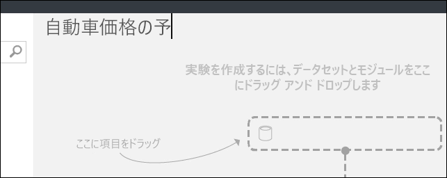
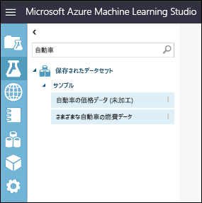
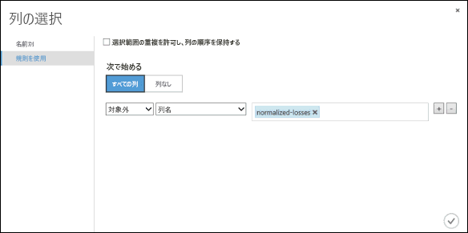
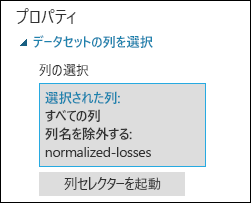
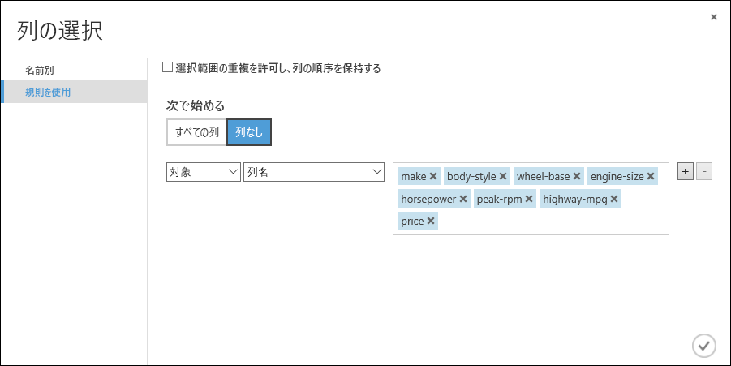
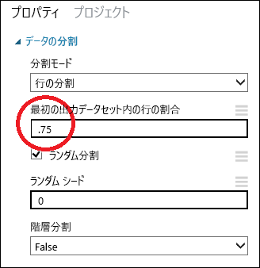
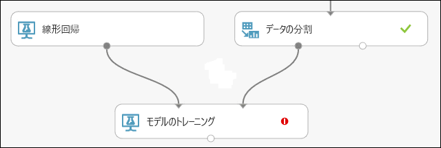

# クイック スタート:Azure Machine Learning Studio (クラシック) で初めてのデータ サイエンス実験を作成する

[!INCLUDE [Designer notice](../../../includes/designer-notice.md)]

このクイック スタートでは、[Azure Machine Learning Studio (クラシック)](what-is-ml-studio.md) で、製造仕様や技術仕様などのさまざまな変数に基づいて自動車の価格を予測する、機械学習の実験を作成します。

機械学習を初めて学ぶ場合は、ビデオ シリーズ「[Data Science for Beginners (データ サイエンス入門)](data-science-for-beginners-the-5-questions-data-science-answers.md)」をご覧になることをお勧めします。日常的な言語と概念を使用して、機械学習について説明しています。

このクイック スタートは、次のような実験の既定のワークフローに従っています。

1. **モデルの作成**
    - [データを取得する]
    - [データを準備する]
    - [特徴を定義する]
1. **モデルのトレーニング**
    - [アルゴリズムを選択して、適用する]
1. **モデルのスコア付けとテスト**
    - [新しい自動車の価格を予測する]

[データを取得する]: #get-the-data
[データを準備する]: #prepare-the-data
[特徴を定義する]: #define-features
[アルゴリズムを選択して、適用する]: #choose-and-apply-an-algorithm
[新しい自動車の価格を予測する]: #predict-new-automobile-prices

## データを取得する

機械学習の実行にはまずデータが必要です。
使用できるいくつかのサンプル データセットが、従来のバージョンの Studio に含まれています。また、多数のソースからデータをインポートできます。 この例では、ワークスペースに含まれているサンプル データセットである**Automobile price data (Raw)** を使用します。
このデータセットには、製造仕様、モデル仕様、技術仕様、価格などの情報を含む、さまざまな個別の自動車のエントリが含まれています。

> [!TIP]
> [Azure AI Gallery](https://gallery.azure.ai)には、次の実験の作業コピーがあります。 「 **[初めてのデータ サイエンス実験 - 自動車価格の予測 ](https://gallery.azure.ai/Experiment/Your-first-data-science-experiment-Automobile-price-prediction-1)** 」にアクセスし、 **[Open in Studio]\(Studio で開く\)** をクリックして、お使いの Machine Learning Studio (クラシック) ワークスペースに実験のコピーをダウンロードしてください。

データセットを実験に取得する方法を次に示します。

1. Machine Learning Studio (クラシック) ウィンドウの下部にある **[+新規]** をクリックして、新しい実験を作成します。 **[EXPERIMENT]\(実験\)**  >   **[Blank Experiment]\(空の実験\)** の順に選択します。

1. 実験には既定の名前が付いており、キャンバスの上部で確認できます。 このテキストを選択し、「**Automobile price prediction**」(自動車価格の予測) など意味のある名前に変更します。 名前は一意でなくてもかまいません。

    

1. 実験キャンバスの左側には、データセットとモジュールのパレットがあります。 このパレットの上部にある検索ボックスに「**automobile**」と入力し、**Automobile price data (Raw)** というラベルが付いたデータセットを検索します。 このデータセットを実験キャンバスにドラッグします。

    

このデータの中身を確認するには、automobile データセットの下部にある出力ポートをクリックし、 **[Visualize]\(視覚化\)** を選択します。

![出力ポートをクリックし、[Visualize]\(視覚化\) を選択](./media/create-experiment/select-visualize.png)

> [!TIP]
> データセットとモジュールには、小さな円で表される入力ポートと出力ポートがあります (入力ポートは上部、出力ポートは下部)。
実験を通じてデータのフローを作成するには、1 つのモジュールの出力ポートを別のモジュールの入力ポートに接続します。
いつでもデータセットまたはモジュールの出力ポートをクリックして、データ フローのその時点でデータがどのようになっているかを確認できます。

このデータセットでは、各行が自動車を表していて、各自動車に関連付けられている変数は列として表示されます。 特定の自動車の変数を使用して、右端の列で価格が予測されます ("price" という名前の列 26)。

右上隅の "**x**" をクリックして、視覚化ウィンドウを閉じます。

## データを準備する

通常、データセットには、分析前にある程度の前処理が必要です。 さまざまな行の中に、値が不足している列があります。 モデルがデータを正しく分析するには、これらの不足値を整理する必要があります。 値が不足している行をすべて削除します。 また、不足している値の大部分は、**normalized-losses** 列にあります。したがって、モデルからこの列も一緒に除外します。

> [!TIP]
> 不足している値を入力データから整理することが、ほとんどのモジュールを使用するための前提条件となっています。

まず、**normalized-losses** 列を完全に削除するモジュールを追加します。 次に、データが不足している行を削除する別のモジュールを追加します。

1. モジュールのパレットの上部にある検索ボックスに「**select columns**」と入力し、[Select Columns in Dataset][select-columns] (データセットの列を選択する) モジュールを見つけます。 その後、それを実験キャンバスにドラッグします。 このモジュールを使用すると、モデルに含める、またはモデルから除外するデータの列を選択できます。

1. **Automobile price data (Raw)** データセットの出力ポートを、Select Columns in Dataset の入力ポートに接続します。

    

1. [Select Columns in Dataset][select-columns] モジュールを選択し、 **[Properties]\(プロパティ\)** ウィンドウの **[Launch column selector]\(列セレクターの起動\)** をクリックします。

   - 左側の **[With rules]\(規則を使用\)** をクリックします
   - **[Begin With]\(次で始まる\)** の **[All columns]\(すべての列\)** をクリックします。 これらの規則により、[Select Columns in Dataset][select-columns] (データセット内の列の選択) では、すべての列がフィルターを通過します (これから除外する列を除く)。
   - ドロップダウンから **[Exclude]\(除外\)** と **[column names]\(列名\)** を選択し、テキスト ボックスの内側をクリックします。 列の一覧が表示されます。 **[normalized-losses]** を選択すると、テキスト ボックスに追加されます。
   - (右下の) チェック マーク (OK) ボタンをクリックして列セレクターを閉じます。

     

     これで、**Select Columns in Dataset**のプロパティ ウィンドウに、**normalized-losses** 以外のデータセットのすべての列がフィルターを通過することが示されます。

     

     > [!TIP] 
     > モジュールをダブルクリックして、テキストを入力すると、モジュールにコメントを追加できます。 これで、実験でモジュールがどのような処理をするのかがひとめでわかります。 この例では、[Select Columns in Dataset][select-columns] モジュールをダブルクリックして、「Exclude normalized losses」(normalized losses を除外する) というコメントを入力します。

     

1. [Clean Missing Data (不足データのクリーンアップ)][clean-missing-data] モジュールを実験キャンバスにドラッグして、[Select Columns in Dataset (データセットの列を選択する)][select-columns] モジュールに接続します。 **[Properties]\(プロパティ\)** ウィンドウで、 **[Cleaning mode]\(整理モード\)** の下の **[Remove entire row]\(行全体を削除\)** を選択します。 これらのオプションにより、[Clean Missing Data][clean-missing-data] (見つからないデータのクリーンアップ) では値が不足している行が削除され、データがクリーンアップされます。 モジュールをダブルクリックして、「Remove missing value rows」(値が不足している行を削除する) というコメントを入力します。

    !["Clean Missing Data" モジュールの [Cleaning Mode]\(整理モード\) を [Remove entire row]\(行全体を削除\) に設定](./media/create-experiment/set-remove-entire-row.png)

1. ページの下部の **[RUN]\(実行\)** をクリックして、実験を実行します。

    実験の実行が終了すると、すべてのモジュールに緑色のチェック マークが付けられ、正常に完了したことが示されます。 右上隅にも **[Finished running]\(実行が完了しました\)** というステータスが表示されます。

    

> [!TIP]
> ここで実験を実行したのはなぜでしょうか。 実験を実行することで、データの列の定義がデータセットから [Select Columns in Dataset][select-columns] モジュールと [Clean Missing Data][clean-missing-data] モジュールを介して渡されます。 これにより、[Clean Missing Data][clean-missing-data] に接続するすべてのモジュールに、この同じ情報が設定されることになります。

これで、データが整理されました。 整理したデータセットを表示するには、[Clean Missing Data][clean-missing-data] モジュールの左側の出力ポートをクリックし、 **[Visualize]\(視覚化\)** を選択します。 **normalized-losses** 列がもう含まれていないことと、値が不足していないことが確認できます。

データが整理できたので、予測モデルで使用する特徴を指定する準備が整いました。

## 特徴を定義する

機械学習において 「*特徴*」 とは、関心のある項目を個別に測定できるプロパティです。 この例のデータセットでは、各行が 1 台の車を表し、各列がその車の特徴に対応します。

予測モデルの作成に役立つ特徴を見つけるには、解決する問題に関する実験と知識が必要です。 対象を予測するにあたり、一部の特徴は他のものよりも有益です。 他の特徴と強い相関関係があって削除できる特徴もあります。 たとえば、city-mpg と highway-mpg は密接に関連しているため、予測に大きな影響を及ぼすことなく一方を残して他方を削除することができます。

ここでは、データセット内の特徴のサブセットを使用するモデルを構築します。 後でこの手順に戻って別の特徴を選択し、もう一度実験を実行して、より優れた結果が得られるかどうかを確認できます。 しかしまずは、次の特徴を試してみましょう。

    make, body-style, wheel-base, engine-size, horsepower, peak-rpm, highway-mpg, price

1. 別の [Select Columns in Dataset][select-columns] モジュールを、実験キャンバスにドラッグします。 [Clean Missing Data][clean-missing-data] モジュールの左側の出力ポートを、[Select Columns in Dataset][select-columns] モジュールの入力に接続します。

    

1. モジュールをダブルクリックして、「Select features for prediction」と入力します。

1. **[Properties]\(プロパティ\)** ウィンドウで、 **[Launch column selector]\(列セレクターの起動\)** をクリックします。

1. **[With rules]\(規則を使用\)** をクリックします。

1. **[Begin With]\(次で始まる\)** の **[No columns]\(列なし\)** をクリックします。 フィルター行で、 **[Include]\(含める\)** と **[column names]\(列名\)** を選択してから、テキスト ボックス中の列名の一覧を選択します。 このフィルターによりこのモジュールでは、指定した列を除いて列 (特徴) が渡されなくなります。

1. チェック マーク (OK) ボタンをクリックします。

    

このモジュールにより、フィルター処理されたデータセットが生成されます。このデータセットには、次の手順で使用する学習アルゴリズムに渡す特徴のみが含まれます。 後でこの手順に戻り、別の特徴を選択して再度実行することができます。

## アルゴリズムを選択して、適用する

データが準備できました。予測モデルの構築に必要なのは、トレーニングとテストです。 このデータを使用してモデルのトレーニングとテストを行い、価格を予測する精度を確認します。
<!-- For now, don't worry about *why* we need to train and then test a model.-->

"*分類*" と "*回帰*" は、2 種類の教師あり機械学習アルゴリズムです。 分類は、色 (赤、青、または緑) のような定義された一連のカテゴリから答えを予測するものです。 回帰は、数値を予測する目的で使用されます。

予測したい価格は数値であるため、回帰アルゴリズムを使用することになります。 この例では "*線形回帰*" モデルを使用します。

価格が含まれた一連のデータを指定してモデルをトレーニングします。 モデルによってデータがスキャンされ、自動車の特徴と価格の相関関係が検出されます。 次にモデルのテストを行います。よく知っている自動車の特徴のセットをモデルに与え、モデルがその既知の価格をどの程度の精度で予測できるか確認します。

データは別個のトレーニング データセットとテスト データセットに分割して、モデルのトレーニングとテストの両方に使用します。

1. [Split Data][split] (データを分割する) モジュールを選択して実験キャンバスにドラッグし、最後の [Select Columns in Dataset][select-columns] モジュールに接続します。

1. [Split Data][split] モジュールをクリックして選択します。 (キャンバス右側の **[Properties]\(プロパティ\)** ウィンドウにある) **[Fraction of rows in the first output dataset]\(最初の出力データセットにおける列の割合\)** を探して 0.75 に設定します。 このようにして、データの 75% をモデルのトレーニングに使用し、25% をテスト用に保持しておきます。

    

    > [!TIP]
    > **[Random seed]\(ランダム シード\)** パラメーターを変更して、トレーニング用とテスト用に異なるランダムなサンプルを作成できます。 このパラメーターでは、擬似乱数ジェネレーターによる生成を制御できます。

1. 実験を実行します。 実験を実行すると、[Select Columns in Dataset][select-columns] モジュールと [Split Data][split] モジュールによって、次に追加するモジュールに列定義が渡されます。  

1. 学習アルゴリズムを選ぶには、キャンバスの左側にあるモジュールのパレットの **[Machine Learning]\(機械学習\)** カテゴリを展開してから、 **[Initialize Model]\(モデルの初期化\)** を展開します。 これにより、機械学習アルゴリズムの初期化に使用できるモジュールのカテゴリが複数表示されます。 この実験では、 **[Regression]\(回帰\)** カテゴリにある [Linear Regression][linear-regression] (線形回帰) モジュールを選択し、実験キャンバスにドラッグします (パレットの検索ボックスで「linear regression」と入力してモジュールを探すこともできます)。

1. [Train Model][train-model] (モデルのトレーニング) モジュールを見つけて、実験にドラッグします。 [Linear Regression][linear-regression] (線形回帰) モジュールの出力を、[Train Model][train-model] (モデルのトレーニング) モジュールの左側の入力に接続します。次に、[Split Data][split] (データの分割) モジュールのトレーニング データ出力 (左側のポート) を、[Train Model][train-model] (モデルのトレーニング) モジュールの右側の入力に接続します。

    

1. [Train Model][train-model] モジュールをクリックして、 **[Properties]\(プロパティ\)** ウィンドウの **[Launch column selector]\(列セレクターの起動\)** をクリックし、**price** 列を選択します。 **price** が、作成しているモデルで予測する値です。

    列セレクターで **[Available columns]\(使用できる列\)** の一覧から **[Selected columns]\(選択した列\)** の一覧に **price** 列を移動させることで選択します。

    

1. 実験を実行します。

新しい自動車のデータをスコア付けして価格を予測するのに使用できる、トレーニング済みの回帰モデルができました。

## 新しい自動車の価格を予測する

これまでにデータの 75% を使用してモデルをトレーニングしました。ここからは残りの 25% のデータにスコアを付け、モデルの精度を確認します。

1. [Score Model][score-model] (モデルをスコア付けする) モジュールを探して、実験キャンバスにドラッグします。 [Train Model][train-model] (モデルのトレーニング) モジュールの出力を、[Score Model][score-model] (モデルのスコア付け) の左側の入力ポートに接続します。 [Split Data][split] (データの分割) モジュールのテスト データの出力 (右側のポート) を、[Score Model][score-model] (モデルのスコア付け) の右側の入力ポートに接続します。

    

1. 実験を実行し、[Score Model][score-model] の出力ポートをクリックして、 **[Visualize]\(視覚化\)** を選択します。[Score Model][score-model] モジュールの出力が表示されます。 出力に、予測された価格の値と、テスト データからの既知の値が表示されます。  

    

1. 最後に、結果の品質をテストします。 [Evaluate Model][evaluate-model] (モデルを評価する) モジュールを選択して実験キャンバスにドラッグし、[Score Model][score-model] モジュールの出力を、[Evaluate Model][evaluate-model] の左側の入力に接続します。 最終的な実験は次のようになります。

    

1. 実験を実行します。

[Evaluate Model][evaluate-model] モジュールの出力を表示するには、出力ポートをクリックして、 **[Visualize]\(視覚化\)** を選択します。

作成したモデルに対して、以下の統計値が表示されます。

- **Mean Absolute Error** (MAE、平均絶対誤差):絶対誤差の平均です (*誤差* とは、予測された値と実際の値との差です)。
- **Root Mean Squared Error** (RMSE、二乗平均平方根誤差):テスト データセットに対して実行した予測の二乗誤差平均の平方根です。
- **Relative Absolute Error** (相対絶対誤差):実際の値とすべての実際の値の平均との絶対差を基準にした絶対誤差の平均です。
- **Relative Squared Error** (相対二乗誤差):実際の値とすべての実際の値の平均との二乗差を基準にした二乗誤差の平均です。
- **Coefficient of Determination** (決定係数):**R-2 乗値**ともいいます。どの程度モデルが高い精度でデータと適合するかを示す統計指標です。

この誤差の統計情報は、それぞれ小さいほど良いとされます。 値が小さいほど、予測が実際の値により近いことを示します。 **Coefficient of Determination**では、値が 1 (1.0) に近づくほど、予測の精度が高くなります。

## リソースのクリーンアップ

[!INCLUDE [machine-learning-studio-clean-up](../../../includes/machine-learning-studio-clean-up.md)]

## 次の手順

このクイック スタートでは、サンプル データセットを使用して、簡単な実験を作成しました。 モデルを作成してデプロイするプロセスをさらに詳しく調べるには、予測ソリューションのチュートリアルに進んでください。

> [!div class="nextstepaction"]
> [チュートリアル:Studio (クラシック) での予測ソリューションの作成](tutorial-part1-credit-risk.md)

<!-- Module References -->
[evaluate-model]: https://msdn.microsoft.com/library/azure/927d65ac-3b50-4694-9903-20f6c1672089/
[linear-regression]: https://msdn.microsoft.com/library/azure/31960a6f-789b-4cf7-88d6-2e1152c0bd1a/
[clean-missing-data]: https://msdn.microsoft.com/library/azure/d2c5ca2f-7323-41a3-9b7e-da917c99f0c4/
[select-columns]: https://msdn.microsoft.com/library/azure/1ec722fa-b623-4e26-a44e-a50c6d726223/
[score-model]: https://msdn.microsoft.com/library/azure/401b4f92-e724-4d5a-be81-d5b0ff9bdb33/
[split]: https://msdn.microsoft.com/library/azure/70530644-c97a-4ab6-85f7-88bf30a8be5f/
[train-model]: https://msdn.microsoft.com/library/azure/5cc7053e-aa30-450d-96c0-dae4be720977/
